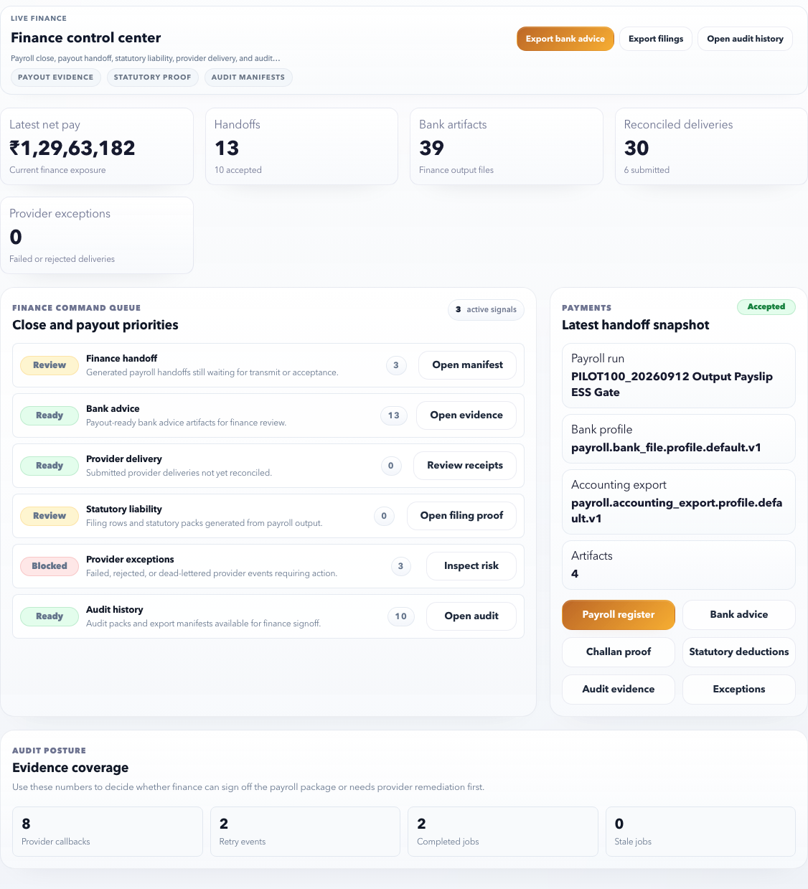

# Finance Manager Payroll Day

Use this checklist when payroll has been handed to finance for payout, statutory evidence, or audit close.

## Goal

Confirm finance can safely use the final payroll files and evidence.

## Start Here

Open **Finance Manager > Control Center**.

Review:

| Section | What to check |
| --- | --- |
| Latest net pay | Final net pay total for the latest payroll run. |
| Handoffs | Payroll handoff records ready for finance. |
| Bank artifacts | Bank advice or payment files. |
| Reconciled deliveries | Files or provider jobs completed. |
| Provider exceptions | Failed, blocked, or stale provider records. |
| Evidence coverage | Audit, bank, statutory, and provider evidence availability. |

## Step 1: Confirm Run and Totals

Check:

- Payroll run name.
- Period.
- Net pay amount.
- Employee count.
- Whether values match Payroll Outputs and payroll approval notes.

Do not continue if the finance page and payroll output page show different final totals.

## Step 2: Review Bank Advice

Use **Export bank advice** only after checking:

- Run name is final.
- Bank advice row count is expected.
- Net pay total matches final payroll.
- Employees held from payout are explained.
- Bank profile and format are correct.

Do not upload to bank if:

- The run is not final.
- Provider exceptions remain blocked.
- Bank advice total does not match net pay.
- File appears to be from an old or test run.

## Step 3: Review Statutory and Compliance Evidence

Open:

- **Export filings**
- **Challan proof**
- **Statutory deductions**
- **Compliance evidence**

Check:

- Filing period.
- Legal entity.
- Deduction totals.
- Challan or payment proof if applicable.
- Missing statutory artifact warnings.

## Step 4: Review Provider Exceptions

Open **Inspect risk** or provider exception actions.

Check:

- Failed jobs.
- Retry capped jobs.
- Rejected files.
- Stale jobs.
- Delivery mismatch.

Record decision:

| Decision | Use when |
| --- | --- |
| Proceed | Exception is informational or already resolved. |
| Hold payout | Exception can affect bank file, amount, or employee rows. |
| Escalate | Provider or technical team must resolve delivery. |
| Manual evidence | Finance proceeds outside provider but records proof. |

## Step 5: Store Audit Evidence

Open:

- **Open audit history**
- **Open manifest**
- **Open evidence**
- **Review receipts**

Keep references for:

- Bank advice export.
- Payroll register.
- Statutory evidence.
- Provider delivery evidence.
- Review receipts.
- Exception decisions.

## Finance Sign-Off Checklist

| Check | Expected result |
| --- | --- |
| Run | Correct final payroll run |
| Net pay | Matches payroll output |
| Bank advice | Correct and exportable |
| Provider exceptions | None blocking or explained |
| Statutory evidence | Available or exception noted |
| Audit evidence | Manifest and receipts available |
| Finance decision | Proceed, hold, or escalate recorded |

## Pass/fail rules

| Area | Pass when | Fail when |
| --- | --- | --- |
| Run identity | All finance files show the same run and period. | Any file appears from another run, test run, or old export. |
| Net pay | Bank advice and payroll register reconcile. | Totals differ without approved hold or exception. |
| Employee rows | Payable employee count is expected. | Employees are missing or extra without explanation. |
| Provider status | Jobs are completed or exceptions are accepted. | Rejected, dead-lettered, or stale jobs remain unexplained. |
| Statutory evidence | Filing rows, deductions, and proof are available. | Filing proof is missing or totals do not match. |
| Audit pack | Manifest, receipts, and export records are available. | Finance cannot explain what was exported or delivered. |

## Communication template

When holding or escalating, send:

- Payroll run and period.
- File or artifact name.
- Amount/count mismatch.
- Screenshot or evidence reference.
- Decision needed: regenerate, explain, approve exception, or manual process.

## Related Guides

- [Finance Manager Overview](../finance-manager/index.md)
- [Payment Handoff](../finance-manager/payment-handoff.md)
- [Compliance Evidence](../finance-manager/compliance-evidence.md)
- [Audit Evidence](../finance-manager/audit-evidence.md)
- [Payroll Close to Finance Handoff](../workflows/payroll-close-to-finance-handoff.md)
