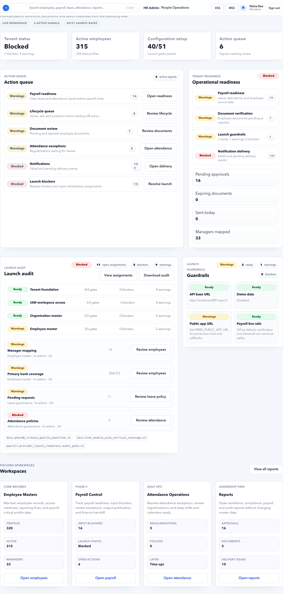
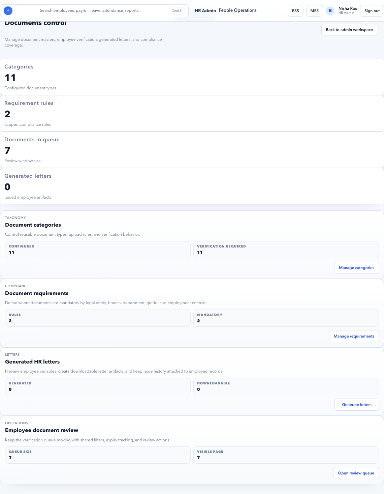

# HR Admin Daily Checklist

Use this checklist at the start of each working day and again before payroll cutoff.

## Goal

Keep HR operations healthy by clearing employee, lifecycle, document, leave, attendance, notification, and launch queues before they become payroll or compliance blockers.

## Start Here

Open **HR Admin > Dashboard**.

Read these first:

| Section | What to check |
| --- | --- |
| Tenant status | Whether the workspace is ready, warning, or blocked. |
| Action queue | Daily work items needing HR action. |
| Tenant readiness | Payroll, documents, launch guardrails, and notification health. |
| Launch audit | Any release-blocking assignments. |

## Daily Routine

### 1. Clear Blocked Action Queue Items

1. Open **Dashboard**.
2. Start with rows marked **Blocked**.
3. Use the row action button, such as **Open readiness**, **Review lifecycle**, **Review documents**, **Open attendance**, **Open delivery**, or **Resolve launch**.
4. Complete the action on the target page.
5. Return to Dashboard and confirm the count reduced.

Do not skip blocked rows because they can prevent payroll, onboarding, document verification, or launch readiness.

### 2. Review Employee Master Issues

Open **People > Employees**.

Check:

- Employees with structure review.
- Employees without department, designation, branch, location, or manager.
- Active employees without access when ESS is expected.
- Managers with direct reports but no manager access.
- Employees with payroll readiness warnings.

Fix before payroll if:

- Legal entity is missing.
- Branch or location is missing.
- Manager chain is broken.
- Bank or salary readiness is missing.

### 3. Review Lifecycle Queue

Open **Lifecycle**.

Check:

- New joiners awaiting action.
- Probation reminders.
- Movements, transfers, promotions, or reporting changes.
- Exit or final settlement items.

Use workflow-driven pages when the change needs effective date, owner, status, or approval evidence.

### 4. Review Documents

Open **Documents**.

Check:

- Pending documents.
- Rejected documents.
- Expiring documents.
- Documents needed for launch, payroll, or compliance.

Use clear rejection notes so employees know exactly what to fix.

### 5. Review Attendance and Leave

Open **Attendance** and **Leave**.

Check:

- Pending regularizations.
- Missing attendance records.
- Leave requests in the current payroll period.
- Leave balance corrections awaiting approval.
- Leave without pay that can affect payroll.

Do not wait until payroll day to clear attendance and leave. These are common payroll blockers.

### 6. Review Notification Failures

Open **Notifications** and **Notification Delivery**.

Check:

- Failed notifications.
- Retry capped items.
- Pending queues that are growing.
- Invite, reset, approval, or payroll notification failures.

If email failed but in-app delivered, decide whether the business process still needs email delivery.

### 7. Review Reports and Audit Only When Needed

Open **Reports and Audit** when:

- A user disputes a change.
- Payroll or compliance needs evidence.
- You need actor, timestamp, or before/after record details.

## End-of-Day Checklist

| Check | Expected result |
| --- | --- |
| Dashboard blocked rows | Cleared or assigned with notes |
| Employee structure warnings | Reviewed |
| Lifecycle queue | No urgent pending items |
| Document backlog | Pending/rejected items reviewed |
| Attendance exceptions | Critical items closed |
| Leave approvals | Payroll-impacting items closed |
| Notifications | Failed or retry-capped items triaged |
| Audit notes | Added for important manual decisions |

## Do Not Continue If

- A blocked payroll readiness item has no owner.
- Documents needed for compliance are rejected without user follow-up.
- Attendance or leave approvals are pending on payroll cutoff day.
- Notification failures affect password reset, invite, payroll approval, or compliance deadline.

## Related Guides

- [HR Dashboard](../hr-admin/dashboard.md)
- [HR Admin Task Recipes](../hr-admin/task-recipes.md)
- [Employee to Payroll](../workflows/employee-to-payroll.md)
- [Leave and Attendance to Payroll](../workflows/leave-attendance-to-payroll.md)
- [Notification Failure to Recovery](../workflows/notification-failure-to-recovery.md)

