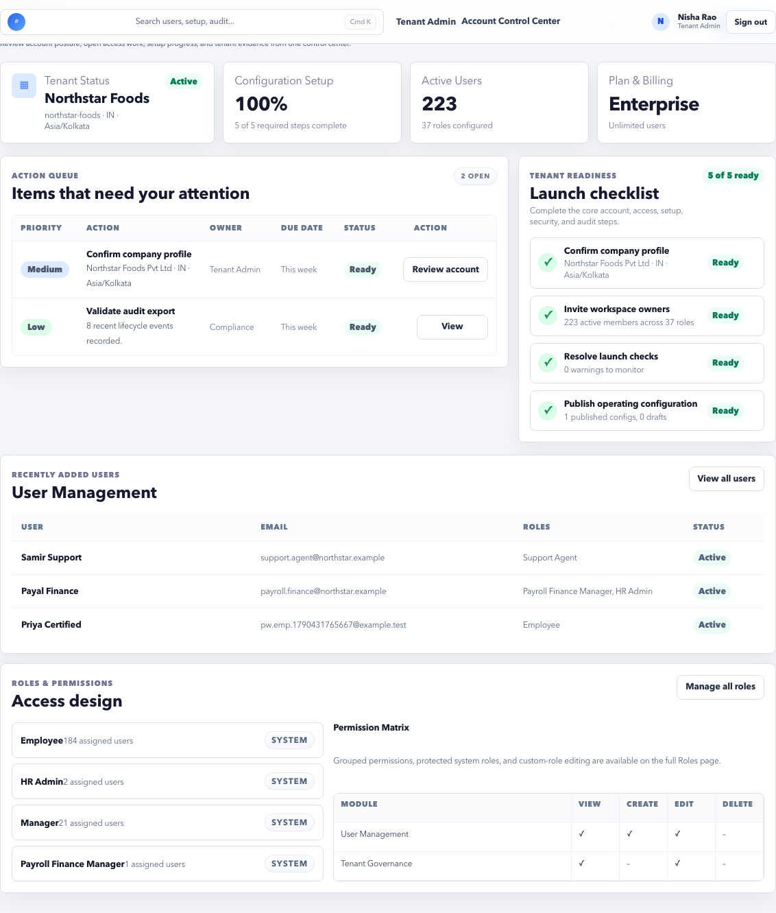
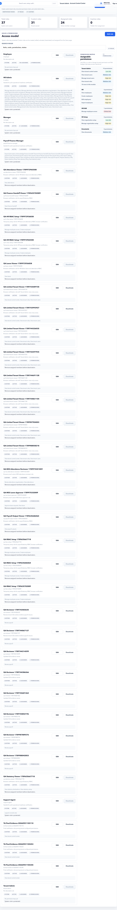
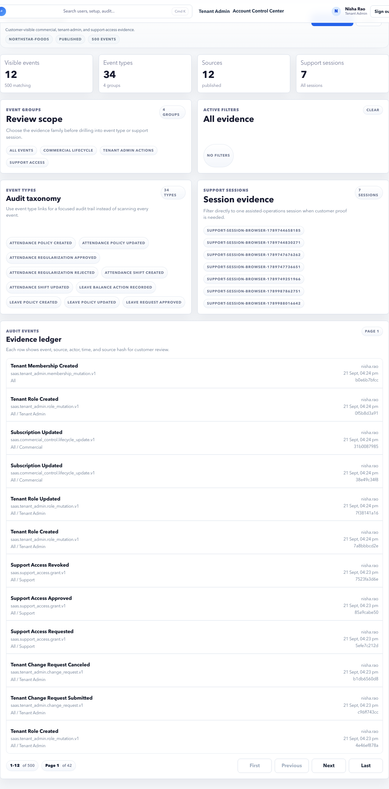

# Tenant Admin Weekly Checklist

Use this checklist once a week and before important payroll or launch activities.

## Goal

Keep account users, roles, support access, plan, security, and audit posture healthy.

## Weekly Routine

### 1. Review Users

Open **Tenant Admin > Users**.

Check:

- New users added this week.
- Inactive users.
- Admin users.
- Users with HR Admin, Payroll, Finance Manager, or Tenant Admin access.
- Users who changed role or responsibility.

Remove or update access when:

- A user no longer owns the responsibility.
- Temporary access is no longer needed.
- An employee left the company.
- A user has more access than required.

### 2. Review Roles

Open **Tenant Admin > Roles**.

Check:

- System roles are not modified directly.
- Custom roles have clear names and descriptions.
- Permission set matches job responsibility.
- High-risk permissions are assigned only where needed.

Do not create broad custom roles without testing with one user first.

### 3. Review Support Access

Open **Support Access**.

Check:

- Whether support access is enabled.
- Who approved it.
- Expiry time.
- Scope of access.
- Whether support access should be revoked.

Use temporary support access only for active support cases.

### 4. Review Trust Audit

Open **Trust Audit**.

Check:

- Admin role changes.
- Support access changes.
- Security setting changes.
- Plan or billing changes.
- Unusual login or account operations if visible.

Keep evidence for sensitive changes.

### 5. Review Settings and Security

Open **Settings** and **Security Readiness**.

Check:

- Account details.
- Public or tenant URL settings.
- Security posture.
- Workspace readiness.
- Any blocked security item.

### 6. Review Plan

Open **Plan**.

Check:

- Active modules.
- Usage limits.
- Payroll, HR, security, or support features included in the tenant plan.
- Any limits that could affect upcoming payroll or onboarding.

## Before Payroll Close

Tenant Admin should confirm:

- Payroll Admin users exist and are active.
- Finance Manager access exists if finance handoff is used.
- ESS/MSS access roles are working.
- No required admin user is inactive.
- Support access is not open longer than required.

## Do Not Continue If

- A user has admin access without business reason.
- Payroll owner cannot access payroll pages.
- Finance owner cannot access Finance Manager.
- Support access is enabled without active need.
- Security readiness shows a blocked item.

## Weekly Evidence to Keep

- User access changes.
- Role changes.
- Support access approvals and revocations.
- Security readiness state.
- Trust audit entries for sensitive actions.

## Quick pass/fail decision

| Area | Pass when | Fail when |
| --- | --- | --- |
| Users | Only current owners have active admin access. | Former or temporary users still have admin access. |
| Roles | Standard roles cover most users and custom roles are narrow. | Custom roles are broad, unclear, or unused. |
| Support access | No open grant exists unless there is an active support case. | Broad or expired support access remains open. |
| Security | No blocked security item is unresolved. | Security readiness has blocked controls without owner. |
| Plan | Usage is within limits for upcoming work. | Payroll, user, employee, or support limits can block operations. |
| Audit | Sensitive actions have searchable evidence. | Role, support, or security changes cannot be explained. |

## What to do after the checklist

- If all areas pass, record the review date and continue operations.
- If one area fails, fix it before payroll close or launch signoff.
- If multiple areas fail, open the relevant Tenant Admin guide and treat the account as needing governance review.

## Related Guides

- [Tenant Admin Overview](../tenant-admin/index.md)
- [Users](../tenant-admin/users.md)
- [Roles](../tenant-admin/roles.md)
- [Support Access](../tenant-admin/support-access.md)
- [Trust Audit](../tenant-admin/trust-audit.md)
- [Access Issues](../troubleshooting/access.md)
