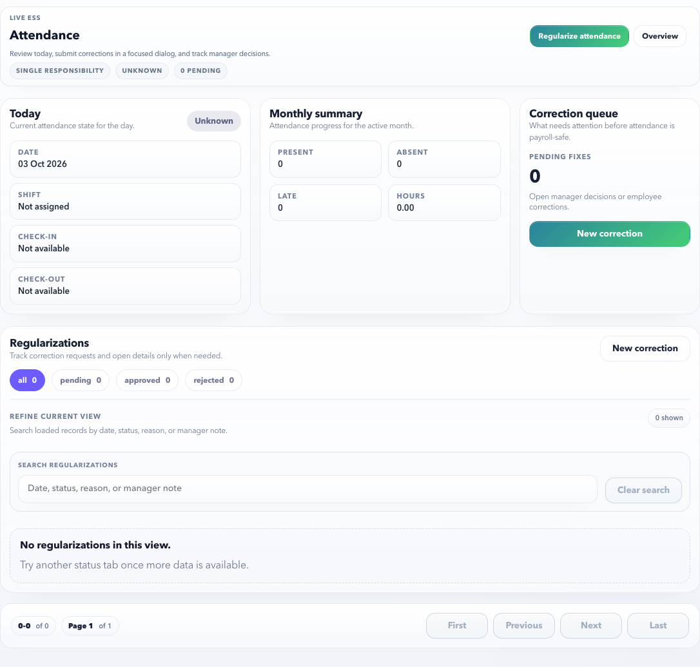

# ESS Attendance

Use ESS Attendance to review daily attendance, understand exceptions, and request corrections when attendance is missing or incorrect.

## On This Page

- [Attendance Quick Navigation](#attendance-quick-navigation)
- [Purpose](#purpose)
- [Use this page when](#use-this-page-when)
- [Main sections](#main-sections)
- [Screen Labels To Recognize](#screen-labels-to-recognize)
- [Example: request missed punch correction](#example-request-missed-punch-correction)
- [Example: review late-coming exception](#example-review-late-coming-exception)
- [Modal behavior](#modal-behavior)
- [What HR Controls Upstream](#what-hr-controls-upstream)
- [Validation behavior](#validation-behavior)
- [Common errors](#common-errors)
- [Payroll impact](#payroll-impact)
- [Related pages](#related-pages)

## Attendance Quick Navigation

| I need to | Start here | Verify before finishing |
| --- | --- | --- |
| Check today's attendance | Today card | Shift, check-in, check-out, status, and exception message. |
| Review month health | Monthly summary | Present, absent, late, worked hours, and unresolved exceptions. |
| Correct a missing punch | **Regularize attendance** modal | Date, requested status, corrected time, reason, and lock state. |
| Review a submitted correction | Regularizations > detail modal | Approval status, manager decision, timeline, and corrected values. |
| Understand why submit is blocked | Validation message | Reason, time order, locked period, attendance record availability, and API state. |
| Understand payroll impact | [Payroll impact](#payroll-impact) | Pending regularizations and locked records before payroll cutoff. |

## Purpose

Employees use this page to confirm that attendance records are accurate before payroll cutoff.

## Use this page when

- Your check-in, check-out, or working hours look incorrect.
- You missed a punch and need to request regularization.
- You need to explain late coming, early leaving, or absence.
- You want to track whether a correction request is pending, approved, or rejected.

## Main sections

| Section | Meaning |
| --- | --- |
| Today | Shows the current day status, shift, check-in, and check-out. |
| Monthly summary | Shows present, absent, late, and worked-hour totals for the active month. |
| Correction queue | Shows open correction count and gives a focused **New correction** action. |
| Regularizations | Shows correction request history with status tabs, search, and pagination. |
| Regularization detail | Opens in a modal so the employee can inspect manager decision, timeline, and correction detail without leaving the page. |
| Regularize attendance | Opens the correction form in a modal. The main page does not carry the full form inline. |
| Request summary | Shows the selected date, current status, requested status, shift, and lock state before submission. |

The page should stay single-purpose: review attendance first, then open a focused modal only when the employee needs to correct a record.

## Screen Labels To Recognize

| Screen label | What it means |
| --- | --- |
| Today | Current day shift, status, check-in, and check-out context. |
| Monthly summary | Month-level attendance health and exception summary. |
| Correction queue | Open correction count and the primary correction action. |
| Regularizations | Submitted correction history with filters and pagination. |
| Regularize attendance | Focused modal for one attendance correction. |
| Attendance regularization summary | Selected date, current state, requested state, and lock context. |

## Example: request missed punch correction

1. Open **ESS > Attendance**.
2. Select **Regularize attendance** or **New correction**.
3. Choose the attendance record for the affected date.
4. Keep the requested status as **Present** if the day status is correct.
5. Enter the corrected check-in or check-out time if the punch time is wrong.
6. Add a clear reason, such as `Forgot to punch out after client meeting`.
7. Review the request summary on the right side of the modal.
8. Select **Submit regularization**.

Expected result:

- The correction request is created.
- The status becomes pending approval if approval is required.
- Your manager can approve or reject it from MSS.
- Once approved, the corrected attendance can flow into payroll readiness.

## Example: review late-coming exception

1. Open **ESS > Attendance**.
2. Find the exception date.
3. Open the detail or correction action.
4. Read the policy reason shown, such as late check-in or missing shift.
5. Submit a correction only if the record is wrong.

Expected result:

- If the record is correct, no action is required.
- If a correction is submitted, it appears in request history.

## Modal behavior

Attendance actions should stay lightweight:

- **Regularize attendance** opens a modal with attendance record, requested status, check-in, check-out, and reason.
- **View details** opens a modal with manager decision, timeline, and correction detail.
- **Close** or the `Esc` key returns the employee to the attendance list.
- The background page remains readable but inactive while a modal is open.

This keeps ESS Attendance easy for employees: the page is for review, and the modal is for one focused correction.

## What HR Controls Upstream

| Setup item | Why it matters in ESS |
| --- | --- |
| Shift / roster assignment | Determines expected working hours and late/early exceptions. |
| Attendance capture/import | Creates the source records employees can review or regularize. |
| Regularization window | Controls how many days employees can correct. |
| Lock and payroll cutoff | Blocks corrections after attendance is finalized for payroll. |
| Approval workflow | Routes regularization to manager, HR, or auto-approval. |
| Attendance policy | Determines present, absent, half-day, late, and exception interpretation. |

## Validation behavior

| Scenario | Expected behavior |
| --- | --- |
| No reason is entered | Submit stays disabled and the modal shows `Reason required.` |
| Requested check-out is earlier than requested check-in | Submit stays disabled and the modal shows `Check time order.` |
| Attendance record is locked | Submit is blocked with a message asking the employee to contact HR before payroll close. |
| No attendance record exists | The record dropdown shows `No attendance records available`; HR must verify attendance capture or import. |
| Live API is unavailable | The page shows a workspace load issue instead of silently falling back to fake data. |

## Browser certification coverage

The ESS Attendance launch certification covers:

- Page structure: Today, Monthly summary, Correction queue, Regularizations, pagination, and no horizontal overflow.
- Detail drilldown: a regularization opens in a modal and closes with `Esc`.
- Regularization modal: reason requirement, invalid time-order blocking, locked-record guard, and request summary.
- Positive submission path: an unlocked attendance record can submit a correction through the browser against a live local backend.

## Common errors

| Message or issue | Why it happens | What to do |
| --- | --- | --- |
| No shift is assigned. | HR has not assigned a shift or roster for the employee. | Contact HR with the date and employee code. |
| Regularization window closed. | The allowed correction window has passed. | Contact HR to check whether an exception can be reopened. |
| Attendance is locked. | Payroll or attendance cutoff has locked the period. | Contact HR/payroll before payroll close. |
| Manager approval pending. | The request is waiting for manager action. | Follow up with your manager. |
| Request rejected. | Manager or HR rejected the correction. | Read the rejection reason and submit corrected evidence if allowed. |

## Payroll impact

Attendance issues can affect payroll readiness. Missing punches, unapproved regularizations, or absence exceptions may block or warn payroll before calculation.

## Related pages

- [ESS Overview](index.md)
- [ESS Task Recipes](task-recipes.md)
- [MSS Approvals](../mss/approvals.md)
- [HR Admin Attendance](../hr-admin/attendance.md)
