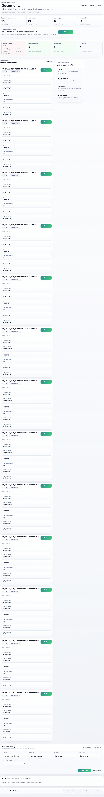

# Documents

Use Documents to upload employee documents, review required document status, and download accepted document history where allowed.

## Page Purpose

This page prevents document follow-up from happening over email. Employees can see exactly what is pending, accepted, rejected, expiring, or needs re-upload. The page is intentionally split into status, guidance, history, and focused dialogs so the employee does not have to understand every control at once.

## Main Sections

| Section | What it shows | How to use it |
| --- | --- | --- |
| Summary metrics | Required, missing, expiring, and expired document counts. | Start here to understand whether action is needed. |
| Document readiness band | Missing uploads, returned files, expiry focus, and HR review counts. | Use this as the first action checklist before opening upload or detail dialogs. |
| Required documents | Documents HR expects from you. | Upload or replace from the specific requirement card. |
| Upload checklist | Quality checks before sending a file. | Use this to avoid common rejections. |
| Document history | Past uploads and current status. | Search, filter, download, or open the detail drilldown. |
| Upload dialog | Focused upload/replace form. | Opens only when you choose **Upload document**, **Upload**, or **Replace**. |
| Document detail dialog | File metadata, HR review status, and audit trail. | Open from **Review** in history. |

## Controls

| Control | Purpose |
| --- | --- |
| Upload document | Opens the upload dialog for any self-upload category. |
| Upload / Replace on a requirement | Opens the upload dialog with the category preselected. |
| Search | Finds a document by title, category, file name, or review note. |
| Verification filter | Shows pending, approved, rejected, or all records. |
| Category filter | Narrows history to one document category. |
| Expiry focus | Finds expiring, expired, or missing-expiry documents. |
| Review | Opens document metadata, review status, and audit trail. |
| Download | Downloads the selected uploaded file when access is enabled. |
| Pagination | Moves through document history without making the page too long. |

## Upload Checklist

- Start from the top readiness band. If **Missing uploads** is zero, do not upload a random extra file.
- If **Returned by HR** is non-zero, replace those files first because payroll, onboarding, or compliance may be blocked.
- If **Expiry focus** is non-zero, upload renewed proof before the document expires.
- If **HR review** is non-zero, wait for HR unless the file is clearly wrong.
- Use a clear scan or photo.
- Make sure the full document is visible.
- Use the requested file type and upload it under the correct category.
- Add document number and expiry date when the document has them.
- Re-upload only after reading the rejection reason.
- Avoid uploading unrelated documents under the wrong category.

## What HR Controls Upstream

| Setup item | Why it matters in ESS |
| --- | --- |
| Document categories | Determines which upload categories employees can choose. |
| Required document rules | Determines which documents appear as required for the employee. |
| Employee-upload permission | Controls whether employees can upload a category themselves. |
| Expiry tracking | Controls whether expiry date is required and whether expiring documents are highlighted. |
| Verification workflow | Routes uploaded files to HR review and stores accepted/rejected status. |
| File access rules | Controls whether employees can download previously uploaded files. |

## Example: upload PAN proof

1. Open **ESS > Documents**.
2. Check **Required documents** for **PAN**.
3. Select **Upload** on that requirement, or select **Upload document** from the top action band.
4. Confirm **Category** is PAN.
5. Enter a clear title such as `PAN card - Riya Sharma`.
6. Enter the PAN number in **Document number** if your company expects it.
7. Attach the PDF or image.
8. Select **Submit for review**.

Expected result: the document is submitted to HR, appears in **Document history**, and stays pending until HR verifies it.

## Example: replace a rejected bank proof

1. Open the requirement card that shows **Re-upload** or **Action needed**.
2. Read the latest review note.
3. Select **Replace**.
4. Upload the corrected bank proof.
5. Use **Review** in Document history to confirm the new version and status.

Expected result: the latest version is available for HR review while previous versions remain in audit history.

## Document statuses

| Status | Meaning | Your action |
| --- | --- | --- |
| Required | HR expects this document from you. | Upload the correct file. |
| Uploaded | File was submitted. | Wait for review. |
| Pending review | HR has not accepted or rejected it yet. | No action unless HR asks. |
| Accepted | Document is approved. | No action. |
| Rejected | Document did not meet the requirement. | Read the reason and upload a corrected file. |
| Expiring | Accepted document has an upcoming expiry. | Upload renewed proof before the due date. |
| Expired | Accepted document is no longer valid. | Replace it immediately. |

## Positive and negative scenarios

| Scenario | What should happen |
| --- | --- |
| Upload without title or file | The submit button stays disabled. |
| Upload under wrong category | HR can reject it with a note; employee should re-upload under the correct category. |
| Upload for a category that does not allow employee upload | The employee cannot submit that category from ESS. HR must manage it. |
| Expiry date missing for a tracked document | HR may reject or ask for correction depending on policy. |
| File rejected by HR | Requirement card shows action needed and the upload dialog can replace the document. |
| Download unavailable | The employee should contact HR if the file is expected but no download link is available. |

## Browser certification coverage

The ESS Documents launch certification covers:

- Summary metrics and document readiness band.
- Required document cards and upload/replacement actions.
- Upload modal validation for category, title, and file.
- Document history search, filters, pagination, and detail modal.
- Accepted, pending, rejected, expiring, and missing-upload states.
- No horizontal overflow and no inline form crowding.

## Common rejection reasons

| Reason | How to fix it |
| --- | --- |
| Blurry or cropped file | Upload a clearer scan/photo with all corners visible. |
| Wrong document type | Upload the requested document under the matching category. |
| Name mismatch | Contact HR if the document is valid but the name differs. |
| Expired proof | Upload a current version. |
| Missing page | Combine all required pages before uploading. |

## FAQ

### Can I delete an uploaded document?

Usually employees cannot delete audit history. Upload a corrected version or ask HR if a sensitive mistake needs review.

### What should I do if the rejection reason is unclear?

Contact HR with the document type, status, and rejection text. Do not keep re-uploading the same file.
