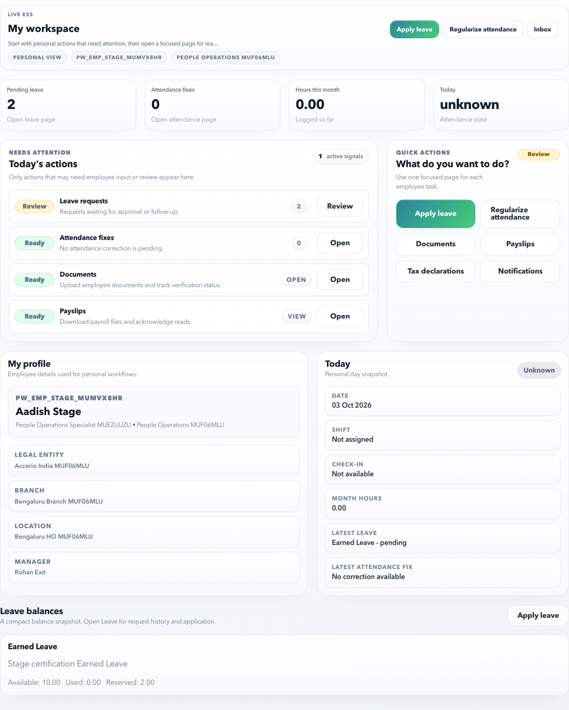

# Employee Self Service

Employee Self Service is the employee workspace for personal HR, payroll, document, leave, attendance, tax, and notification work.

## On This Page

- [ESS Quick Navigation](#ess-quick-navigation)
- [What Employees Can Do](#what-employees-can-do)
- [Screen Labels To Recognize](#screen-labels-to-recognize)
- [Latest Page Pattern](#latest-page-pattern)
- [How To Use The Overview](#how-to-use-the-overview)
- [Employee Checklist](#employee-checklist)
- [First Week Setup Checklist](#first-week-setup-checklist)
- [Daily use guide](#daily-use-guide)
- [What HR Controls Upstream](#what-hr-controls-upstream)
- [Common statuses](#common-statuses)
- [Browser Certification Coverage](#browser-certification-coverage)

## ESS Quick Navigation

| I need to | Open | Verify before finishing |
| --- | --- | --- |
| Know what needs my attention today | Overview | Priority cards, unread alerts, leave/attendance exceptions, and document blockers. |
| Apply leave or check balance | [Leave](leave.md) | Leave type, available balance, evidence rule, date range, and approval status. |
| Correct attendance | [Attendance](attendance.md) | Attendance date, lock state, corrected time, reason, and manager approval state. |
| Download salary proof | [Payslips](payslips.md) | Correct payroll month, employee name/code, net pay, and published/download status. |
| Upload joining or identity proof | [Documents](documents.md) | Required category, file clarity, document number, expiry date, and HR review status. |
| Update investment/tax proof | [Tax Declarations](statutory-declarations.md) | Active tax year, PAN, regime, rejected proof count, proof window, and submit readiness. |
| Understand an alert | [Notifications](notifications.md) | Message, source workflow, read state, and failed delivery reason if any. |
| Follow a step-by-step task | [ESS Task Recipes](task-recipes.md) | Use the matching recipe, then verify the expected result. |

## What Employees Can Do

| Area | Purpose | Best next action |
| --- | --- | --- |
| Overview | See personal profile status, today’s attendance, leave balances, pending requests, and quick links. | Start here when you are unsure what needs action. |
| Leave | Check balances, apply leave, attach evidence, and track approvals. | Open when planning time off or fixing a leave request issue. |
| Attendance | Review daily attendance, exceptions, and regularization requests. | Open when a punch, absence, or work-hour record looks wrong. |
| Payslips | View published payslips, payment summaries, read receipts, and download files. | Open after payroll is published or when salary proof is needed. |
| Documents | Upload required employee documents and review document status. | Use when HR asks for ID, address, bank, qualification, or employment proof. |
| Tax Declarations | Submit tax declarations, proof items, and statutory information. | Use before payroll proof cutoff or year-end proof collection. |
| Notifications | Review employee alerts and open the source workflow. | Use when an email, in-app alert, or HR action needs follow-up. |

## Screen Labels To Recognize

Employees should be able to recognize these areas immediately on the ESS overview:

| Screen label | What it means |
| --- | --- |
| Today's actions | The priority list of employee tasks that may need attention today. |
| What do you want to do? | Quick action shortcuts for common self-service work. |
| My profile | Employee identity and profile context pulled from HR Admin. |
| Today | Current attendance snapshot. |
| Leave balances | Available leave snapshot before applying. |

## Latest Page Pattern

ESS pages follow one common pattern so employees do not need to learn a new screen style for every task.

| Pattern | Meaning | Example |
| --- | --- | --- |
| One page, one responsibility | Each page starts with the thing employees came to do. | Leave focuses on balances and requests; Payslips focuses on published payroll files. |
| Summary first | The top area explains status before showing detailed rows. | Documents shows missing, returned, expiring, and HR review counts before upload history. |
| Focused modals | Create, update, upload, submit, and review actions open dialogs instead of crowding the page. | Apply leave, add tax proof, upload document, and review payslip open modals. |
| Checklist before action | Employees see what could block submission before they submit. | Tax declaration checklist shows PAN readiness, rejected proof, and declaration state. |
| Detail without losing context | Review dialogs can be closed to return to the same list, filter, and scroll context. | Attendance and notifications detail reviews do not navigate away unnecessarily. |
| Employee boundary | Employees should see only their own records. | Payslips, documents, tax proof, notifications, leave, and attendance are employee-scoped. |

## How To Use The Overview

The overview is meant to answer one question: “What do I need to do today?”

- Check **Today’s priorities** first. These are pending actions that may block payroll, documents, leave, or attendance.
- Use **Self-service shortcuts** to jump directly to payslips, documents, tax declarations, notifications, or manager view.
- Review **Profile snapshot** before payroll cutoff so email, phone, department, manager, and bank-related details stay accurate.
- Check **Attendance today** before raising a regularization request.
- Review **Leave balances** before applying for leave.
- Use the request area for new leave or attendance correction requests.

## Employee Checklist

Before payroll cutoff:

- Confirm your profile data is correct.
- Make sure required documents are uploaded and accepted.
- Review open leave or attendance requests.
- Check tax declaration status if your organization uses declarations.
- Open notifications and close anything marked failed, unread, or action required.

## First Week Setup Checklist

When a new employee first enters ESS:

1. Open **Overview** and check whether employee profile, manager, department, and contact details look correct.
2. Open **Documents** and upload required joining documents.
3. Open **Leave** and verify the available leave types and balances.
4. Open **Attendance** after the first working day and confirm attendance is flowing correctly.
5. Open **Tax Declarations** and check PAN, tax regime, PF/UAN, and active financial year.
6. Open **Notifications** and review any unread onboarding or setup alerts.

## Daily use guide

| If you need to | Start here | What to check |
| --- | --- | --- |
| See whether anything needs action | Overview | Today’s priorities and notifications. |
| Apply for leave or check balance | Leave | Leave type, available balance, attachment rule, and approval status. |
| Correct a missing punch or exception | Attendance | Date, exception reason, correction window, and approval status. |
| Download salary proof | Payslips | Correct month, net pay, and published status. |
| Submit ID, bank, address, or employment proof | Documents | Requirement name, accepted file type, and latest status. |
| Update tax declarations | Tax Declarations | Active tax year, declaration totals, proof requirement, and cutoff. |
| Understand an alert | Notifications | Message, source link, read state, and delivery status. |

## What HR Controls Upstream

ESS is employee-facing, but many fields come from HR Admin setup.

| ESS area | Upstream HR/Admin dependency |
| --- | --- |
| Leave types and balance | Leave policies, employee policy assignment, opening balance, accrual, and approval workflow. |
| Attendance records | Shift setup, attendance import/capture, regularization window, and manager workflow. |
| Payslips | Payroll output publication, storage access, and read/download governance. |
| Documents | Document categories, required document rules, accepted file types, and HR review queue. |
| Tax Declarations | Financial year, declaration profile, proof window, statutory profile, and payroll consumption rules. |
| Notifications | Notification templates, delivery channels, source workflow, and recipient eligibility. |

If a field is missing or disabled in ESS, check the related HR Admin setup before treating it as an employee error.

## Common statuses

| Status | Meaning | What you should do |
| --- | --- | --- |
| Pending | Waiting for your action or HR review. | Open the related page and check the next step. |
| Submitted | You sent the item for review. | Wait unless HR asks for changes. |
| Accepted / Approved | HR or payroll accepted it. | No action unless details are wrong. |
| Rejected | Reviewer found an issue. | Read the reason and resubmit corrected data. |
| Published | Payroll or document output is available. | Review/download if needed. |
| Failed | A notification or delivery could not complete. | Open the source workflow or contact HR if unclear. |

## When to contact HR

Contact HR only after checking the relevant page and status. Include:

- The page name.
- Employee code or email if asked.
- Period/month/tax year.
- Screenshot or exact status text.
- What you already tried.

## Browser Certification Coverage

The ESS launch certification checks these employee flows from the browser:

- Overview navigation and quick links.
- Leave balance review, apply modal, validation, evidence behavior, and detail modal.
- Attendance review, regularization modal, invalid-time validation, and detail modal.
- Payslip list, review modal, read receipt, and download availability.
- Document readiness band, upload modal, detail modal, filters, and pagination.
- Tax declaration tax-year selection, checklist, update declaration modal, add proof modal, submit modal, and proof detail.
- Notifications inbox, filters, review modal, read state, failed-delivery handling, and source workflow links.

## Related Pages

- [Payslips](payslips.md)
- [Leave](leave.md)
- [Attendance](attendance.md)
- [Documents](documents.md)
- [Tax Declarations](statutory-declarations.md)
- [Notifications](notifications.md)
- [ESS Task Recipes](task-recipes.md)
