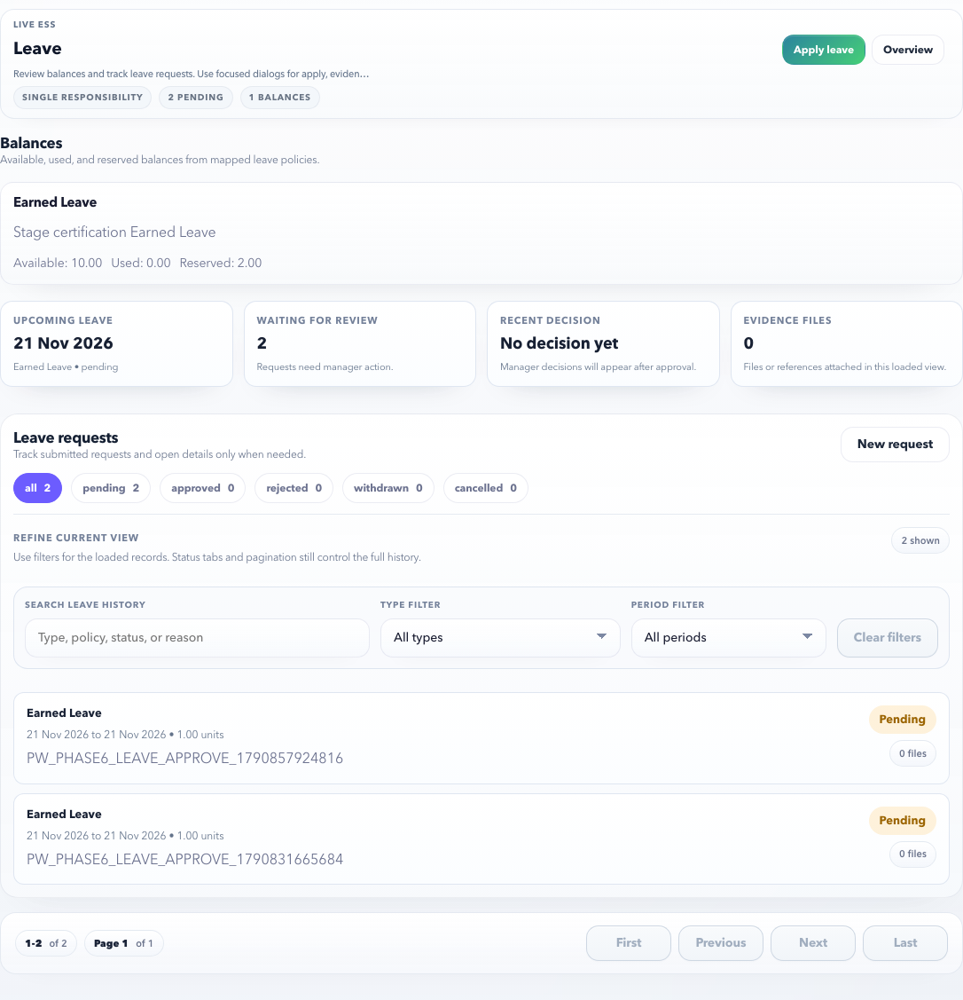

# ESS Leave

Use ESS Leave to check leave balances, apply for leave, attach evidence when required, and track approval status.

## On This Page

- [Leave Quick Navigation](#leave-quick-navigation)
- [Purpose](#purpose)
- [Use this page when](#use-this-page-when)
- [Main sections](#main-sections)
- [Screen Labels To Recognize](#screen-labels-to-recognize)
- [Example: apply one day Earned Leave](#example-apply-one-day-earned-leave)
- [Example: apply Sick Leave with attachment](#example-apply-sick-leave-with-attachment)
- [Modal behavior](#modal-behavior)
- [Leave unit calculation](#leave-unit-calculation)
- [Evidence behavior](#evidence-behavior)
- [What HR Controls Upstream](#what-hr-controls-upstream)
- [Negative validation examples](#negative-validation-examples)
- [Common errors](#common-errors)
- [Related pages](#related-pages)

## Leave Quick Navigation

| I need to | Start here | Verify before finishing |
| --- | --- | --- |
| Check whether I can take leave | Balance summary | Available balance, pending/reserved balance, and leave type eligibility. |
| Apply for leave | **Apply leave** modal | Leave type, date range, day portions, reason, evidence rule, and request summary. |
| Upload proof for sick/medical leave | **Apply leave** modal | Attachment requirement, file chosen, evidence reference, and final validation. |
| Review an existing request | Request history > detail modal | Status, approval timeline, balance impact, evidence, and manager decision. |
| Fix a failed submission | Error message in modal | Active policy, balance, evidence, date order, and approval route setup. |
| Know what HR must configure | [What HR Controls Upstream](#what-hr-controls-upstream) | Leave type, policy assignment, balance/accrual, workflow, calendar, and evidence rule. |

## Purpose

Employees use this page when they need time off or want to understand available leave balance before applying.

## Use this page when

- You want to apply for Earned Leave, Casual Leave, Sick Leave, or another assigned leave type.
- You want to check available, used, pending, or reserved balance.
- You need to upload evidence, such as a medical certificate, when the leave policy requires it.
- You want to confirm whether a request is pending, approved, rejected, or cancelled.

## Main sections

| Section | Meaning |
| --- | --- |
| Balance summary | Shows available leave by leave type. |
| Request history | Shows submitted requests with status filters, pagination, and a compact row for each request. |
| Request detail | Opens in a modal so the list stays focused and the employee can inspect one request without losing context. |
| Apply leave | Opens the leave request modal. The main page does not carry the full form inline. |
| Request summary | Shows estimated leave units, available balance, non-working days, and attachment requirement before submission. |
| Policy guidance | Explains the selected leave type, unit, and whether evidence is optional or required. |
| Final validation | Explains that policy, balance, holiday, and approval routing are checked again during submission. |

## Screen Labels To Recognize

| Screen label | What it means |
| --- | --- |
| Balances | Available, used, pending, and reserved leave by type. |
| Leave requests | Request history with status tabs and pagination. |
| Apply leave | Focused modal for creating a new leave request. |
| Leave request summary | Estimated units, available balance, non-working days, and attachment rule. |
| Unit calculation | Date-by-date breakdown showing which days were counted or excluded. |
| Policy guidance | Policy-level guidance for the selected leave type. |
| Final validation | Final server-side checks before the request is accepted. |

## Example: apply one day Earned Leave

Use this example when Earned Leave is already assigned to your employee profile.

1. Open **ESS > Leave**.
2. Select **Apply leave**.
3. Choose leave type **Earned Leave**.
4. Select start date and end date.
5. Choose full-day or half-day portions.
6. Add a clear reason, such as `Personal work`.
7. Upload a file only if the policy requires evidence.
8. Review the request summary.
9. Select **Submit leave**.

Expected result:

- The request is created.
- The request status becomes pending approval if approval is required.
- Your manager can review it in MSS.
- The balance is reserved or updated based on the configured policy.
- The request appears in the history list and can be opened from the detail modal.

## Example: apply Sick Leave with attachment

1. Open **ESS > Leave**.
2. Select **Apply leave**.
3. Choose **Sick Leave**.
4. Select the leave dates.
5. Attach the medical certificate if the policy asks for evidence.
6. Add the reason.
7. Submit the request.

Expected result:

- The request should not show an attachment error.
- The manager or HR reviewer can see the evidence during approval.

## Modal behavior

Leave actions should stay lightweight:

- **Apply leave** opens a modal with leave type, dates, day portions, evidence, and reason.
- **View details** opens a modal with approval status, evidence, balance impact, and audit context.
- **Close** or the `Esc` key should return the employee to the leave list.
- The background page should remain readable but inactive while a modal is open.

This keeps ESS Leave as one responsibility: review balances and requests first, then perform focused actions in modals.

## Leave unit calculation

Leave units are policy-driven and can differ from a simple calendar-day count:

| Rule source | Employee impact |
| --- | --- |
| Employee roster / shift assignment | Weekly offs follow the employee's resolved roster. If an employee's weekly offs are Tuesday and Wednesday, Saturday and Sunday can be counted as working leave days. |
| No resolved roster / shift | The system falls back to the standard Saturday/Sunday weekly off pattern. |
| Holiday calendar | Tenant holidays can be excluded when the leave policy does not count holiday overlap. |
| Calendar-day policy | If the policy counts calendar days, weekends and holidays remain chargeable. |
| Sandwich rule | If enabled by HR policy, intervening weekly offs or holidays inside the selected range can be counted. |

After submission, open **View details** and check **Unit calculation**. It shows each date, weekday, units, and whether the day was **Counted** or **Excluded**. This is the best place to confirm why a Friday-to-Monday request may be two units for a standard weekend employee, while a rostered employee with different weekly offs may see a different result.

## Evidence behavior

Evidence depends on the HR policy:

| Policy result | Employee experience |
| --- | --- |
| Evidence optional | The modal shows `Attachment: Optional`; the employee can submit without a file if all other fields are valid. |
| Evidence required | The modal shows `Evidence required`; submit remains disabled until a file or evidence reference is provided. |
| No policy assigned | Submission fails with a clear policy message instead of silently creating an invalid request. |

## What HR Controls Upstream

| Setup item | Why it matters in ESS |
| --- | --- |
| Leave type catalog | Determines whether employees see Earned Leave, Casual Leave, Sick Leave, or tenant-specific leave types. |
| Leave policy assignment | Controls whether the employee can submit for the selected leave type and date. |
| Balance and accrual setup | Drives available, used, reserved, and after-request balance. |
| Evidence rule | Decides whether attachment is optional, mandatory, or required only above a threshold. |
| Approval workflow | Routes the request to manager, HR, or auto-approval. |
| Attendance policy, shift assignment, roster, and holiday calendar | Affects estimated leave units, weekly-off exclusion, and holiday exclusion. |

## Negative validation examples

| Scenario | Expected behavior |
| --- | --- |
| End date is before start date | The modal shows `Check dates.` and disables submit. |
| Leave type has no active policy | The modal shows `No active leave policy is assigned to this employee for the selected leave type.` |
| Evidence is mandatory but missing | Submit remains disabled and the employee sees `Evidence required.` |
| Balance would go negative and policy does not allow it | Submission is blocked with an insufficient balance message. |

## Browser certification coverage

The ESS Leave launch certification covers:

- Page structure: balances, filters, tabs, pagination, request history, and no horizontal overflow.
- Detail drilldown: request detail opens in a modal and closes with `Esc`.
- Apply modal: policy guidance, evidence optional/required state, final validation, date blocking, and roster-aware unit calculation.
- Positive submission path: an optional-evidence leave request can be submitted through the browser against a live local backend.
- Roster regression: browser coverage proves a custom weekly-off roster can count Saturday/Sunday and exclude the configured weekly-off days instead of hardcoding weekends.

## Common errors

| Message or issue | Why it happens | What to do |
| --- | --- | --- |
| No active leave policy is assigned to this employee. | HR has not assigned a leave policy for the selected leave type, or the assignment is not effective for the selected dates. | Contact HR and mention the leave type and dates selected. |
| Insufficient balance. | The requested leave units are more than the available balance and negative balance is not allowed. | Reduce the date range or ask HR to verify opening balance/accrual. |
| Attachment required. | The policy requires proof for this leave type or duration. | Upload the required file and submit again. |
| Approval route missing. | The leave policy needs approval but manager/workflow setup is incomplete. | Contact HR to verify reporting manager and approval workflow. |
| Selected dates are invalid. | End date is before start date, or the date is outside the policy effective window. | Correct the dates and try again. |
| Leave units do not match Saturday/Sunday expectations. | Your employee roster may use different weekly offs, or HR may not have assigned a roster yet. | Open the request detail **Unit calculation** section and contact HR with the dates shown as counted or excluded. |

## When to contact HR

Contact HR when:

- The correct leave type is missing.
- Balance does not match your expected balance.
- Your manager cannot see the approval request.
- The page says no active policy is assigned.
- A submitted leave needs correction or cancellation and the page does not allow it.

## Related pages

- [ESS Overview](index.md)
- [ESS Task Recipes](task-recipes.md)
- [MSS Approvals](../mss/approvals.md)
- [HR Admin Leave](../hr-admin/leave.md)
