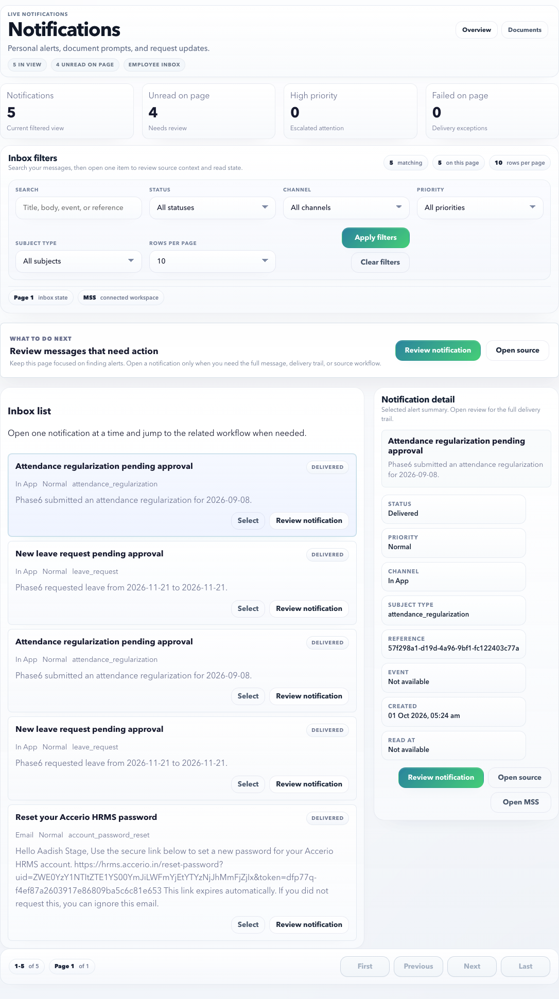

# Notifications

Use Notifications to review employee alerts, source workflow messages, delivery status, and read/unread state.

## On This Page

- [Notification Quick Navigation](#notification-quick-navigation)
- [Page Purpose](#page-purpose)
- [Main Sections](#main-sections)
- [Screen Labels To Recognize](#screen-labels-to-recognize)
- [Controls](#controls)
- [Notification states](#notification-states)
- [Triage order](#triage-order)
- [What HR / System Controls Upstream](#what-hr-system-controls-upstream)
- [Example: review a leave update](#example-review-a-leave-update)
- [Example: check a failed email notification](#example-check-a-failed-email-notification)
- [Positive and negative scenarios](#positive-and-negative-scenarios)
- [Browser certification coverage](#browser-certification-coverage)
- [Good Practice](#good-practice)
- [FAQ](#faq)
- [Related Pages](#related-pages)

## Notification Quick Navigation

| I need to | Start here | Verify before finishing |
| --- | --- | --- |
| Review new alerts | Inbox metrics and unread filter | Message subject, priority, source type, and read state. |
| Open the related workflow | Review dialog > source link | Source route opens the correct ESS page and remains employee-scoped. |
| Check a failed email/SMS/in-app event | Status filter > failed | In-app message, provider log, retry state, and whether HR follow-up is needed. |
| Clear completed alerts | Review dialog > **Mark read** | Read state changes and unread count updates. |
| Find an old notification | Search and filters | Subject, channel, priority, source type, date, and pagination. |
| Understand delivery setup | [What HR / System Controls Upstream](#what-hr-system-controls-upstream) | Template, recipient, channel, retry policy, source workflow, and read tracking. |

## Page Purpose

Notifications are the employee inbox for HRMS events. They help employees understand what changed, what needs attention, and where to continue the work. The page is intentionally split into a searchable inbox and a focused review dialog so employees do not have to scan technical delivery detail unless they need it.

## Main Sections

| Section | What it shows | How to use it |
| --- | --- | --- |
| Top metrics | Total notifications in the current view, unread count, high-priority count, and failed delivery count. | Start here to understand whether anything needs action. |
| Inbox filters | Search, status, channel, priority, subject type, and page size. | Narrow the inbox before reviewing individual items. |
| Inbox list | Employee-scoped notifications with message summary and review action. | Select a row, open the review dialog, or follow the source workflow. |
| Notification detail panel | Short summary for the selected notification. | Use it to confirm status and quickly open the source workflow. |
| Review dialog | Full message, read/unread action, delivery timestamps, source workflow, and provider logs. | Open when the alert needs proof, troubleshooting, or follow-up. |

## Screen Labels To Recognize

| Screen label | What it means |
| --- | --- |
| Inbox filters | Filter controls for finding the right notification. |
| Inbox list | Employee-scoped notification rows. |
| Notification detail | Selected notification summary. |
| Review notification | Focused modal with full message and delivery state. |
| Mark read / Mark unread | Read-state action for the selected notification. |
| Open source | Route to the linked ESS workflow when available. |

## Controls

| Control | Purpose |
| --- | --- |
| Status filter | Show unread, failed, delivered, or all notifications. |
| Select | Makes a notification the selected item on the page. |
| Review notification | Opens full notification detail in a dialog. |
| Mark read | Clear unread state after review. |
| Source link | Open the related workflow if available. |
| Clear filters | Return to the full inbox. |

## Notification states

| State | Meaning | What to do |
| --- | --- | --- |
| Unread | You have not opened it yet. | Open and review the message. |
| Read | You reviewed it. | No action unless the source workflow remains open. |
| Action required | The message points to a task. | Open the source link and complete the task. |
| Failed | Delivery had a problem. | Review in-app and contact HR if the message is unclear. |
| Retry capped | Delivery retried too many times. | Use in-app message and tell HR if external email/SMS is needed. |

## Triage order

1. Action-required notifications.
2. Failed or retry-capped notifications.
3. Payroll, document, tax, leave, and attendance messages.
4. General information messages.

## What HR / System Controls Upstream

| Setup item | Why it matters in ESS |
| --- | --- |
| Notification template | Controls message subject, body, and source context. |
| Recipient selection | Determines whether the employee receives the event. |
| Delivery channel | Controls in-app, email, SMS, WhatsApp, or push attempts where configured. |
| Source workflow | Provides the route back to leave, attendance, documents, payroll, tax, or another task. |
| Retry policy | Determines how many times failed delivery is retried. |
| Read-state tracking | Controls whether opened/read state is recorded. |

## Example: review a leave update

1. Open **ESS > Inbox**.
2. Search for `leave` or choose **Subject type > Leave request**.
3. Select **Apply filters**.
4. Select **Review notification** on the leave message.
5. Read the message body and delivery status.
6. Select **Open source** to continue to the related leave workflow.
7. Mark the notification as read after you understand it.

Expected result: the notification remains employee-scoped, the source workflow opens in ESS, and the read state can be updated from the review dialog.

## Example: check a failed email notification

1. Open **ESS > Inbox**.
2. Choose **Status > Failed** or search by the subject.
3. Open **Review notification**.
4. Read the in-app message first; it is the reliable fallback even when email failed.
5. Check **Provider logs** for the delivery reason if visible.
6. Contact HR only when the message is unclear or an external email is required.

Expected result: you can still see the HRMS alert inside ESS even if email, SMS, WhatsApp, or push delivery failed.

## Positive and negative scenarios

| Scenario | What should happen |
| --- | --- |
| New unread notification exists | It appears in the inbox and can be reviewed in the dialog. |
| Notification points to a workflow | **Open source** routes to the relevant ESS page, such as leave, attendance, documents, or payslips. |
| Notification has no source workflow | The review dialog still shows the message and delivery state, but no source action is required. |
| Filter has no matches | The page shows a clear no-results state and lets you clear filters. |
| External delivery failed | The in-app notification remains visible, and provider logs explain the failure where available. |
| Employee tries another user's notification | Access must be denied by the authenticated employee boundary. |

## Browser certification coverage

The ESS Notifications launch certification covers:

- Inbox metrics and filters.
- Status, channel, priority, source type, and search behavior.
- Review dialog with message, delivery state, provider context, and source workflow.
- Mark-read behavior.
- Failed and retry-capped notification handling.
- Empty result state, pagination, and no horizontal overflow.

## Good Practice

- Review unread notifications before payroll cutoff.
- Do not ignore failed or retry-capped notifications if they contain HR actions.
- Use the source link when a notification mentions a document, approval, or payroll item.
- Keep notification review inside the app instead of relying only on forwarded emails.

## FAQ

### Do I need to act on every notification?

No. Some are informational. Act when the notification says action is required or links to an open workflow.

### What if I did not receive the email?

Check the in-app notification first. If email delivery matters, contact HR and mention the notification subject and date.

## Related Pages

- [ESS Overview](index.md)
- [ESS Task Recipes](task-recipes.md)
- [HR Admin Notifications](../hr-admin/notifications.md)
