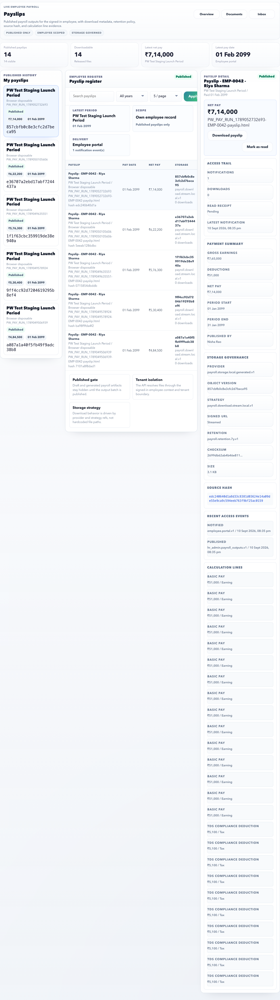

# Payslips

Use Payslips to view payslips published by payroll, inspect the payment summary, and download the payslip file.

## Page Purpose

The page keeps salary history in one place so employees do not need to ask HR for previously published payslips.

## Main Sections

| Section | What it shows | How to use it |
| --- | --- | --- |
| Payslip register | Searchable list of published or available payslips. | Select a period to inspect details. |
| My payslips rail | Period list and status indicators. | Use it to move between months quickly. |
| Payslip detail | Gross pay, deductions, net pay, publication status, and source trace. | Verify salary numbers before downloading. |
| Access trail | Read/download activity, source hash, and evidence. | Useful when HR asks whether the payslip was opened. |

## Controls

| Control | Purpose |
| --- | --- |
| Search | Find payslips by period, run code, or status. |
| Year filter | Limit the list to one financial/calendar year. |
| Page size | Change how many records show in the list. |
| Apply | Refresh the list using current filters. |
| Download payslip | Download the selected payslip file. |

## Before downloading

Check:

- Period/month is correct.
- Payslip status is published or available.
- Gross earnings, deductions, and net pay look reasonable.
- Employee name and code are yours.
- You are comfortable sharing the file wherever you plan to use it.

## If a payslip is missing

| Possible reason | What to do |
| --- | --- |
| Payroll is not published yet | Wait for HR/payroll announcement. |
| You are filtering the wrong year | Clear filters or choose the correct year. |
| You joined after the selected period | Check the first eligible payroll month. |
| Payroll output was held | Contact HR with the month and employee code. |

## Good Practice

- Download payslips only from the app, not from forwarded messages.
- Check net pay, deduction summary, and month before sharing a payslip outside the company.
- If a payslip is missing, check whether payroll outputs are published before contacting HR.

## FAQ

### Can I download old payslips?

Yes, when they are published and available under your employee record. Use year or period filters to find them.

### What if net pay looks wrong?

Check the deduction summary and period first. If it still looks wrong, contact HR/payroll with the payslip month and the amount you are questioning.
