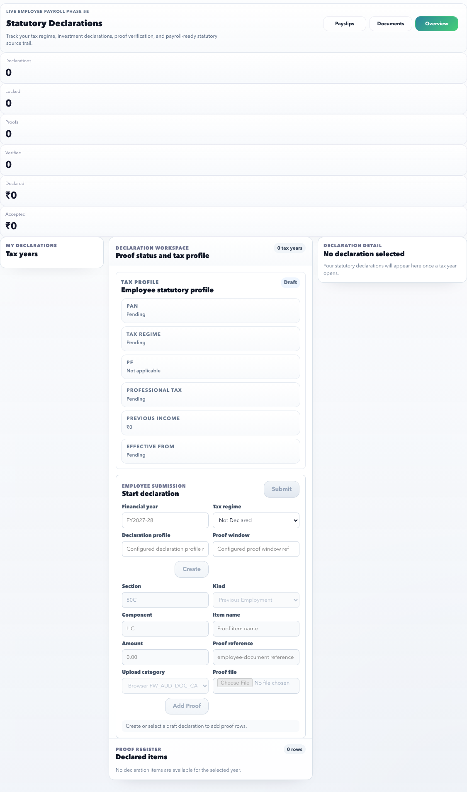

# Tax Declarations

Use Tax Declarations to choose the active tax year, maintain Indian income tax declarations, attach proof, and understand what payroll can use for TDS calculation.

## On This Page

- [Tax Quick Navigation](#tax-quick-navigation)
- [Purpose](#purpose)
- [Who Uses It](#who-uses-it)
- [Use This Page When](#use-this-page-when)
- [Page Map](#page-map)
- [Screen Labels To Recognize](#screen-labels-to-recognize)
- [Controls](#controls)
- [India Field Guide](#india-field-guide)
- [Example: Start Old Regime Declaration](#example-start-old-regime-declaration)
- [Example: Add 80C Proof](#example-add-80c-proof)
- [Example: Correct Rejected HRA Proof](#example-correct-rejected-hra-proof)
- [Submission Rules](#submission-rules)
- [Positive and Negative Scenarios](#positive-and-negative-scenarios)
- [Payroll Impact](#payroll-impact)
- [Browser Certification Coverage](#browser-certification-coverage)
- [Common Issues](#common-issues)
- [FAQ](#faq)
- [Related Pages](#related-pages)

## Tax Quick Navigation

| I need to | Start here | Verify before finishing |
| --- | --- | --- |
| Select the correct financial year | Tax years group | Active year, draft/locked state, declared total, and proof acceptance. |
| Know what action is pending | Tax declaration checklist | PAN readiness, declaration opened, rejected proof, proof count, and submit readiness. |
| Start or update declaration values | **Update declaration** modal | Regime, declaration profile, proof window, 80C/80D/HRA/previous-employment values. |
| Upload proof | **Add proof** modal | Section, component, amount, proof reference, upload category, and file attachment. |
| Correct rejected proof | Proof register > proof detail modal | Rejection reason, corrected file, corrected amount/reference, and cutoff state. |
| Submit for payroll review | **Submit declaration** modal | No known wrong proof, selected year is editable, and final confirmation is correct. |
| Understand payroll TDS impact | [Payroll Impact](#payroll-impact) | Draft/submitted/accepted/locked/consumed state and payroll-accepted value. |

## Purpose

This page gives employees one controlled place to maintain tax declarations instead of sending values and proof over email. It is designed for India payroll, but it stays tenant-configurable so every organization can decide the active financial year, proof window, tax regime rules, document categories, and payroll cutoff behavior.

## Who Uses It

| User | Responsibility |
| --- | --- |
| Employee | Select the right year, confirm tax profile, enter declaration amounts, upload proof, and submit before cutoff. |
| HR / Payroll | Configure declaration windows, proof categories, statutory profile data, and review rejected or accepted proof. |
| Auditor / Payroll reviewer | Verify what was declared, what was accepted, what was rejected, and what payroll consumed. |

## Use This Page When

- You need to start or update declarations for a financial year.
- You want to choose or confirm Old Regime / New Regime where your tenant allows it.
- You need to upload investment, insurance, rent, previous employment, or other tax proof.
- HR rejected a proof and asked you to correct it.
- Payroll cutoff is near and you need to confirm declaration status.

## Page Map

| Section | What it shows | How to use it |
| --- | --- | --- |
| Tax years | Full-width year cards for available financial years. | Select the year first. All details below follow the selected year. |
| Tax declaration checklist | PAN readiness, declaration opened, rejected proofs, proof count, and submit readiness. | Treat this as the top action band before editing. |
| Summary | Declaration count, draft count, proof count, rejected count, declared amount, and payroll-accepted amount. | Use it to understand whether action is still pending. |
| Declaration detail | Current declaration status, regime, submitted state, verified state, accepted value, and proof coverage. | Review before opening any modal. |
| Tax profile | PAN, PF / UAN, professional tax, regime default, and employee payroll tax context. | Contact HR if profile data is wrong. |
| Proof register | Proof rows for the selected year with status and detail action. | Review proof, rejection reason, or accepted amount. |
| Update declaration modal | Focused form for regime, declaration profile, proof window, and declaration values. | Use when values need to be created or corrected. |
| Add proof modal | Focused proof upload form with section, component, amount, reference, category, and file. | Use after selecting the correct declaration year. |
| Submit declaration modal | Final confirmation before sending declaration to HR/payroll. | Use only after checking values and proof. |
| Proof detail modal | Proof status, amount, document reference, review note, and audit details. | Use when HR rejected proof or you need evidence detail. |

## Screen Labels To Recognize

| Screen label | What it means |
| --- | --- |
| Tax years | Full-width financial-year selector. |
| Tax declaration checklist | Top action band for PAN, declaration, proof, and submit readiness. |
| Current declaration | Selected year's declaration status and totals. |
| Tax profile | PAN, PF/UAN, regime, and statutory payroll context. |
| Proof register | Proof rows for the selected year. |
| Update declaration / Add proof / Submit declaration | Modal actions for editing, proof upload, and final submission. |

## Controls

| Control | Purpose |
| --- | --- |
| Overview | Returns to the summary-oriented tax declaration view. |
| Documents | Shows proof and document-oriented view for the selected declaration. |
| Update declaration | Opens the declaration modal. Use it for tax regime and declaration values. |
| Add proof | Opens the proof upload modal. Use it for one proof item at a time. |
| Submit declaration | Opens final submission confirmation. |
| Search | Finds declarations or proof by year, regime, proof reference, or status. |
| Status filter | Narrows to draft, submitted, accepted, rejected, locked, or all states. |
| Financial year filter | Shows one year or all available years. |
| Rows per page | Keeps proof/declaration lists compact. |
| Review proof | Opens proof detail without leaving the page. |

## India Field Guide

| Field | Meaning | Example |
| --- | --- | --- |
| Financial year | The tax year for declaration and proof. | `FY2026-27` |
| Tax regime | Employee's applicable tax regime if tenant allows choice. | `Old Regime` or `New Regime` |
| PAN | Permanent Account Number used for Indian tax processing. | `ABCDE1234F` |
| PF / UAN | Provident Fund or Universal Account Number context. | `100200300400` |
| Professional tax | State-specific professional tax applicability. | Enabled for Maharashtra/Karnataka where configured. |
| 80C | Common investment deduction section. | ELSS, PPF, life insurance premium. |
| 80D | Medical insurance deduction section. | Health insurance premium. |
| HRA | House Rent Allowance proof. | Rent receipts and landlord PAN when required. |
| Previous employment | Income and tax details from a previous employer. | Form 16 / salary certificate. |
| Proof reference | Employee-readable reference for the uploaded proof. | `LIC premium receipt Jan 2027` |

## Example: Start Old Regime Declaration

1. Open **ESS > Tax Declarations**.
2. Select the active tax year, for example `FY2026-27`.
3. Review the top **Tax declaration checklist**.
4. Select **Update declaration**.
5. Choose **Old Regime** if your tenant allows regime selection.
6. Enter or confirm declaration profile and proof window if shown.
7. Add declaration values for applicable sections, such as 80C, 80D, or HRA.
8. Save the declaration.

Expected result: the selected tax year shows a draft declaration with updated declared totals. Payroll does not treat it as final until it is submitted or accepted as per tenant policy.

## Example: Add 80C Proof

1. Select the correct tax year.
2. Select **Add proof**.
3. Choose **Section > 80C**.
4. Choose the component, for example **LIC** or **ELSS**.
5. Enter the amount from the proof.
6. Add a clear proof reference, such as `LIC annual premium receipt`.
7. Select the configured upload category.
8. Attach the file.
9. Submit proof.

Expected result: the proof appears in the proof register and waits for HR/payroll review. If HR accepts only part of the amount, the accepted payroll value may be lower than the declared value.

## Example: Correct Rejected HRA Proof

1. Select the active tax year.
2. Open **Proof register**.
3. Select the rejected HRA proof.
4. Read the rejection reason in the proof detail modal.
5. Use **Add proof** or the replacement action if available.
6. Upload the corrected rent receipt and enter a clear reference.
7. Submit again before cutoff.

Expected result: the rejected item remains in audit history and the corrected proof becomes the latest review item.

## Submission Rules

| Scenario | Expected behavior |
| --- | --- |
| Draft declaration has required values and proof | Employee can submit for review. |
| Proof is missing for a required section | Submission should warn or block based on tenant policy. |
| Declaration year is locked | Employee cannot edit; HR must reopen the window if correction is allowed. |
| Payroll consumed the declaration | Employee should not change values without HR/payroll guidance. |
| PAN or statutory profile is missing | Checklist shows action needed; HR may need to update employee master/profile. |
| Rejected proof exists | Checklist shows correction needed before final payroll acceptance. |

## Positive and Negative Scenarios

| Scenario | What should happen |
| --- | --- |
| Employee selects another tax year | Details, checklist, proof register, and totals update to that year. |
| Employee opens **Update declaration** | A modal opens and the main page stays readable in the background. |
| Employee opens **Add proof** without a draft declaration | Page should ask the employee to create/select a draft first. |
| Employee uploads proof without amount or file | Submit remains disabled or shows a clear validation message. |
| Employee tries to edit a locked year | Action is blocked with a locked/cutoff message. |
| Employee submits with rejected proof | Page highlights rejected proof and explains what to correct. |
| Live API is unavailable | The page shows a workspace load issue instead of silently showing fake data. |

## Payroll Impact

Payroll can use only the declaration data allowed by tenant rules. Usually:

- Draft declarations are not final.
- Submitted declarations may require review.
- Accepted proof can become payroll-accepted value.
- Rejected proof should not reduce taxable income.
- Locked or consumed declarations should be changed only through HR/payroll-controlled correction.

## Browser Certification Coverage

The ESS tax declaration certification covers:

- Full-width tax year selection so the detail area is not squeezed.
- Top checklist visibility before detail work.
- Declaration detail, proof coverage, and proof register using full screen width.
- Modal-based **Update declaration**, **Add proof**, **Submit declaration**, and proof detail flows.
- Search, status/year filters, pagination, and no horizontal overflow.
- Positive proof-review path and negative states for missing draft, rejected proof, and locked/consumed years.

## Common Issues

| Issue | Why it happens | What to do |
| --- | --- | --- |
| PAN is missing or wrong | Employee statutory profile is incomplete. | Contact HR with the correct PAN. |
| Add proof is unavailable | No editable declaration exists, proof window is closed, or year is locked. | Start/update declaration or ask HR to reopen the window. |
| Proof rejected | File, amount, category, or name did not match the requirement. | Read the reason and upload corrected proof. |
| Accepted value is lower than declared value | HR/payroll accepted only eligible value or statutory limit capped it. | Review proof detail and contact payroll if unclear. |
| Tax regime cannot be changed | Tenant policy or payroll cutoff locked it. | Ask HR/payroll before the next cutoff. |

## FAQ

### Can I change a declaration after payroll cutoff?

Only if the declaration window is still open or HR/payroll reopens it. If payroll has already consumed the declaration, ask HR before changing values or proof.

### Why is my accepted amount lower than my declared amount?

The accepted amount can be lower when proof is missing, partially accepted, outside statutory limits, or not eligible under the selected tax regime.

### What should I do if proof is rejected?

Open the proof detail, read the rejection reason, upload corrected proof under the right section/category, and submit it again before cutoff.

### Can I use ESS for every tax correction?

No. ESS handles employee-editable declarations and proof. Locked, consumed, or payroll-impacting corrections should go through HR/payroll.

## Related Pages

- [ESS Overview](index.md)
- [ESS Task Recipes](task-recipes.md)
- [Documents](documents.md)
- [HR Admin Statutory Payroll](../hr-admin/payroll/statutory-payroll.md)
- [HR Admin Payroll](../hr-admin/payroll/index.md)
