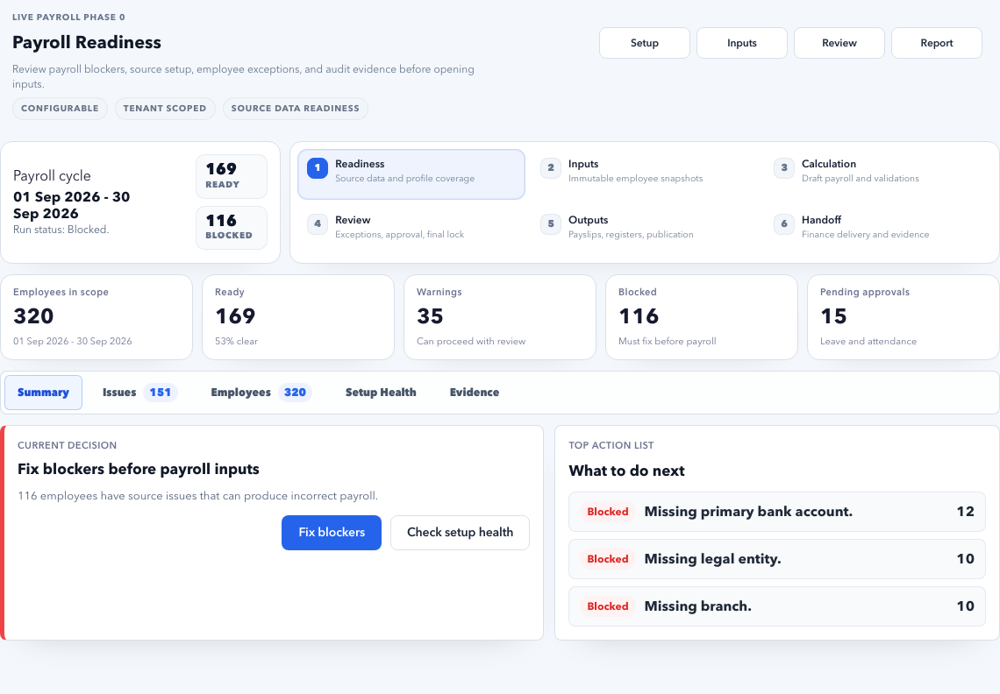

# How to Update This Documentation

Keep documentation close to the product. Whenever a feature changes, update the matching guide in the same development cycle.

## Update rule

Every user-facing change should answer:

- Does a menu name change?
- Does a page purpose change?
- Does a button, field, tab, or modal change?
- Does a workflow gain or lose a step?
- Does permission behavior change?
- Does troubleshooting guidance change?

If yes, update the docs.

## Page writing standard

Use this structure for new pages:

```md
# Page Name

Short explanation of the page.

## Purpose

Why this page exists.

## Use this page when

- Situation 1
- Situation 2

## What you can do

- Action 1
- Action 2

## Important buttons and fields

| Control | Meaning |
| --- | --- |
| Save | Saves the current record. |

## Checks before moving ahead

- Check 1
- Check 2

## Related pages

- Link to related page
```

## Screenshot standard

Screenshots are useful when a user needs visual confirmation, especially for dashboards, tabs, forms, queues, review panels, and drilldown pages.

Use screenshots only when they make the guide easier to follow. Do not add screenshots for every small button if the text already explains the action clearly.

### Screenshot safety rules

- Use demo or sanitized tenant data only.
- Do not show real employee names, personal emails, phone numbers, salary amounts, bank accounts, statutory IDs, provider credentials, API tokens, or customer secrets.
- Crop browser chrome unless the address bar is needed to explain navigation.
- Prefer desktop screenshots for operating screens.
- Add mobile screenshots only when layout behavior is important.
- Use clear alt text so search and accessibility remain useful.

### Screenshot storage

Store screenshots under:

```text
docs-site/docs/assets/screenshots/<workspace>/<page-name>.png
```

For payroll pages, use:

```text
docs-site/docs/assets/screenshots/payroll/
```

Example Markdown:

```md

```

### Screenshot review checklist

- The screenshot matches the current UI.
- The visible data is safe for public/internal documentation.
- The screenshot shows the exact section described by the nearby text.
- The image is not too tall; crop to the relevant section.
- The page still explains the workflow in text, so the screenshot supports the guide instead of replacing it.

### Refresh product screenshots

The HR Admin and payroll screenshots can be refreshed from the local demo environment with Playwright.

1. Start the backend on `127.0.0.1:8001`.
2. Start the web app on `127.0.0.1:3001`.
3. Run:

```bash
PLAYWRIGHT_BASE_URL=http://127.0.0.1:3001 \
  pnpm --dir web exec playwright test tests/e2e/docs-screenshot-capture.spec.ts --project=chromium
```

The test writes documentation screenshots into `docs-site/docs/assets/screenshots/`.

After capture, remove generated Playwright failure videos or temporary artifacts from `web/test-results` and `web/playwright-report` unless they are intentionally needed for debugging.

## Local preview

From the project root:

```bash
cd docs-site
python -m venv .venv
. .venv/bin/activate
pip install -r requirements.txt
mkdocs serve
```

Open the local URL shown by MkDocs.

## Build static docs

```bash
cd docs-site
mkdocs build
```

The generated static site is created under `docs-site/site/`.

## Quality checklist

- The page uses simple end-user language.
- The page explains when to use the feature.
- Buttons and fields are named exactly as shown in the product.
- Long workflows are split into steps.
- Internal engineering terms are avoided unless necessary.
- The page can be found through search using common user words.
- Screenshot placeholders are filled only with sanitized screenshots.

## Detailed module documentation standard

Use the detailed standard when documenting HR Admin, payroll, ESS, MSS, tenant admin, or platform admin functionality that has forms, approvals, exceptions, or downstream impact.

Each detailed module guide must include:

- Purpose: who uses the feature and when.
- Real example: use realistic values, such as Earned Leave with 18 days/year or an employee in a Bengaluru branch.
- Exact navigation: name the workspace, menu, tab, modal, and button.
- Field guide: explain important fields, recommended values, validations, and downstream impact.
- Positive workflow: show the normal successful path and expected result.
- Negative workflow: show at least one blocked or failed case and how to fix it.
- Cross-module impact: explain ESS, MSS, payroll, notifications, documents, reports, and audit impact where applicable.
- Troubleshooting: include the error message, likely reason, and correction steps.
- Quality gate: run docs QA before marking the guide complete.

For HR Admin detailed documentation, track progress in [HR Admin Detailed Documentation Roadmap](hr-admin/detailed-documentation-roadmap.md).

## Final QA command

Before closing documentation work, run:

```bash
pnpm qa:docs
```

This checks menu coverage, child route coverage, screenshots, navigation, secret safety, and the strict MkDocs build. See [Documentation QA](docs-qa.md) for failure meanings and fixes.
