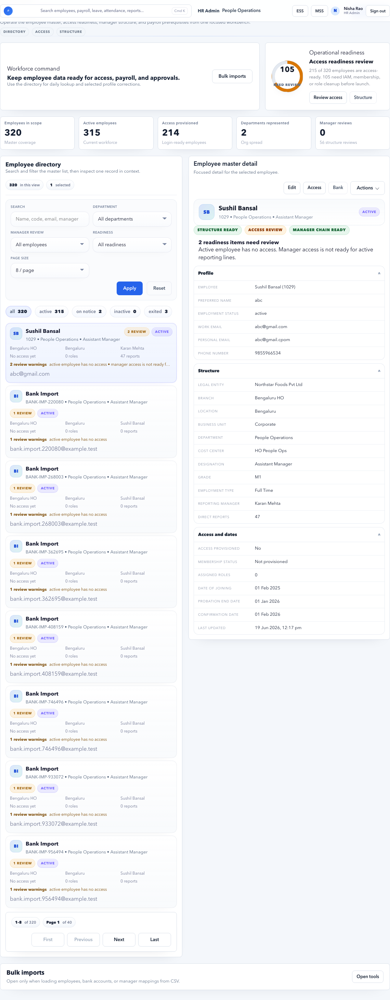

# Employees

Employees is the master workspace for employee profiles, structure readiness, access readiness, manager mapping, and payroll source quality.

## Purpose

Use Employees to create, search, review, and maintain employee records used by HR, payroll, ESS, MSS, documents, leave, attendance, and reporting.

## Use this page when

- A new employee joins.
- An employee changes department, branch, location, designation, manager, or status.
- Payroll readiness shows employee master blockers.
- A user cannot access ESS or MSS.
- Manager chain readiness needs review.
- Employee details must be checked before payroll close.

## Page sections

| Section | Meaning |
| --- | --- |
| Workforce command | Short explanation and primary actions such as New employee and Import updates. |
| Operational readiness | Summary of employees, access, departments, and manager review state. |
| Employee directory | Searchable employee list with filters and status pills. |
| Employee master detail | Detailed selected employee profile. |
| Actions menu | Contextual actions for the selected employee. |
| Bulk import | CSV-based employee creation or update workflow. |

## How to use this page safely

Employees is a master-data page. Use it for factual employee profile corrections and daily lookup. Use **Lifecycle** or **Movement** workflows when the change needs approval, future effective dates, owner tracking, or audit evidence.

| Change needed | Recommended place | Reason |
| --- | --- | --- |
| Correct spelling, phone, email, missing department, or missing branch | Employees | Simple master correction. |
| New joiner setup | Employees, then Lifecycle if onboarding tasks are needed | The employee record must exist before tasks can be tracked. |
| Promotion, transfer, manager change, or department movement | Lifecycle or Movements | These changes often need effective dates and approval. |
| Exit or final settlement trigger | Lifecycle or Exits | Exit affects access, payroll, documents, and F&F. |
| Salary or CTC change | Salary Setup | Salary changes should be effective-dated and payroll-auditable. |
| Bank account update | Employee bank account screen | Bank readiness affects payout. |
| Login or workspace access issue | Employee access or Tenant Admin Users | Access must match role and approval policy. |

## Directory filters

| Filter | Meaning |
| --- | --- |
| Search | Find by employee name, code, email, or manager. |
| Department | Show employees in one department. |
| Manager review | Show employees needing manager chain checks. |
| Readiness | Filter by structure, access, or manager readiness. |
| Page size | Controls how many employees appear in the list. |
| Status pills | Quickly show all, active, notice, inactive, or exited employees. |

## Employee detail fields

| Field | Meaning |
| --- | --- |
| Employee | Employee display name and employee code. |
| Preferred name | Name used in employee-facing views. |
| Employment status | Active, on notice, inactive, or exited. |
| Date of joining | Joining date used for eligibility and payroll. |
| Probation end date | Date used by probation workflow. |
| Confirmation date | Date when employee became confirmed. |
| Work email | Primary work email for login and communications. |
| Personal email | Personal contact email. |
| Legal entity | Employing company. |
| Branch / Location | Work location context used for payroll and reporting. |
| Department / Designation | Organization placement. |
| Manager | Reporting manager for MSS and approvals. |

## Readiness badges

| Badge | Meaning |
| --- | --- |
| Structure Ready | Department, branch, location, and related structure are valid. |
| Structure Review | Structural fields are missing or need review. |
| Access Ready | Employee login/access setup is valid. |
| Access Review | Employee is active but access may be missing. |
| Manager Chain Ready | Reporting line is valid. |
| Manager Review | Manager access or reporting chain needs correction. |

## Payroll impact fields

Some employee fields directly affect payroll readiness. Treat them carefully near payroll close.

| Field | Payroll impact |
| --- | --- |
| Employment status | Determines whether the employee is in payroll scope. |
| Date of joining | Controls partial-period eligibility and payroll inclusion. |
| Exit date / on notice status | Can affect payable days, F&F, and access. |
| Legal entity | Drives statutory setup, reports, and finance posting. |
| Branch / location | Can affect statutory state, HRA/location rules, attendance, and reports. |
| Department / business unit / cost center | Used for reporting, cost allocation, and approvals. |
| Manager | Drives MSS approvals and manager chain readiness. |
| Work email | Used for login, notifications, and employee communications. |

## Buttons and actions

| Button | What it does |
| --- | --- |
| New employee | Opens employee creation flow. |
| Import updates | Opens employee CSV update/import area. |
| Apply | Applies selected directory filters. |
| Reset | Clears directory filters. |
| Actions | Opens selected employee actions such as edit, access, movement, or review. |
| Load sample template | Loads employee CSV example. |
| Copy template | Copies CSV header/template. |
| Download template | Downloads the employee import template. |
| Upload CSV | Uploads employee import file. |
| Preview import | Validates import rows before commit. |
| Commit ready rows | Saves only rows that passed validation. |

## Employee action paths

| Action | Use it for | Check after completion |
| --- | --- | --- |
| Edit employee | Correct employee master fields. | Readiness badges should improve or remain valid. |
| Access | Provision or review login access. | Employee should have only the required workspace access. |
| Bank accounts | Add or update payroll bank details. | One active primary account exists. |
| Movement | Start a transfer, promotion, or manager/department change. | Movement has owner, effective date, and status. |
| Exit | Begin exit workflow. | Exit status and F&F requirements are visible. |
| Review warnings | Investigate readiness messages. | Warning is fixed or intentionally accepted with evidence. |

## Employee access and invite email

Use employee access only when the person needs to sign in to ESS, MSS, HR Admin, Finance Manager, or another workspace.

When HR Admin creates access for an employee:

1. The system creates or links the user account.
2. The system creates the tenant membership and role assignment.
3. The system queues a secure setup email to the employee email address.
4. The email contains a password setup/reset link.
5. The generated temporary password is not included in the email body.

After creating access, confirm:

- The email address is correct.
- The user status is active when login is required.
- The membership status is active or invited, depending on the launch decision.
- At least one role is assigned.
- The invite/setup email appears in **Notifications** as pending, delivered, or failed.
- The user can open the setup link, set a password, and land in the correct workspace.

If the employee says the email did not arrive, check **Notifications** for that email address. If no invite notification exists, the access may have been created before invite automation was enabled; resend a setup/reset email or ask an administrator to regenerate the invite.

## Recommended workflows

### Create one employee

1. Open **Employees**.
2. Click **New employee**.
3. Enter identity, work, organization, manager, and contact details.
4. Save the employee.
5. Reopen the employee from directory.
6. Confirm structure, access, and manager readiness badges.

Before leaving the employee record, confirm:

- Work email is correct.
- Legal entity, branch, location, department, designation, and manager are set.
- Employee status and joining date are correct.
- Access is created only if the employee needs to log in.
- If access is created, the setup email is queued and the user can complete password setup.
- Payroll-related setup continues in Salary Setup and bank/statutory screens.

### Correct payroll blocker

1. Open **Employees** from Payroll Control or Dashboard.
2. Search the employee.
3. Open the selected record.
4. Read the readiness message.
5. Correct the missing field.
6. Save and return to Payroll Control.

Common employee blockers:

| Blocker | Fix |
| --- | --- |
| Missing legal entity | Edit employee organization details. |
| Missing branch or location | Select valid branch/location from Organization masters. |
| Missing department | Select active department. |
| Missing manager | Assign manager or mark as intentionally not applicable if policy allows. |
| Active employee has no access | Open employee access or Tenant Admin Users if login is required. |
| Manager chain not ready | Check manager record, manager access, and reporting loop. |

### Bulk update employees

1. Download the template.
2. Fill only trusted source data.
3. Upload CSV.
4. Click **Preview import**.
5. Fix rejected rows.
6. Commit ready rows.
7. Review the affected employees.

Use bulk import when many records change at once. Use the form when a single employee needs careful correction or when the change needs immediate review.

## Before payroll close

Run this quick check before locking payroll inputs:

| Check | Expected result |
| --- | --- |
| Active employees | No required structure fields are missing. |
| New joiners | Joining date, legal entity, branch, manager, salary, and bank are ready. |
| Exits | Exit workflow and F&F status are clear. |
| Managers | Direct-report managers have manager access where approvals are needed. |
| Work emails | Login and notification addresses are correct. |
| Readiness badges | No unexplained Structure Review, Access Review, or Manager Review for payroll employees. |

## Quality checks

- Employee code is unique.
- Work email is correct and not shared.
- Department, branch, location, legal entity, and manager are present for active employees.
- Manager has required access if MSS approvals are needed.
- Payroll-required employees have salary, bank, and statutory details completed through the relevant modules.

## Good practice

Keep employee edits focused. Use Lifecycle or Movement pages for changes that need approval, ownership, due date, or audit evidence.

## FAQ

### Why does Payroll Control still show an employee blocker after I fixed the employee?

Refresh Payroll Control and confirm the selected payroll period is correct. Some checks also depend on Organization, Salary Setup, bank, statutory, leave, or attendance records.

### Should every employee have login access?

No. Provision access only when the employee needs ESS, MSS, HR Admin, Finance Manager, or Tenant Admin functionality.

### Can I edit an employee after payroll inputs are locked?

Yes, but the locked payroll run may still use the old snapshot. If the change affects pay, follow the payroll correction or rerun process.

### Why is manager chain readiness important?

Manager chain readiness controls approvals, MSS visibility, escalation, and organization reporting. A missing or incorrect manager can block workflows even when the employee profile looks complete.
