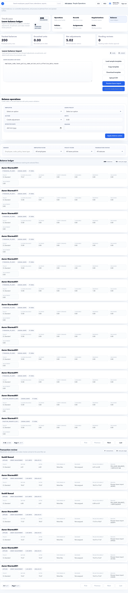

# Leave Management

Leave Management covers the full leave lifecycle: leave types, leave policies, scoped assignments, balances, employee requests, manager approvals, manual corrections, payroll impact, and audit evidence.

Use this guide when you are setting up leave for the first time, correcting employee leave data, resolving leave blockers before payroll, or helping employees and managers understand why a leave request is blocked.

## On This Page

- [Leave Quick Navigation](#leave-quick-navigation)
- [Who Uses Leave Management](#who-uses-leave-management)
- [Leave Management Map](#leave-management-map)
- [Recommended Setup Order](#recommended-setup-order)
- [Leave Type Setup](#leave-type-setup)
- [Leave Policy Setup](#leave-policy-setup)
- [Leave Policy Assignment](#leave-policy-assignment)
- [Leave Balances and Opening Balances](#leave-balances-and-opening-balances)
- [ESS Leave Request](#ess-leave-request)
- [MSS Leave Approval](#mss-leave-approval)
- [Payroll Impact](#payroll-impact)
- [Troubleshooting](#troubleshooting)
- [Leave signoff checklist](#leave-signoff-checklist)

## Leave Quick Navigation

| I need to... | Start here | Then check |
| --- | --- | --- |
| Set up leave from zero | [Recommended Setup Order](#recommended-setup-order) | [Example: Earned Leave Policy for India Office](#example-earned-leave-policy-for-india-office) |
| Create the visible leave bucket | [Leave Type Setup](#leave-type-setup) | [Leave Policy Setup](#leave-policy-setup) |
| Configure entitlement, accrual, attachments, or carry-forward | [Leave Policy Setup](#leave-policy-setup) | [Leave Policy Assignment](#leave-policy-assignment) |
| Assign leave policy to employees | [Leave Policy Assignment](#leave-policy-assignment) | [Leave Balances and Opening Balances](#leave-balances-and-opening-balances) |
| Fix employee balance or opening balance | [Leave Balances and Opening Balances](#leave-balances-and-opening-balances) | [Payroll Impact](#payroll-impact) |
| Help an employee apply leave | [ESS Leave Request](#ess-leave-request) | [MSS Leave Approval](#mss-leave-approval) |
| Understand payroll blockers | [Payroll Impact](#payroll-impact) | [Month-End Leave Checklist](#month-end-leave-checklist) |

## Who Uses Leave Management

| User | What they do |
| --- | --- |
| HR Admin | Creates leave types, policies, assignments, balances, corrections, and payroll readiness checks. |
| Employee | Applies leave, attaches evidence, withdraws/cancels when allowed, and tracks status in ESS. |
| Manager | Approves or rejects team leave requests in MSS. |
| Payroll Admin | Confirms leave is finalized before payroll inputs are locked. |
| Auditor | Reviews leave corrections, approvals, and balance transactions. |

## Leave Management Map

| Area | Page | Purpose |
| --- | --- | --- |
| Leave type setup | **HR Admin > Leave Types** | Create visible leave buckets such as Earned Leave, Casual Leave, Sick Leave, or Comp Off. |
| Leave policy setup | **HR Admin > Leave Policies** | Define entitlement, accrual, approval, attachment, carry-forward, and lifecycle rules. |
| Policy assignment | **HR Admin > Leave Policy Assignments** | Decide which employees receive which leave policy. |
| Balance operations | **HR Admin > Leave** | Review balances, upload/import balances, apply credit/debit/encashment, and approve balance transactions. |
| Employee request | **ESS > Leave** | Employee applies leave and tracks status. |
| Manager decision | **MSS > Approvals** | Manager approves or rejects leave requests. |
| Payroll readiness | **Payroll Control / Payroll Inputs** | Confirms leave source data is stable before calculation. |

## Recommended Setup Order

Follow this order for a new tenant or when introducing a new leave category:

1. Create or verify organization masters: legal entity, branch, department, employee type, grade, and manager mapping.
2. Create the leave type.
3. Create the leave policy.
4. Preview the policy route with a real employee.
5. Create the leave policy assignment.
6. Add opening balances or import migrated balances.
7. Test one employee leave request from ESS.
8. Test one roster-sensitive leave request if the employee does not work a standard Monday-to-Friday week.
9. Test manager approval from MSS.
10. Confirm Payroll Control does not show leave blockers.

Do not start with balance corrections if the leave type, policy, or assignment is missing. Repeated manual corrections usually mean the setup layer is wrong.

## Leave Type Setup

Leave type is the label employees and managers see. Policy rules are added later.

Open **HR Admin > Policies > Leave Types** or direct page **HR Admin > Leave Types**.

### Important Fields

| Field | Meaning | Example |
| --- | --- | --- |
| Code | System-friendly identifier. Keep it short and stable. | `EL`, `CL`, `SL` |
| Name | User-facing leave name. | `Earned Leave` |
| Short code | Compact display code. | `EL` |
| Category | Leave bucket used for reporting and behavior. | Earned, casual, sick, unpaid, comp off |
| Unit | Whether leave is tracked in days or another unit. | Days |
| Color code | Visual tag for UI. | `#0b6e4f` |
| Description | Human explanation of when to use the leave. | Annual earned leave for planned time off. |
| Active | Makes the leave type usable. | On |
| Requires attachment | Forces evidence at leave-type level. Use carefully. | Usually off for Earned Leave |
| Allow negative balance | Allows balance below zero. | Usually off |
| Approval required | Makes requests approval-driven. | Usually on |

### Example: Create Earned Leave Type

Use this example when the organization gives employees planned annual leave.

1. Open **HR Admin > Leave Types**.
2. Select **Create leave type**.
3. Enter:

| Field | Value |
| --- | --- |
| Code | `EL` |
| Name | `Earned Leave` |
| Short code | `EL` |
| Category | Earned / Paid leave category available in your tenant |
| Unit | Days |
| Color code | `#0b6e4f` |
| Description | `Annual earned leave for planned paid time off.` |
| Active | On |
| Requires attachment | Off |
| Allow negative balance | Off |
| Approval required | On |

4. Select **Create leave type**.

Expected result:

- Earned Leave appears in the leave type list.
- It can now be used while creating a leave policy.
- Employees still cannot use it until a leave policy and assignment exist.

### Example: Create Sick Leave Type

Use this example when sick leave may need a medical certificate.

| Field | Value |
| --- | --- |
| Code | `SL` |
| Name | `Sick Leave` |
| Short code | `SL` |
| Category | Sick leave category |
| Unit | Days |
| Requires attachment | Off at leave-type level if attachment is duration-based in policy |
| Approval required | On |

Recommended approach: keep attachment off at leave-type level and configure medical certificate threshold in the leave policy. This allows short sick leave without attachment and longer sick leave with evidence.

## Roster-sensitive leave calculation

Leave policies decide whether non-working days can be excluded, but attendance setup decides which weekdays are non-working for the employee.

| HR setup | Runtime result |
| --- | --- |
| Employee has a shift or roster assignment with weekly offs such as Tuesday and Wednesday | Leave request unit calculation excludes Tuesday and Wednesday. Saturday and Sunday can be counted as working days. |
| Employee has no resolved shift assignment for the requested dates | Leave calculation falls back to standard Saturday/Sunday weekly offs. |
| Attendance policy has a holiday calendar | Holidays can be excluded when `Allow weekend or holiday overlap` is off. |
| Leave policy counts calendar days or sandwich rule is enabled | Weekly offs and holidays may still count according to that leave policy. |

Use **HR Admin > Employee Shift Assignments** to preview the employee's shift resolution for the requested date range. After submission, open the leave request detail and review **Unit calculation**. It shows each date, weekday, whether it was counted, the reason, and the resolved shift/calendar context when available.

Good practice:

- Configure shift assignments before employees submit leave in a non-standard roster.
- Avoid fixing roster mistakes with manual balance corrections; correct the assignment and ask the employee to resubmit when needed.
- For standard office employees, keep a resolved shift assignment where possible. If none exists, the fallback is Saturday/Sunday.

## Leave Policy Setup

Leave policy defines the actual business rule: entitlement, accrual, carry-forward, attachment, approval route, lifecycle behavior, and holiday restrictions.

Open **HR Admin > Leave Policies** and select **Create leave policy**.

### Policy Field Guide

| Section | Field | Meaning | Practical guidance |
| --- | --- | --- | --- |
| Identity and timing | Leave type | Which leave type this policy controls. | Select `Earned Leave`, `Casual Leave`, or `Sick Leave`. |
| Identity and timing | Code | Stable policy identifier. | Use `EL_STANDARD_2026`, not a vague code. |
| Identity and timing | Name | User-friendly policy name. | `Earned Leave Standard` |
| Identity and timing | Status | Whether policy can be used. | Use Active only when ready to assign. |
| Identity and timing | Effective from / to | Date range when policy is valid. | Use financial year start or go-live date. |
| Entitlement | Accrual frequency | How leave is credited. | Monthly for Earned Leave; yearly/monthly based on policy. |
| Entitlement | Annual entitlement | Total yearly entitlement. | `18` for 18 days per year. |
| Entitlement | Max carry forward | Max unused units carried forward. | `45` or company cap. |
| Entitlement | Max consecutive days | Longest single request. | `15` or `30` for Earned Leave. |
| Entitlement | Min days per request | Smallest request allowed. | `0.5` if half-day is allowed. |
| Entitlement | Notice days required | Advance notice needed. | `0`, `1`, or company rule. |
| Eligibility | Gender restriction | Restrict policy if needed. | Usually blank. |
| Eligibility | Marital status restriction | Restrict policy if needed. | Usually blank. |
| Eligibility | Minimum service days | Service period before eligible. | Use `90` if leave starts after probation. |
| Behavior | Allow half day | Allows half-day leave. | On for EL/CL/SL if company permits. |
| Behavior | Allow backdated application | Allows leave after date passed. | Use carefully; often on for sick leave. |
| Behavior | Allow weekend or holiday overlap | Allows leave over weekends/holidays. | Usually off unless policy counts all calendar days. |
| Behavior | Enable sandwich rule | Counts intervening holidays/weekends based on company policy. | Use only if policy explicitly requires it. |
| Behavior | Probation eligible | Allows leave during probation. | Depends on company policy. |
| Routing | Default approval route | Who approves leave. | Usually manager first; HR fallback for special cases. |
| Routing | Escalation route | Additional approver for larger requests. | Use for long leave. |
| Evidence | Attachment label | What evidence means to user. | `Medical certificate`, `Supporting document`. |
| Evidence | Require attachment when units reach | Attachment threshold. | Example: `3` sick leave days. |
| Evidence | Require medical certificate when units reach | Medical certificate threshold. | Example: `3` days. |
| Entitlement advanced | Grant mode | How entitlement is granted. | Use monthly accrual for Earned Leave. |
| Entitlement advanced | Proration mode | How joining/leaving mid-year affects entitlement. | Use join-date proration for live tenants. |
| Entitlement advanced | Policy year start month/day | Policy year start. | India financial year: month `4`, day `1`; calendar year: `1`, `1`. |
| Entitlement advanced | Carry forward mode | How unused leave moves forward. | Carry forward with cap for Earned Leave. |
| Operations | Balance reviewer | Reviewer for sensitive balance actions. | HR/payroll owner. |
| Operations | Credit/debit thresholds | When manual actions need review. | Use thresholds to prevent silent large corrections. |
| Lifecycle | Withdraw pending | Allows employee to withdraw pending leave. | Recommended on. |
| Lifecycle | Cancel approved | Allows employee to cancel approved leave. | Recommended on with notice rules. |
| Holiday governance | Holiday-linked validation | Restricts leave to holiday rows. | Use for restricted holiday, not normal EL. |
| Workflow preview | Employee / requested units | Tests policy resolution. | Always preview before broad rollout. |

## Example: Earned Leave Policy for India Office

Use this example when the company gives 18 paid earned leaves per year, credited monthly.

### Business Rule

| Rule | Value |
| --- | --- |
| Annual entitlement | 18 days |
| Accrual | Monthly |
| Monthly credit | 1.5 days |
| Half day | Allowed |
| Approval | Required |
| Carry forward | Allowed with cap |
| Max balance / carry cap | 45 days |
| Encashment | Usually on exit or company-defined year-end policy |
| Negative balance | Not allowed |
| Attachment | Not required |
| Probation | Company-dependent |

### Steps

1. Open **HR Admin > Leave Policies**.
2. Select **Create leave policy**.
3. In **Identity and timing**, enter:

| Field | Value |
| --- | --- |
| Leave type | Earned Leave |
| Code | `EL_STANDARD_2026` |
| Name | `Earned Leave Standard` |
| Status | Active |
| Effective from | `2026-04-01` or tenant go-live date |
| Effective to | Blank unless policy has an end date |

4. In **Entitlement and request limits**, enter:

| Field | Value |
| --- | --- |
| Accrual frequency | Monthly |
| Annual entitlement | `18` |
| Max carry forward | `45` |
| Max consecutive days | `15` or `30` |
| Min days per request | `0.5` |
| Notice days required | `1` or company rule |

5. In **Behavior switches**, set:

| Toggle | Recommended value |
| --- | --- |
| Allow half day | On |
| Allow backdated application | Off |
| Allow weekend or holiday overlap | Off unless policy counts calendar days |
| Enable sandwich rule | On only if company policy requires it |
| Probation eligible | Company-dependent |

6. In **Advanced routing and evidence rules**, set:

| Field | Value |
| --- | --- |
| Default approval route | Manager / reporting chain route available in tenant |
| Escalation route | Optional |
| Attachment label | `Supporting document` |
| Require attachment when units reach | Blank |
| Always require attachment | Off |

7. In **Advanced entitlement and carry-forward rules**, set:

| Field | Value |
| --- | --- |
| Grant mode | Monthly accrual / accrual mode available in tenant |
| Proration mode | Joining-date proration if available |
| Policy year start month | `4` for Indian financial year |
| Policy year start day | `1` |
| Carry forward mode | Carry forward with cap |
| Carry forward cap override | `45` if needed |
| Encashment cap | Company rule, for example `15` or blank |

8. Use **Workflow preview**:
   - Select a real employee.
   - Requested units: `1`.
   - Select **Preview route**.

Expected preview:

- Current active policy resolves to Earned Leave Standard.
- Assignment scope is visible.
- Resolved route shows manager or HR approval.
- Attachment rule says no attachment required.
- Projected entitlement and carry forward look reasonable.

9. Select **Create leave policy**.

Do not proceed to employee testing until the policy preview resolves correctly.

## Example: Casual Leave Policy

Use this when casual leave is limited and usually does not carry forward.

| Field | Recommended value |
| --- | --- |
| Leave type | Casual Leave |
| Code | `CL_STANDARD_2026` |
| Name | `Casual Leave Standard` |
| Accrual frequency | Monthly or yearly, based on company policy |
| Annual entitlement | `12` |
| Max carry forward | `0` |
| Max consecutive days | `3` |
| Min days per request | `0.5` |
| Notice days required | `0` or `1` |
| Allow half day | On |
| Allow backdated application | Off |
| Approval route | Manager |
| Attachment required | Off |
| Carry forward mode | No carry forward |

Test scenario:

- Employee applies one day Casual Leave.
- Manager approves.
- Balance reduces by one day.
- Payroll readiness remains clear.

## Example: Sick Leave Policy With Medical Certificate

Use this when short sick leave is allowed without proof but longer sick leave needs a certificate.

| Field | Recommended value |
| --- | --- |
| Leave type | Sick Leave |
| Code | `SL_STANDARD_2026` |
| Name | `Sick Leave Standard` |
| Annual entitlement | `6` or company rule |
| Accrual frequency | Yearly or monthly |
| Allow backdated application | On, if company allows |
| Attachment label | `Medical certificate` |
| Require medical certificate when units reach | `3` |
| Approval route when evidence is required | Manager + HR or company route |
| Always require attachment | Off unless every sick leave requires evidence |

Positive example:

1. Employee applies 1 day Sick Leave.
2. No attachment is required.
3. Manager approves.

Evidence-required example:

1. Employee applies 3 days Sick Leave.
2. Page asks for medical certificate.
3. Employee uploads file.
4. Manager or HR reviews the evidence.

Negative example:

- Employee applies 3 days Sick Leave without certificate.
- Expected result: submission is blocked or asks for required evidence.
- Fix: upload medical certificate and resubmit.

## Leave Policy Assignment

Creating a policy is not enough. The policy must be assigned to the right employee population.

Open **HR Admin > Leave Policy Assignments** and select **Create assignment**.

### Assignment Field Guide

| Field | Meaning | Example |
| --- | --- | --- |
| Leave policy | Policy to apply. | Earned Leave Standard |
| Legal entity | Restricts policy to one legal entity. | Accerio India Pvt Ltd |
| Branch | Restricts to a branch. | Bengaluru HO |
| Department | Restricts to a department. | People Operations |
| Grade | Restricts to employee grade. | G5 |
| Employment type | Restricts to full-time, contract, intern, etc. | Full-time |
| Employee override | Applies to one employee only. | Use for testing or exception |
| Priority | Which policy wins when multiple assignments match. | Higher priority for specific overrides |
| Active | Whether assignment participates in policy resolution. | On |

### Example: Assign Earned Leave to All India Employees

1. Open **HR Admin > Leave Policy Assignments**.
2. Select **Create assignment**.
3. Enter:

| Field | Value |
| --- | --- |
| Leave policy | Earned Leave Standard |
| Legal entity | Accerio India Pvt Ltd |
| Branch | Blank unless branch-specific |
| Department | Blank unless department-specific |
| Grade | Blank unless grade-specific |
| Employment type | Full-time, if policy is only for full-time employees |
| Employee override | Blank |
| Priority | `100` |
| Active | On |

4. Review the assignment governance check.
5. If the page shows active overlap, confirm whether this assignment should override or be overridden.
6. Select **Create assignment**.

Expected result:

- Employees in the selected scope can resolve the Earned Leave policy.
- Employees outside the scope cannot apply this policy.
- ESS leave requests should no longer fail with missing policy for covered employees.

### Example: Employee-Specific Test Assignment

Use this before broad rollout.

| Field | Value |
| --- | --- |
| Leave policy | Earned Leave Standard |
| Employee override | Select one test employee |
| Priority | `999` |
| Active | On |

Expected result:

- Only that employee gets the test policy.
- If the test succeeds, create a wider assignment later.

### Assignment Mistakes

| Mistake | Result | Fix |
| --- | --- | --- |
| Policy is active but no assignment exists. | Employee sees missing policy error. | Create active assignment. |
| Assignment is inactive. | Policy does not resolve. | Turn assignment active. |
| Assignment scope is too narrow. | Some employees cannot apply leave. | Add legal entity/branch/department scope correctly. |
| Two assignments have same priority and overlap. | Resolution may be blocked or ambiguous. | Change priority or narrow scope. |
| Employee type mismatch. | Full-time employee may miss policy if policy assigned to contract workers. | Correct employment type scope. |

## Leave Balances and Opening Balances

Balances show what each employee has available under a policy. Use balance actions only when the reason is clear.

Open **HR Admin > Leave**.

### Balance Operations

| Action | Meaning | Example use |
| --- | --- | --- |
| Credit adjustment | Add units. | Opening balance or approved correction. |
| Debit adjustment | Reduce units. | Wrong migrated balance or correction. |
| Encashment | Convert balance into payable settlement. | Exit encashment or year-end encashment. |

### Balance Form Fields

| Field | Meaning |
| --- | --- |
| Employee | Employee whose balance changes. |
| Leave policy | Policy balance to adjust. |
| Action | Credit, debit, or encashment. |
| Units | Number of leave units. |
| Effective date | Date the action applies. |
| Reason | Business reason and audit context. |

### Example: Add Opening Earned Leave Balance

Use this during migration from another system.

1. Open **HR Admin > Leave**.
2. In **Balance operations**, select:

| Field | Value |
| --- | --- |
| Employee | Riya Sharma |
| Leave policy | Earned Leave Standard |
| Action | Credit adjustment |
| Units | `6.00` |
| Effective date | `2026-04-01` |
| Reason | `Opening earned leave balance migrated from previous HRMS.` |

3. Select **Apply balance action**.
4. If approval is required, approve the transaction from the review queue.
5. Search the employee and confirm balance is updated.

Expected result:

- Balance increases by 6 units.
- Transaction history shows the reason.
- Payroll/audit can trace why the balance was added.

### Example: Correct Wrong Balance

Scenario: Employee was imported with 10 EL days, but verified opening balance is 8 days.

| Field | Value |
| --- | --- |
| Action | Debit adjustment |
| Units | `2.00` |
| Reason | `Correcting migrated EL opening balance from 10 to 8 after HR verification.` |

Expected result:

- Balance reduces by 2 units.
- Reason explains the correction.
- If reviewer approval is configured, transaction remains pending until approved.

### Import Leave Balances

Use import when many employees need opening balance or correction.

1. Open **HR Admin > Leave**.
2. Use the import workbench.
3. Download or copy the template.
4. Prepare rows with employee code, leave policy name, action, units, effective date, and reason.
5. Preview import.
6. Fix invalid rows.
7. Commit only ready rows.

Common import errors:

| Error | Fix |
| --- | --- |
| Employee code is required. | Add valid employee code. |
| Leave policy name must match an existing leave balance policy. | Use exact policy name from HR Admin. |
| Units must be greater than zero. | Correct units. |
| Effective date must be valid. | Use valid date format. |
| Duplicate batch row. | Remove duplicate row or change action/date/reason. |

## ESS Leave Request

Employees apply leave from **ESS > Leave**.

### Example: Employee Applies Earned Leave

1. Employee opens **ESS > Leave**.
2. Selects **Apply leave**.
3. Chooses **Earned Leave**.
4. Selects start date and end date.
5. Chooses full-day or half-day portions.
6. Enters reason: `Personal work`.
7. Reviews request summary:
   - Available balance.
   - After request balance.
   - Weekend days.
   - Attachment rule.
8. Selects **Submit leave**.

Expected result:

- If approval is required, status becomes pending.
- Manager receives approval task in MSS.
- Balance is reserved or updated based on policy behavior.
- Employee can track the request in ESS.

### Example: Employee Applies Sick Leave Requiring Certificate

1. Employee opens **ESS > Leave**.
2. Chooses **Sick Leave**.
3. Selects 3 days.
4. Uploads medical certificate.
5. Submits request.

Expected result:

- Submission succeeds only when required evidence is present.
- Manager or HR can review the evidence.

## MSS Leave Approval

Managers approve leave from **MSS > Approvals**.

### Manager Approval Checklist

Before approving, manager should check:

- Employee name and dates.
- Leave type.
- Requested units.
- Reason.
- Team coverage.
- Evidence if required.
- Payroll cutoff if the request is old or in current payroll period.

### Example: Approve Earned Leave

1. Manager opens **MSS > Approvals**.
2. Selects the leave queue.
3. Opens the employee request.
4. Checks dates and team coverage.
5. Adds comment if needed.
6. Selects **Approve**.

Expected result:

- Employee sees approved status in ESS.
- Leave can affect balance and payroll readiness.
- Payroll Control should not show this request as pending.

### Example: Reject Leave

1. Manager opens request.
2. Adds clear rejection comment:
   - `Team coverage is already below minimum on this date. Please choose another date.`
3. Selects **Reject**.

Expected result:

- Employee sees rejected status and reason.
- Balance is not consumed.
- Payroll should not count it as approved leave.

## Withdraw and Cancel Leave

Whether employees can withdraw or cancel depends on lifecycle governance in the policy.

| Action | Used when | Policy controls |
| --- | --- | --- |
| Withdraw pending leave | Employee submitted request but it is not approved yet. | Allow employee withdraw while pending, notice hours, evidence rule. |
| Cancel approved leave | Employee needs to cancel already-approved leave. | Allow employee cancel after approval, reapproval rule, notice hours, evidence rule. |

Examples:

- Employee withdraws a pending leave before manager approval: request becomes withdrawn and leaves manager queue.
- Employee cancels approved leave after approval: policy may apply cancellation directly or route cancellation for approval.

Payroll warning:

- If approved leave has already been consumed by locked payroll inputs, cancellation may require payroll correction or adjustment.

## Payroll Impact

Leave affects payroll when it changes payable days, unpaid leave, encashment, or final settlement.

| Leave situation | Payroll impact |
| --- | --- |
| Approved paid leave | Usually no salary deduction; balance reduces. |
| Approved unpaid leave / LWP | Reduces payable days or salary. |
| Pending leave in payroll period | Can block or warn payroll readiness. |
| Leave approved after input lock | May require payroll rerun, adjustment, or next-cycle correction. |
| Encashment | Adds payable amount if payroll rules support it. |
| Exit encashment | Affects full-and-final settlement. |
| Carry-forward / expiry | Affects opening balance for next period. |

Before payroll inputs are locked:

1. Open **Payroll Control**.
2. Check leave readiness warnings or blockers.
3. Open **HR Admin > Leave** for pending leave and balance transactions.
4. Ensure manager approvals are complete.
5. Ensure LWP/unpaid leave is correctly reflected.
6. Lock payroll inputs only after leave source data is stable.

## Month-End Leave Checklist

| Check | Expected result |
| --- | --- |
| Pending leave requests inside payroll period | Approved, rejected, withdrawn, or documented as non-payroll-impacting. |
| Pending balance transactions | Approved or rejected. |
| LWP / unpaid leave | Correctly marked for payroll. |
| Opening balance corrections | Reasoned and approved if required. |
| Carry-forward / expiry | Applied only for correct policy period. |
| Leave policy assignment | No missing policy for active employees. |
| Repeated manual corrections | Investigated as setup issue. |
| Payroll Control | No leave blockers remain. |

## Troubleshooting

| Message or issue | Why it happens | How to fix |
| --- | --- | --- |
| No active leave policy is assigned to this employee. | No active assignment resolves for employee, leave type, and date. | Check leave policy status, assignment scope, priority, employee legal entity/branch/department/employment type, and effective dates. |
| Employee cannot see leave type in ESS. | Leave type inactive, no active policy, or no matching assignment. | Activate leave type/policy and create assignment. |
| Insufficient balance. | Requested units exceed available balance and negative balance is not allowed. | Reduce request, add verified opening balance, or fix accrual policy. |
| Attachment required. | Policy requires evidence based on leave type or duration. | Employee uploads required file; HR verifies policy threshold. |
| Approval route missing or unresolved approver. | Manager mapping or workflow owner is missing. | Fix employee reporting manager or configure HR/second-level owner. |
| Backdated leave is blocked. | Policy does not allow backdated applications. | Use current/future date or HR changes policy if allowed. |
| Weekend/holiday overlap blocked. | Policy disallows overlap or holiday-linked governance requires specific dates. | Correct dates or adjust policy only if business rule allows. |
| Balance action failed. | Missing employee/policy, invalid units/date, or permission issue. | Correct fields and confirm user has leave balance management permission. |
| Balance transaction pending. | Maker-checker review is required. | Reviewer approves or rejects transaction. |
| Leave approved but payroll still blocked. | Payroll inputs may not refresh, another pending leave exists, or approval happened after lock. | Refresh Payroll Control; check all requests; follow payroll correction/rerun process if locked. |

## Practical End-to-End Scenario: Earned Leave From Setup to Payroll

Use this full scenario to certify Leave Management after setup changes.

### Step 1: Create Leave Type

Create `Earned Leave` with code `EL`, unit `Days`, approval required, active, and no negative balance.

### Step 2: Create Policy

Create `Earned Leave Standard`:

- Annual entitlement: `18`.
- Accrual frequency: monthly.
- Min days: `0.5`.
- Max carry forward: `45`.
- Half day: allowed.
- Approval: manager route.
- Attachment: not required.
- Policy year: `1 Apr` to `31 Mar` for Indian financial year.

### Step 3: Assign Policy

Assign policy to the legal entity or test employee.

### Step 4: Add Opening Balance

Credit `6.00` units with reason:

`Opening earned leave balance migrated from previous HRMS.`

### Step 5: Employee Applies Leave

Employee applies 1 day Earned Leave from ESS.

### Step 6: Manager Approves

Manager approves from MSS.

### Step 7: HR Verifies

HR opens Leave and confirms:

- Request is approved.
- Balance decreased or reserved according to policy.
- Transaction history is explainable.

### Step 8: Payroll Verifies

Payroll Control should not show pending leave blocker for that request.

Success criteria:

- Employee can apply leave.
- Manager can approve.
- HR can trace balance and status.
- Payroll readiness remains clear.

## Practical Negative Scenario: Missing Policy Assignment

Scenario: Employee sees `No active leave policy is assigned to this employee.`

Fix path:

1. Open employee detail and confirm legal entity, branch, department, grade, employment type, and manager.
2. Open **Leave Policies** and confirm the policy is active and effective for the selected date.
3. Open **Leave Policy Assignments**.
4. Check whether assignment scope includes the employee.
5. If not, create assignment:
   - Leave policy: Earned Leave Standard.
   - Employee override: selected employee for immediate test, or correct legal entity/branch scope for production.
   - Priority: higher than conflicting broad policy if needed.
   - Active: on.
6. Return to ESS and submit the leave request again.

Expected result:

- Missing policy error disappears.
- Request summary shows balance and policy guidance.

## Practical Negative Scenario: Attachment Missing

Scenario: Sick Leave policy requires medical certificate for 3 or more days.

Employee tries to submit 3 days without file.

Expected result:

- Submission is blocked or indicates attachment requirement.

Fix path:

1. Employee attaches medical certificate.
2. Employee submits again.
3. Manager/HR reviews evidence during approval.

If the policy should not require attachment:

1. HR opens **Leave Policies**.
2. Edits Sick Leave policy.
3. Clears `Require medical certificate when units reach` or turns off always require attachment.
4. Saves only after confirming company policy.

## Practical Negative Scenario: Payroll Locked Before Approval

Scenario: Employee leave is approved after payroll inputs are locked.

Risk:

- Current payroll run may not include the leave impact.

Fix path:

1. Open **Payroll Inputs** and confirm whether the payroll run is locked.
2. If unlocked, refresh source data and recheck Payroll Control.
3. If locked, decide whether to rerun, adjust, or carry correction into next payroll.
4. Add audit notes explaining the late approval.

## Good Practices

- Test a policy with one employee before broad rollout.
- Prefer policy and assignment fixes over repeated manual balance corrections.
- Use clear reasons for every balance adjustment.
- Do not edit active policy behavior during payroll close unless fixing a blocker.
- Use future effective dates for policy changes whenever possible.
- Keep manager mapping clean; approval failures often start with missing manager data.
- Check Payroll Control after leave setup changes.

## FAQ

### Should HR create leave for employees or should employees use ESS?

Employees should normally apply leave from ESS. HR should create or correct leave only for controlled cases such as migration, missed historical entry, employee access issue, or a documented payroll correction.

### Can one employee have multiple leave policies?

Yes, but only one policy should win for a leave type and date. Use assignment priority and effective dates to make the winning policy clear. Avoid overlapping broad and employee-specific policies unless the override is intentional.

### Why does an employee have balance but still cannot apply leave?

Balance alone is not enough. The employee also needs an active leave type, active policy, valid assignment, allowed date range, approval route, and any required attachment.

### When should HR use opening balance versus adjustment?

Use opening balance for migrated or starting balances. Use adjustment for a correction after the employee is already live, and always add a reason.

### Does approved leave always affect the current payroll?

Only if the payroll period is still open and inputs are refreshed before lock. Late approvals may need rerun, adjustment, or next-period correction depending on payroll policy.

## Leave signoff checklist

| Check | Expected result |
| --- | --- |
| Leave types exist. | Employees see only valid leave choices. |
| Policies are active and assigned. | Eligible employees can apply leave for the correct dates. |
| Opening balances are loaded. | Migrated balances match HR records. |
| Approval route works. | Manager/HR decisions reach the right queue. |
| Payroll-period leave is closed. | Pending approvals do not block payroll inputs. |
| Manual adjustments have reason. | Corrections are auditable and explainable. |

## Related Pages

- [Policies](policies.md)
- [Attendance](attendance.md)
- [Payroll Control](payroll/payroll-control.md)
- [Payroll Inputs](payroll/payroll-inputs.md)
- [Leave and Attendance to Payroll](../workflows/leave-attendance-to-payroll.md)
- [ESS Leave](../ess/leave.md)
- [MSS Approvals](../mss/approvals.md)
- [HR Admin Task Recipes](task-recipes.md)
