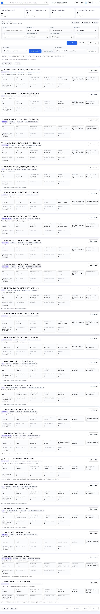

# Lifecycle

Lifecycle manages employee events from joining to exit, including onboarding, movement, probation, and separation.

## Purpose

Use Lifecycle when an employee change needs workflow tracking, owner assignment, evidence, or approval.

## Use this page when

- A joiner needs onboarding tasks.
- A transfer, promotion, department change, or reporting change is planned.
- Probation needs review.
- An employee resignation or exit must be processed.
- A lifecycle item is blocking launch or payroll readiness.

## Lifecycle queues

| Queue | Purpose |
| --- | --- |
| Joiners | New hire onboarding tasks. |
| Movements | Transfer, promotion, manager change, branch change, or department change. |
| Probation | Probation review, confirmation, extension, or rejection. |
| Exits | Resignation, termination, final working date, F&F readiness. |
| Assignments | Owner and due-date tracking for lifecycle tasks. |

## When to use Lifecycle instead of Employees

Use **Employees** for direct master-data corrections. Use **Lifecycle** when the change needs process control.

| Situation | Use |
| --- | --- |
| Correct typo in employee name | Employees |
| Add missing department after import | Employees |
| New joiner onboarding checklist | Lifecycle Joiners |
| Promotion or transfer effective next month | Movements |
| Manager change that affects approvals | Movements |
| Probation confirmation or extension | Probation |
| Resignation, termination, or F&F readiness | Exits |
| Task needs owner, due date, reminder, or approval evidence | Lifecycle |

## Common lifecycle statuses

| Status | Meaning | Typical action |
| --- | --- | --- |
| Draft | Created but not submitted. | Complete missing details. |
| Submitted | Waiting for review or approval. | Reviewer checks details. |
| Approved | Accepted and ready for effective-date processing. | Monitor effective date. |
| Rejected | Sent back for correction. | Fix and resubmit if needed. |
| Effective | Change has taken effect. | Confirm employee master updated. |
| Closed | Workflow is complete. | Keep evidence for audit. |
| Overdue | Due date has passed. | Reassign, escalate, or complete task. |

## Movement operations

Use movements for planned changes that should not silently edit employee master data.

| Field | Meaning |
| --- | --- |
| Movement type | Transfer, promotion, manager change, department change, or other change type. |
| Effective date | Date from which the change applies. |
| Current structure | Existing department, branch, manager, or designation. |
| Target structure | New department, branch, manager, or designation. |
| Owner | Person responsible for completing the movement. |
| Status | Draft, submitted, approved, rejected, effective, or closed. |

## Lifecycle impact areas

| Lifecycle event | What it can affect |
| --- | --- |
| Joiner | Employee master, access, documents, salary setup, bank setup, payroll inclusion. |
| Movement | Department, branch, location, manager chain, approvals, cost center, payroll grouping. |
| Probation | Confirmation date, employment status, policy eligibility, reporting. |
| Exit | Access removal, final working date, payroll stop, F&F, documents, assets. |

Treat lifecycle changes as payroll-sensitive when they affect pay group, status, payable days, cost center, legal entity, branch, or manager approval.

## Buttons and actions

| Button | What it does |
| --- | --- |
| Create movement | Starts a new movement record. |
| Apply filters | Filters lifecycle or movement records. |
| Clear filters | Resets filters. |
| Select page | Selects visible records for bulk action. |
| Assign owner | Assigns selected lifecycle items to an owner. |
| Set status | Changes selected item status when allowed. |
| Review | Opens item detail or review page. |
| Back to lifecycle | Returns from movement page to lifecycle overview. |

## Bulk action safety

Bulk owner and status actions are useful, but they can create confusion if used on the wrong filtered set.

Before using a bulk action:

- Confirm filters show only the intended records.
- Check selected count.
- Confirm the owner or status applies to every selected row.
- Avoid bulk closing records that still require evidence.
- Reopen a sample record after bulk update to confirm the result.

## Recommended movement workflow

1. Create movement.
2. Select employee.
3. Choose movement type.
4. Enter effective date.
5. Enter target department, designation, branch, location, or manager.
6. Assign owner.
7. Submit or save according to internal policy.
8. Approver reviews and approves.
9. Confirm employee master reflects the change after effective date.

## Joiner workflow

1. Create or confirm the employee record.
2. Open Lifecycle joiner queue.
3. Assign onboarding owner.
4. Track required tasks such as documents, access, salary, bank, and manager setup.
5. Close tasks only after evidence is available.
6. Confirm Payroll Control and Dashboard readiness.

## Exit workflow

1. Create exit record with expected last working date.
2. Assign owner and approver.
3. Confirm handover, document, asset, and access tasks.
4. Confirm payroll stop date and F&F readiness.
5. Remove or disable access according to policy.
6. Close exit only after final evidence is complete.

## Before payroll close

Check Lifecycle if payroll has unexplained blockers:

| Item | What to verify |
| --- | --- |
| Joiners | All payroll-required joiner tasks are complete. |
| Movements | Effective-date changes are approved and applied. |
| Probation | Confirmation changes do not affect benefits or eligibility unexpectedly. |
| Exits | Final working date, status, and F&F state are correct. |
| Manager changes | Manager access and approval routing are ready. |

## Good practice

- Use effective dates carefully. Payroll and manager approvals may depend on them.
- Do not use movement for simple typo corrections.
- Use bulk owner assignment only after selecting the right records.
- Review manager access when reporting lines change.

## FAQ

### Why should I not directly edit a transfer in Employees?

A direct edit changes the employee master but may skip approval, ownership, effective date, and audit evidence. Use Movements when the transfer is operationally meaningful.

### Can an approved movement still block payroll?

Yes. If the movement affects legal entity, branch, location, pay group, cost center, or manager approval and has not become effective correctly, payroll readiness can still show blockers or warnings.

### What should I do with overdue lifecycle items?

Filter overdue items, assign an owner, and resolve the highest payroll or launch impact first. Do not close overdue items without evidence.

### Should exits remove access immediately?

Follow company policy. Some exits require access until last working day; others require immediate restriction. Always ensure the access decision is visible in the exit evidence.
