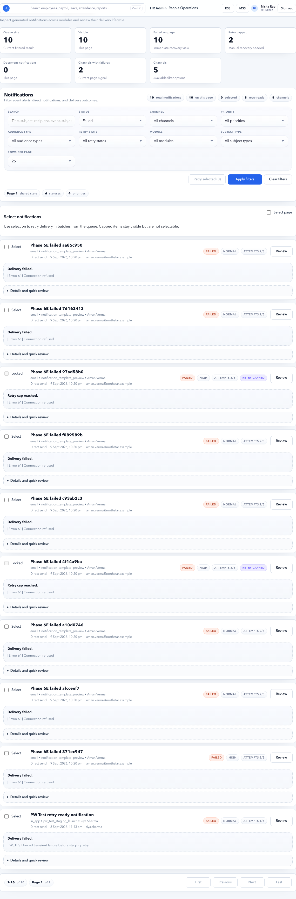
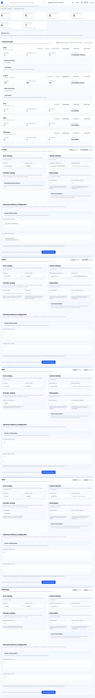

# HR Admin Notifications

Use **HR Admin > Notifications** to prove that HRMS messages are created, routed, delivered, retried, and audited correctly. This guide is written for HR Admins, payroll operators, support users, and implementation teams who need to test or operate notification workflows without guessing.

Notifications are launch-critical because they unblock access, approvals, compliance corrections, payroll communication, and go-live remediation.





## On This Page

- [Notification Quick Navigation](#notification-quick-navigation)
- [What Notifications Owns](#what-notifications-owns)
- [Navigation Map](#navigation-map)
- [Mental Model](#mental-model)
- [Launch-Critical Notification Matrix](#launch-critical-notification-matrix)
- [Operational Email Catalog](#operational-email-catalog)
- [Template Variable Catalog](#template-variable-catalog)
- [Delivery Worker And Scheduled Jobs](#delivery-worker-and-scheduled-jobs)
- [Scenario Playbooks](#scenario-playbooks)
- [Positive Testing Pack](#positive-testing-pack)
- [Negative Testing Pack](#negative-testing-pack)
- [Retry Decision Guide](#retry-decision-guide)
- [Evidence To Capture](#evidence-to-capture)
- [Troubleshooting](#troubleshooting)
- [Browser QA Checklist](#browser-qa-checklist)
- [Final Signoff Checklist](#final-signoff-checklist)

## Notification Quick Navigation

| I need to... | Start here | Then check |
| --- | --- | --- |
| Check whether email/in-app delivery is healthy | [Page 2: Notification Delivery](#page-2-notification-delivery) | [Delivery Worker And Scheduled Jobs](#delivery-worker-and-scheduled-jobs) |
| Find why a user did not receive a message | [Page 5: Notification Queue](#page-5-notification-queue) | [Page 6: Notification Review](#page-6-notification-review) |
| Fix message text, subject, link, or variables | [Page 3: Notification Templates](#page-3-notification-templates) | [Operational Email Catalog](#operational-email-catalog) |
| Add a new workflow notification | [Page 4: Notification Events](#page-4-notification-events) | [Mental Model](#mental-model) |
| Retry failed notifications safely | [Retry Decision Guide](#retry-decision-guide) | [Negative Testing Pack](#negative-testing-pack) |
| Prepare launch signoff evidence | [Launch-Critical Notification Matrix](#launch-critical-notification-matrix) | [Final Signoff Checklist](#final-signoff-checklist) |
| Investigate SMTP or worker failures | [Page 7: Notification Diagnostics](#page-7-notification-diagnostics) | [Troubleshooting](#troubleshooting) |

## What Notifications Owns

| Area | What it controls | Example |
| --- | --- | --- |
| Events | The business trigger that creates a notification. | Leave request submitted. |
| Templates | Subject, title, body, and channel-specific content. | "Leave request pending approval". |
| Queue | The individual message record created for one recipient. | Email to `aditi.gupta1789@gmail.com`. |
| Delivery | Whether the message is pending, delivered, failed, read, or retry-capped. | SMTP rejected the email. |
| Channel health | Whether email, in-app, push, SMS, or other providers are healthy. | Email has 9 failed records. |
| Retry and review | Manual triage, retry, priority update, hold, or escalation. | Retry after SMTP is fixed. |
| Evidence | Operational proof for HR, payroll, support, and audit. | Recipient, template, event, attempt count, latest failure. |

## Navigation Map

| Page | URL | Primary responsibility | Use when |
| --- | --- | --- | --- |
| Notifications control | `/hr-admin/notifications-admin` | One-page command center for delivery, templates, events, diagnostics, and queue. | You need the health picture and next action. |
| Notification delivery | `/hr-admin/notification-delivery` | Channel health, provider failures, retry capacity, and channel configuration. | Email or in-app delivery is failing. |
| Notification templates | `/hr-admin/notification-templates` | Template catalog and message editing. | Message text, link, or variables are wrong. |
| New template | `/hr-admin/notification-templates/new` | Create a reusable message template. | A workflow needs a new message. |
| Notification events | `/hr-admin/notification-events` | Business trigger and recipient routing setup. | A workflow action should create a message. |
| New event | `/hr-admin/notification-events/new` | Create a trigger that uses a template. | A new process must notify a role, manager, employee, or member. |
| Notification diagnostics | `/hr-admin/notification-diagnostics` | Catalog health, failed delivery summary, channel findings, and recommendations. | You need launch-grade evidence or cleanup. |
| Notification queue | `/hr-admin/notifications` | Search, filter, review, retry, and update notification records. | A user says they did not receive a message. |
| Notification review | `/hr-admin/notifications/{id}/review` | Full payload, status, delivery attempt, and audit review. | A single message needs deep investigation. |
| Audit logs | `/hr-admin/audit` | Wider evidence trail. | You need who changed what and when. |

## Who Can Use It

| Role | Can view | Can manage | Notes |
| --- | --- | --- | --- |
| HR Admin | Yes | Yes, where assigned permission exists. | Primary owner for business notification operations. |
| Payroll Admin / Finance | Usually view or action-specific access. | Depends on role setup. | Relevant for payslip, payroll review, and handoff messages. |
| Manager | In-app/MSS notifications only. | No HR Admin catalog control. | Reviews approval messages in MSS. |
| Employee | ESS notifications only. | No HR Admin catalog control. | Receives leave, attendance, payslip, document, and tax updates. |
| Platform / Technical Admin | Yes if granted. | Provider and backend configuration. | Owns SMTP, worker, DNS, and infrastructure-level issues. |

## Mental Model

Every notification follows this path:

1. A business action happens.
2. A notification event matches that action.
3. The event chooses an audience and channel.
4. The event renders a template.
5. A notification queue record is created.
6. The delivery worker processes the queue.
7. The provider returns success or failure.
8. HR Admin reviews, retries, or records evidence.

In short:

`Business action -> Event -> Template -> Queue record -> Provider -> Status -> Audit evidence`

If a user says "I did not get email", do not start with SMTP only. Check whether the event created a queue record first.

## Launch-Critical Notification Matrix

Use this matrix for stage signoff and production smoke tests.

| Business event | Recipient | Channel | Why it matters | Expected result |
| --- | --- | --- | --- | --- |
| New tenant admin invite | Tenant Admin | Email | Tenant cannot administer account without it. | Setup link email is received and usable. |
| New HR Admin invite | HR Admin | Email | HR cannot operate workspace. | Setup link email is received and user lands in HR Admin. |
| New employee invite | Employee | Email | Employee cannot access ESS. | Setup link email is received and user lands in ESS. |
| Password reset requested | Requesting user | Email | User is blocked from login. | Reset link email is received and works. |
| Leave request submitted | Manager | Email and/or in-app | Manager must approve. | Manager sees approval task. |
| Leave approved | Employee | Email and/or in-app | Employee needs status confirmation. | Employee sees approved status. |
| Leave rejected | Employee | Email and/or in-app | Employee needs reason. | Employee sees rejection reason. |
| Attendance regularization submitted | Manager | Email and/or in-app | Manager must approve correction. | Manager sees attendance task. |
| Attendance approved/rejected | Employee | Email and/or in-app | Employee needs final status. | Employee sees decision. |
| Document uploaded for review | HR Admin | Email and/or in-app | HR must verify documents. | HR receives review alert. |
| Document re-upload requested | Employee | Email and/or in-app | Employee must correct document. | Employee sees correction task. |
| Document expiry attention | Employee | Email and/or in-app | Compliance document may expire. | Employee sees renewal request. |
| Tax declaration/proof rejected | Employee | Email and/or in-app | Employee must correct before payroll. | Employee sees rejection reason. |
| Payslip published | Employee | Email and/or in-app | Employee should know payslip is available. | Employee receives payslip alert. |
| Payroll review requested | Payroll / HR approver | Email and/or in-app | Payroll close may be delayed. | Approver receives review alert. |
| Payroll handoff completed | Finance Manager | Email and/or in-app | Finance needs payout evidence. | Finance receives handoff alert. |
| Launch remediation reminder | HR/Admin owner | Email and/or in-app | Go-live blocker needs action. | Owner receives action reminder. |
| Launch remediation escalation | HR/Admin owner | Email and/or in-app | Overdue blocker needs escalation. | Owner receives critical alert. |

## Page 1: Notifications Control

Open **HR Admin > Notifications** or `/hr-admin/notifications-admin`.

This page is the starting point. It should answer three questions:

- Are notification channels healthy?
- Are templates and events configured?
- Where should I go next?

### What You See

| Section | Meaning | What to check |
| --- | --- | --- |
| Page header | Confirms you are in notification operations. | Use this as the main entry point. |
| Top action buttons | Shortcuts to Admin, Delivery, Templates, Events, Diagnostics, Queue, and Audit. | Click the exact workspace you need. |
| Notification operations strip | Governance summary for delivery, templates, events, queue, and audit. | Failed delivery and untested active events should be reviewed. |
| Metrics | Enabled channels, failed delivery, untested active events, source. | Failed or untested counts should be zero before signoff. |
| Attention items | Failed delivery, channel watch, inactive templates, untested events. | Treat these as the operator to-do list. |
| Workspaces | Cards for Delivery, Templates, Events, Diagnostics, Queue. | Use cards when you are unsure where to start. |

### Buttons And Links

| Control | Expected action |
| --- | --- |
| Admin | Opens the notification admin/control workspace. |
| Delivery | Opens channel health and delivery configuration. |
| Templates | Opens the template catalog. |
| Events | Opens event definitions. |
| Diagnostics | Opens diagnostics and recommendations. |
| Queue | Opens searchable notification queue. |
| Audit center | Opens audit evidence. |

### Good State

- Failed delivery count is zero or explained.
- Active events have tested templates.
- Enabled channels match tenant plan.
- Queue can be opened and filtered.
- Delivery page does not show provider setup blockers.

### Bad State

- Failed delivery exists and no one has reviewed it.
- Active event uses an inactive template.
- Email channel is enabled but SMTP is not ready.
- Queue has retry-capped invite, password reset, payroll, or compliance messages.

## Page 2: Notification Delivery

Open `/hr-admin/notification-delivery`.

Use this page when many messages are failing, pending, or retry-capped.

### Top Metrics

| Metric | Meaning | Operator decision |
| --- | --- | --- |
| Configured channels | Channels configured for tenant. | Confirm expected channels exist. |
| Enabled channels | Channels currently active. | Disabled channels will not send. |
| Channels with failures | Channels currently failing. | Open failed-only queue. |
| Retry capped items | Records that exhausted attempts. | Investigate before retrying. |
| Backend options | Available backend providers. | Confirm expected provider exists. |
| Email readiness | Email provider state. | Must be ready before email signoff. |

### Notification Delivery Channel Health

Each channel card summarizes one delivery route, such as Email or In-App.

| Field | Meaning | What to do |
| --- | --- | --- |
| Enabled | Channel is allowed to send. | Disabled channel means no delivery should be expected. |
| Provider | Actual backend used by the channel. | Email should show expected SMTP/provider. |
| Tracked | Total notification records seen. | Baseline volume. |
| Failed | Delivery failed. | Review failed queue. |
| Retry capped | Automatic retry attempts are exhausted. | Escalate or manually follow up. |
| Pending | Waiting for worker/provider. | If growing, check worker and provider. |
| Delivered or read | Successful delivery/read count. | Confirms channel can work. |
| Retry ready | Failed items eligible for retry. | Retry after root cause is fixed. |
| Last activity | Most recent send/read/failure. | Confirms recency. |
| Observed providers | Provider names seen in records. | Confirms actual route. |
| Latest failure | Most recent error text. | Use for technical triage. |

### Channel Buttons

| Button | Opens | Use when |
| --- | --- | --- |
| Open queue | Queue filtered by channel. | You need all records for a channel. |
| Failed only | Queue filtered by channel and failed status. | You need failure triage. |
| Retry ready | Queue filtered to retry-eligible records. | Root cause is fixed and messages are still useful. |

### Channel Configuration

The delivery manager is used to keep channel configuration intentional.

| Setting | Meaning | Good practice |
| --- | --- | --- |
| Channel enabled | Whether records can be delivered through that channel. | Enable only after provider is tested. |
| Provider key | Delivery backend identifier. | Match tenant environment and provider. |
| Retry policy | How failures are retried. | Keep sane caps to avoid repeated bad sends. |
| Priority support | Whether channel handles critical/high messages. | Payroll/access/compliance messages need reliable channels. |

HR users should not enter mail-provider connection values in browser fields unless your implementation explicitly supports secure storage. Provider setup should normally be owned by platform/technical operations.

## Page 3: Notification Templates

Open `/hr-admin/notification-templates`.

Templates control the message content. A template is not the trigger. It is the reusable wording and payload used by one or more events.

### Template Catalog

| Area | Meaning |
| --- | --- |
| Search | Find by template name, code, channel, status, or content. |
| Status filter | Active, draft, inactive, archived. |
| Channel filter | Email, in-app, push, SMS, WhatsApp, or configured channel. |
| Source filter | System seeded or custom. |
| Catalog rows | Show template name, code, channel, status, source, and actions. |
| Edit | Opens template form. |
| Queue | Opens notification queue filtered by template/channel context. |
| Create template | Opens the new template form. |
| Back to notifications | Returns to notification command center. |

### Template Form

| Section | Field | Purpose | Example |
| --- | --- | --- | --- |
| Template identity | Code | Stable technical key. | `email-leave-manager-pending` |
| Template identity | Name | Human-readable label. | `Leave Pending For Manager Email` |
| Template identity | Channel | Where message is sent. | Email |
| Template identity | Status | Draft, active, inactive, archived. | Active after testing. |
| Message framing | Subject template | Email subject or equivalent headline. | `Leave request pending approval` |
| Message framing | Title template | In-app/card title. | `Leave request pending approval` |
| Body and metadata | Body template | Main message text. | `A team member submitted a leave request.` |
| Body and metadata | Metadata template | Channel-specific JSON object. | `{ "cta": "/mss/approvals" }` |

### Template Variables

Templates should use variables only when the event payload supplies them.

The current renderer uses **single-brace variables**:

```text
{employee_name}
{status}
{period_name}
```

Good:

```text
Hello {employee_name}, your request status is now {status}.
```

Avoid double-brace variables:

```text
{{ employee_name }}
```

Double-brace examples are easy to read in help text, but they are not the production rendering syntax in the current backend. Use `{employee_name}` in the saved template.

Use preview/test before activating a template. A template is not launch-ready if variables render as blank, raw braces, or technical field names.

### Template Variable Catalog

Use this catalog while authoring templates. Variables marked **Available today** are currently present in the notification payloads generated by code. Variables marked **Recommended enrichment** are useful launch-grade variables, but should not be used in active templates until the related workflow payload has been enhanced and preview confirms they render.

#### Always Available

| Variable | Status | Meaning | Example use |
| --- | --- | --- | --- |
| `{event_code}` | Available today | Event definition code that produced the notification. | `Reference: {event_code}` |

#### Leave Workflow

Manager pending trigger: `leave.request.manager_pending`

Employee update trigger: `leave.request.employee_updated`

| Variable | Status | Meaning | Example use |
| --- | --- | --- | --- |
| `{leave_request_id}` | Available today | Internal leave request identifier. | `Leave request {leave_request_id} needs review.` |
| `{status}` | Available today for employee update | Latest leave status. | `Your leave request is now {status}.` |
| `{employee_name}` | Recommended enrichment | Employee display name. | `{employee_name} requested leave.` |
| `{employee_code}` | Recommended enrichment | Employee code. | `Employee code: {employee_code}` |
| `{leave_type}` | Recommended enrichment | Leave type such as Earned Leave or Casual Leave. | `{leave_type} request pending.` |
| `{start_date}` | Recommended enrichment | Leave start date. | `From {start_date}` |
| `{end_date}` | Recommended enrichment | Leave end date. | `to {end_date}` |
| `{requested_units}` | Recommended enrichment | Number of leave days/units requested. | `{requested_units} day(s)` |
| `{reason}` | Recommended enrichment | Employee-provided leave reason. | `Reason: {reason}` |
| `{manager_name}` | Recommended enrichment | Approving manager name. | `Assigned to {manager_name}` |
| `{decision_comment}` | Recommended enrichment | Approver comment on approve/reject. | `Comment: {decision_comment}` |

Safe launch wording today:

```text
Your leave request {leave_request_id} is now {status}. Open ESS Leave to review the latest status.
```

Better wording after enrichment:

```text
Hello {employee_name}, your {leave_type} request from {start_date} to {end_date} is now {status}.
```

#### Attendance Workflow

Manager pending trigger: `attendance.regularization.manager_pending`

Employee update trigger: `attendance.regularization.employee_updated`

| Variable | Status | Meaning | Example use |
| --- | --- | --- | --- |
| `{attendance_regularization_id}` | Available today | Internal attendance regularization identifier. | `Regularization {attendance_regularization_id} needs review.` |
| `{status}` | Available today for employee update | Latest regularization status. | `Your attendance correction is {status}.` |
| `{employee_name}` | Recommended enrichment | Employee display name. | `{employee_name} submitted a correction.` |
| `{employee_code}` | Recommended enrichment | Employee code. | `Employee code: {employee_code}` |
| `{attendance_date}` | Recommended enrichment | Date being corrected. | `For {attendance_date}` |
| `{requested_status}` | Recommended enrichment | Requested attendance status. | `Requested status: {requested_status}` |
| `{requested_check_in}` | Recommended enrichment | Requested check-in time. | `Check-in: {requested_check_in}` |
| `{requested_check_out}` | Recommended enrichment | Requested check-out time. | `Check-out: {requested_check_out}` |
| `{reason}` | Recommended enrichment | Employee-provided reason. | `Reason: {reason}` |
| `{manager_name}` | Recommended enrichment | Approving manager name. | `Assigned to {manager_name}` |
| `{decision_comment}` | Recommended enrichment | Approver comment. | `Comment: {decision_comment}` |

Safe launch wording today:

```text
Your attendance regularization {attendance_regularization_id} is now {status}. Open ESS Attendance to review it.
```

#### Document Workflow

Triggers:

- `documents.employee.upload_submitted`
- `documents.employee.reupload_requested`
- `documents.employee.expiry_attention`
- `documents.onboarding.attention_required`

| Variable | Status | Meaning | Example use |
| --- | --- | --- | --- |
| `{employee_id}` | Available today | Internal employee identifier. | `Employee ID: {employee_id}` |
| `{employee_code}` | Available today | Employee code. | `Employee {employee_code}` |
| `{document_id}` | Available today for employee document events | Internal document identifier. | `Document ref: {document_id}` |
| `{category_id}` | Available today for employee document events | Internal document category identifier. | `Category ref: {category_id}` |
| `{category_name}` | Available today for employee document events | Document category name. | `{category_name} needs attention.` |
| `{verification_status}` | Available today for upload/re-upload events | Current verification status. | `Status: {verification_status}` |
| `{uploaded_by_identifier}` | Available today for upload submitted | Employee/admin code that uploaded the file. | `Uploaded by {uploaded_by_identifier}` |
| `{reupload_requested}` | Available today for re-upload requested | Whether re-upload is requested. | `Re-upload required: {reupload_requested}` |
| `{reupload_requested_by_identifier}` | Available today for re-upload requested | User/employee that requested re-upload. | `Requested by {reupload_requested_by_identifier}` |
| `{expiry_state}` | Available today for expiry attention | Expiry state such as expired or expiring soon. | `Expiry state: {expiry_state}` |
| `{expiry_label}` | Available today for expiry attention | Human-readable expiry label. | `{expiry_label}` |
| `{days_until_expiry}` | Available today for expiry attention | Days until expiry. | `{days_until_expiry} days remaining` |
| `{expires_on}` | Available today for expiry attention | Expiry date. | `Expires on {expires_on}` |

Example:

```text
Your {category_name} needs attention. Status: {verification_status}. Open ESS Documents to upload the corrected file.
```

#### Payroll Payslip Workflow

Trigger: `payroll_payslip_published`

| Variable | Status | Meaning | Example use |
| --- | --- | --- | --- |
| `{artifact_id}` | Available today | Payslip artifact identifier. | `Payslip ref: {artifact_id}` |
| `{payroll_run_id}` | Available today | Payroll run identifier. | `Run: {payroll_run_id}` |
| `{payroll_run_name}` | Available today | Payroll run display name. | `{payroll_run_name}` |
| `{period_name}` | Available today | Payroll period name. | `For {period_name}` |
| `{pay_date}` | Available today | Pay date. | `Pay date: {pay_date}` |
| `{employee_id}` | Available today | Internal employee identifier. | `Employee ID: {employee_id}` |
| `{employee_code}` | Available today | Employee code. | `Employee {employee_code}` |
| `{employee_name}` | Available today | Employee name. | `Hello {employee_name}` |
| `{file_name}` | Available today | Payslip file name. | `{file_name}` |
| `{download_path}` | Available today | ESS payslip link path. | `Open {download_path}` |
| `{published_by}` | Available today | User who published the payslip. | `Published by {published_by}` |

Example:

```text
Hello {employee_name}, your payslip for {period_name} is available. Open ESS Payslips to download it.
```

#### Account Email Workflow

Account invite and password reset emails are generated by account services rather than HR Admin notification templates.

| Workflow | Template-controlled by HR Admin? | Notes |
| --- | --- | --- |
| New user invite | No | Uses secure account setup link and workspace details. |
| Password reset | No | Uses secure reset link and expiry handling. |

These emails should still be tested in notification delivery and queue, but HR Admin template variables do not control their body text today.

#### Variable Safety Rules

| Rule | Why it matters |
| --- | --- |
| Use single braces: `{employee_name}`. | Backend rendering uses Python format syntax. |
| Do not invent variable names. | Missing variables can render as raw placeholders. |
| Preview every template before activation. | Preview proves variables render with sample payload. |
| Test send before production use. | Test send proves queue creation and delivery. |
| Keep technical IDs out of employee-facing text where possible. | IDs are useful for audit but not friendly for ESS/MSS users. |
| Prefer role/action wording when rich variables are not available. | Example: "Open MSS to review the pending leave request." |

### Template Design Standard

| Rule | Good example | Avoid |
| --- | --- | --- |
| Start with what happened. | `Your payslip is published.` | `System notification created.` |
| Say what to do next. | `Open ESS Payslips to download it.` | `Please check.` |
| Use the correct role language. | `Open MSS to review.` | Employee link sent to manager. |
| Keep subject short. | `Document re-upload requested` | Long internal workflow code. |
| Include reason when useful. | `PAN proof was rejected: unreadable image.` | `Document invalid.` |

## Page 4: Notification Events

Open `/hr-admin/notification-events`.

Events connect business actions to templates and recipients.

### Event Catalog

| Area | Meaning |
| --- | --- |
| Search | Find by event name, code, trigger, module, or template. |
| Module filter | Leave, attendance, documents, payroll, SaaS operations, and other modules. |
| Channel filter | Email, in-app, or configured channel. |
| Activity filter | Active or inactive events. |
| Template mode filter | Event has template, missing template, or channel/template mismatch. |
| Edit | Opens the event definition. |
| Queue | Opens queue records created by this event context. |
| Create event | Opens new event form. |

### Event Form

| Section | Field | Purpose | Example |
| --- | --- | --- | --- |
| Trigger definition | Code | Stable event key. | `email-leave-manager-pending` |
| Trigger definition | Name | Human-readable event name. | `Leave Pending For Manager Email` |
| Trigger definition | Module | Functional module. | Leave |
| Trigger definition | Trigger key | Business trigger emitted by code. | `leave.request.manager_pending` |
| Audience and delivery | Audience type | Who receives it. | Employee, manager, role, membership |
| Audience and delivery | Channel | Delivery channel. | Email |
| Audience and delivery | Template | Template rendered for this event. | Leave pending email |
| Audience and delivery | Priority | Normal, high, critical. | High for compliance correction |
| Audience and delivery | Delay minutes | Optional delay before delivery. | `0` for immediate |
| Scoped routing | Role | Used when audience type is role. | `hr-admin` |
| Scoped routing | Membership | Used when sending to a specific membership. | Tenant admin user |
| Recipient snapshot and status | Recipient snapshot JSON | Audit/debug context. | `{ "seed_ref": "..." }` |
| Recipient snapshot and status | Active toggle | Whether event can fire. | Active after testing |

### Audience Types

| Audience | Meaning | Example |
| --- | --- | --- |
| Employee | Send to the employee connected to the subject. | Leave approved email to employee. |
| Manager | Send to employee's reporting manager. | Leave approval request. |
| Role | Send to users with a role. | Launch remediation to HR Admin. |
| Membership | Send to a specific tenant membership. | Document operations owner. |

### Event And Template Setup Checklist

An event is ready only when:

- Trigger key matches the actual workflow.
- Channel matches the template channel.
- Template is active.
- Audience resolves to a real active user.
- Recipient has email or in-app identity.
- Link opens the correct workspace.
- Test notification is delivered or visible in queue.

## Page 5: Notification Queue

Open `/hr-admin/notifications`.

This page is for real operational triage.

### Queue Filters

| Filter | Use for |
| --- | --- |
| Search | Recipient email, employee name, subject, title, event, template, or reference. |
| Status | Pending, delivered, failed, read, retry-ready, retry-capped. |
| Channel | Email, in-app, push, SMS, WhatsApp, or configured channel. |
| Priority | Normal, high, critical. |
| Audience type | Employee, manager, role, membership. |
| Retry state | Retry-ready or retry-capped investigation. |
| Module | Leave, attendance, payroll, documents, tax, SaaS operations. |
| Subject type | Employee, payroll run, document, leave request, attendance request, or other subject. |
| Rows per page | 10, 25, 50, or 100. Use smaller pages for review quality. |

### Queue Buttons

| Button | Expected behavior | Use when |
| --- | --- | --- |
| Apply filters | Applies selected filters. | You changed search/filter values. |
| Clear filters | Resets queue filters. | You need a clean queue view. |
| Select page | Selects visible records. | Bulk retry same-status records. |
| Retry selected | Retries selected actionable records. | Root cause is fixed. |
| Review | Opens full review page for one record. | High-impact or unclear failure. |
| Details and quick review | Expands inline triage. | Fast status/priority/read-state update. |
| Save review | Saves inline status or priority changes. | You are documenting triage. |
| Retry delivery | Retries one record. | A temporary/provider issue is fixed. |

### Row Anatomy

| Row item | Meaning |
| --- | --- |
| Checkbox | Selects record for bulk operation. |
| Title | Human-readable notification title. |
| Channel and event | Delivery channel and event/template context. |
| Recipient | Email address, user, or destination identity. |
| Latest activity | Last delivery/read/failure time. |
| Status chip | Pending, delivered, failed, read, or retry-capped. |
| Priority chip | Normal, high, critical. |
| Attempts chip | Attempt count and max attempts. |
| Retry capped chip | Automatic attempts exhausted. |
| Document chip | Indicates document-related workflow where shown. |
| Failure panel | Latest failure summary. |
| Details and quick review | Inline triage controls. |

### Quick Review

Use quick review for low-risk triage.

| Control | Use |
| --- | --- |
| Status | Mark reviewed state or correct queue state when appropriate. |
| Priority | Raise payroll, access, compliance, or launch messages. |
| Read state | Keep unread or mark reviewed/read when operationally correct. |
| Full review | Opens complete review page. |
| Retry delivery | Retries this message if eligible. |
| Save review | Persists triage changes. |

Use full review instead of quick review when the notification affects access, payroll, compliance, launch, or repeated failures.

Retry and review actions require the correct HR Admin notification permission. Employee and manager sessions should fail closed if they call HR Admin notification APIs directly.

## Page 6: Notification Review

Open from **Review** on a queue record.

The review page is the evidence page for one message.

### What To Verify

| Check | Expected result |
| --- | --- |
| Recipient | Correct user, email, manager, role, or membership. |
| Subject | Correct employee, document, payroll run, leave request, or workflow subject. |
| Channel | Correct delivery route. |
| Template | Correct template and channel. |
| Payload | Variables are available and rendered correctly. |
| Link | Opens correct ESS, MSS, HR Admin, or Tenant Admin page. |
| Attempts | Attempt count is reasonable and understandable. |
| Failure reason | Error is visible enough for action. |
| Retry state | Retry allowed only when root cause is fixed. |
| Audit trail | Triage notes/actions are recorded. |

### Full Review Decisions

| Finding | Decision |
| --- | --- |
| Temporary provider timeout | Retry after provider recovers. |
| Wrong recipient email | Fix source data first, then create/send again if needed. |
| Missing manager | Fix Employee Master manager mapping. |
| Missing role/access | Fix Tenant Admin or HR Admin access. |
| Retry cap reached | Escalate before retry. |
| Template link wrong | Fix template and test with correct role. |
| Message outdated | Do not retry; record manual follow-up. |

## Page 7: Notification Diagnostics

Open `/hr-admin/notification-diagnostics`.

Diagnostics is the launch-readiness page for notification operations.

### Diagnostic Areas

| Area | Meaning |
| --- | --- |
| Templates | Catalog size, inactive templates, missing content, or channel mismatch. |
| Events | Active events, untested events, missing templates, or inactive routing. |
| Live notifications | Real queue volume. |
| Failed notifications | Delivery failures requiring triage. |
| Channels with failures | Which delivery channels are unhealthy. |
| Preview/test sends | Whether templates/events have been tested. |
| Failed delivery card | High-level failure count and link to queue. |
| Catalog cleanup card | Inactive/mismatched setup to fix before launch. |
| Test active rules card | Active events/templates that still need proof. |
| Channel diagnostics table | Channel-by-channel tracked, pending, failed, retry capped, and last activity. |
| Recommendations | Suggested operational cleanup. |

### How To Use Diagnostics

1. Open diagnostics before launch signoff.
2. Check failed delivery first.
3. Check active events without tested templates.
4. Open channel rows with failures.
5. Open related queue records.
6. Fix template/event/channel setup.
7. Send or trigger a test.
8. Recheck diagnostics until blockers are cleared or documented.

## Operational Email Catalog

The seeded operational email catalog currently covers these workflows:

| Template/Event code | Workflow | Recipient |
| --- | --- | --- |
| `email-leave-manager-pending` | Leave request pending approval. | Manager |
| `email-leave-employee-updated` | Leave decision updated. | Employee |
| `email-attendance-manager-pending` | Attendance regularization pending. | Manager |
| `email-attendance-employee-updated` | Attendance decision updated. | Employee |
| `email-documents-onboarding-attention` | Onboarding document attention needed. | Membership/HR owner |
| `email-documents-upload-submitted` | Employee uploaded document. | Membership/HR owner |
| `email-documents-reupload-requested` | Employee must re-upload document. | Employee |
| `email-documents-expiry-attention` | Employee document expiry attention. | Employee |
| `email-payroll-payslip-published` | Payslip published. | Employee |
| `email-launch-remediation-reminder` | Launch readiness reminder. | Role owner |
| `email-launch-remediation-escalated` | Launch readiness escalation. | Role owner |

Seed command for technical/admin operators:

```bash
cd /var/www/hrms-payroll-saas/current/backend
set -a; . /var/www/hrms-payroll-saas/shared/backend.env; set +a
./.venv/bin/python manage.py seed_operational_email_notifications --tenant-code accerio-india
```

Expected result:

- First successful seed creates templates and events.
- Later runs may show `0 templates, 0 events` if everything already exists and is up to date.
- If tenant code is wrong or tenant is inactive, the command should fail instead of silently seeding another tenant.

## Delivery Worker And Scheduled Jobs

Notification records are not useful unless pending messages are processed.

### Process Pending Notifications

```bash
cd /var/www/hrms-payroll-saas/current/backend
set -a; . /var/www/hrms-payroll-saas/shared/backend.env; set +a
./.venv/bin/python manage.py process_notifications --tenant-code accerio-india --limit 100
```

Optional channel-specific run:

```bash
./.venv/bin/python manage.py process_notifications --tenant-code accerio-india --channel email --limit 100
```

Expected result:

- Pending records move to delivered/read or failed.
- Failed records show an actionable error.
- Queue does not grow endlessly.

### Document Expiry Reminders

Document expiry reminders are generated by the document expiry scan.

```bash
cd /var/www/hrms-payroll-saas/current/backend
set -a; . /var/www/hrms-payroll-saas/shared/backend.env; set +a
./.venv/bin/python manage.py send_document_expiry_reminders --tenant-code accerio-india
```

Use this only after document expiry rules and recipients are correct.

## Scenario Playbooks

### Example: New User Invite Email

Business case: Tenant Admin or HR Admin creates a user.

Expected:

- Email notification is created.
- Email is delivered to the user.
- Setup link opens password setup.
- User lands in the correct workspace after login.

Test:

1. Create user with a real test email.
2. Confirm email arrives.
3. Open setup link.
4. Set password.
5. Login.
6. Confirm user does not land on public home page.
7. Confirm user does not land on Workspace Access unless role/profile is intentionally missing.
8. Search notification queue by email and confirm delivery status.

If email does not arrive:

1. Search queue by email.
2. If no record exists, the invite event did not fire.
3. If pending, run/check notification worker.
4. If failed, open review and read latest failure.
5. If retry-capped, escalate before retry.

### Example: Password Reset Email

Business case: User clicks **Forgot password**.

Expected:

- Reset email is created and delivered.
- Link is valid.
- User can set new password.
- User can login with new password.

Negative checks:

- Unknown email should not reveal sensitive information.
- Inactive or no-workspace users should not be routed into unauthorized workspace.
- Expired reset link should fail clearly.

### Example: Leave Request Notifications

Business case: Employee applies for leave.

Expected notifications:

| Step | Recipient | Expected result |
| --- | --- | --- |
| Employee submits leave | Manager | Approval alert in MSS and/or email. |
| Manager approves | Employee | Approval status in ESS and/or email. |
| Manager rejects | Employee | Rejection status with reason. |

If manager does not receive it:

1. Verify employee has manager mapped.
2. Verify manager has active MSS access.
3. Verify leave policy exists for the employee and leave type.
4. Verify event/template is active.
5. Search queue by employee, manager, or leave request.

### Attendance Regularization

Business case: Employee submits missed punch or attendance correction.

Expected notifications:

| Step | Recipient | Expected result |
| --- | --- | --- |
| Employee submits correction | Manager | Attendance approval alert. |
| Manager approves/rejects | Employee | Attendance decision alert. |

If missing:

- Check attendance policy.
- Check manager mapping.
- Check MSS access.
- Search notification queue by employee and attendance trigger.

### Example: Document Rejection Notification

Business case: Employee uploads document or HR requests correction.

Expected:

- HR receives document upload review alert where configured.
- Employee receives re-upload request if rejected.
- Employee receives expiry attention when document is expired, expiring, or missing expiry details.

Good rejection message:

```text
Your bank proof was rejected because IFSC is unreadable. Upload a clearer copy showing account holder name, account number, and IFSC.
```

Bad rejection message:

```text
Invalid document.
```

### Tax Declaration Rejection

Business case: HR rejects an employee tax proof.

Expected:

- Employee receives correction notification.
- Message includes reason and next action.
- Link opens ESS Tax Declarations or relevant proof area.
- Payroll can rely on corrected proof status.

### Example: Payslip Published Notification

Business case: Payroll publishes payslips.

Expected:

- Employee gets payslip availability alert.
- Link opens ESS Payslips.
- Email is not sent before payslip is actually published.
- Queue delivery evidence exists for payroll signoff.

### Example: Payroll Review And Finance Handoff

Business case: Payroll run needs approval or finance handoff.

Expected:

| Event | Recipient | Expected action |
| --- | --- | --- |
| Payroll review requested | Payroll/HR approver | Review exceptions and approve. |
| Payroll approved | Payroll/Finance | Prepare outputs. |
| Handoff ready | Finance Manager | Download payout/register evidence. |
| Handoff failed | Payroll/Finance | Fix provider/manual handoff. |

Use full review for these notifications because payroll evidence may be required later.

### Launch Remediation

Business case: A launch blocker needs owner action.

Expected:

- Reminder goes to the configured role owner.
- Escalation goes to the configured role owner with critical priority.
- Link opens Launch Readiness or the relevant remediation item.
- Audit evidence shows reminder/escalation was sent.

## Positive Testing Pack

Run this before signoff.

| Test | Expected result |
| --- | --- |
| Invite user with verified test inbox. | Invite email received and link works. |
| Forgot password for active user. | Reset email received and password can be changed. |
| Employee submits leave. | Manager alert appears. |
| Manager approves leave. | Employee update appears. |
| Employee submits attendance correction. | Manager alert appears. |
| Manager rejects attendance correction. | Employee rejection appears. |
| Employee uploads document. | HR review alert appears if configured. |
| HR requests document re-upload. | Employee receives correction alert. |
| Document expiry scan runs. | Eligible employee receives expiry alert. |
| HR rejects tax proof. | Employee receives tax correction alert. |
| Payslip is published. | Employee receives payslip alert if enabled. |
| Payroll review/handoff action occurs. | Approver/finance alert appears if enabled. |
| Launch remediation reminder runs. | Role owner receives action alert. |

## Negative Testing Pack

These tests prove the system fails safely.

| Test | Expected behavior |
| --- | --- |
| Wrong recipient email. | Notification fails or is not useful; source data must be fixed before retry. |
| Employee has no manager. | Manager notification should not silently go to wrong person. |
| Manager lacks MSS access. | Approval alert should not pretend route is complete. |
| Event is inactive. | Business action should not create active delivery unexpectedly. |
| Template is inactive. | Event should be diagnosed as incomplete. |
| Channel disabled. | No channel delivery should be expected. |
| SMTP/provider down. | Queue records fail with actionable error. |
| Retry cap reached. | Item is visible as retry-capped and needs escalation. |
| Template variable missing. | Preview/test exposes bad rendering. |
| Link opens wrong workspace. | QA fails until template/link is corrected. |
| Message is outdated. | Do not retry; record manual follow-up. |

### Negative Scenario: User Did Not Receive Invite

Use this when a user was created but says the invite email never arrived.

1. Search the queue by the exact email address.
2. If no notification exists, verify the user creation/invite action fired the event.
3. If the record is pending, check the worker using `process_notifications`.
4. If the record is failed, open full review and read the latest failure.
5. If the record is retry-capped, stop and fix the provider or recipient issue first.
6. Confirm the user has the correct role or employee profile.
7. Retry only after the cause is fixed.
8. If access is urgent, use manual follow-up and record the decision.

### Negative Scenario: Direct SMTP Test Works But App Email Does Not

This means the mail provider may be healthy, but the application path may still be broken.

Check these in order:

| Check | Why it matters |
| --- | --- |
| Event exists | The app must create a queue record. |
| Event is active | Inactive events do not send. |
| Template is active | Active event needs usable content. |
| Channel matches template | Email event must use email template. |
| Recipient resolves | User/employee/manager email must exist. |
| Worker processed queue | Pending records must move to delivered or failed. |
| Failure reason | Provider can reject one recipient/content even if direct test worked. |

### Negative Scenario: Template Link Opens Wrong Workspace

Example: a manager approval email opens ESS instead of MSS.

Fix:

1. Open the template.
2. Check the action link and recipient role.
3. Correct the link to the right workspace.
4. Preview/test with a manager user.
5. Confirm link opens MSS approval page.
6. Activate the corrected template.
7. Record the change if it affected production users.

### Negative Scenario: Notification Sent To Wrong Person

Wrong recipient is usually a source-data or routing issue, not a retry issue.

| Cause | Fix |
| --- | --- |
| Employee manager is wrong. | Fix Employee Master manager mapping. |
| Workflow route points to wrong role. | Fix workflow/event routing. |
| User email belongs to wrong person. | Fix Tenant Admin user or Employee Master email. |
| Role membership is stale. | Update user roles/access. |
| Old request was created before transfer. | Reassign or escalate according to policy. |

Always fix routing first. Retrying the same record can notify the wrong person again.

## Retry Decision Guide

| Finding | Retry? | Action |
| --- | --- | --- |
| Temporary provider timeout and provider is now healthy. | Yes | Retry eligible records. |
| SMTP credentials were wrong and are now fixed. | Yes | Retry a small batch first, then bulk retry. |
| Recipient email is wrong. | No | Fix employee/user record first. |
| User is inactive or lacks workspace access. | No | Fix access first. |
| Manager mapping is missing. | No | Fix Employee Master manager. |
| Retry cap reached. | Not immediately | Review and escalate root cause. |
| Message is no longer relevant. | No | Save review note and follow up manually if needed. |
| In-app delivered but email failed. | Maybe | Decide if email is mandatory for the process. |

## Evidence To Capture

| Situation | Evidence |
| --- | --- |
| User says email was not received. | Recipient, event, template, channel, status, latest activity, latest failure. |
| Invite or password reset failed. | User email, account status, event record, provider error, retry/manual action. |
| Manager did not receive approval. | Employee manager mapping, manager access, event, queue record. |
| Payroll or launch alert failed. | Priority, owner, run/item reference, attempt count, manual follow-up. |
| Provider/channel issue. | Channel health counts, provider name, failure time window, latest failure. |
| Template issue. | Template code, preview output, before/after wording. |
| Retry performed. | Who retried, when, status before and after. |

## Troubleshooting

| Problem | Likely reason | Fix |
| --- | --- | --- |
| No notification record exists. | Business event did not fire or event inactive. | Check feature action, event definition, and backend logs. |
| Record pending too long. | Worker not running or queue backlog. | Run/check `process_notifications`. |
| Email failed but in-app works. | Email provider/channel issue. | Check Delivery page and SMTP setup. |
| Direct SMTP test works but app email does not. | Event, template, recipient, or worker path is broken. | Search queue and inspect event/template. |
| User received email but cannot act. | Wrong link or missing workspace access. | Fix template link or role/profile access. |
| Manager approval alert missing. | Manager mapping, workflow route, or MSS access issue. | Fix Employee Master/workflow/access. |
| Template has raw variables. | Missing payload field or bad variable name. | Correct template and preview. |
| Many failed records. | Provider/channel outage or bad credentials. | Stop bulk retry, fix provider, then retry sample. |
| Retry keeps failing. | Root cause not fixed. | Stop retry and escalate. |
| User lands on Workspace Access. | Auth succeeded but no workspace route/role/profile. | Fix Tenant Admin/HR Admin/Employee access. |

## Browser QA Checklist

Use this list when testing from a real user point of view.

1. Login as HR Admin.
2. Open Notifications control page.
3. Confirm action buttons route to the correct pages.
4. Open Delivery and verify channel health cards align.
5. Open each channel button: Open queue, Failed only, Retry ready.
6. Open Templates and test search, status, channel, and source filters.
7. Open one template and verify all fields fit, save action is clear, and preview is meaningful.
8. Open Events and test search, module, channel, activity, and template mode filters.
9. Open one event and verify audience, template, role/membership, active state, and delay.
10. Open Diagnostics and verify failed delivery, catalog cleanup, and recommendations.
11. Open Queue and test all filters.
12. Expand inline details and quick review.
13. Open full review page.
14. Retry a safe test notification only after confirming root cause.
15. Confirm pagination and rows per page do not break layout.
16. Confirm mobile/narrow viewport does not hide critical actions.
17. Confirm all notification pages use the same typography, spacing, chips, cards, and button alignment as HR Admin.

## Final Signoff Checklist

| Check | Signoff expectation |
| --- | --- |
| Invite email | Delivered to real test inbox and link works. |
| Password reset | Delivered and reset link works. |
| Leave request | Manager receives action alert. |
| Leave decision | Employee receives status alert. |
| Attendance request | Manager receives action alert. |
| Attendance decision | Employee receives status alert. |
| Document re-upload | Employee receives correction alert. |
| Document expiry | Employee receives expiry alert after scan/manual reminder. |
| Tax proof rejection | Employee receives correction alert. |
| Payslip publish | Employee receives payslip alert when enabled. |
| Payroll review/handoff | Approver/finance receives operational alert when enabled. |
| Launch remediation | Owner receives reminder/escalation. |
| Queue triage | Failed records can be reviewed with clear reason. |
| Retry | Retry works only after root cause is fixed. |
| Diagnostics | No unexplained failed channels or untested active rules. |
| Audit | Evidence can be shown for send/retry/review decisions. |

## FAQ

### Should every failed notification be retried?

No. Retry only after the root cause is fixed and the message is still useful.

### What if email is delivered but the user still cannot act?

Check link target and workspace access. Delivery success does not prove authorization or routing is correct.

### What if direct SMTP email works but app email does not?

Then the provider may be fine, but the app path may be broken. Check event creation, template status, recipient resolution, pending queue, and failure reason.

### Why does retry-capped matter?

Retry-capped means automatic attempts are exhausted. It is a sign to investigate, not a prompt to keep retrying blindly.

### When should HR Admin escalate to technical operations?

Escalate when many records fail, pending queue grows, SMTP credentials are rejected, DNS/SPF/DKIM is suspected, provider is unavailable, or worker processing is not running.

### Can HR Admin edit production email credentials?

Usually no. HR Admin can review and operate notifications. SMTP credentials and infrastructure settings should be controlled by platform/technical operations.

### What is the minimum production smoke test?

Invite email, password reset email, leave manager alert, leave employee decision alert, attendance manager alert, document correction alert, payslip publish alert, and one retry-ready failure recovery.

## Related Guides

- [Notification Failure to Recovery](../workflows/notification-failure-to-recovery.md)
- [Notification Issues](../troubleshooting/notifications.md)
- [Tenant Admin Users](../tenant-admin/users.md)
- [Workflows](workflows.md)
- [Documents](documents.md)
- [Leave Management](leave.md)
- [Attendance](attendance.md)
- [Payroll Control](payroll/payroll-control.md)
