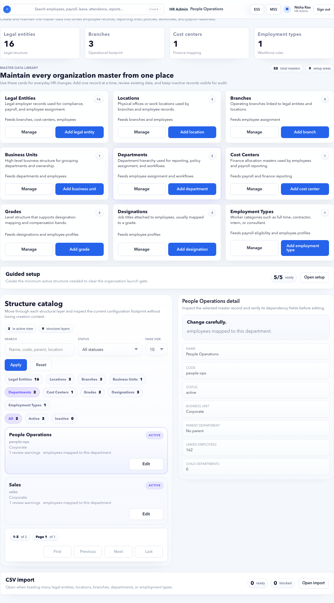

# Organization

Organization manages the structural masters used across employees, approvals, payroll, reports, ESS, and MSS.

## Purpose

Use Organization to create and maintain legal entities, locations, branches, business units, departments, cost centers, grades, designations, and employee types.

## Use this page when

- A new tenant is being set up.
- Employee import fails because a department, branch, location, or legal entity is missing.
- Payroll readiness shows organization master blockers.
- A new business unit, cost center, grade, or designation is needed.
- Future employee changes need updated master data.

## Organization layers

| Layer | Purpose |
| --- | --- |
| Legal entity | Employing company or registered entity. |
| Location | City or operating location. |
| Branch | Office or branch under a location. |
| Business unit | Business grouping for reporting or payroll. |
| Department | Functional team such as Sales, HR, Engineering. |
| Cost center | Finance or accounting allocation. |
| Grade | Level or band. |
| Designation | Job title. |
| Employee type | Full-time, contractor, intern, consultant, or similar. |

## How layers depend on each other

Create parent layers before child layers so forms, imports, and employee records can reference valid masters.

| Layer | Usually depends on |
| --- | --- |
| Legal entity | None. |
| Location | Legal entity or country/state context, depending on tenant setup. |
| Branch | Legal entity and location. |
| Business unit | Legal entity or company structure. |
| Department | Business unit or legal entity. |
| Cost center | Finance structure, often legal entity or department. |
| Grade | Tenant-wide or legal-entity-specific policy. |
| Designation | Grade, department, or job family where applicable. |
| Employee type | Tenant policy. |

## Ways to maintain masters

| Method | Best for |
| --- | --- |
| Guided form | Creating or editing a few records through the browser. |
| CSV import | Initial setup or large updates. |
| Structure catalog | Searching, filtering, and auditing existing records. |

## Form or CSV?

| Scenario | Recommended method | Why |
| --- | --- | --- |
| Setting up the first tenant structure | CSV import, then guided review | Faster and validates dependencies in bulk. |
| Adding one new department | Guided form | Lower risk and easier to confirm immediately. |
| Renaming many cost centers | CSV import | Keeps updates consistent. |
| Correcting one parent relationship | Guided form | Lets HR verify the impact before save. |
| Adding many branches/locations | CSV import | Prevents repetitive manual entry. |
| Exploring current setup | Structure catalog | Search and filter without changing records. |

## Buttons and actions

| Button | What it does |
| --- | --- |
| Load sample template | Loads sample organization CSV. |
| Copy template | Copies CSV template text. |
| Download template | Downloads CSV template. |
| Upload CSV | Uploads organization CSV. |
| Preview import | Validates rows before save. |
| Commit ready rows | Saves valid rows only. |
| Apply | Applies catalog filters. |
| Reset | Clears filters. |
| Add / Save | Creates or updates a master record in guided form. |

## Recommended setup order

1. Legal entities.
2. Locations.
3. Branches.
4. Business units.
5. Departments.
6. Cost centers.
7. Grades.
8. Designations.
9. Employee types.

After this, import or create employees. Employee import is much smoother when all required organization masters already exist.

## What each master affects

| Master | Affects |
| --- | --- |
| Legal entity | Payroll employer, statutory reports, finance handoff, audit evidence. |
| Location | Attendance, HRA/location rules, reports, employee workplace. |
| Branch | Payroll readiness, statutory state context, local policies, reporting. |
| Business unit | Reporting, cost allocation, leadership review. |
| Department | Employee directory filters, approvals, manager review, reports. |
| Cost center | Finance posting, payroll reports, allocation evidence. |
| Grade | Salary bands, policy eligibility, approvals. |
| Designation | Employee profile, policy eligibility, reports. |
| Employee type | Benefits, payroll eligibility, attendance/leave policy assignment. |

## Safe edit rules

- Do not delete or deactivate a master that active employees still use.
- Prefer renaming display names over changing stable codes.
- Use effective-date or workflow controls if a structural change affects payroll or reporting.
- Review dependent employees after changing parent relationships.
- Keep old records inactive only when reporting history no longer needs them for new assignments.

## Import validation guidance

Before committing CSV rows:

| Check | Expected result |
| --- | --- |
| Section | Matches a supported master section. |
| Code | Unique, stable, and not reused for a different meaning. |
| Parent code | Already exists or appears earlier in the import order. |
| Active flag | Correct for whether the record can be used by employees. |
| Payroll eligibility | Correct for legal entities, branches, and employee types used in payroll. |
| Error preview | No dependency errors before commit. |

## Quality checks

- Codes are short, unique, and stable.
- Names are understandable to HR and finance users.
- Parent-child relationships are correct.
- Inactive records are not used for new employees.
- Payroll-required structures are created before employee import.

## Good practice

Use codes that can survive naming changes. For example, a department name may change from “People Ops” to “HR Operations”, but the code should remain stable if reports depend on it.

## FAQ

### Why does employee import fail with missing department or branch?

The employee row references a code that does not exist in Organization, is inactive, or is in the wrong parent structure. Create or correct the master first, then rerun preview.

### Should I create all possible masters on day one?

Create the masters needed for current employees and payroll. Avoid cluttering the tenant with unused departments, grades, or cost centers.

### Can I change a department code later?

Avoid changing codes after employees, reports, payroll, or integrations use them. Change the display name instead unless there is a controlled migration.

### How does Organization affect payroll?

Payroll readiness uses organization mappings to decide legal entity, branch, location, department, cost center, statutory context, reporting, and finance handoff. Missing or inconsistent masters can block payroll even when salary is configured.
