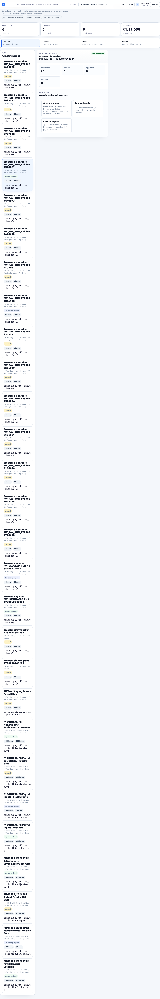

# Adjustments and Settlements

Adjustments and Settlements handle payroll exceptions that are not part of regular monthly salary.

## On This Page

- [Adjustments Quick Navigation](#adjustments-quick-navigation)
- [Purpose](#purpose)
- [When to use this page](#when-to-use-this-page)
- [Adjustment examples](#adjustment-examples)
- [Statuses](#statuses)
- [Workflow](#workflow)
- [Approval checklist](#approval-checklist)
- [Common mistakes](#common-mistakes)
- [Practical examples](#practical-examples)
- [Negative scenarios](#negative-scenarios)
- [Troubleshooting](#troubleshooting)
- [Signoff checklist](#signoff-checklist)

## Adjustments Quick Navigation

| I need to... | Start here | Then check |
| --- | --- | --- |
| Decide if this is adjustment or salary change | [When to use this page](#when-to-use-this-page) | [Common mistakes](#common-mistakes) |
| Add arrear, recovery, one-time earning, or deduction | [Adjustment examples](#adjustment-examples) | [Workflow](#workflow) |
| Approve adjustment before payroll | [Approval checklist](#approval-checklist) | [Statuses](#statuses) |
| Investigate adjustment issue | [Negative scenarios](#negative-scenarios) | [Troubleshooting](#troubleshooting) |
| Prepare payroll evidence | [Signoff checklist](#signoff-checklist) | [Practical examples](#practical-examples) |

## Purpose

Use this page for arrears, recovery, one-time earnings, deductions, and full-and-final settlements.

## When to use this page

Use this page when the item is exceptional, period-specific, or needs approval before it affects payroll.

Do not use it for permanent salary structure changes, regular monthly allowances, or ordinary CTC updates.

## Adjustment examples

| Type | Example |
| --- | --- |
| Earning | Bonus, arrears, incentive, reimbursement. |
| Deduction | Notice recovery, loan deduction, excess payment recovery. |
| Correction | Previous month payroll correction. |
| Settlement | Full-and-final payout for exited employee. |

## Statuses

| Status | Meaning |
| --- | --- |
| Draft | Created but not submitted. |
| Submitted | Waiting for review. |
| Approved | Can affect payroll. |
| Rejected | Not accepted. |
| Applied | Included in payroll. |

## Workflow

1. Create adjustment or settlement.
2. Select employee and payroll period.
3. Add amount, component, and reason.
4. Submit for approval.
5. Approver reviews and approves or rejects.
6. Approved item appears in payroll review/calculation.

## Approval checklist

| Check | Why it matters |
| --- | --- |
| Employee | Adjustment must apply to the intended employee. |
| Payroll period | Wrong period can overpay or underpay. |
| Component | Determines earning, deduction, tax, and payslip behavior. |
| Amount sign | Recovery and earning must not be reversed. |
| Reason | Required for audit and employee explanation. |
| Approval | Unapproved items should not affect payroll. |

## Common mistakes

- Using adjustment for recurring salary change.
- Missing approval reason.
- Selecting wrong payroll period.
- Entering deduction as earning or earning as deduction.
- Applying full-and-final settlement before exit details are complete.

## Practical examples

### One-time festival bonus

1. Create an earning adjustment for the employee or eligible group.
2. Select the correct payroll period.
3. Choose the bonus earning component.
4. Enter amount and reason.
5. Submit for approval.
6. Confirm approved item appears in payroll review/calculation.

Expected result: the bonus is visible in the employee payroll line and payslip for that period only.

### Notice recovery

1. Create a deduction adjustment.
2. Select the employee and exit/full-and-final period.
3. Choose the recovery component.
4. Enter amount with clear reason.
5. Attach or reference approval evidence where required.
6. Submit and approve before payroll calculation.

Expected result: recovery reduces net pay and is traceable in audit.

### Full-and-final settlement

1. Confirm exit details are complete.
2. Confirm payable days, unpaid leave, notice recovery, leave encashment, bonus, and deductions.
3. Create settlement items.
4. Submit for review.
5. Approve only after HR/payroll verification.
6. Include in payroll and verify output.

Expected result: final payout is complete, explainable, and not mixed with regular monthly payroll changes.

## Negative scenarios

| Issue | Impact | Fix |
| --- | --- | --- |
| Wrong payroll period | Employee is paid in wrong month. | Reverse/correct and reprocess according to payroll policy. |
| Earning entered as deduction | Net pay becomes incorrect. | Correct component and recalculate. |
| Adjustment used for recurring allowance | Future months will be wrong. | Move to Salary Setup. |
| Approval missing | Audit and payroll control fail. | Submit and approve before calculation. |
| Settlement before exit completion | Final pay misses recovery/encashment. | Complete lifecycle exit first. |

## Troubleshooting

| Problem | Likely reason | Fix |
| --- | --- | --- |
| Adjustment not in payroll | Not approved, wrong period, or employee outside run. | Check status, period, and payroll scope. |
| Amount sign is wrong | Component type or amount entry is wrong. | Correct earning/deduction component. |
| Tax treatment is wrong | Component configuration is wrong. | Check Salary Setup and statutory settings. |
| Duplicate adjustment appears | Same item created twice or imported twice. | Void/reverse duplicate with audit note. |

## Signoff checklist

| Check | Expected result |
| --- | --- |
| Employee and period are correct. | Adjustment affects intended payroll only. |
| Component is correct. | Tax, payslip, and accounting behavior are right. |
| Approval exists. | Payroll can use item confidently. |
| Reason is clear. | Employee/support explanation is possible. |
| Payroll output reflects item once. | No duplicate or missing adjustment. |

## FAQ

### Should salary increment be an adjustment?

No. Use Salary Setup and salary assignment/versioning for recurring salary changes.

### How should full-and-final settlement be handled?

Confirm exit details, payable days, recoveries, leave encashment, bonus, deductions, and approval before including the settlement in payroll.
