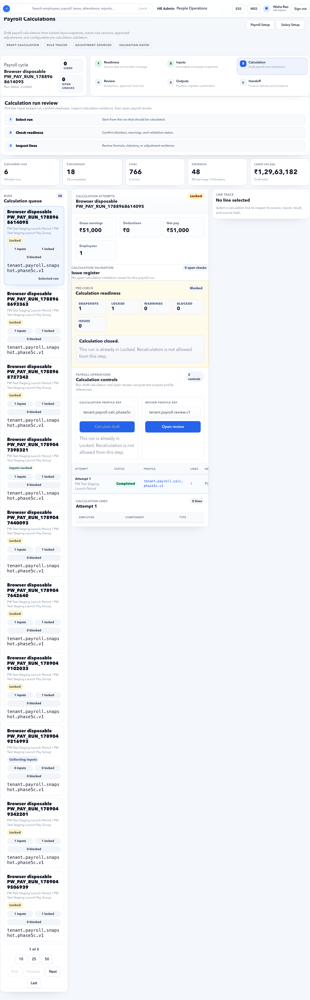

# Payroll Calculations

Payroll Calculations generates draft payroll and shows calculation evidence.

## On This Page

- [Calculation Quick Navigation](#calculation-quick-navigation)
- [Purpose](#purpose)
- [What this page should answer](#what-this-page-should-answer)
- [Who uses this page](#who-uses-this-page)
- [Page layout](#page-layout)
- [Summary values](#summary-values)
- [Buttons and actions](#buttons-and-actions)
- [Calculation states](#calculation-states)
- [Workflow](#workflow)
- [Amount investigation path](#amount-investigation-path)
- [Rerun rules](#rerun-rules)
- [Pre-review checklist](#pre-review-checklist)
- [Evidence to keep](#evidence-to-keep)

## Calculation Quick Navigation

| I need to... | Start here | Then check |
| --- | --- | --- |
| Calculate payroll for the period | [Workflow](#workflow) | [Example: Calculate September 2026 payroll](#example-calculate-september-2026-payroll) |
| Understand gross, deductions, or net pay | [Summary values](#summary-values) | [Amount investigation path](#amount-investigation-path) |
| Investigate one employee amount | [Example: Investigate HRA for one employee](#example-investigate-hra-for-one-employee) | [How To Read Trace](payroll-rules.md#how-to-read-trace) |
| Fix calculation blocked state | [Negative scenario: calculation blocked because inputs are not locked](#negative-scenario-calculation-blocked-because-inputs-are-not-locked) | [Calculation states](#calculation-states) |
| Decide if rerun is allowed | [Rerun rules](#rerun-rules) | [Evidence to keep](#evidence-to-keep) |

## Purpose

Use this page to calculate payroll and inspect the result before review.

This page answers: **what did payroll calculate, why did it calculate that way, and what must be fixed before review?**

Use it only after [Payroll Inputs](payroll-inputs.md) are locked for the selected run.

## What this page should answer

- Did the run calculate successfully?
- How many employees and lines were included?
- What are gross earnings, deductions, and net pay?
- Are there blockers or warnings?
- Can an amount be explained through trace?

## Who uses this page

| User | Responsibility |
| --- | --- |
| Payroll Admin | Runs calculation, reviews validation, checks line trace, and moves the run to review. |
| HR Admin | Fixes source issues that appear in validation, such as missing employee data or pending approvals. |
| Finance Manager | Reviews gross, deduction, and net pay movement before approval or handoff. |
| Auditor | Uses line trace to confirm source, input, rule, and output evidence. |

## Page layout

| Section | Meaning |
| --- | --- |
| Calculation queue | Payroll runs available for calculation. |
| Calculation attempts | Latest calculation result summary. |
| Issue register | Validation issues found during calculation. |
| Line trace | Detailed source, input, rule, and output for one line. |
| Step tracker | Shows where calculation sits in the payroll lifecycle. |
| Next action | Shows whether the run can move to review. |

## Summary values

| Value | Meaning |
| --- | --- |
| Gross earnings | Total earnings before deductions. |
| Deductions | Total employee deductions. |
| Net pay | Payable amount after deductions. |
| Employees | Employees included in calculation. |
| Lines | Calculation lines generated. |
| Validation | Warning or blocker count. |
| Latest net pay | Most recent draft net pay for the selected run. |

## Buttons and actions

| Button | What it does |
| --- | --- |
| Calculate draft | Runs payroll calculation from locked inputs. |
| Open Review | Moves the run to review when calculation is acceptable. |
| Select line | Opens line trace for detailed investigation. |
| Select run | Changes the payroll run being inspected. |
| Issue register | Lists validation items that must be resolved or accepted. |

## Calculation states

| State | Meaning | User action |
| --- | --- | --- |
| Not calculated | Inputs exist but no draft calculation has run. | Run calculation after confirming inputs are locked. |
| Calculating | Calculation is in progress. | Wait and refresh only if needed. |
| Completed | Draft lines were generated. | Review totals and validation. |
| Warning | Calculation completed with review items. | Investigate and document decision. |
| Blocked | Calculation cannot proceed safely. | Fix input, rule, or setup issue first. |
| Locked | Run is no longer editable for calculation changes. | Move to review/output or follow reopen process. |

## Workflow

1. Confirm inputs are locked.
2. Open Payroll Calculations.
3. Select the payroll run.
4. Run draft calculation.
5. Review gross, deductions, and net pay.
6. Open issue register.
7. Resolve blockers.
8. Inspect trace for unusual values.
9. Move to Payroll Review.

## Example: Calculate September 2026 payroll

Scenario:

- Tenant: Accerio India
- Payroll period: 01 Sep 2026 to 30 Sep 2026
- Inputs: locked
- Employees in scope: 298
- Expected next step: payroll review

Steps:

1. Open **HR Admin > Payroll > Payroll Calculations**.
2. Select the September 2026 payroll run.
3. Confirm the run status shows locked inputs.
4. Click **Calculate draft**.
5. Wait for the calculation attempt to complete.
6. Review gross earnings, deductions, net pay, employees, lines, and validation count.
7. Open issue register.
8. Resolve blockers and rerun if required.
9. Use **Open Review** only after totals and validation are acceptable.

Expected result:

- Draft payroll lines are generated.
- Gross, deduction, and net pay values are visible.
- Line trace can explain employee-level amounts.
- The run can move to Payroll Review when no blocking issues remain.

## Example: Investigate HRA for one employee

Use this when an employee or finance reviewer says the HRA amount is wrong.

Steps:

1. Select the payroll run.
2. Search or select the employee line.
3. Open line trace.
4. Find the HRA component.
5. Check the locked input values:
   - Basic salary.
   - Work city or branch.
   - Salary structure version.
   - Effective date.
6. Check rule version:
   - Metro city should use 50% of Basic.
   - Non-metro city should use 40% of Basic, unless tenant policy says otherwise.
7. Compare result with expected formula.

Example:

| Value | Example |
| --- | --- |
| Employee | Aditi Gupta |
| City | Bengaluru |
| Basic | INR 40,000 |
| Rule | Non-metro HRA 40% of Basic |
| Expected HRA | INR 16,000 |

If the trace shows Delhi/metro logic for Bengaluru, fix the organization city or rule dependency before recalculating.

## Example: Zero net pay investigation

Zero net pay can be valid or wrong. Do not assume it is a system issue.

Check:

| Check | Why it matters |
| --- | --- |
| Salary assignment | Missing salary can produce zero earnings. |
| Payable days | Full LOP or inactive status can reduce earnings to zero. |
| Deductions | Recovery, loan, arrears adjustment, or statutory deduction can consume net pay. |
| Exit/F&F | Final settlement may offset payable amount. |
| Rule version | Wrong rule can suppress components. |

Valid example:

- Employee is on full unpaid leave for the month.
- Gross earnings are zero.
- Net pay is zero.

Invalid example:

- Employee worked the full month, but salary assignment starts after the payroll period.
- Fix salary effective date, recreate/refresh inputs as per process, then recalculate.

## Amount investigation path

When an amount looks wrong, check in this order:

1. Select the employee or line.
2. Open line trace.
3. Confirm locked input values.
4. Confirm rule version and dependencies.
5. Check approved adjustments.
6. Check statutory deductions.
7. Compare with previous period if needed.
8. Recalculate only after correcting the source issue.

## Negative scenario: calculation blocked because inputs are not locked

What happens:

- Calculation page shows the run but does not allow safe calculation.
- Issue register says inputs must be locked before calculation.

Fix:

1. Open [Payroll Inputs](payroll-inputs.md).
2. Select the same payroll run.
3. Resolve blocked snapshots.
4. Lock inputs.
5. Return to Payroll Calculations.

Do not calculate from live editable data. Payroll must use locked snapshots.

## Negative scenario: latest net pay is from the wrong run

This happens when the page shows a previous successful calculation while the selected run is blocked or not calculated.

Warning signs:

- The run name in calculation queue differs from the payroll cycle being reviewed.
- Latest net pay appears even though the selected run has blockers.
- Employee count or line count does not match expected payroll scope.

Fix:

1. Confirm selected payroll run name and period.
2. Check calculation attempt timestamp.
3. Compare employee count with Payroll Inputs.
4. Rerun calculation only for the correct locked run.

## Negative scenario: employee missing from calculation

Common causes:

- Employee not assigned to the pay group.
- Employee joined after the period end date.
- Employee exited before the period start date.
- Salary assignment does not cover the payroll period.
- Inputs were locked before the employee correction.

Fix:

1. Search the employee in Payroll Inputs.
2. If missing from inputs, fix the source scope first.
3. Recreate or refresh inputs only through the controlled process.
4. Recalculate and confirm the employee appears.

## Rerun rules

Recalculate only when the underlying reason is clear.

| Situation | Rerun? | Notes |
| --- | --- | --- |
| Typo in employee personal phone | Usually no | Does not affect payroll amount. |
| Bank account corrected before handoff | Maybe | Needed if bank advice uses the value. |
| Salary effective date fixed | Yes | Requires updated inputs and calculation. |
| Leave approval completed after input lock | Usually yes | Requires controlled input refresh/recreate. |
| Rule version corrected | Yes | Record approval before rerun. |
| Finance wants a comparison | No direct source change | Export current draft and compare before rerun. |

Each rerun should keep old and new evidence if payroll totals change.

## Common issues

| Issue | Likely cause |
| --- | --- |
| Calculation blocked | Inputs not locked or source blockers exist. |
| Zero net pay | Missing salary, unpaid leave, full deduction, or incorrect component rule. |
| Deduction too high | Rule configuration, statutory slab, loan/recovery, or adjustment issue. |
| Employee missing | Not in pay group, inactive, outside period, or missing salary assignment. |
| HRA wrong | City, Basic, salary version, or HRA rule dependency is wrong. |
| Net pay differs from finance sheet | Different run, stale inputs, manual adjustment, or post-lock source change. |
| Lines lower than expected | Component inactive, rule not applicable, missing structure, or employee out of scope. |

## Pre-review checklist

Before opening Payroll Review, confirm:

- Calculation completed for the correct payroll period.
- Employee count matches locked inputs.
- Gross, deductions, and net pay look reasonable versus previous period.
- Blockers are zero.
- Warnings are investigated and documented.
- Unusual employee amounts have line trace evidence.
- Any rerun reason is documented.
- Finance reviewer knows whether values are draft or final.

## Evidence to keep

For payroll signoff, keep:

- Calculation attempt timestamp and user.
- Payroll run name and period.
- Gross, deduction, net pay summary.
- Employee and line count.
- Issue register export or screenshot.
- Line trace for disputed or sampled employees.
- Rerun comparison if totals changed.

## Downstream impact

| Downstream area | Impact |
| --- | --- |
| Payroll Review | Uses draft calculation lines for approval and exception review. |
| Payroll Outputs | Payslips, registers, and exports come from reviewed calculation results. |
| Finance Handoff | Bank advice and finance summary depend on calculation totals. |
| ESS Payslips | Employees see payslips only after output publication. |
| Audit | Line trace explains source, input, rule, and result for each amount. |

## FAQ

### Why does the page show latest net pay but calculation is blocked?

The latest net pay may come from a previous completed run. Check selected run status and validation panel.

### Can I approve payroll from this page?

No. Use this page for calculation and investigation. Formal approval belongs in Payroll Review.

### Can I manually change a calculated amount?

No. Correct the source, rule, or approved adjustment, then recalculate. Manual changes without source evidence break audit trace.

### Why did calculation create more lines than employees?

Payroll lines are component-level. One employee can generate many lines, such as Basic, HRA, allowances, PF, PT, TDS, bonus, and deductions.

### What should I do if the trace does not explain the value?

Treat it as a blocker. Check whether the component, rule, and input schema are complete. If the trace is technically missing, escalate with run ID, employee, component, and screenshot.

## Related guides

- [Payroll Inputs](payroll-inputs.md)
- [Payroll Control](payroll-control.md)
- [Salary Setup](salary-setup.md)
- [Payroll Rules](payroll-rules.md)
- [Payroll Review](payroll-review.md)
- [Payroll Issues](../../troubleshooting/payroll.md)
