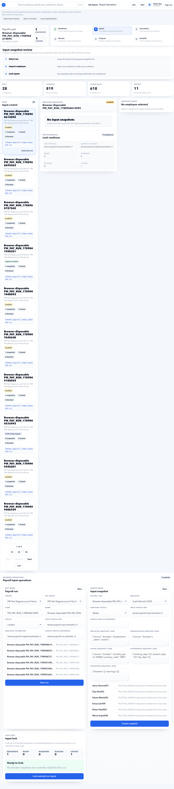

# Payroll Inputs

Payroll Inputs are locked snapshots of source data used for payroll calculation.

## Purpose

Use Payroll Inputs to freeze employee, salary, attendance, leave, lifecycle, document, and banking data for a payroll run.

This page answers one critical question: **what exact source data will payroll calculate from?**

Use it after [Payroll Control](payroll-control.md) is clear and before [Payroll Calculations](payroll-calculations.md) starts.

## Who uses this page

| User | Responsibility |
| --- | --- |
| Payroll Admin | Selects the payroll run, reviews readiness, locks inputs, and moves to calculation. |
| HR Admin | Fixes employee, leave, attendance, lifecycle, document, and bank source issues before lock. |
| Finance Manager | Reviews locked evidence when payroll values are challenged. |
| Auditor | Confirms which source values were used for a closed payroll run. |

## Why inputs are locked

Payroll must be repeatable. If employee data changes after calculation, the payroll run should still show what was used at calculation time.

Example: if Aditi Gupta's bank account is corrected on 3 October after September payroll was locked, the September run should still show the bank account that existed at lock time unless the payroll run is intentionally reopened or recreated.

## What gets snapshotted

| Source family | Examples |
| --- | --- |
| Employee | Status, joining date, exit date, organization mapping. |
| Organization | Legal entity, branch, location, department, cost center, grade, designation. |
| Salary | Structure, version, CTC, component assignments. |
| Attendance | Payable days, absences, regularization decisions. |
| Leave | Approved leave, unpaid leave, leave without pay. |
| Lifecycle | Joiner, transfer, promotion, manager change, resignation, exit, F&F readiness. |
| Banking | Primary account and payment readiness. |
| Statutory | Employee tax/statutory profile and applicable setup. |
| Documents | Payroll-critical proof status such as PAN, bank proof, previous employment proof. |
| Adjustments | Approved arrears, bonus, deductions, and settlements. |
| Rules | Effective rule versions and calculation dependencies used by the run. |

## Source ownership

| Source family | Usually fixed from | Common owner |
| --- | --- | --- |
| Employee and organization | HR Admin > Employees, Organization | HR Admin |
| Salary and rules | Payroll > Salary Setup, Payroll Rules | Payroll Admin |
| Leave and attendance | HR Admin > Leave, Attendance, MSS approvals | HR Admin / Manager |
| Banking and documents | HR Admin > Employees, Documents | HR Admin / Employee |
| Statutory | Payroll > Statutory, ESS Tax Declarations | Payroll Admin / Employee |
| Adjustments | Payroll > Adjustments and Settlements | Payroll Admin / Finance |

## Page layout

| Section | Meaning |
| --- | --- |
| Payroll cycle | Selected run and lock status. |
| Step tracker | Shows current payroll lifecycle stage. |
| Runs | Payroll runs available for input review. |
| Employee snapshots | Employees included in the selected run. |
| Snapshot trace | Source families used for the selected employee. |

## Important fields

| Field | Meaning |
| --- | --- |
| Input profile | Input contract used by the payroll run. |
| Snapshot schema | Schema version of stored source data. |
| Source hash | Technical evidence that source data is unchanged. |
| Locked | Whether snapshot is frozen. |
| Blocked | Whether a snapshot issue prevents calculation. |
| Ready | Number of employees whose source snapshot can be used for calculation. |
| Warnings | Non-blocking source conditions that must be reviewed before lock. |
| Run status | Current payroll lifecycle state, such as Draft, Blocked, Locked, or Calculated. |

## Buttons and actions

| Button | What it does |
| --- | --- |
| Open Calculation | Moves to calculation page for selected run. |
| Lock inputs | Freezes source snapshot if available. |
| View trace | Shows source details for selected employee. |
| Select run | Changes the payroll run whose snapshots are being reviewed. |
| Select employee | Opens snapshot detail and trace for that employee. |

Do not lock inputs only because the button is enabled. Lock only after the business checklist is complete.

## Input states

| State | Meaning | User action |
| --- | --- | --- |
| Collecting | Source snapshots are being collected or refreshed. | Wait, then review readiness. |
| Ready | Snapshot is valid and can be locked. | Continue review or lock inputs. |
| Warning | Snapshot can proceed but needs judgement. | Record evidence before lock. |
| Blocked | Snapshot cannot safely calculate payroll. | Fix the source issue first. |
| Locked | Snapshot is frozen for payroll calculation. | Move to calculation. |

## Example: Create September payroll input snapshot

Scenario:

- Tenant: Accerio India
- Payroll period: 01 Sep 2026 to 30 Sep 2026
- Pay group: India Monthly Staff
- Expected employees: 298
- Payroll Control status: no critical source blockers

Steps:

1. Open **HR Admin > Payroll > Payroll Inputs**.
2. Select the September 2026 payroll run.
3. Confirm the payroll cycle name and dates.
4. Check the employee snapshot count against Payroll Control.
5. Open the first few employee snapshots from different locations or departments.
6. Confirm salary, branch, leave, attendance, bank, and statutory source families are present.
7. Review any warning lines.
8. Lock inputs only when blockers are zero and warning evidence is recorded.

Expected result:

- The selected run shows locked inputs.
- Snapshot trace is available for employees in scope.
- Payroll Calculations can use the locked snapshot.

## Example: Review one employee before lock

Use this when a payroll total seems sensitive or a senior employee needs extra review.

Example employee: Aditi Gupta, Bengaluru, People Operations.

Check:

| Check | Expected value |
| --- | --- |
| Employee status | Active during the payroll period. |
| Branch/location | Bengaluru HO / Bengaluru. |
| Department | People Operations. |
| Pay group | India Monthly Staff. |
| Salary assignment | Active from or before 01 Sep 2026. |
| Leave | Approved leave only; pending requests remain outside calculation. |
| Attendance | Approved payable days or no blocking exceptions. |
| Bank | Primary salary account available. |
| Statutory | PAN and payroll statutory profile available. |

If any source family is missing, return to the owner page and fix the source before locking.

## Example: Lock September payroll inputs

Use this when payroll readiness is clear and source data is approved.

Steps:

1. Open the correct September run.
2. Confirm the run is not an old test run or browser disposable run.
3. Confirm employee count and pay group are correct.
4. Confirm blocked snapshots are zero.
5. Confirm warnings have comments or supporting evidence.
6. Click **Lock inputs**.
7. Open [Payroll Calculations](payroll-calculations.md).

Expected result:

- The run status becomes locked.
- Employee snapshots cannot silently change.
- Calculation can start from the locked data.

## Negative scenario: lock is blocked

Example issue: 12 employees have no primary bank account.

What happens:

- Payroll Inputs shows blocked snapshots.
- Locking should not proceed.
- Payroll Calculations remains blocked or unavailable for that run.

Fix:

1. Open the affected employee from the snapshot list.
2. Check snapshot trace to identify the blocking family.
3. Go to **HR Admin > Employees** or **Documents** to add or verify bank details.
4. Return to Payroll Control and Payroll Inputs.
5. Refresh or recreate the snapshot according to the payroll process.
6. Lock only after the blocker count is zero.

Do not bypass this by creating manual finance files outside the payroll run. That breaks audit trace.

## Negative scenario: source changed after inputs were locked

Example:

- Inputs were locked on 30 Sep 2026.
- On 01 Oct 2026 HR changes an employee department or bank account.
- Payroll user expects September payroll to change automatically.

Correct behavior:

- September payroll continues using the locked snapshot.
- The new value appears only in a new snapshot or future payroll run.

Correct action:

1. Decide whether the September payroll must be reopened.
2. Record the reason for reopening.
3. Recreate or refresh inputs only through the controlled payroll workflow.
4. Recalculate and compare old and new outputs.
5. Keep audit evidence for the source change.

## Negative scenario: wrong payroll run selected

This happens when several test runs or payroll periods exist.

Warning signs:

- Employee count does not match the period.
- Pay group name looks like a test or staging group.
- Period dates are from another month.
- The run status is already locked or calculated unexpectedly.

Fix:

1. Stop before locking.
2. Return to Payroll Setup and confirm calendar, period, and pay group.
3. Select the correct production payroll run.
4. Record that the wrong run was not used.

## Workflow

1. Open Payroll Inputs.
2. Select the payroll run.
3. Review snapshot readiness.
4. Inspect blocked employees.
5. Fix source data if needed.
6. Lock inputs.
7. Move to Payroll Calculations.

## Before locking inputs

Confirm:

- Payroll Control has no unresolved blockers.
- Employee count matches HR expectation.
- Pending leave and attendance approvals are closed or intentionally excluded.
- Salary and bank coverage are acceptable.
- The selected run is the correct period.
- No HR user is still editing source data for the period.

## Pre-lock checklist

| Area | Required check | Evidence |
| --- | --- | --- |
| Scope | Employee count matches expected payroll headcount. | Payroll Control summary or employee count report. |
| Pay group | Correct employee group is selected. | Pay group assignment list. |
| Salary | Salary assignment and effective date are valid. | Salary setup assignment or revision evidence. |
| Leave | Pending approvals are resolved or intentionally excluded. | Leave approval report. |
| Attendance | Attendance exceptions are closed or accepted. | Attendance exception report. |
| Bank | Primary bank account exists for salary-paid employees. | Employee bank readiness report. |
| Statutory | PAN/statutory profile is present where required. | Statutory readiness report. |
| Warnings | Accepted warnings have owner and reason. | Notes or audit evidence. |

## Evidence to keep

For payroll audit, keep:

- Payroll Control readiness screenshot or export.
- Selected payroll run name and period.
- Employee count at lock time.
- Snapshot readiness count.
- Warning acceptance notes.
- Source correction audit trail.
- Input lock timestamp and user.

## Downstream impact

| Downstream area | Impact |
| --- | --- |
| Payroll Calculations | Uses only locked snapshots. |
| Payroll Review | Explains why employee amounts were calculated from specific source data. |
| Payslips | Payslip values come from calculated lines based on locked inputs. |
| Finance Handoff | Bank advice and registers depend on locked employee/bank/salary data. |
| Audit | Source hash and snapshot trace prove what was used at calculation time. |

## FAQ

### Can I change employee data after inputs are locked?

Yes, but the locked payroll run will continue using the old snapshot unless a new run or new snapshot is created.

### What if an employee is missing from snapshots?

Check employee status, pay group assignment, payroll period dates, salary assignment, and employee effective dates.

### Should I unlock inputs?

Only if your process explicitly allows it and the reason is documented. Unlocking or recreating inputs can change payroll results, so it should be treated as a controlled correction.

### Can warnings be ignored?

Warnings can be accepted only when they are not expected to change pay or statutory output. Add the reason and owner before locking.

### Why does the employee count differ from Payroll Control?

Usually because the selected run, pay group, effective dates, or employee status is different. Confirm the payroll period, pay group assignment, joining date, exit date, and salary effective date.

### What should I do if the snapshot trace is missing?

Do not proceed to calculation. Recheck the selected run, backend availability, source setup, and whether snapshot collection completed successfully.

## Related guides

- [Payroll Control](payroll-control.md)
- [Payroll Setup](payroll-setup.md)
- [Salary Setup](salary-setup.md)
- [Payroll Rules](payroll-rules.md)
- [Payroll Calculations](payroll-calculations.md)
- [Payroll Issues](../../troubleshooting/payroll.md)
