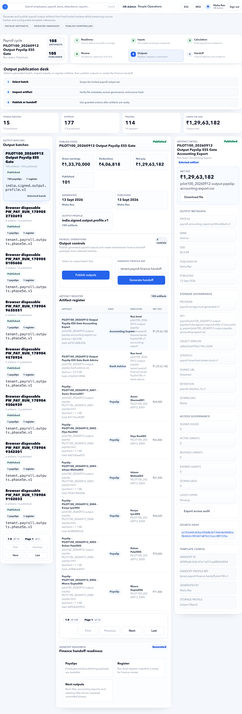

# Payroll Outputs

Payroll Outputs manages generated payroll files, payslips, reports, and access governance.

## On This Page

- [Outputs Quick Navigation](#outputs-quick-navigation)
- [Purpose](#purpose)
- [Who uses this page](#who-uses-this-page)
- [Publishing rule](#publishing-rule)
- [Output types](#output-types)
- [Output ownership](#output-ownership)
- [Page sections](#page-sections)
- [Buttons and actions](#buttons-and-actions)
- [Workflow](#workflow)
- [Output verification checklist](#output-verification-checklist)
- [Important checks](#important-checks)
- [Evidence to keep](#evidence-to-keep)
- [Outputs signoff checklist](#outputs-signoff-checklist)

## Outputs Quick Navigation

| I need to... | Start here | Then check |
| --- | --- | --- |
| Generate payroll outputs | [Workflow](#workflow) | [Example: Generate September payroll outputs](#example-generate-september-payroll-outputs) |
| Publish payslips to ESS | [Example: Publish payslips to ESS](#example-publish-payslips-to-ess) | [Publishing rule](#publishing-rule) |
| Export payroll register for finance | [Example: Export payroll register for finance](#example-export-payroll-register-for-finance) | [Output types](#output-types) |
| Fix payslip count mismatch | [Negative scenario: payslip count does not match employee count](#negative-scenario-payslip-count-does-not-match-employee-count) | [Output verification checklist](#output-verification-checklist) |
| Confirm outputs are ready for handoff | [Outputs signoff checklist](#outputs-signoff-checklist) | [Evidence to keep](#evidence-to-keep) |

## Purpose

Use this page after payroll review is approved and outputs are ready to generate or publish.

This page answers: **which payroll files were generated, who can access them, and when are employee-facing payslips published?**

Use it after [Payroll Review](payroll-review.md) approval and before [Payroll Handoff](payroll-handoff.md).

## Who uses this page

| User | Responsibility |
| --- | --- |
| Payroll Admin | Generates outputs, verifies artifacts, and publishes payslips. |
| Finance Manager | Downloads registers, bank advice, and finance files. |
| HR Admin | Confirms payslip visibility and employee access issues. |
| Tenant Admin | Reviews access governance for sensitive output files. |
| Auditor | Reviews generated artifacts, publication timestamp, and access evidence. |

## Publishing rule

Generate files only from an approved run. Publish employee-facing payslips only when HR/payroll and finance agree the run is final.

Never publish payslips from a draft, rejected, or unapproved run.

## Output types

| Output | Purpose |
| --- | --- |
| Payslip | Employee-facing payroll document. |
| Payroll register | Payroll summary for HR and finance. |
| Bank advice | Payment instruction evidence. |
| Statutory files | Compliance and filing support. |
| Audit pack | Evidence bundle for payroll close. |
| Variance report | Comparison against previous period or previous calculation. |
| Exception report | Accepted warnings, rejected items, and review decisions. |

## Output ownership

| Output | Primary owner | Sensitive? |
| --- | --- | --- |
| Payslip | Payroll Admin / Employee | Yes |
| Payroll register | Payroll Admin / Finance | Yes |
| Bank advice | Finance Manager | Yes |
| Statutory files | Payroll Admin / Compliance | Yes |
| Audit pack | Payroll Admin / Auditor | Yes |
| Variance report | Payroll Admin / Finance | Yes |

## Page sections

| Section | Meaning |
| --- | --- |
| Output batches | Generated output packages. |
| Artifact register | List of files and downloadable artifacts. |
| Access governance | Who can access payroll output files. |
| Storage governance | Where artifacts are stored and retained. |
| Publication status | Whether employee-facing outputs are visible in ESS. |
| Download evidence | User, timestamp, file, and access action evidence. |

## Buttons and actions

| Button | What it does |
| --- | --- |
| Generate outputs | Creates output artifacts from approved review. |
| Publish | Makes employee-facing outputs available. |
| Download file | Downloads selected artifact. |
| Export access audit | Downloads access evidence. |
| Issue signed access | Creates limited access link when allowed. |
| Revoke access | Revokes signed access grant. |
| Regenerate | Recreates artifacts from the approved run when allowed. |
| View details | Opens artifact metadata and generation status. |

## Workflow

1. Confirm payroll review is approved.
2. Generate outputs.
3. Review artifact register.
4. Publish payslips only when ready.
5. Confirm ESS payslip visibility.
6. Download finance files if required.
7. Keep access audit evidence.

## Example: Generate September payroll outputs

Scenario:

- Tenant: Accerio India
- Period: September 2026
- Payroll review: approved and final locked
- Employees eligible for payslip: 298

Steps:

1. Open **HR Admin > Payroll > Payroll Outputs**.
2. Select the September 2026 payroll run.
3. Confirm review status is approved.
4. Click **Generate outputs**.
5. Wait for output batch completion.
6. Check artifact register for payslips, payroll register, bank advice, statutory files, and audit pack.
7. Download payroll register and compare totals with Payroll Review.
8. Publish payslips only after finance confirms final payroll.

Expected result:

- Output batch shows generated artifacts.
- Payslip count matches eligible employees.
- Payroll register totals match approved review totals.
- ESS payslip visibility remains controlled until publication.

## Example: Publish payslips to ESS

Use this only after final payroll approval.

Steps:

1. Confirm payslip artifacts are generated.
2. Confirm no replacement output batch is pending.
3. Confirm finance has accepted payment totals.
4. Click **Publish**.
5. Verify one employee can see the payslip in ESS.
6. Confirm payslip publication notification, if enabled.

Expected result:

- Employees with workspace access can open ESS Payslips.
- Payslip period and net pay match the final run.
- Published timestamp is available for audit.

## Example: Export payroll register for finance

Steps:

1. Open artifact register.
2. Select the payroll register for the approved run.
3. Download the file.
4. Confirm:
   - Payroll period.
   - Legal entity.
   - Employee count.
   - Gross earnings.
   - Deductions.
   - Net pay.
5. Share only through approved finance channel.

If finance asks for a changed file, do not manually edit the export. Correct the payroll run and regenerate through the system.

## Negative scenario: payslip count does not match employee count

Possible valid reasons:

- Employee is not eligible for payslip because net payable is zero and tenant policy suppresses zero payslips.
- Employee was excluded from payroll scope.
- Employee is on hold payroll.

Possible issues:

- Missing employee in payroll input.
- Output generation failed for one employee.
- Employee has no workspace access.
- Payroll run selected is wrong.

Fix:

1. Compare payslip count with Payroll Review employee count.
2. Open output batch detail.
3. Check failed artifact rows.
4. Confirm employee is in Payroll Inputs and Calculation.
5. Regenerate only after root cause is corrected.

## Negative scenario: employee cannot see payslip

Check:

| Check | Reason |
| --- | --- |
| Payslip published | Unpublished payslips are not visible in ESS. |
| Employee workspace access | User needs ESS access. |
| Employee included in payroll | No payslip exists if employee was out of scope. |
| Output batch status | Failed generation means no artifact exists. |
| Correct tenant/user | Employee may be logged into wrong account. |
| Notification delivery | Email may fail even if ESS payslip is visible. |

## Negative scenario: output generated from wrong run

Warning signs:

- Payroll period is wrong.
- Employee count differs from approved review.
- Output batch timestamp predates final approval.
- File name contains a test run or old run code.

Fix:

1. Do not publish.
2. Revoke any accidental signed access.
3. Generate outputs from the correct approved run.
4. Keep audit note explaining the discarded output.

## Regeneration rules

| Situation | Regenerate? | Notes |
| --- | --- | --- |
| Typo in downloaded filename | No | Rename only if allowed by document control; do not alter data. |
| Payslip template changed before publication | Maybe | Regenerate from same approved data and keep version note. |
| Payroll amount changed | Yes, after recalculation and reapproval | Old artifacts must be retained or marked superseded. |
| Finance wants different grouping | Prefer report/export option | Do not alter source payroll output manually. |
| Employee cannot access ESS | No | Fix access or publication issue, not payroll output. |

## Output verification checklist

| Check | Expected result |
| --- | --- |
| Payroll run | Matches the approved review run. |
| Payslip count | Matches eligible employees. |
| Payroll register | Totals match approved gross, deductions, and net pay. |
| Bank advice | Payee count and net pay match final payroll. |
| Statutory files | Generated for required compliance areas. |
| Access control | Sensitive files are visible only to permitted roles. |
| Publication status | Payslips are unpublished until final approval. |

## Important checks

- Do not publish draft payroll.
- Confirm employee payslip count.
- Confirm sensitive files are access controlled.
- Confirm output date and payroll period.

## Evidence to keep

Keep:

- Output batch ID or run reference.
- Generated artifact list.
- Payslip count.
- Payroll register total.
- Bank advice total.
- Publication timestamp.
- Access audit export.
- Regeneration reason if any.
- Revocation evidence for signed access, if used.

## Downstream impact

| Downstream area | Impact |
| --- | --- |
| ESS Payslips | Published payslips become visible to employees. |
| Payroll Handoff | Finance and provider files are used for payment and compliance. |
| Notifications | Payslip publication can trigger employee alerts. |
| Reports | Payroll registers and audit packs support finance and compliance reports. |
| Audit | Artifact history proves what was generated and shared. |

## FAQ

### Can I regenerate outputs?

Only regenerate when the underlying approved run changed through a controlled correction. Keep evidence of the previous artifact if it was already shared.

### Why can an employee not see a payslip?

Check publish status, employee access, payslip generation result, and notification delivery.

### Can I download and edit the payroll register?

You can use a copy for finance analysis, but it should not become the official payroll output. Official outputs must come from the system.

### Should bank advice be shared by email?

Only if company policy allows it and the channel is secure. Bank advice contains sensitive salary and bank data.

## Outputs signoff checklist

| Check | Expected result |
| --- | --- |
| Review is approved. | Outputs are generated from approved payroll. |
| Payslips are generated. | Employee payslip artifacts exist for eligible employees. |
| Registers are generated. | Payroll, bank, statutory, and audit registers are available. |
| Failed artifacts are reviewed. | Generation failures are resolved before publication. |
| Publication is controlled. | Employees see payslips only after final release. |

## Related guides

- [Payroll Review](payroll-review.md)
- [Payroll Handoff](payroll-handoff.md)
- [ESS Payslips](../../ess/payslips.md)
- [Notification Issues](../../troubleshooting/notifications.md)
- [Payroll Issues](../../troubleshooting/payroll.md)
