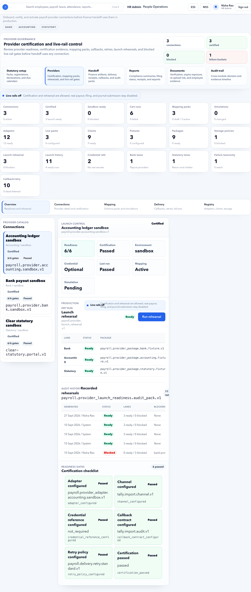

# Payroll Providers

Payroll Providers manages integrations with external payroll, banking, filing, or delivery systems.

## On This Page

- [Provider Quick Navigation](#provider-quick-navigation)
- [Purpose](#purpose)
- [Provider readiness rule](#provider-readiness-rule)
- [Provider concepts](#provider-concepts)
- [Buttons and actions](#buttons-and-actions)
- [Workflow](#workflow)
- [Certification checklist](#certification-checklist)
- [Common mistakes](#common-mistakes)
- [Practical examples](#practical-examples)
- [Negative scenarios](#negative-scenarios)
- [Troubleshooting](#troubleshooting)
- [Signoff checklist](#signoff-checklist)

## Provider Quick Navigation

| I need to... | Start here | Then check |
| --- | --- | --- |
| Decide whether provider is live-ready | [Provider readiness rule](#provider-readiness-rule) | [Certification checklist](#certification-checklist) |
| Understand provider setup objects | [Provider concepts](#provider-concepts) | [Workflow](#workflow) |
| Certify mapping or delivery | [Practical examples](#practical-examples) | [Signoff checklist](#signoff-checklist) |
| Fix provider delivery or callback issues | [Negative scenarios](#negative-scenarios) | [Troubleshooting](#troubleshooting) |
| Avoid unsafe live usage | [Common mistakes](#common-mistakes) | [Provider readiness rule](#provider-readiness-rule) |

## Purpose

Use this page to configure and monitor provider connections, mapping packs, certification evidence, delivery jobs, and callbacks.

## Provider readiness rule

Do not use a provider for live payroll until the connection, mapping pack, and certification evidence are all ready for the tenant.

## Provider concepts

| Concept | Meaning |
| --- | --- |
| Connection | Provider endpoint and credential configuration. |
| Mapping pack | Field mapping between HRMS and provider format. |
| Certification | Proof that provider setup is ready. |
| Delivery | A file or payload sent to provider. |
| Callback | Provider response after delivery. |

## Buttons and actions

| Button | What it does |
| --- | --- |
| Run certification | Tests provider readiness. |
| Activate mapping pack | Makes mapping pack available for delivery. |
| Archive mapping pack | Retires old mapping pack. |
| Simulate | Tests mapping without real delivery. |
| Export | Downloads mapping pack or evidence. |
| Schedule retry | Retries failed provider delivery later. |

## Workflow

1. Create provider connection.
2. Configure credentials and endpoint.
3. Create or import mapping pack.
4. Simulate mapping.
5. Run certification.
6. Activate mapping pack.
7. Use provider in handoff.
8. Monitor deliveries and callbacks.

## Certification checklist

| Check | Expected result |
| --- | --- |
| Endpoint | Correct environment and provider URL. |
| Credentials | Stored securely and not visible in docs or screenshots. |
| Mapping pack | Active version matches provider format. |
| Simulation | Test payload maps without errors. |
| Certification | Latest certification is successful. |
| Callback | Provider responses are received and stored. |
| Retry policy | Failed jobs have clear retry behavior. |

## Common mistakes

- Using uncertified provider in live payroll.
- Activating wrong mapping pack version.
- Ignoring callback failures.
- Retrying permanent failures repeatedly.
- Not storing certification evidence.

## Practical examples

### Bank advice provider certification

1. Create provider connection for the correct environment.
2. Upload or configure mapping pack for bank advice.
3. Run simulation with a non-production payroll sample.
4. Fix mapping errors.
5. Run certification.
6. Store certification evidence.
7. Activate mapping pack only after certification succeeds.

Expected result: payroll handoff can generate provider-ready bank advice without manual column correction.

### Statutory filing provider delivery

1. Confirm statutory setup is complete.
2. Confirm provider mapping pack version matches current filing format.
3. Simulate with current payroll period.
4. Run certification or test delivery.
5. Review callback and provider response.
6. Approve live delivery only after successful response.

Expected result: filing data leaves HRMS in the expected provider format and callback evidence is stored.

### Failed provider handoff

1. Open provider delivery record.
2. Read latest provider/callback error.
3. Decide whether the failure is temporary or permanent.
4. Fix mapping, endpoint, or provider setup.
5. Retry only after correction.
6. If payroll deadline is near, use approved manual handoff fallback and capture evidence.

Expected result: failed delivery is not repeatedly retried without root-cause correction.

## Negative scenarios

| Issue | Impact | Fix |
| --- | --- | --- |
| Provider uses wrong environment | Live data may go to test or test data to live. | Verify endpoint and environment before activation. |
| Mapping pack version is wrong | Bank/statutory file is rejected. | Activate correct mapping pack and rerun simulation. |
| Callback ignored | HRMS may show uncertain handoff state. | Review callback and reconcile status. |
| Certification missing | Launch evidence is incomplete. | Run certification before live use. |
| Permanent failure retried | Noise and duplicate provider attempts. | Fix mapping/credentials before retry. |

## Troubleshooting

| Problem | Likely reason | Fix |
| --- | --- | --- |
| Certification fails | Endpoint, authentication, mapping, or sample data mismatch. | Fix the failing layer and rerun. |
| Provider rejects file | Column, format, code, or mandatory field mismatch. | Compare mapping pack with provider spec. |
| Callback not received | Provider callback URL or network configuration issue. | Check provider setup and backend logs. |
| Delivery status is unclear | Provider accepted file but callback missing. | Use provider portal evidence and record manual reconciliation. |

## Signoff checklist

| Check | Expected result |
| --- | --- |
| Correct environment | Test and live endpoints are not mixed. |
| Active mapping pack | Version matches provider format. |
| Simulation passes | Sample payload maps cleanly. |
| Certification passes | Evidence is stored. |
| Callback works | Provider response is captured. |
| Fallback process exists | Manual handoff route is documented for outage. |

## FAQ

### Should provider setup be completed before payroll close?

Yes, if the tenant depends on provider delivery for bank advice, statutory filing, or payroll handoff.

### What if provider certification fails?

Do not proceed with automated delivery. Fix endpoint, credentials, or mapping pack first, or use an approved manual handoff fallback with evidence.
