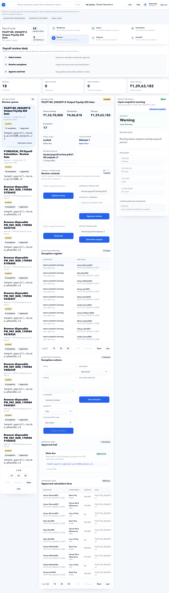

# Payroll Review

Payroll Review is where exceptions are reviewed and payroll is approved before outputs are generated.

## Purpose

Use this page to make the final HR/payroll decision before publishing outputs.

This page answers: **is the calculated payroll acceptable for final approval, or must it go back for correction?**

Use it after [Payroll Calculations](payroll-calculations.md) and before [Payroll Outputs](payroll-outputs.md).

## Who uses this page

| User | Responsibility |
| --- | --- |
| Payroll Admin | Prepares the review, explains exceptions, and submits payroll for approval. |
| HR Admin | Confirms employee, leave, attendance, lifecycle, and document exceptions. |
| Finance Manager | Confirms totals, deductions, bank advice readiness, and approval evidence. |
| Approver | Approves or rejects payroll based on company policy. |
| Auditor | Reviews exception decisions, approver identity, and final lock evidence. |

## Review decision principle

Every exception should have one of these outcomes:

- Fixed at source and recalculated.
- Accepted with a clear note.
- Rejected and returned to the owner.
- Deferred to a documented adjustment or next-cycle correction.

Do not leave severe exceptions unexplained before final approval.

## What should be reviewed

| Area | What to check | Typical owner |
| --- | --- | --- |
| Gross earnings | Salary, allowances, bonus, arrears, overtime. | Payroll Admin |
| Deductions | PF, ESI, PT, TDS, loan, recovery, advance, LOP. | Payroll Admin / Finance |
| Net pay | High-value changes, zero net pay, negative net pay, unusual movement. | Finance Manager |
| Employee exceptions | Missing bank, missing PAN, new joiner, exit, transfer, salary revision. | HR Admin |
| Leave and attendance | Pending approvals, unpaid leave, attendance corrections. | HR Admin / Manager |
| Statutory | TDS, PF, ESI, PT, employee declarations, proof status. | Payroll Admin |
| Evidence | Notes, source trace, approval comments, audit trail. | Payroll Admin / Approver |

## Page layout

| Section | Meaning |
| --- | --- |
| Review queue | Payroll reviews available for action. |
| Exception register | Items requiring decision. |
| Approval trail | Who submitted, approved, rejected, or locked payroll. |
| Final lock | Whether payroll review is frozen. |
| Totals summary | Gross, deduction, net pay, employee count, and exception count. |
| Review notes | Business explanation for accepted or rejected exceptions. |

## Exception decision options

| Decision | Meaning |
| --- | --- |
| Approve | Accept the exception and allow payroll to continue. |
| Reject | Send the issue back for correction. |
| Mark reviewed | Acknowledge a non-blocking warning. |
| Defer | Carry a documented correction to next cycle or adjustment process. |

## Severity guide

| Severity | Meaning | Recommended action |
| --- | --- | --- |
| Blocker | Payroll output can be wrong, unpaid, or non-compliant. | Fix source and recalculate before approval. |
| Warning | Payroll can continue with documented judgement. | Add note and owner before approval. |
| Info | Evidence or non-payroll observation. | Review if relevant; do not block payroll. |

## Buttons and actions

| Button | What it does |
| --- | --- |
| Submit review | Sends payroll for approval. |
| Approve payroll | Approves payroll review. |
| Reject payroll | Returns payroll for correction. |
| Final lock | Prevents further review changes. |
| Generate outputs | Creates payroll output artifacts after approval. |
| View exception | Opens the detailed exception context. |
| Add note | Records the review decision and business reason. |
| Open trace | Opens supporting calculation/source evidence when available. |

## Workflow

1. Open Payroll Review.
2. Select the payroll run.
3. Review all exceptions.
4. Add decision notes where needed.
5. Submit review.
6. Approver approves payroll.
7. Lock final review.
8. Generate outputs.

## Example: Approve September payroll review

Scenario:

- Tenant: Accerio India
- Period: September 2026
- Employees: 298
- Calculation: completed
- Exceptions: 3 warnings, 0 blockers
- Finance reviewer: Renu Bansal

Steps:

1. Open **HR Admin > Payroll > Payroll Review**.
2. Select the September 2026 payroll run.
3. Confirm employee count and totals match Payroll Calculations.
4. Open each warning in the exception register.
5. Add a review note for each accepted warning.
6. Submit review.
7. Finance or authorized approver reviews totals and notes.
8. Click **Approve payroll**.
9. Apply **Final lock** after approval.
10. Move to [Payroll Outputs](payroll-outputs.md).

Expected result:

- The payroll review is approved.
- Approval trail shows submitter, approver, and timestamp.
- Outputs can be generated only from the approved run.

## Example: Accept a warning with evidence

Warning: one employee has a pending document proof, but it does not affect September net pay.

Good note:

> PAN proof is pending resubmission. Employee has existing verified PAN and September TDS is calculated from current statutory profile. Owner: HR Admin. Follow-up due 05 Oct 2026.

Bad note:

> Looks okay.

Good review notes should include:

- What was reviewed.
- Why payroll can continue.
- Owner.
- Due date if follow-up is needed.
- Whether payroll amount is affected.

## Example: Reject payroll for correction

Scenario:

- Calculation shows Aditi Gupta net pay as zero.
- Trace shows salary assignment starts 01 Oct 2026 instead of 01 Sep 2026.

Steps:

1. Open the exception or employee trace.
2. Add rejection note: "Salary effective date wrong; September salary missing."
3. Click **Reject payroll**.
4. Payroll Admin fixes salary assignment.
5. Inputs are refreshed/recreated through controlled process if required.
6. Payroll is recalculated.
7. Review is resubmitted.

Expected result:

- Payroll does not proceed to outputs.
- The reason for rejection is visible in approval trail.
- Corrected calculation can be reviewed again.

## Negative scenario: payroll approved with open blockers

What can go wrong:

- Payslips show incorrect pay.
- Bank advice is wrong.
- Finance rejects payroll after output generation.
- Audit cannot explain why blockers were ignored.

Correct action:

1. Do not approve when blockers exist.
2. Reject payroll with clear reason.
3. Fix source or rule.
4. Recalculate.
5. Review again.

## Negative scenario: final lock applied too early

What happens:

- Review notes and exception decisions become frozen.
- Output generation may proceed before finance is ready.
- Corrections require a reopen process.

Fix:

1. Confirm finance review is complete before final lock.
2. If locked by mistake, follow the controlled reopen process.
3. Keep audit evidence showing why review was reopened.

## Negative scenario: approver cannot approve

Common causes:

- User does not have payroll approver permission.
- Approval workflow is missing.
- Approver is inactive.
- Tenant role does not include payroll review permission.

Fix:

1. Check Tenant Admin roles and HR Admin user access.
2. Confirm workflow route for payroll approval.
3. Confirm the approver can access the workspace.
4. Retry approval after access is corrected.

## Approval evidence to keep

| Evidence | Why it matters |
| --- | --- |
| Exception notes | Explains why a warning was accepted. |
| Approver identity | Shows who approved payroll. |
| Approval timestamp | Proves payroll was approved before output publication. |
| Final totals | Confirms gross, deductions, and net pay at approval time. |
| Rejection notes | Shows why payroll was sent back. |
| Exception register | Shows each blocker/warning and final decision. |
| Recalculation evidence | Shows old and new values if payroll was corrected. |

## Pre-output checklist

Before generating outputs, confirm:

- Payroll Review status is approved.
- Final lock is applied after approval.
- Gross, deductions, net pay, employee count, and line count are accepted.
- Open blockers are zero.
- Accepted warnings have notes.
- Approver identity and timestamp are visible.
- Any rejected payroll was recalculated before approval.

## Common mistakes

- Approving without checking exception register.
- Locking final review too early.
- Not documenting approval rationale.
- Generating outputs before finance review is complete.
- Accepting warnings without owner or due date.
- Approving a payroll run different from the intended period.
- Relying only on net pay total without checking employee exceptions.

## Downstream impact

| Downstream area | Impact |
| --- | --- |
| Payroll Outputs | Outputs can be generated only from approved review. |
| ESS Payslips | Employees should see payslips only after publication. |
| Finance Handoff | Finance receives files based on approved review totals. |
| Audit | Approval trail explains who accepted payroll and why. |
| Notifications | Payroll approval, rejection, or payslip publication may trigger notifications. |

## FAQ

### Who should approve payroll?

This depends on company policy. Usually payroll admin prepares, HR or finance approver reviews, and an authorized approver gives final approval.

### What if finance finds an issue after approval?

Do not edit outputs silently. Reopen through the approved correction process, recalculate if required, and regenerate outputs from the corrected run.

### Can HR approve payroll without finance?

Only if the tenant's approval policy allows it. For production payroll, finance review is strongly recommended before final lock and output publication.

### What if only one low-risk warning remains?

It can be accepted only with a clear note, owner, and reason explaining why pay and statutory output are not affected.

## Related guides

- [Payroll Calculations](payroll-calculations.md)
- [Payroll Outputs](payroll-outputs.md)
- [Payroll Handoff](payroll-handoff.md)
- [Payroll Issues](../../troubleshooting/payroll.md)
