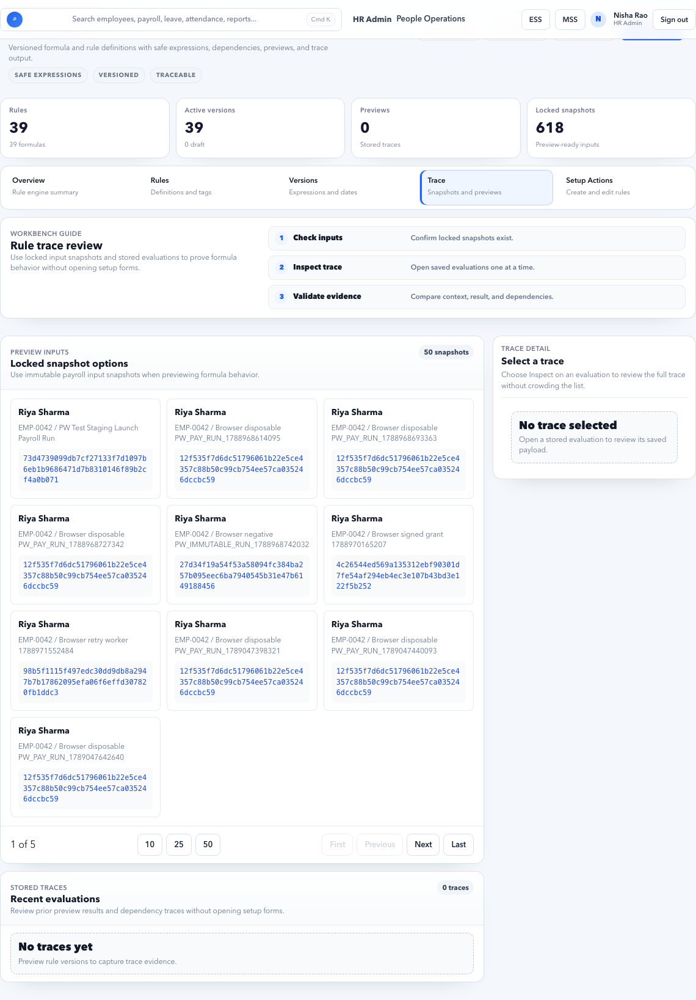

# Payroll Rules

Payroll Rules define formulas and calculation logic used during payroll calculation.

## Purpose

Use Payroll Rules to explain and control how payroll values are calculated.

Payroll Rules answer:

- Which formula calculates a payroll component?
- Which version applies to a payroll period?
- Which inputs does the rule depend on?
- Why did a calculated value become the final amount?
- How can payroll logic change without breaking historical payroll?

Do not use Payroll Rules for every value. Use rules only when the value must be calculated from conditions, formulas, slabs, attendance, leave, statutory setup, or other dependencies.

## Main concepts

| Concept | Meaning |
| --- | --- |
| Rule definition | The logical rule, such as HRA calculation. |
| Rule version | Effective-dated version of the rule. |
| Dependency | Another value required by the rule. |
| Trace | Evidence of how a result was calculated. |

## Rule Ownership

| Rule area | Primary owner | Review partner |
| --- | --- | --- |
| Salary formulas | Payroll Admin | Finance |
| Statutory formulas | Payroll Admin | Compliance / Finance |
| Attendance or leave proration | Payroll Admin | HR Admin |
| Bonus eligibility | Payroll Admin | HR / Finance |
| Recovery limits | Payroll Admin | Finance |
| Rule version approval | Payroll Admin | Finance / Compliance |

Rules should not be changed casually during payroll close. A rule change can affect many employees and must be tested through calculation trace.

## When to create a rule

Create or update a rule when the system must calculate a value from conditions instead of storing a fixed amount.

Examples:

- HRA as a percentage of Basic.
- City-based allowance.
- Grade-based bonus.
- Statutory deduction using a slab.
- Proration based on payable days.
- Recovery limited by net pay.

If the value is a simple fixed amount for one employee, use salary assignment or adjustment instead.

## Tabs

| Tab | Purpose |
| --- | --- |
| Catalog | List of rule definitions. |
| Versions | Effective-dated rule versions. |
| Trace | Calculation trace and dependencies. |
| Actions | Create or update rule records. |

## Rule fields

| Field | Meaning |
| --- | --- |
| Code | Unique rule code. |
| Name | User-friendly rule name. |
| Component | Salary component affected by the rule. |
| Effective date | Date from which the rule version applies. |
| Expression | Formula or calculation logic. |
| Priority | Order in which the rule is applied. |
| Active | Whether the rule can be used. |

## Rule Design Standard

Use clear, auditable rule design.

| Standard | Why it matters |
| --- | --- |
| One rule has one business purpose. | Avoids hidden side effects. |
| Rule code is stable and meaningful. | Helps trace, audit, and support. |
| Versions are effective-dated. | Keeps historical payroll reproducible. |
| Dependencies are explicit. | Prevents missing Basic, payable days, city, grade, or statutory input. |
| Priority is documented. | Prevents two rules from fighting over the same component. |
| Trace is reviewed after changes. | Confirms formula result before approval. |

## Common Rule Families

| Rule family | Example |
| --- | --- |
| Salary split | Basic is 40% of CTC. |
| Allowance | HRA is 40% or 50% of Basic based on city. |
| Proration | Monthly salary prorated by payable days. |
| Statutory | PF, ESI, PT, LWF, and TDS slab logic. |
| Bonus | Quarterly bonus paid only in quarter-end months. |
| Recovery | Recovery capped so net pay does not go below allowed threshold. |
| Rounding | Net pay rounded according to finance policy. |

## Example: HRA Rule By City

### Scenario

Accerio India pays HRA as:

- 50% of Basic for metro cities.
- 40% of Basic for non-metro cities.

### Rule definition

| Field | Example value |
| --- | --- |
| Code | `HRA_BY_CITY` |
| Name | `HRA by city classification` |
| Component | `HRA` |
| Dependency | Basic, work city, salary structure version |
| Priority | After Basic calculation |

### Rule behavior

| Condition | Result |
| --- | --- |
| City is Delhi, Mumbai, Chennai, or Kolkata | HRA = Basic x 50% |
| Any other city | HRA = Basic x 40% |

### Steps

1. Open **Payroll Rules > Catalog**.
2. Search for `HRA_BY_CITY`.
3. Create a rule if it does not exist.
4. Open **Versions**.
5. Create version effective `01 Sep 2026`.
6. Add dependencies: Basic and employee city/location.
7. Add city condition.
8. Save as draft.
9. Run a calculation test for one Delhi employee and one Bengaluru employee.
10. Open **Trace** and confirm the correct branch of the rule was used.

### Expected result

- Delhi employee receives HRA at 50% of Basic.
- Bengaluru employee receives HRA at 40% of Basic.
- Trace shows the city input, Basic value, rule version, and final HRA.

## Example: Prorate Salary By Payable Days

### Scenario

An employee joins on 16 Sep 2026 and should be paid only for payable days in September.

### Rule definition

| Field | Example value |
| --- | --- |
| Code | `MONTHLY_PRORATION` |
| Name | `Monthly salary proration` |
| Dependency | Monthly component amount, payable days, period days, join/exit dates, LOP days |

### Rule behavior

Monthly component amount is prorated by payable days according to tenant policy.

### Steps

1. Confirm employee joining date and payroll period.
2. Confirm attendance/leave inputs are ready.
3. Open Payroll Rules and review `MONTHLY_PRORATION`.
4. Confirm version applies to September 2026.
5. Run calculation.
6. Open line trace for Basic, HRA, and allowance lines.
7. Confirm payable days and period days used by the rule.

### Expected result

- Employee receives salary only for eligible payable days.
- Trace explains join date, payable days, and component amount.

## Example: Quarterly Bonus Rule

### Scenario

Quarterly bonus should be paid only in June, September, December, and March payroll.

### Rule design

| Field | Example value |
| --- | --- |
| Code | `QUARTERLY_BONUS_ELIGIBILITY` |
| Component | `Quarterly Bonus` |
| Dependency | Payroll month, eligibility flag, employee status, bonus amount |

### Expected behavior

- September payroll includes bonus for eligible employees.
- October payroll does not include quarterly bonus.
- Exited or ineligible employees are excluded according to policy.

### Negative case

If bonus appears in every month, check whether the rule is missing the payroll-month condition or the bonus was incorrectly configured as a monthly component in Salary Setup.

## Versioning Workflow

Use new versions for rule changes.

1. Open **Payroll Rules > Catalog**.
2. Select the rule.
3. Review existing versions.
4. Do not edit a version used by closed payroll.
5. Create new version with correct effective date.
6. Add formula, conditions, dependencies, and priority.
7. Test with sample employees.
8. Activate only after trace is correct.

## Example: Change HRA From Next Month

### Scenario

The company wants HRA for Bengaluru to change from 40% to 45% of Basic from `01 Oct 2026`.

### Correct approach

1. Keep existing September rule version unchanged.
2. Create new version effective `01 Oct 2026`.
3. Change non-metro condition to 45%.
4. Test October run.
5. Confirm September payroll still calculates at 40%.

### Expected result

- Past payroll is preserved.
- Future payroll reflects approved change.
- Audit shows the version change.

## Negative Scenario: Rule Edited Without Versioning

### Symptom

September payroll report changes after October rule update.

### Likely cause

A rule version used by September was edited instead of creating a new October version.

### Correct action

Stop approval/export. Restore or create correct historical version if possible, recalculate affected run under the controlled process, and keep audit evidence.

## Dependencies

Rules fail or produce wrong values when dependencies are missing or stale.

| Dependency | Example issue |
| --- | --- |
| Basic | HRA becomes zero because Basic did not calculate. |
| City/location | HRA uses non-metro rate because city is missing. |
| Payable days | Proration is wrong because attendance/leave is pending. |
| Salary version | Rule points to an inactive structure version. |
| Statutory profile | PF/PT/TDS rule cannot select correct slab. |
| Adjustment | Bonus/recovery rule ignores approved adjustment. |

## Negative Scenario: Missing Dependency Produces Wrong Amount

### Symptom

HRA is zero or lower than expected.

### Common reasons

- Basic component is missing or inactive.
- Basic calculation failed.
- City/location is blank.
- Wrong rule version was selected.
- Rule priority ran before Basic was available.

### Correct action

Open trace, inspect dependencies, fix Salary Setup, Employee Master, Organization, or rule priority, then recalculate through the approved flow.

## Safe rule change workflow

1. Open Payroll Rules.
2. Find the rule in Catalog.
3. Review existing versions.
4. Create a new version instead of overwriting old logic.
5. Confirm effective date.
6. Review dependencies.
7. Run calculation in a controlled payroll run.
8. Open Trace and verify output.

## Pre-Activation Checklist

| Check | Expected result |
| --- | --- |
| Business approval | Rule change has approved business reason. |
| Effective date | Future or intended period is correct. |
| Component | Rule affects the correct component. |
| Dependencies | Required inputs are explicit and available. |
| Priority | Rule runs after dependencies are calculated. |
| Conditions | Legal entity, city, grade, department, or pay group conditions are correct. |
| Test employees | At least one matching and one non-matching employee tested. |
| Trace | Trace explains inputs, rule version, and result. |
| Payroll Control | No unexpected blocker appears after rule change. |
| Audit | Change owner and approval are traceable. |

## Trace review checklist

| Check | What to confirm |
| --- | --- |
| Employee context | Legal entity, city, grade, role, department, and pay group are correct. |
| Effective date | The selected rule version applies to the payroll period. |
| Inputs | Basic, CTC, payable days, leave, attendance, and statutory inputs are correct. |
| Dependencies | The rule did not use a missing or stale dependency. |
| Result | Amount matches policy expectation. |
| Audit note | Any exception is documented before review approval. |

## How To Read Trace

Use trace when any amount looks wrong.

1. Select employee and component line.
2. Confirm payroll run and period.
3. Confirm source snapshot or locked input value.
4. Confirm selected rule code and version.
5. Confirm dependencies.
6. Confirm condition branch selected by the rule.
7. Recalculate manually for one employee if needed.
8. Decide whether the issue belongs to Employee Master, Organization, Salary Setup, Payroll Rules, Attendance, Leave, Statutory, or Adjustments.

Trace is evidence. It should explain the amount without needing engineering help for routine payroll questions.

## Common mistakes

- Changing a live rule without versioning.
- Not setting effective date.
- Creating circular dependencies.
- Forgetting statutory impact.
- Not checking trace after calculation.
- Using one rule for multiple unrelated components.
- Setting priority before dependencies exist.
- Adding a rule condition that no employee can match.
- Forgetting to test both matching and non-matching employees.

## Negative Scenario: Two Rules Affect Same Component

### Symptom

The same component appears duplicated, overwritten, or calculated unexpectedly.

### Common reasons

- Two active rule versions overlap.
- Two rules target the same component.
- Priority is wrong.
- Conditions are too broad.

### Correct action

Review Catalog, Versions, priority, component target, and effective dates. Disable or end-date the unintended rule version before recalculation.

## Evidence To Keep

| Evidence | Why |
| --- | --- |
| Rule catalog entry | Proves rule purpose and target component. |
| Rule version | Proves effective date and formula logic. |
| Dependency list | Proves required inputs. |
| Test trace | Proves rule works for selected examples. |
| Approval note | Explains why logic changed. |
| Audit trail | Shows who changed rule and when. |

## FAQ

### Why is rule trace important?

Trace explains how the system reached a payroll value. It helps answer employee, finance, and audit questions.

### Can formulas differ by role or city?

Yes. Conditions can be based on employee attributes such as city, location, legal entity, department, grade, role, or pay group.

### What if two rules affect the same component?

Check priority, effective dates, and conditions. Only the intended rule should apply for the selected employee and payroll period.

### Should I use rules for one employee's fixed allowance?

Usually no. Use salary assignment or adjustment unless the value must be calculated from reusable logic.

### Can payroll rules change after inputs are locked?

Avoid this. If a rule change is required after inputs or calculations, follow rerun/recalculation governance and keep approval evidence.

### Why does trace show an old rule version?

Check payroll period, rule effective date, active status, and whether the payroll run used a locked snapshot from before the rule was changed.

## Related guides

- [Salary Setup](salary-setup.md)
- [Payroll Calculations](payroll-calculations.md)
- [Payroll Control](payroll-control.md)
- [Statutory Payroll](statutory-payroll.md)
- [Adjustments and Settlements](adjustments-settlements.md)
- [Payroll Issues](../../troubleshooting/payroll.md)
