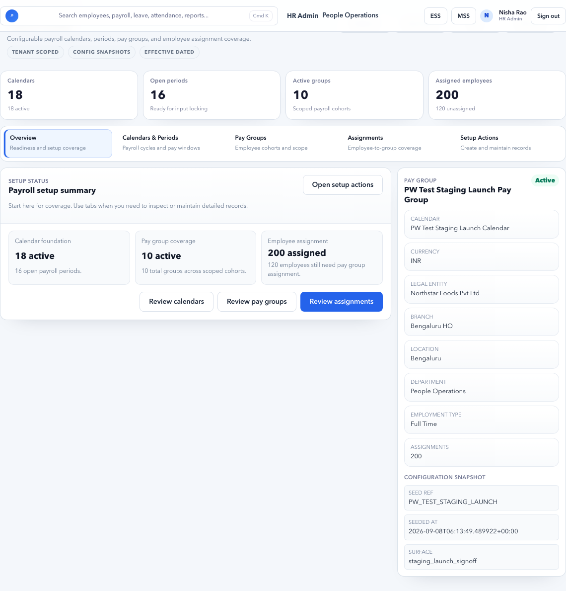

# Payroll Setup

Payroll Setup defines the calendar, periods, pay groups, and employee assignments used by payroll.

## On This Page

- [Payroll Setup Quick Navigation](#payroll-setup-quick-navigation)
- [Purpose](#purpose)
- [Setup concepts](#setup-concepts)
- [Who owns each setup?](#who-owns-each-setup)
- [Recommended screen design pattern](#recommended-screen-design-pattern)
- [Tabs](#tabs)
- [Calendar fields](#calendar-fields)
- [Period fields](#period-fields)
- [Pay group fields](#pay-group-fields)
- [Assignment Fields](#assignment-fields)
- [Recommended setup workflow](#recommended-setup-workflow)
- [Monthly Operating Workflow](#monthly-operating-workflow)
- [Pagination and Search Standard](#pagination-and-search-standard)
- [Payroll setup signoff checklist](#payroll-setup-signoff-checklist)

## Payroll Setup Quick Navigation

| I need to... | Start here | Then check |
| --- | --- | --- |
| Understand setup objects | [Setup concepts](#setup-concepts) | [Tabs](#tabs) |
| Create payroll calendar | [Example: Create India Monthly Payroll Calendar](#example-create-india-monthly-payroll-calendar) | [Before creating a calendar](#before-creating-a-calendar) |
| Create payroll period | [Example: Create September 2026 Payroll Period](#example-create-september-2026-payroll-period) | [Period fields](#period-fields) |
| Create pay groups | [Example: Create Pay Groups For India Employees](#example-create-pay-groups-for-india-employees) | [Pay group fields](#pay-group-fields) |
| Assign employees to pay group | [Example: Assign Employees To Monthly Staff Pay Group](#example-assign-employees-to-monthly-staff-pay-group) | [Assignment Fields](#assignment-fields) |
| Fix missing/incorrect payroll scope | [Negative Scenario: Employee Assigned To Wrong Pay Group](#negative-scenario-employee-assigned-to-wrong-pay-group) | [Negative Scenario: Employee Missing From Payroll Because Assignment Starts Late](#negative-scenario-employee-missing-from-payroll-because-assignment-starts-late) |
| Prepare setup signoff | [Pre-Payroll Setup Checklist](#pre-payroll-setup-checklist) | [Payroll setup signoff checklist](#payroll-setup-signoff-checklist) |

## Purpose

Use this page before running payroll for a tenant, or when payroll structure changes.

Payroll Setup answers four questions:

- Which payroll calendar controls cutoffs and frequency?
- Which payroll period is currently being processed?
- Which pay group owns a cohort of employees?
- Which employees are assigned to which pay group for the period?

Do not start Payroll Inputs until calendar, period, pay group, and assignments are correct.

## Setup concepts

| Concept | Meaning |
| --- | --- |
| Calendar | Defines payroll frequency, currency, timezone, and period start behavior. |
| Period | A payroll window such as 01 Sep to 30 Sep. |
| Pay group | A group of employees paid together. |
| Assignment | Mapping of employees to pay groups. |

## Who owns each setup?

| Setup area | Primary owner | Review partner |
| --- | --- | --- |
| Calendar | Payroll Admin | Finance Manager |
| Period | Payroll Admin | HR Admin |
| Pay group | Payroll Admin | HR Admin / Finance Manager |
| Assignment | HR Admin / Payroll Admin | Manager or department owner when needed |
| Changes after payroll starts | Payroll Admin | Finance Manager / HR Admin |

## Recommended screen design pattern

Each setup tab should work like a focused workbench:

1. A compact summary of existing records.
2. Search and filters for long lists.
3. Paginated table or list.
4. One create/edit form for the selected record.
5. Clear primary action at the bottom or top-right.
6. Drilldown only when extra fields would overcrowd the tab.

This keeps setup manageable as the tenant grows from a few employees to hundreds of employees.

## Tabs

| Tab | Purpose | Example |
| --- | --- | --- |
| Calendars | Create and maintain payroll calendars. | India Monthly Payroll |
| Periods | Maintain monthly payroll windows. | September 2026 |
| Pay groups | Create payroll cohorts. | Monthly Staff, Contract Staff |
| Assignments | Assign employees to pay groups. | Employee A to Monthly Staff |

## Calendar fields

| Field | Meaning |
| --- | --- |
| Code | Unique system code for the payroll calendar. |
| Name | User-friendly calendar name. |
| Frequency | Monthly, weekly, or other payroll frequency. |
| Timezone | Timezone used for cutoffs. For India use Asia/Kolkata. |
| Currency code | Payroll currency, such as INR. |
| Period start day | Day of month on which payroll period starts. |
| Config profile reference | Optional reference to advanced configuration. |
| Active calendar | Whether this calendar is available for use. |

## Before creating a calendar

Confirm:

- Payroll frequency.
- Currency.
- Timezone.
- Period start day.
- Whether the same calendar can serve all employees.
- Whether a separate calendar is needed for contractors, weekly workers, or another country.

## Example: Create India Monthly Payroll Calendar

### Scenario

Accerio India pays employees monthly in INR from the first day to the last day of each month.

### Recommended values

| Field | Example value |
| --- | --- |
| Code | `IN-MONTHLY` |
| Name | `India Monthly Payroll` |
| Frequency | `Monthly` |
| Timezone | `Asia/Kolkata` |
| Currency code | `INR` |
| Period start day | `1` |
| Config profile reference | Blank unless implementation has an approved profile |
| Active calendar | Enabled |

### Steps

1. Open **HR Admin > Payroll Setup**.
2. Open **Calendars**.
3. Click **New**.
4. Enter the calendar values.
5. Save with **Create calendar**.
6. Confirm the new calendar appears in the list.

### Expected result

- Calendar is available for periods and pay groups.
- The calendar has clear code and name.
- Payroll Control setup health can validate calendar coverage.

## Negative Scenario: Duplicate Active Calendars

### Symptom

Two calendars have similar names such as `India Payroll`, `India Monthly`, and `IN Payroll`.

### Risk

Periods and pay groups may be created under different calendars. Payroll users may process the wrong period.

### Correct action

Keep one approved active calendar. Rename or deactivate confusing calendars if they are not used by active payroll periods.

## Period fields

| Field | Meaning |
| --- | --- |
| Period name | User-facing period label. |
| Start date | First date included in payroll. |
| End date | Last date included in payroll. |
| Status | Draft, active, locked, closed, or similar period state. |
| Calendar | Calendar that owns this period. |

## Example: Create September 2026 Payroll Period

### Scenario

The tenant is preparing salary for September 2026.

### Recommended values

| Field | Example value |
| --- | --- |
| Period name | `September 2026` |
| Calendar | `India Monthly Payroll` |
| Start date | `01 Sep 2026` |
| End date | `30 Sep 2026` |
| Status | `Draft` before payroll starts, then active/open according to workflow |

### Steps

1. Open **Periods**.
2. Search for `September 2026`.
3. If missing, click **New**.
4. Select `India Monthly Payroll`.
5. Enter start and end date.
6. Save.
7. Confirm no overlapping period exists for the same calendar.

### Expected result

- Payroll Control can select or detect September 2026.
- Payroll Inputs can later create a snapshot for the correct dates.
- Reports can use the same period.

## Negative Scenario: Period Dates Overlap

### Symptom

September period is `01 Sep - 30 Sep`, but another active period also covers `15 Sep - 30 Sep`.

### Risk

Attendance, leave, salary revisions, and payroll inputs can be counted in the wrong run.

### Correct action

Do not continue payroll setup. Correct or close the wrong period before creating pay groups or locking inputs.

## Pay group fields

| Field | Meaning |
| --- | --- |
| Code | Unique pay group identifier. |
| Name | User-friendly name. |
| Calendar | Payroll calendar used by the group. |
| Legal entity / branch / department filters | Optional filters for employee grouping. |
| Active | Whether new assignments can use this group. |

## Example: Create Pay Groups For India Employees

### Scenario

Accerio India pays regular employees monthly, but keeps consultants out of the normal employee payroll run.

### Suggested pay groups

| Pay group | Use for | Example code |
| --- | --- | --- |
| Monthly Staff | Full-time Indian employees paid monthly. | `IN-MONTHLY-STAFF` |
| Contract Staff | Consultants or fixed-term staff processed separately. | `IN-CONTRACT` |
| Hold Payroll | Employees temporarily excluded pending HR or finance decision. | `IN-HOLD` |

### Steps

1. Open **Pay groups**.
2. Click **New**.
3. Select the payroll calendar.
4. Enter code and name.
5. Add legal entity, branch, or department filters only when they are intentional.
6. Mark active.
7. Save.

### Expected result

- Employees can be assigned to an appropriate payroll cohort.
- Payroll Control can identify missing or wrong pay group assignments.

## Negative Scenario: Employee Assigned To Wrong Pay Group

### Example

An employee in Bengaluru regular staff is assigned to `IN-CONTRACT`.

### Impact

- Employee may be excluded from the main payroll run.
- Salary, statutory, provider, or finance handoff may use wrong rules.

### Correct action

Open **Assignments**, search the employee, change pay group with correct effective date, then refresh Payroll Control.

## Assignment Fields

| Field | Meaning |
| --- | --- |
| Employee | Employee being mapped to payroll. |
| Pay group | Payroll cohort used for the employee. |
| Effective from | Date from which the assignment applies. |
| Effective to | Optional end date for temporary assignment. |
| Status | Active, future, ended, or inactive assignment state. |
| Reason | Business reason for assignment or change. |

## Example: Assign Employees To Monthly Staff Pay Group

### Scenario

HR created five pilot employees and wants them included in September payroll.

### Steps

1. Open **Assignments**.
2. Search by employee name, employee code, department, or legal entity.
3. Select employee.
4. Choose `IN-MONTHLY-STAFF`.
5. Set effective from date on or before `01 Sep 2026`.
6. Save assignment.
7. Repeat or use bulk assignment where available.
8. Open Payroll Control and confirm the employee appears in scope.

### Expected result

- Employee is included in the selected payroll cycle.
- Missing pay group blocker clears.
- Employee appears in Payroll Inputs after source readiness is clear.

## Negative Scenario: Employee Missing From Payroll Because Assignment Starts Late

### Symptom

Employee joined on `15 Sep 2026`, but does not appear in September payroll.

### Possible reason

Pay group assignment starts `01 Oct 2026`, so September payroll does not include the employee.

### Correct action

Check joining date, assignment effective date, salary effective date, and pay group. Correct the assignment only if the employee should be paid in September.

## Buttons and actions

| Button | What it does |
| --- | --- |
| New | Clears the form for a new record. |
| Create calendar | Creates a payroll calendar. |
| Create period | Creates a payroll period. |
| Create pay group | Creates a pay group. |
| Assign employee | Creates employee pay group assignment. |
| Save / Update | Saves changes to the selected record. |

## Recommended setup workflow

1. Create a calendar.
2. Create payroll periods for upcoming months.
3. Create pay groups.
4. Assign employees to pay groups.
5. Open Payroll Control and check setup health.

## Monthly Operating Workflow

Use this before each new payroll cycle:

1. Confirm next payroll period exists.
2. Confirm period dates match finance calendar.
3. Confirm pay groups are active.
4. Review employees with missing pay group.
5. Review joiners, exits, transfers, and department moves.
6. Confirm assignments are effective for the payroll period.
7. Open Payroll Control > Setup Health.
8. Fix setup blockers before locking inputs.

## Long-list handling

Use pagination and filters when records grow:

| List | Recommended filters |
| --- | --- |
| Calendars | Status, frequency, currency. |
| Periods | Calendar, month, status. |
| Pay groups | Calendar, legal entity, active status. |
| Assignments | Employee, department, pay group, status. |

Avoid showing every historical period or assignment in one long page. Users should be able to find the current payroll period without scrolling through old records.

## Pagination and Search Standard

Long setup lists should be reviewed with filters, not scrolling.

| List | Minimum review pattern |
| --- | --- |
| Calendars | Filter active calendars first. Keep historical calendars searchable. |
| Periods | Filter by calendar and year. Sort newest period first. |
| Pay groups | Filter active pay groups first. Search by code and legal entity. |
| Assignments | Search employee code/name and filter by pay group/status. |

For customer tenants with hundreds of employees, assignments must be handled with search, filters, pagination, and bulk action. Do not rely on a single unpaginated list.

## Common mistakes

- Creating multiple active calendars with similar names.
- Period dates overlapping.
- Employees missing pay group assignment.
- Assigning employees to the wrong pay group.
- Using unclear codes that are hard to audit later.

## Pre-Payroll Setup Checklist

| Check | Expected result |
| --- | --- |
| Calendar | One approved active calendar for the payroll population. |
| Period | Correct date range, no overlap, correct status. |
| Pay group | Every payroll population has a clear active pay group. |
| Assignments | Every payable employee has active assignment for the period. |
| Joiners | Joiners have assignment effective from joining or payroll eligibility date. |
| Exits | Exited employees are assigned or excluded according to final settlement process. |
| Transfers | Branch/pay group changes are effective-dated correctly. |
| Payroll Control | Setup Health has no unresolved setup blockers. |

## Evidence To Keep

| Evidence | Why |
| --- | --- |
| Calendar setup | Proves payroll frequency, timezone, and currency. |
| Period list | Proves monthly payroll window. |
| Pay group setup | Proves payroll population design. |
| Assignment export | Proves who is included in each pay group. |
| Audit trail | Proves who changed setup before payroll. |

## FAQ

### Should I create a new calendar every month?

No. Create one reusable calendar and create monthly periods under it.

### When should I create a separate pay group?

Create a separate pay group when employees follow different payroll timing, rules, provider handoff, or review process.

### Should payroll setup be changed during an active run?

Avoid it unless the change is required to fix a blocker. If a payroll run is already locked or calculated, check whether a rerun is required.

### Should contractors and employees be in the same pay group?

Only if they follow the same payroll calendar, review process, statutory setup, provider handoff, and finance approval. Otherwise create a separate pay group.

### Why does Payroll Control still show missing pay group?

Check assignment effective date, employee status, legal entity/branch filters, pay group active status, and selected payroll period.

### Can I delete old periods?

No, not if they were used for payroll or evidence. Close or archive historical periods according to policy instead of deleting them.

## Payroll setup signoff checklist

| Check | Expected result |
| --- | --- |
| Calendar is active. | Payroll periods can be created consistently. |
| Period is open and correct. | Start/end dates match business payroll month. |
| Pay groups are defined. | Employees are grouped by payroll timing and rules. |
| Assignments are effective-dated. | Employees are in the correct pay group for the period. |
| Setup changes are auditable. | Changes to periods or groups have reason and owner. |

## Related guides

- [Payroll Overview](index.md)
- [Payroll Control](payroll-control.md)
- [Payroll Inputs](payroll-inputs.md)
- [Employee Master](../employees.md)
- [Organization](../organization.md)
- [Lifecycle](../lifecycle.md)
- [Payroll Issues](../../troubleshooting/payroll.md)
