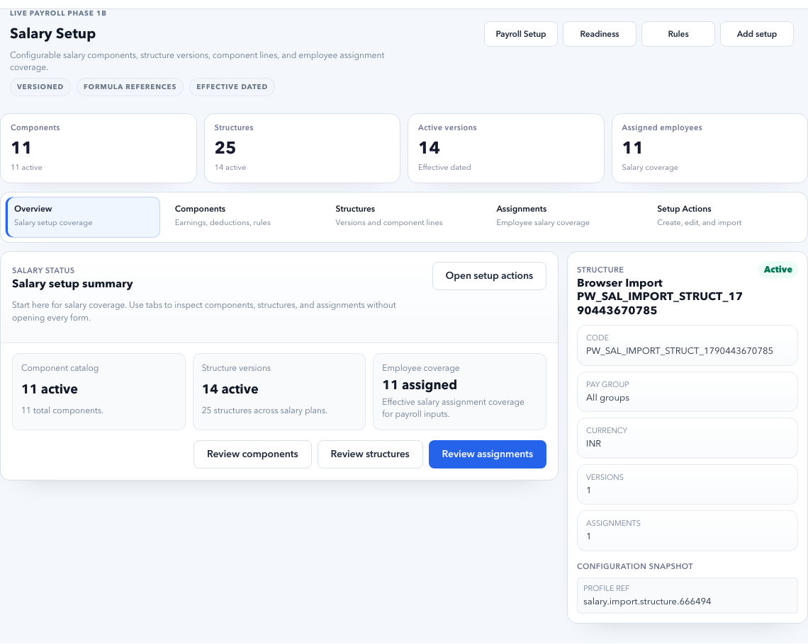

# Salary Setup

Salary Setup defines salary components, salary structures, structure versions, and employee salary assignments.

## Purpose

Use Salary Setup to decide what an employee is paid and how that amount is split into components.

Salary Setup answers:

- Which salary components exist?
- Which components are earnings, deductions, reimbursements, benefits, or employer contributions?
- Which salary structure applies to which employee group?
- Which version is active for the payroll period?
- Which employee has which CTC, salary structure, and effective date?

Payroll Control will continue to show salary blockers until every payroll-scope employee has a valid salary assignment for the payroll period.

## Main concepts

| Concept | Meaning |
| --- | --- |
| Component | A salary part such as Basic, HRA, Conveyance, PF, TDS, Bonus. |
| Structure | A reusable salary design for a role or employee group. |
| Version | A dated version of a salary structure. |
| Assignment | Mapping of an employee to salary structure and CTC. |

## Who owns salary setup?

| Area | Primary owner | Review partner |
| --- | --- | --- |
| Components | Payroll Admin | Finance / Compliance |
| Structures | Payroll Admin | HR / Finance |
| Versions | Payroll Admin | Finance / Compliance |
| Employee assignments | HR Admin / Payroll Admin | Department owner when salary source is role-based |
| One-time payouts | Payroll Admin | Finance |
| Statutory-linked components | Payroll Admin | Compliance / Finance |

## Decide where the change belongs

| Need | Use |
| --- | --- |
| Add a new pay head such as Basic, HRA, or Bonus | Component |
| Define how a role or group is paid | Structure |
| Change formula or component split from a date | Version |
| Give an employee a CTC or salary structure | Assignment |
| Add one-time bonus, arrears, or recovery | Adjustments and Settlements |

Do not use one-time adjustments for permanent salary changes. Do not edit historical structure versions when the change is effective from a new date.

## Tabs

| Tab | Purpose |
| --- | --- |
| Components | Maintain earnings, deductions, benefits, reimbursements, and employer contributions. |
| Structures | Maintain reusable salary structures. |
| Versions | Maintain effective-dated versions and rules. |
| Assignments | Assign salary structures and CTC to employees. |

## Component fields

| Field | Meaning |
| --- | --- |
| Code | Unique component code. |
| Name | User-facing component name. |
| Component type | Earning, deduction, benefit, employer contribution, reimbursement. |
| Taxable | Whether the component is taxable. |
| Payslip visible | Whether employees see it on payslip. |
| Active | Whether the component can be used in structures. |

## Component Design Standard

Create components with clear business meaning. Do not reuse one component for multiple purposes.

| Component | Recommended type | Payslip visible | Notes |
| --- | --- | --- | --- |
| Basic | Earning | Yes | Usually drives HRA, PF, gratuity, and other formulas. |
| HRA | Earning | Yes | Often percentage of Basic and may vary by city. |
| Special Allowance | Earning | Yes | Used as residual or fixed earning depending on structure. |
| Conveyance Allowance | Earning | Yes | Can be fixed or structure-based. |
| Employer PF | Employer contribution | Optional | Employer-side cost; part of CTC but not net pay. |
| Employee PF | Deduction | Yes | Employee deduction from gross. |
| Professional Tax | Deduction | Yes | State-specific deduction. |
| TDS | Deduction | Yes | Income tax deduction. |
| Bonus | Earning | Yes | Monthly, quarterly, annual, or one-time depending on setup. |
| Reimbursement | Reimbursement | Yes | Usually claim or policy based. |

## Example: Create Basic and HRA Components

### Scenario

Accerio India wants salary slips to show Basic and HRA separately.

### Basic component

| Field | Example value |
| --- | --- |
| Code | `BASIC` |
| Name | `Basic Salary` |
| Component type | `Earning` |
| Taxable | Yes |
| Payslip visible | Yes |
| Active | Yes |

### HRA component

| Field | Example value |
| --- | --- |
| Code | `HRA` |
| Name | `House Rent Allowance` |
| Component type | `Earning` |
| Taxable | Yes |
| Payslip visible | Yes |
| Active | Yes |

### Expected result

- Components are available for salary structures.
- Payroll rules can calculate HRA from Basic.
- Payslip can show both components clearly.

## Real-world salary examples

| Scenario | Setup approach |
| --- | --- |
| HRA is 40% of Basic for non-metro cities. | Create HRA rule with city condition. |
| HRA is 50% of Basic for metro cities. | Add location or city-based condition. |
| One organization uses fixed conveyance. | Add fixed amount component in structure version. |
| Another organization uses role-based allowance. | Add grade or designation condition. |
| Monthly bonus | Add earning component with monthly frequency. |
| Quarterly bonus | Add earning component and pay in specific periods. |
| Annual bonus | Add one-time adjustment or annual component. |

## HRA Setup For Indian Payroll

HRA commonly depends on Basic salary and city classification.

| Case | Example rule |
| --- | --- |
| Metro city | HRA = 50% of Basic. |
| Non-metro city | HRA = 40% of Basic. |
| Company-specific cap | HRA = lower of configured percentage or fixed cap. |
| Role-specific allowance | HRA or housing allowance varies by grade or designation. |

### Example: HRA 40% For Bengaluru, 50% For Delhi

1. Create `BASIC` and `HRA` components.
2. Create salary structure `INDIA-STAFF`.
3. Create version effective `01 Sep 2026`.
4. Add Basic formula, for example `40% of CTC` if that is the business design.
5. Add HRA rule:
   - If city is Delhi, Mumbai, Chennai, or Kolkata: `50% of Basic`.
   - Otherwise: `40% of Basic`.
6. Assign one Bengaluru employee and one Delhi employee to the structure.
7. Run payroll calculation test.
8. Inspect line trace for Basic and HRA.

Expected result:

- Bengaluru employee gets HRA at 40% of Basic.
- Delhi employee gets HRA at 50% of Basic.
- Calculation trace explains which city condition was used.

## Bonus Frequency Setup

Bonuses should be designed based on how frequently they are earned and paid.

| Bonus type | Recommended setup | Example |
| --- | --- | --- |
| Monthly fixed bonus | Add recurring earning in structure. | `Performance Allowance` paid every month. |
| Quarterly bonus | Add bonus component and rule limited to quarter-end periods. | Paid in June, September, December, March. |
| Annual bonus | Use annual component or approved adjustment. | Diwali bonus or annual performance bonus. |
| One-time joining bonus | Use Adjustments and Settlements. | Pay once in first payroll. |
| Retention bonus | Use dated adjustment or rule with eligibility condition. | Pay after 12 months of service. |

### Negative Scenario: Annual Bonus Added As Monthly Component

If an annual bonus is mistakenly added as a monthly recurring component, the employee may receive it every month.

Correct action:

1. Stop payroll before approval if detected.
2. Correct structure version or move bonus to adjustment.
3. Recalculate affected payroll run.
4. Use Audit to capture the correction.

Do not fix this by manually editing only the final net pay.

## Structure Fields

| Field | Meaning |
| --- | --- |
| Code | Unique salary structure code. |
| Name | User-facing name. |
| Description | Purpose of the structure. |
| Legal entity / branch / grade / role scope | Optional scope for structure usage. |
| Active | Whether this structure can be assigned. |

## Example: Create Staff Salary Structure

### Scenario

Accerio India needs a reusable salary structure for regular employees.

### Recommended values

| Field | Example value |
| --- | --- |
| Code | `INDIA-STAFF` |
| Name | `India Staff Salary Structure` |
| Scope | Accerio India regular employees |
| Active | Yes |

### Steps

1. Open **Salary Setup > Structures**.
2. Click **New**.
3. Enter code, name, and description.
4. Set scope if the UI supports legal entity, branch, grade, or role filters.
5. Save.
6. Create a version before assigning it to employees.

Expected result:

- Structure is available for effective-dated versions.
- Employee salary assignments can reference the structure.

## Version Fields

| Field | Meaning |
| --- | --- |
| Structure | Parent salary structure. |
| Version code | Unique reference for the version. |
| Effective from | First date this version applies. |
| Effective to | Optional end date. |
| Component rules | Component amounts, formulas, percentages, and conditions. |
| Status | Draft, active, retired, or locked depending on workflow. |

## Example: Create Version Effective 01 Sep 2026

### Scenario

The company updates salary breakup from September payroll.

### Steps

1. Open **Versions**.
2. Select `INDIA-STAFF`.
3. Click **New version**.
4. Set effective from `01 Sep 2026`.
5. Add component rules:
   - Basic.
   - HRA.
   - Special Allowance.
   - Employer PF where applicable.
   - Employee PF, PT, TDS through statutory/rule setup if separated.
6. Validate formula references.
7. Save as draft.
8. Test with one employee.
9. Activate only after review.

Expected result:

- Old payroll periods keep old version.
- September payroll uses new version.
- Calculation trace shows the version used.

## Negative Scenario: Editing Historical Version

Do not edit a salary version that has already been used for a closed payroll unless there is a controlled correction process.

Risk:

- Old payslips and reports may no longer reconcile.
- Audit evidence becomes confusing.
- Finance and compliance numbers may change retrospectively.

Correct action:

Create a new effective-dated version for future periods. Use adjustment or rerun process for already processed payroll.

## Assignment Fields

| Field | Meaning |
| --- | --- |
| Employee | Employee receiving salary assignment. |
| Structure | Salary structure assigned. |
| Version | Version used, usually resolved by effective date. |
| CTC or fixed amount | Employee's annual or monthly package value. |
| Effective from | Date from which salary applies. |
| Effective to | Optional end date for temporary assignment. |
| Reason | Hire, revision, promotion, correction, migration, or other reason. |

## Example: Assign Salary To A New Employee

### Scenario

Employee **Aditi Gupta** joins Bengaluru as Assistant Manager with annual CTC of `₹9,60,000`, effective `01 Sep 2026`.

### Steps

1. Open **Salary Setup > Assignments**.
2. Search employee `Aditi Gupta`.
3. Select structure `INDIA-STAFF`.
4. Enter CTC `960000`.
5. Set effective from `01 Sep 2026`.
6. Add reason `New hire salary setup`.
7. Save.
8. Open Payroll Control.
9. Confirm salary blocker clears for Aditi.
10. Run calculation test when inputs are locked.

Expected result:

- Employee has valid salary for September payroll.
- Payroll Control no longer shows missing salary assignment.
- Calculation trace uses correct structure, version, CTC, and effective date.

## Example: Salary Revision After Promotion

### Scenario

Employee is promoted from Executive to Senior Executive from `01 Oct 2026`. CTC changes from `₹8,00,000` to `₹10,00,000`.

### Steps

1. Complete Lifecycle promotion with effective date.
2. Open Salary Setup > Assignments.
3. End-date old salary assignment if required.
4. Add new assignment effective `01 Oct 2026`.
5. Use correct structure/version for new role.
6. Confirm October payroll uses revised salary.
7. Confirm September payroll remains unchanged.

Expected result:

- Promotion and salary revision align by effective date.
- Past payroll is not changed.
- October payroll calculation uses new salary.

## Negative Scenario: Salary Effective Date Is After Payroll Period

### Symptom

Employee appears in Payroll Control as salary missing, even though salary was assigned.

### Common reason

Salary assignment starts `01 Oct 2026`, but September payroll is being processed.

### Correct action

If the employee should be paid in September, correct the salary effective date. If not, confirm employee scope and payroll eligibility.

## Salary setup workflow for a new tenant

1. Create base components first.
2. Mark whether each component is taxable, payslip visible, and earning/deduction/employer contribution.
3. Create structures for each salary design.
4. Create a version with effective date.
5. Add component split or formula references.
6. Assign salary to employees.
7. Confirm Payroll Control no longer shows salary assignment blockers.
8. Run a small calculation test and inspect line trace.

## Safe Change Workflow

When salary setup changes after go-live:

1. Identify whether change is permanent, effective-dated, or one-time.
2. Use new version for future structure changes.
3. Use new assignment for employee-specific revision.
4. Use Adjustments and Settlements for one-time payout/recovery.
5. Avoid editing historical records used in closed payroll.
6. Run calculation trace for at least one affected employee.
7. Keep approval and audit evidence.

## Buttons and actions

| Button | What it does |
| --- | --- |
| New | Start creating a new salary record. |
| Create component | Adds a salary component. |
| Create structure | Adds a reusable structure. |
| Create version | Adds a dated structure version. |
| Assign salary | Maps employee to salary structure and CTC. |
| Save / Update | Saves selected item changes. |

## Recommended workflow

1. Create components first.
2. Create salary structures.
3. Create structure versions with effective dates.
4. Assign salary to employees.
5. Open Payroll Control and confirm salary blockers are reduced.
6. Open Payroll Rules if calculation logic is required.

## Common mistakes

- Assigning salary without effective date.
- Editing a structure instead of creating a new version.
- Using the same component for different meanings.
- Making a component hidden when payroll users need to verify it.
- Forgetting employer contribution components.
- Adding a one-time bonus as a recurring monthly component.
- Assigning salary to an employee before pay group and organization are ready.
- Creating formulas that reference inactive or missing components.

## Pre-Calculation Checklist

| Check | Expected result |
| --- | --- |
| Components | Required earnings, deductions, employer contributions, reimbursements, and bonus components exist. |
| Component meaning | Each component has one clear purpose. |
| Structures | Salary structures match actual employee groups. |
| Versions | Active version exists for the payroll period. |
| Employee assignments | Every payroll-scope employee has salary assignment and effective date. |
| CTC | CTC or fixed salary value is correct. |
| HRA and allowances | City, grade, role, or branch conditions are configured where needed. |
| Bonus setup | Monthly, quarterly, annual, and one-time bonuses are not mixed incorrectly. |
| Payroll Control | Salary blocker count is zero or explained. |
| Calculation trace | Test employee trace matches expected breakup. |

## Evidence To Keep

| Evidence | Why |
| --- | --- |
| Component list | Proves salary heads and payslip visibility. |
| Structure/version details | Proves the salary design used for payroll. |
| Employee assignment export | Proves salary assigned to each employee. |
| Approval note | Explains salary revision or exception. |
| Calculation trace | Proves why Basic, HRA, deductions, and net pay were calculated. |
| Audit trail | Shows who changed salary setup and when. |

## FAQ

### Can two organizations have different HRA rules?

Yes. Use different structures, versions, or conditional rules based on legal entity, city, branch, grade, or role.

### Should bonus be part of salary structure or adjustment?

Use salary structure for predictable recurring bonus. Use adjustments for one-time, exceptional, or period-specific bonus.

### Why is CTC not matching net pay?

CTC includes employer-side costs and gross components. Net pay is calculated after employee deductions, tax, leave impact, and approved adjustments.

### Should HRA be one rule for all companies?

No. HRA should be tenant-configurable. Some organizations use 40%/50% of Basic, some use fixed slabs, and some use role or city-specific housing allowance.

### Can I change salary after inputs are locked?

Not directly for that run. Locked inputs use a snapshot. Use the approved rerun, unlock, or adjustment process.

### Why is salary still blocked after assignment?

Check effective date, active structure version, employee pay group, employee status, and whether the selected payroll period is correct.

## Related guides

- [Payroll Overview](index.md)
- [Payroll Control](payroll-control.md)
- [Payroll Rules](payroll-rules.md)
- [Payroll Calculations](payroll-calculations.md)
- [Adjustments and Settlements](adjustments-settlements.md)
- [Employee Master](../employees.md)
- [Lifecycle](../lifecycle.md)
- [Payroll Issues](../../troubleshooting/payroll.md)
