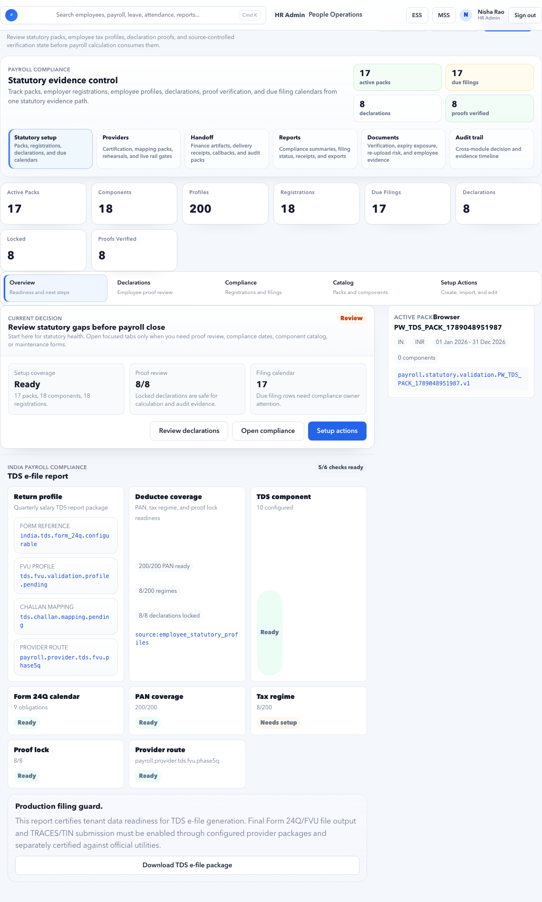

# Statutory Payroll

Statutory Payroll covers compliance setup and readiness for PF, ESIC, professional tax, LWF, TDS, declarations, proofs, reports, and filing evidence.

## Purpose

Use this page to maintain statutory packs, components, slabs, employer registrations, filing calendars, employee statutory profiles, and readiness evidence.

This guide answers: **will Indian statutory deductions, employer contributions, employee declarations, and compliance outputs calculate correctly for payroll?**

Use it before [Payroll Inputs](payroll-inputs.md) are locked and again after [Payroll Outputs](payroll-outputs.md) are generated.

## Who uses this page

| User | Responsibility |
| --- | --- |
| Payroll Admin | Configures statutory packs, slabs, components, profiles, and payroll readiness checks. |
| HR Admin | Maintains employee PAN, UAN, ESIC applicability, state, documents, and employee corrections. |
| Employee | Submits tax declarations and proofs from ESS where applicable. |
| Finance Manager | Reviews statutory deductions, employer cost, reports, and filing evidence. |
| Compliance Owner | Confirms statutory registrations, filing calendars, and exception handling. |
| Auditor | Reviews effective dates, calculations, proof status, and filing evidence. |

## Statutory setup principle

Statutory setup must be **effective-dated, location-aware, employee-aware, and auditable**.

India payroll can differ by:

- Legal entity and employer registration.
- State and branch.
- Salary threshold.
- Employee category.
- Joining and exit date.
- Tax regime.
- Employee declaration and proof status.
- Applicable statutory pack version.

Do not treat statutory setup as a one-time tenant configuration. It must be reviewed when legal entities, branches, salary structures, slabs, or laws change.

## Common statutory areas for India

| Area | Meaning | Typical payroll impact |
| --- | --- | --- |
| PF | Provident Fund employee and employer contribution. | Employee deduction, employer contribution, statutory report. |
| ESIC | Employee State Insurance contribution where salary and applicability rules qualify. | Employee deduction, employer contribution, statutory report. |
| Professional Tax | State-specific tax deduction. | Employee deduction based on work state and salary/slab. |
| LWF | Labour Welfare Fund where applicable. | Periodic employee/employer contribution. |
| TDS | Income tax deduction from salary. | Monthly tax deduction based on income, regime, declaration, proof, and projections. |
| PAN | Tax identity used for TDS and compliance. | Missing PAN can trigger higher TDS or readiness blocker depending on policy. |
| UAN | PF member identity. | PF reporting and employee profile readiness. |

## Setup items

| Item | Purpose |
| --- | --- |
| Statutory pack | Country, state, or tenant compliance bundle. |
| Component | Deduction or employer contribution component such as Employee PF, Employer PF, PT, TDS. |
| Slab | Threshold and rate configuration. |
| Employer registration | Employer statutory registration identifiers for a legal entity. |
| Filing calendar | Due dates, proof windows, filing windows, and payroll cutoff dates. |
| Employee statutory profile | PAN, UAN, ESIC applicability, PT state, tax regime, declaration status. |
| Proof workflow | Employee declaration proof submission and HR/payroll verification. |

## Recommended setup workflow

1. Confirm legal entities and branches are complete in [Organization](../organization.md).
2. Create or select the India statutory pack.
3. Add employer registration details for each legal entity.
4. Configure PF, ESIC, PT, LWF, and TDS components.
5. Configure slabs and effective dates.
6. Map statutory components to salary structure and payroll rules.
7. Confirm employee statutory profiles.
8. Open ESS tax declaration window where applicable.
9. Verify employee declarations and proofs.
10. Run Payroll Control readiness.
11. Lock inputs and calculate payroll.
12. Review statutory deductions in calculation trace and reports.
13. Generate statutory files/evidence after payroll approval.

## Statutory ownership map

| Setup area | Usually owned by | Before payroll lock |
| --- | --- | --- |
| Employer registration | Compliance / Payroll Admin | Must be configured for payroll legal entity. |
| PAN/UAN/ESIC employee data | HR Admin / Employee | Must be captured or exception documented. |
| PT state | Organization / HR Admin | Branch and work state must be correct. |
| Tax regime | Employee / Payroll Admin | Regime should be known before TDS calculation. |
| Declarations and proofs | Employee / Payroll Admin | Proof cutoff and accepted values must be clear. |
| Slabs and rates | Payroll Admin / Compliance | Effective version must cover payroll period. |
| Reports and filing evidence | Payroll Admin / Finance | Must be generated after approved payroll. |

## Example: Configure statutory pack for Accerio India

Scenario:

- Tenant: Accerio India
- Legal entity: Accerio India Pvt Ltd
- Country: India
- Payroll frequency: Monthly
- Primary states: Karnataka, Maharashtra, Delhi
- Payroll start: September 2026

Steps:

1. Open **HR Admin > Payroll > Statutory**.
2. Select or create the India statutory pack.
3. Set country to `India`.
4. Set effective date to `01 Sep 2026`.
5. Add active legal entity mapping for `Accerio India Pvt Ltd`.
6. Configure PF, ESIC, Professional Tax, LWF, and TDS areas according to tenant policy.
7. Add employer registration references.
8. Save the statutory pack.
9. Run setup health or Payroll Control readiness.

Expected result:

- Statutory setup is active for the payroll period.
- Payroll Control does not show missing statutory setup for the legal entity.
- Payroll rules can select statutory components and slabs.

## Example: Configure employer registrations

Use employer registration to identify the legal entity in statutory outputs.

Example fields:

| Field | Example |
| --- | --- |
| Legal entity | Accerio India Pvt Ltd |
| PF registration reference | `PF-ACCERIO-KA-001` |
| ESIC registration reference | `ESIC-ACCERIO-KA-001` |
| Professional Tax state | Karnataka |
| TAN reference | `BLRA00000A` |
| Effective from | 01 Sep 2026 |
| Status | Active |

Expected result:

- PF, ESIC, PT, and TDS reports can show employer context.
- Finance and compliance can reconcile payroll output to statutory registrations.

## Example: PF setup

PF setup generally depends on employee applicability, Basic salary, employer policy, and effective rules.

Example setup:

| Field | Example |
| --- | --- |
| Component: employee deduction | Employee PF |
| Component: employer contribution | Employer PF |
| Source salary component | Basic |
| Employee profile field | PF applicable, UAN |
| Effective date | 01 Sep 2026 |
| Reporting requirement | PF monthly report |

Before payroll:

1. Confirm PF components exist in [Salary Setup](salary-setup.md).
2. Confirm PF rule exists in [Payroll Rules](payroll-rules.md).
3. Confirm employee PF applicability and UAN where available.
4. Confirm PF employer registration exists for the legal entity.

Negative signs:

- PF amount is zero for an applicable employee.
- Employer PF appears in net pay.
- UAN missing for PF-applicable employee.
- PF report does not show employer registration.

## Example: ESIC setup

ESIC generally applies only when employee compensation and applicability criteria qualify.

Example setup:

| Field | Example |
| --- | --- |
| Component: employee deduction | Employee ESIC |
| Component: employer contribution | Employer ESIC |
| Applicability | Based on ESIC profile and wage threshold |
| Employer registration | ESIC registration for legal entity |
| Effective date | 01 Sep 2026 |

Check before payroll:

- Employee ESIC applicability.
- Work location/legal entity registration.
- Wage threshold logic.
- Employer contribution component mapping.

Negative scenario:

An employee above the ESIC threshold receives ESIC deduction because their salary profile was not updated after salary revision. Fix salary/statutory profile, refresh inputs through the controlled payroll process, then recalculate.

## Example: Professional Tax by state

Professional Tax depends on state, salary, and effective slab.

Example:

| Employee | State | Monthly gross | PT result |
| --- | --- | --- | --- |
| Aditi Gupta | Karnataka | INR 75,000 | Karnataka slab applies. |
| Riya Sharma | Maharashtra | INR 65,000 | Maharashtra slab applies. |
| Aman Verma | Delhi | INR 80,000 | No PT if tenant/state setup says PT not applicable. |

Steps:

1. Confirm branch state in [Organization](../organization.md).
2. Confirm employee branch/location.
3. Confirm PT slab version for the payroll period.
4. Confirm PT component mapping.
5. Check payroll calculation trace for selected employees.

Negative scenario:

Employee transferred from Karnataka to Maharashtra effective 01 Sep 2026, but Payroll Inputs still show old Bengaluru branch. PT calculation uses Karnataka slab. Fix lifecycle/organization effective date, recreate or refresh inputs as per payroll process, and recalculate.

## Example: TDS using employee tax declaration

TDS depends on salary projection, tax regime, PAN, declarations, proofs, previous employment income, and payroll policy.

Example:

| Field | Example |
| --- | --- |
| Financial year | FY2026-27 |
| Employee | Riya Sharma |
| Tax regime | Old Regime |
| Declared 80C | INR 1,50,000 |
| Proof accepted | INR 1,20,000 |
| PAN | Available |
| Payroll use | Accepted proof value used for TDS after proof verification |

Workflow:

1. Employee opens [ESS Tax Declarations](../../ess/statutory-declarations.md).
2. Employee starts or updates declaration.
3. Employee adds declaration rows and uploads proof.
4. Payroll/HR reviews proof.
5. Accepted proof values become available for payroll calculation.
6. Payroll calculation trace shows TDS source and declaration status.

If proof is not yet accepted:

- Tenant policy decides whether declared amount, accepted proof amount, or zero proof amount is used.
- Payroll Admin must document the policy and cutoff.

## Declaration and proof states

| State | Meaning | Payroll action |
| --- | --- | --- |
| Draft | Employee started but did not submit. | Usually not used for final payroll. |
| Submitted | Employee submitted for review. | Review before cutoff. |
| Accepted | Proof/value approved. | Can be used for payroll. |
| Rejected | Proof or amount is invalid. | Employee must correct; payroll uses policy fallback. |
| Consumed by payroll | Payroll used declaration in calculation. | Change only through correction process. |
| Locked | Declaration window closed. | Reopen only if policy allows. |

## Example: Reject tax proof and notify employee

Scenario:

- Employee uploads LIC proof under 80C.
- Proof file is unreadable.
- Payroll cutoff is near.

Steps:

1. Open statutory declaration/proof review.
2. Open the proof row.
3. Reject proof with reason: `File unreadable. Upload clear LIC receipt before cutoff.`
4. Confirm notification is generated if configured.
5. Employee resubmits proof from ESS.
6. Reviewer accepts corrected proof.

Expected result:

- Rejection reason is clear.
- Employee knows what to fix.
- Payroll uses accepted value only after proof is approved.

## Negative scenario: PAN missing before TDS calculation

What happens:

- Payroll readiness may show statutory blocker or warning.
- TDS calculation may use fallback/higher deduction logic depending on tenant policy.
- Statutory reporting may be incomplete.

Fix:

1. Open employee statutory profile.
2. Add PAN or mark exception according to policy.
3. If PAN proof is required, request employee document upload.
4. Verify proof.
5. Refresh Payroll Control readiness.
6. Lock inputs only after readiness is clear or exception is approved.

## Negative scenario: outdated statutory slab

What happens:

- PT, TDS, PF, ESIC, or LWF can calculate using old logic.
- Payroll totals can be wrong even if employee data is complete.

Fix:

1. Check slab effective date.
2. Create a new effective-dated slab version.
3. Do not edit historical slab versions used by closed payroll.
4. Recalculate only affected open payroll runs.
5. Keep approval and version evidence.

## Negative scenario: wrong state drives Professional Tax

What happens:

- Employee pays PT for the wrong state.
- Reports and finance output mismatch branch payroll.

Fix:

1. Check employee branch/location.
2. Check lifecycle transfer effective date.
3. Check Organization state value.
4. Confirm Payroll Inputs show the correct state.
5. Recalculate after controlled input refresh if needed.

## Negative scenario: proof accepted after payroll lock

Example:

- September inputs are locked.
- Employee submits or corrects proof on 01 Oct 2026.
- Payroll user expects September TDS to change automatically.

Correct behavior:

- Locked payroll continues using the declaration/proof state captured at lock time.
- Change applies to a future run unless September payroll is intentionally reopened.

Correct action:

1. Decide whether payroll must be reopened.
2. Record approval for reopen.
3. Refresh/recreate inputs through controlled process.
4. Recalculate and compare TDS change.
5. Keep old and new evidence.

## Readiness checklist

| Check | Why it matters |
| --- | --- |
| Legal entity registration | Reports and filings need employer identifiers. |
| Employee statutory profile | Determines whether PF, ESIC, PT, LWF, or TDS applies. |
| State mapping | Professional tax and LWF can vary by state. |
| Slab effective date | Outdated slabs can calculate wrong deductions. |
| Salary component mapping | Deductions and employer contributions need correct components. |
| Tax declarations | TDS can depend on employee declarations and proof status. |
| Proof cutoff | Late proofs need clear payroll treatment. |
| Input lock timing | Statutory values used by payroll are frozen at input lock. |

## Payroll calculation checks

During [Payroll Calculations](payroll-calculations.md), sample these employees:

| Sample | Why |
| --- | --- |
| New joiner | Checks joining date, PF/ESIC profile, TDS projection. |
| High salary employee | Checks TDS and ESIC non-applicability if above threshold. |
| Employee with old-regime declaration | Checks declaration/proof treatment. |
| Employee transferred between states | Checks PT state. |
| Employee with missing PAN exception | Checks warning/blocker and TDS fallback. |
| Exit employee | Checks final settlement and statutory output. |

## Statutory reports after payroll

After payroll approval and output generation, review:

| Report/evidence | Purpose |
| --- | --- |
| PF report | Employee/employer PF contribution evidence. |
| ESIC report | Employee/employer ESIC contribution evidence. |
| Professional Tax report | State-wise PT deduction evidence. |
| TDS report | Monthly tax deduction evidence. |
| LWF report | Periodic LWF contribution evidence where applicable. |
| Declaration proof report | Accepted/rejected proof and payroll consumption evidence. |
| Exception report | Missing PAN, missing UAN, missing proof, accepted warnings. |

## Evidence to keep

Keep:

- Statutory pack version.
- Employer registration setup.
- Slab version and effective date.
- Employee statutory profile export.
- Proof acceptance/rejection evidence.
- Payroll calculation trace for sampled statutory amounts.
- Statutory reports generated after payroll.
- Exception approval notes.
- Filing or finance handoff evidence.

## Common mistakes

- Missing employer registration.
- Incorrect state for professional tax.
- Outdated slab version.
- Employee statutory profile missing.
- Tax declaration not reviewed before TDS calculation.
- Employee proof accepted after payroll input lock without controlled recalculation.
- Employer contribution component included in employee net pay.
- State transfer effective date not aligned with payroll period.
- Treating declaration amount and accepted proof amount as the same thing.

## Downstream impact

| Area | Impact |
| --- | --- |
| Payroll Control | Missing PAN, registration, slab, or profile can create readiness blockers. |
| Payroll Inputs | Statutory profile and proof state are frozen at lock time. |
| Payroll Calculations | PF, ESIC, PT, LWF, TDS, and employer contributions are calculated from statutory setup. |
| Payroll Review | Statutory warnings need decision notes before approval. |
| Payroll Outputs | Statutory files and reports are generated from approved payroll. |
| Finance Handoff | Finance/compliance receives statutory evidence and exception notes. |
| ESS | Employees submit declarations and see payslip deductions. |

## FAQ

### Does statutory setup affect payroll calculation?

Yes. Statutory configuration can affect deductions, employer contributions, reports, and filing outputs.

### Should statutory warnings stop payroll?

Critical statutory gaps should be fixed before close. Non-critical warnings can proceed only when payroll/finance records an explicit exception note.

### Can TDS be calculated without employee declaration?

Yes, if tenant policy allows payroll to calculate using available salary and default regime/profile data. However, the employee may pay more tax until declaration and proofs are submitted and accepted.

### Can proof submitted after cutoff be used?

Only if HR/payroll reopens or accepts late proof according to policy. If payroll inputs are already locked, use the controlled refresh/recalculate process.

### Should PF, ESIC, PT, and TDS be configured as salary components or rules?

Both are usually involved. Salary components define how amounts appear in payroll and payslips; payroll/statutory rules calculate the amount based on setup, profile, salary, and slabs.

### What if law or slab values change mid-year?

Create a new effective-dated version. Do not edit old versions used by closed payroll.

## Related guides

- [Organization](../organization.md)
- [Employees](../employees.md)
- [Documents](../documents.md)
- [Salary Setup](salary-setup.md)
- [Payroll Rules](payroll-rules.md)
- [Payroll Inputs](payroll-inputs.md)
- [Payroll Calculations](payroll-calculations.md)
- [Payroll Outputs](payroll-outputs.md)
- [ESS Tax Declarations](../../ess/statutory-declarations.md)
- [Payroll Issues](../../troubleshooting/payroll.md)
