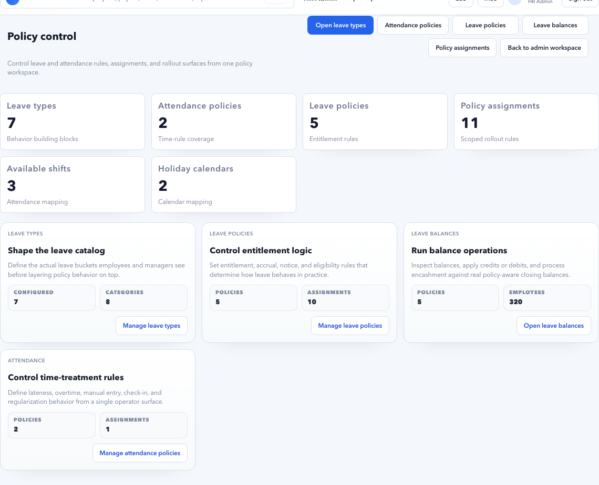

# Policies

Use **Policies** to configure the business rules that decide employee eligibility, balances, attendance behavior, approval needs, effective dates, and payroll impact.

Policies answer this question:

> For this employee, on this date, which rule should apply?

Workflows answer a different question:

> After an employee or HR user takes action, who must review, approve, reject, or escalate it?

Keep those two responsibilities separate. A policy should not hide approval confusion, and a workflow should not decide entitlement or eligibility.

## What Policies Owns

| Area | What it controls | Example |
| --- | --- | --- |
| Leave types | Available leave names and basic classification. | Earned Leave, Casual Leave, Sick Leave. |
| Leave policies | Entitlement, accrual, carry-forward, expiry, attachment, and approval requirement. | 18 days Earned Leave per year, accrued monthly. |
| Attendance policies | Grace, late/early rules, regularization windows, and exception behavior. | Missed punch allowed within 3 days. |
| Shifts and calendars | Expected working hours, weekly offs, and holidays. | Bengaluru general shift and India holiday calendar. |
| Assignments | Which policy applies to which employee group. | Full-time Bengaluru employees get India Staff Leave Policy. |
| Effective dating | When a rule starts and when an old rule stops applying. | New carry-forward cap from 01 Jan 2027. |
| Priority | Which policy wins when two rules could match. | Department-specific policy overrides company-wide policy. |

## Use This Page When

- A new leave type is required.
- Earned Leave, Casual Leave, Sick Leave, or special leave rules need setup.
- Attendance grace, regularization, shift, holiday, or exception rules need setup.
- A group of employees needs a policy assignment.
- A policy should change from a future date.
- Many employees have the same leave, attendance, or payroll blocker.
- Payroll readiness shows policy-related source issues.
- An employee sees `No active leave policy is assigned to this employee`.

## Policy Versus Workflow

| User question | Use Policies | Use Workflows |
| --- | --- | --- |
| Is the employee eligible? | Yes | No |
| How many days can the employee apply? | Yes | No |
| Is attachment required? | Yes | Maybe only for review notes |
| Who approves the request? | No, except approval required flag | Yes |
| What happens after manager does not act? | No | Yes |
| Which employee group gets this rule? | Yes | No |
| Which approver role owns the next step? | No | Yes |
| Does this apply from next month? | Yes | Sometimes workflow version also has effective date |

Example:

- Policy says Sick Leave needs a medical certificate after 2 days.
- Workflow says the reporting manager approves first, then HR reviews if the manager does not act in 2 days.

## Policy Setup Order

Use this sequence for a new tenant or a new policy area:

1. Confirm organization masters: legal entity, branch, location, department, employee type, grade.
2. Create leave types or attendance rule categories.
3. Create the policy.
4. Add effective date.
5. Add eligibility and restrictions.
6. Add accrual, carry-forward, expiry, or regularization rules.
7. Decide whether approval is required.
8. Assign policy to employee scope.
9. Test with one employee.
10. Review ESS, MSS, HR Admin, and Payroll Control behavior.
11. Roll out to broader employee groups.

Do not start with bulk employee corrections. If many employees are wrong, the policy assignment is usually wrong.

## Policy Areas

| Area | Purpose | Typical owner |
| --- | --- | --- |
| Leave types | Define available leave categories. | HR Admin |
| Leave policies | Define entitlement and request rules. | HR Admin |
| Leave assignments | Decide who receives each leave policy. | HR Admin |
| Attendance policies | Define attendance exceptions and correction rules. | HR Admin / Time Office |
| Shifts | Define expected working hours. | HR Admin / Time Office |
| Holiday calendars | Define holiday and weekly off context. | HR Admin |
| Policy versions | Future-dated or changed rules. | HR Admin |

## Field Guidance

| Field | Meaning | Example | Common mistake |
| --- | --- | --- | --- |
| Policy name | Business-friendly name. | `India Full-Time Earned Leave` | `Policy 1` |
| Policy code | Stable system code. | `IN_FT_EL_2026` | Reusing code for different rule. |
| Policy type | Leave, attendance, shift, holiday, or assignment area. | Leave policy | Wrong type selected. |
| Effective from | Date policy starts applying. | `01 Jan 2027` | Starting mid-payroll without review. |
| Effective to | Optional end date. | `31 Dec 2026` for old version. | Leaving overlapping active versions. |
| Scope | Employee group that gets the policy. | Legal entity + employee type. | Applying company-wide by mistake. |
| Priority | Which rule wins if multiple match. | Department override priority higher than company policy. | No priority for overlapping assignments. |
| Approval required | Whether request needs approval. | Yes for Earned Leave. | Turning off approval to bypass stuck workflow. |
| Attachment required | Whether proof is needed. | Medical certificate after 2 Sick Leave days. | Requiring proof for every small request. |
| Payroll impact | Whether policy can affect payroll. | LOP, unpaid leave, attendance penalty. | Not checking Payroll Control after change. |
| Active | Whether policy is available. | Active after testing. | Deleting instead of retiring. |

## Example: Company-Wide Earned Leave Policy

Business case: Accerio India gives full-time employees 18 Earned Leave days per year, accrued monthly, with manager approval.

1. Open **HR Admin > Policies**.
2. Open **Leave Policies**.
3. Create policy:

| Field | Value |
| --- | --- |
| Policy name | `India Full-Time Earned Leave` |
| Policy code | `IN_FT_EL_2026` |
| Leave type | `Earned Leave` |
| Effective from | `01 Jan 2026` |
| Entitlement | `18 days per year` |
| Accrual | Monthly |
| Carry-forward | Yes, cap `45 days` if tenant policy allows |
| Encashment | Tenant policy decision |
| Negative balance | No |
| Half-day | Allowed if policy allows |
| Attachment | Not required by default |
| Approval required | Yes |

4. Assign to:

| Scope field | Value |
| --- | --- |
| Legal entity | `Accerio India Pvt Ltd` |
| Employee type | `Full Time` |
| Status | Active |

5. Test with one full-time employee.
6. Open **ESS > Leave** as that employee and confirm Earned Leave appears.
7. Submit one request.
8. Confirm request routes to manager in MSS.
9. Confirm HR Admin Leave and Payroll Control show expected status.

Expected result:

- Employee can apply Earned Leave.
- Manager can approve.
- Leave balance reduces only after approved according to tenant rule.
- Payroll readiness does not show missing policy.

## Example: Sick Leave With Attachment Rule

Business case: Sick Leave is 6 days per year. Medical certificate is required when the employee applies for more than 2 continuous days.

| Field | Value |
| --- | --- |
| Policy name | `India Sick Leave Standard` |
| Leave type | `Sick Leave` |
| Entitlement | `6 days per year` |
| Accrual | Annual or monthly according to tenant policy |
| Attachment rule | Required when request exceeds `2 days` |
| Approval required | Yes |
| Negative balance | No |

Test cases:

| Test | Expected result |
| --- | --- |
| Employee applies 1 day Sick Leave | Attachment optional. |
| Employee applies 3 days Sick Leave without attachment | Request blocked or warning shown according to policy. |
| Employee applies 3 days Sick Leave with medical certificate | Request can proceed to approval. |

## Example: Department-Specific Leave Override

Business case: Company-wide Casual Leave is 12 days per year, but the Support department gets an additional special leave rule.

Recommended approach:

1. Keep the company-wide Casual Leave policy active.
2. Create a department-specific policy or assignment.
3. Scope it only to department `Support`.
4. Give it higher priority than the company-wide rule.
5. Test one Support employee and one non-Support employee.

Expected result:

- Support employee receives the department policy.
- Other employees continue with company-wide policy.
- Payroll and leave balances do not duplicate entitlement.

Do not create two active policies with the same scope and no priority. That creates unpredictable results.

## Example: Future-Dated Policy Change

Business case: From 01 Jan 2027, Earned Leave carry-forward cap changes from 45 to 30 days.

Correct approach:

1. Do not edit the 2026 policy directly if historical balances need to remain explainable.
2. Create a new policy version or new assignment effective `01 Jan 2027`.
3. End-date old policy on `31 Dec 2026` if the product supports it.
4. Test an employee for:
   - 31 Dec 2026.
   - 01 Jan 2027.
5. Confirm carry-forward behavior.
6. Communicate policy change before rollout.

Expected result:

- 2026 history remains auditable.
- 2027 requests use the new rule.
- Payroll close for December does not change unexpectedly.

## Example: Attendance Regularization Policy

Business case: Employees can submit missed punch regularization within 3 days. Manager approval is required.

1. Open **Attendance Policies**.
2. Create policy:

| Field | Value |
| --- | --- |
| Policy name | `India Staff Attendance Regularization` |
| Regularization window | `3 days` |
| Missed punch allowed | Yes |
| Late coming correction | Tenant policy decision |
| Attachment required | Optional |
| Approval required | Yes |
| Payroll impact | Yes |

3. Assign to India full-time employees.
4. Confirm shifts and holiday calendars are also assigned.
5. Test missed punch from ESS.
6. Confirm manager can approve from MSS.

Expected result:

- Employees can correct allowed attendance issues.
- Requests outside the allowed window are blocked or flagged.
- Payroll Control shows pending attendance only when action is still needed.

## Policy Priority

Priority matters when more than one policy could apply.

Recommended priority order:

| Priority | Scope | Example |
| --- | --- | --- |
| Highest | Employee-specific exception | One employee special leave arrangement. |
| High | Department or grade | Support department policy. |
| Medium | Branch/location | Mumbai branch holiday/attendance rule. |
| Low | Legal entity | Accerio India default rule. |
| Lowest | Company-wide default | Global fallback. |

Rules:

- Narrower scope should usually win.
- Avoid overlapping active assignments unless priority is explicit.
- Keep one clear default policy for each policy area.
- Document exceptions.

## Effective Dating Rules

Effective dates keep past, present, and future behavior understandable.

| Scenario | Recommended action |
| --- | --- |
| New policy for future joiners | Create assignment effective from joining policy date. |
| Mid-year entitlement change | Create future-dated version. |
| Mistake in current policy discovered before payroll close | Correct policy, then retest affected employees. |
| Mistake discovered after payroll lock | Use controlled correction, rerun, or adjustment flow. |
| Employee transfer changes policy | Use Lifecycle movement or assignment effective from transfer date. |

Do not silently change historical policy rules after payroll has used them.

## Conflict Handling

Policy conflict signs:

- Employee sees duplicate leave types.
- Employee cannot apply leave even though a policy exists.
- Balance is calculated twice.
- Attendance exception appears for a holiday.
- Payroll Control shows policy missing for many employees.

Conflict resolution:

1. Pick one affected employee.
2. Check employee legal entity, branch, location, department, grade, employee type, and status.
3. List all active policy assignments that could match.
4. Check effective dates.
5. Check priority.
6. Keep the intended assignment.
7. End-date, deactivate, or lower priority for the wrong assignment.
8. Retest the same employee.

## Rollout Checklist

Before rollout:

| Check | Expected result |
| --- | --- |
| Scope | Only intended employees match. |
| Effective date | Date is correct and not accidentally historical. |
| Priority | Overlapping rules have clear winner. |
| Approval route | Workflow resolves manager or HR owner. |
| ESS behavior | Employee sees expected option. |
| MSS behavior | Manager sees approval if required. |
| Payroll Control | No unexpected readiness blockers. |
| Audit | Policy change reason is documented. |

## Negative Scenario: No Active Leave Policy Assigned

Employee sees:

`No active leave policy is assigned to this employee for the selected leave type.`

Fix:

1. Open employee profile.
2. Confirm legal entity, branch, department, employee type, grade, and status.
3. Open **Policies > Leave Policy Assignments**.
4. Confirm a matching assignment exists.
5. Confirm assignment is active.
6. Confirm selected leave date is inside effective date range.
7. Confirm no conflicting higher-priority assignment excludes the employee.
8. Retest from ESS.

Do not manually add leave balance until the policy assignment resolves correctly.

## Negative Scenario: Manager Cannot Approve

Likely causes:

| Cause | Fix |
| --- | --- |
| Employee has no manager | Fix Employee Master manager. |
| Manager lacks MSS access | Assign MSS role/access. |
| Workflow route is inactive | Activate correct workflow template. |
| Policy requires approval but workflow cannot resolve owner | Configure manager-first and HR fallback route. |

Use [Workflows](workflows.md) for approval route setup.

## Negative Scenario: Policy Change Breaks Payroll

Example: HR changes attendance grace rule during payroll close and new late penalties appear.

Fix:

1. Identify exact policy change and timestamp from audit.
2. Confirm payroll period status.
3. Decide whether change should affect current payroll or future payroll only.
4. If future only, restore current rule and create future-dated version.
5. Recheck attendance exceptions.
6. Recheck Payroll Control before locking inputs.

## Buttons And Actions

| Action | What it does | Use carefully when |
| --- | --- | --- |
| Create policy | Starts a new rule. | Scope and effective date must be known. |
| Save | Saves policy changes. | Changes may affect many employees. |
| Assign | Applies policy to employees or groups. | Avoid broad scope by accident. |
| Preview / test | Checks how policy resolves for sample employee. | Always use before rollout if available. |
| Activate | Makes policy usable. | Confirm workflow and payroll impact first. |
| Deactivate / retire | Stops future use. | Do not remove historical evidence. |
| New version | Creates changed rule from date. | Preferred for future changes. |

## Before Marking Policy Work Complete

| Check | Expected result |
| --- | --- |
| Leave types | Clear names and codes. |
| Leave policies | Entitlement, accrual, carry-forward, expiry, attachment, and approval rules configured. |
| Attendance policies | Regularization, grace, and exception rules configured. |
| Shifts/calendars | Shift and holiday context assigned. |
| Assignments | Correct employees receive policies. |
| Priority | Overlaps intentionally resolved. |
| Effective dates | Current and future behavior clear. |
| Workflow link | Approver route works for request types that need approval. |
| ESS test | Employee can use intended policy. |
| MSS test | Manager can approve if required. |
| Payroll test | Payroll Control shows expected readiness. |

## Troubleshooting

| Problem | Likely reason | Fix |
| --- | --- | --- |
| Leave type missing in ESS | No active policy assignment or leave type inactive. | Activate and assign policy. |
| Wrong leave balance | Accrual, opening balance, carry-forward, or duplicate assignment issue. | Fix policy and balance source. |
| Request stuck pending | Workflow approver missing or manager lacks access. | Fix workflow or manager access. |
| Attendance exception on holiday | Holiday calendar or shift assignment wrong. | Fix calendar/shift effective date. |
| Many employees have same blocker | Assignment scope wrong. | Fix policy assignment, not individual employees. |
| Policy applies to wrong employee | Scope too broad or priority wrong. | Narrow scope or change priority. |
| Current payroll changed unexpectedly | Policy edited without future date. | Restore or correct through payroll process. |

## FAQ

### Should policies be changed during payroll close?

Avoid policy changes during payroll close unless they fix a blocker. If changed, recheck leave, attendance, and Payroll Control before locking inputs.

### Why do repeated manual leave corrections happen?

Usually because accrual, expiry, carry-forward, opening balance, or assignment rules are wrong. Fix the policy source instead of repeating manual corrections.

### Can different employee groups have different policies?

Yes. Use assignments by legal entity, branch, department, employee type, grade, or other supported grouping. Make priority explicit if policies overlap.

### What should I test after changing a policy?

Test at least one employee who should receive the policy and one employee who should not. Then check ESS, MSS, HR Admin, and Payroll Control.

### Should I edit an existing policy or create a new version?

Create a new version when the change is business-effective from a new date. Edit only when correcting a setup mistake and after checking payroll/audit impact.

## Related Guides

- [Workflows](workflows.md)
- [Leave Management](leave.md)
- [Attendance](attendance.md)
- [Employees](employees.md)
- [Organization](organization.md)
- [Leave and Attendance to Payroll](../workflows/leave-attendance-to-payroll.md)
- [Payroll Control](payroll/payroll-control.md)
