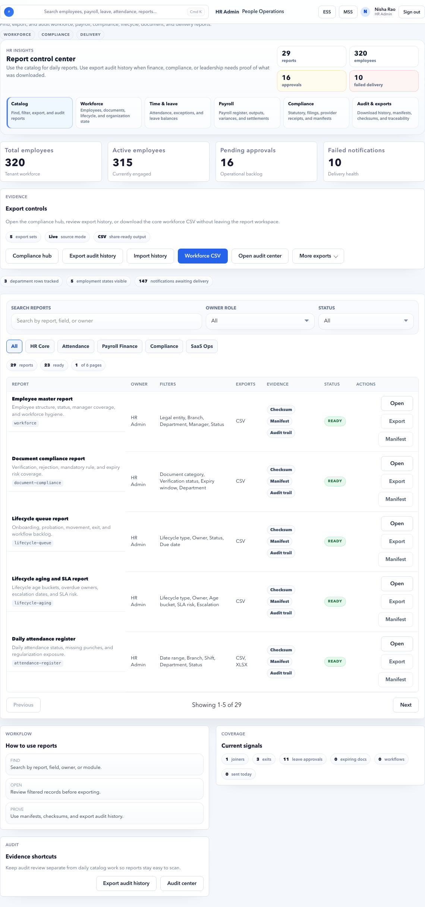

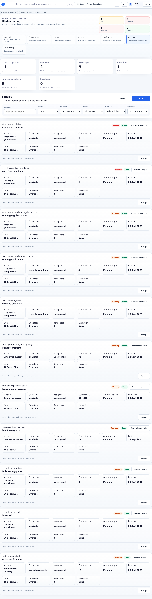

# HR Admin Reports and Audit

Reports and audit pages help HR, payroll, and compliance teams prove what happened and export operational evidence.

## On This Page

- [Reports And Audit Quick Navigation](#reports-and-audit-quick-navigation)
- [Purpose](#purpose)
- [Use these pages when](#use-these-pages-when)
- [Reports](#reports)
- [Which report should I use?](#which-report-should-i-use)
- [Report drilldown pattern](#report-drilldown-pattern)
- [Evidence quality checklist](#evidence-quality-checklist)
- [Pre-Payroll Evidence Pack](#pre-payroll-evidence-pack)
- [Payroll Close Evidence Pack](#payroll-close-evidence-pack)
- [Audit](#audit)
- [Audit investigation pattern](#audit-investigation-pattern)
- [Reports vs Audit](#reports-vs-audit)
- [Launch readiness](#launch-readiness)
- [FAQ](#faq)

## Reports And Audit Quick Navigation

| I need to... | Start here | Then check |
| --- | --- | --- |
| Choose the right report | [Which report should I use?](#which-report-should-i-use) | [Reports](#reports) |
| Run and export a report safely | [Report drilldown pattern](#report-drilldown-pattern) | [Evidence quality checklist](#evidence-quality-checklist) |
| Prepare payroll evidence before inputs | [Pre-Payroll Evidence Pack](#pre-payroll-evidence-pack) | [Example: Workforce Readiness Before Payroll](#example-workforce-readiness-before-payroll) |
| Prepare payroll close evidence | [Payroll Close Evidence Pack](#payroll-close-evidence-pack) | [Example: Export Payroll Register After Close](#example-export-payroll-register-after-close) |
| Attach evidence to signoff | [Example: Attach Audit Evidence To Payroll Signoff](#example-attach-audit-evidence-to-payroll-signoff) | [Evidence quality checklist](#evidence-quality-checklist) |
| Investigate who changed a record | [Audit investigation pattern](#audit-investigation-pattern) | [Example: Investigate Who Changed an Employee Record](#example-investigate-who-changed-an-employee-record) |
| Fix report total mismatch | [Negative Scenario: Report Total Differs From Source Page](#negative-scenario-report-total-differs-from-source-page) | [Reports vs Audit](#reports-vs-audit) |
| Prepare launch evidence | [Launch readiness](#launch-readiness) | [Common blockers](#common-blockers) |

## Purpose

Use Reports and Audit to inspect operational information, export evidence, and answer who changed what, when, and why.

## Use these pages when

- HR or finance needs payroll, employee, attendance, leave, or statutory reports.
- A compliance reviewer asks for evidence.
- A sensitive record changed and must be investigated.
- Payroll approval needs supporting reports.
- Launch readiness requires evidence.

## Reports

Use Reports to inspect workforce, payroll, attendance, leave, statutory, and compliance information.

### Common report groups

| Group | Examples |
| --- | --- |
| Workforce | Employee master, lifecycle aging, manager mapping. |
| Time and leave | Attendance register, attendance exceptions, leave balance. |
| Payroll | Payroll register, salary variance, bank advice, payslip publication. |
| Compliance | PF, ESIC, professional tax, LWF, TDS, statutory deductions. |
| Operations | Export audit, provider receipts, finance handoff exceptions. |

## Which report should I use?

| Question | Start with |
| --- | --- |
| Who is active, inactive, on notice, or missing structure? | Workforce reports. |
| Which attendance records or exceptions affect payroll? | Attendance register or attendance exceptions. |
| What are current leave balances? | Leave balance report. |
| What changed in payroll totals? | Payroll register, salary variance, payroll review exceptions. |
| Which employees are missing bank/statutory readiness? | Payroll close readiness or payroll input exceptions. |
| What can finance pay? | Bank advice and finance handoff reports. |
| Are statutory filings ready? | PF, ESIC, PT, LWF, TDS, statutory filing reports. |
| Who downloaded or exported evidence? | Export audits and Audit page. |

### Report controls

| Control | Meaning |
| --- | --- |
| Report group | Workforce, payroll, attendance, leave, compliance, or operations. |
| Period | Date range or payroll period. |
| Filters | Employee, department, legal entity, branch, status, or report-specific filters. |
| Run report | Generates report preview. |
| Export | Downloads the report when allowed. |
| Download audit | Downloads evidence or export trail. |

## Report drilldown pattern

Most report pages follow the same pattern:

1. Select the report or open the report route from the catalog.
2. Choose period, legal entity, branch, department, or payroll run.
3. Apply filters.
4. Review the preview counts.
5. Open row details if a value looks wrong.
6. Export only when the report is final or evidence is required.
7. Store exported files in approved secure locations.

Do not use old exports as current evidence. Re-run the report for the correct period before approval, payroll close, or audit submission.

## Evidence quality checklist

| Check | Expected result |
| --- | --- |
| Period | Matches the payroll, compliance, or review period. |
| Scope | Legal entity, branch, department, and employee filters are correct. |
| Totals | Match the approved payroll or source page. |
| Export owner | Exported by an authorized user. |
| Timestamp | Evidence is recent enough for the decision. |
| Sensitive data | Stored only in approved locations. |
| Exception notes | Any unresolved issue has owner and explanation. |

### Good practice

Run reports before payroll approval and after payroll publication. Keep exported reports only in approved secure locations.

## Pre-Payroll Evidence Pack

Before payroll setup or payroll input lock, HR should be able to prove that employee and time data is ready.

| Evidence | Why it matters |
| --- | --- |
| Active employee list | Confirms who should be considered for payroll scope. |
| Organization readiness | Confirms legal entity, branch, department, cost center, designation, and employee type are mapped. |
| Manager mapping | Confirms approvals and MSS routing can work. |
| Bank and statutory coverage | Confirms payroll blockers are known before payroll calculation. |
| Leave balances | Confirms opening balances, accruals, and pending leave are visible. |
| Attendance exceptions | Confirms missed punch, late coming, absence, and regularization issues are known. |
| Documents pending or rejected | Confirms PAN, bank proof, identity proof, or other required documents are tracked. |
| Launch blocker list | Confirms unresolved launch risks are assigned or accepted. |
| Audit export trail | Confirms sensitive exports or changes can be traced. |

This pack is not a separate button. It is a working checklist for HR Admin to collect evidence from Reports, Audit, Launch Readiness, Employees, Leave, Attendance, and Documents.

## Payroll Close Evidence Pack

After payroll review is approved, HR and payroll should be able to prove exactly which run was closed, what was exported, who approved it, and what was handed to finance.

| Evidence | Why it matters |
| --- | --- |
| Payroll register | Confirms employee-wise gross, deductions, and net pay for the final run. |
| Bank advice | Confirms payable amount, beneficiary count, and payment-ready account details. |
| Payslip publication report | Confirms which employees can see payslips in ESS. |
| Statutory reports | Confirms PF, ESIC, PT, LWF, TDS, and other statutory outputs for the period. |
| Payroll review approval | Confirms final approval and accepted exceptions. |
| Output artifact manifest | Confirms files were generated from the intended payroll run. |
| Finance handoff receipt | Confirms finance received or accepted the final files. |
| Audit export trail | Confirms who exported sensitive payroll data and when. |

Use this pack only after the payroll run is final or explicitly marked for controlled review. Do not send draft exports as final finance evidence.

## Example: Workforce Readiness Before Payroll

### Scenario

Before September payroll, HR wants to confirm all active Bengaluru employees have legal entity, branch, department, manager, bank, and ESS access.

### Steps

1. Open **HR Admin > Reports**.
2. Select a workforce or employee master report.
3. Set period or as-of date to the payroll period.
4. Filter legal entity and branch if required.
5. Review employee count and missing-field columns.
6. Open Employee Master for records with missing values.
7. Export only after the source issues are corrected or accepted.

### Expected result

- Active employee count matches Employee Master.
- Missing structure, access, manager, bank, and statutory issues are visible.
- HR knows which records must be fixed before payroll opens.

## Example: Leave and Attendance Evidence Before Payroll

### Scenario

Payroll is about to open input lock. HR needs to confirm there are no unreviewed leave or attendance items that can change payable days.

### Steps

1. Open **HR Admin > Reports**.
2. Run leave balance or leave request report for the payroll period.
3. Run attendance exception or attendance register report for the same period.
4. Compare pending leave and attendance exceptions with HR Admin Leave and Attendance pages.
5. Send unresolved items to managers or HR owners.
6. Keep the final report evidence after pending items are cleared or explicitly accepted.

### Expected result

- Payroll blockers are known before input lock.
- Pending approvals do not silently affect payroll.
- Finance can trust the final payroll run.

## Example: Export Payroll Register After Close

### Scenario

September payroll is reviewed and approved. Finance asks HR/payroll for the final payroll register and bank advice evidence.

### Steps

1. Open **HR Admin > Reports**.
2. Select the payroll report group.
3. Choose **Payroll Register**.
4. Select the exact payroll run, for example `Accerio September 2026`.
5. Confirm run status is approved, locked, or closed according to tenant process.
6. Compare employee count, gross earnings, deductions, and net pay with **Payroll Review** or **Payroll Outputs**.
7. Export the register only after the totals match the approved run.
8. Open **Audit** and confirm the export event is recorded with actor and timestamp.
9. Store the export in the approved finance evidence location.

### Expected result

- The exported payroll register belongs to the final approved run.
- Totals match Payroll Outputs and Finance Handoff.
- Audit shows who exported the sensitive payroll file.

## Example: Attach Audit Evidence To Payroll Signoff

### Scenario

An auditor asks why one employee's net pay changed and who approved the exception before finance handoff.

### Steps

1. Open **Payroll Review** and find the exception or decision note.
2. Open **Reports** and export the payroll register or exception report for the same run.
3. Open **Audit**.
4. Filter module to payroll or employee, depending on the change.
5. Search by employee code, payroll run, or entity reference.
6. Capture the actor, timestamp, action, old value, new value, and approval reference.
7. Link or store the evidence with the payroll signoff note.
8. Open **Payroll Handoff** and confirm finance receipt or provider delivery evidence exists.

### Expected result

- The business decision and system event are both traceable.
- Finance can see the final approved file.
- Audit can see who changed, approved, exported, and handed off the run.

## Negative Scenario: Draft Payroll Register Sent To Finance

### Symptom

Finance receives a payroll register before final review is approved, then net pay changes after an exception is corrected.

### Risk

Finance may pay the wrong amount or reconcile against an outdated register.

### Correct action

Mark the draft export as superseded, regenerate the register after final approval, confirm audit export history, and send finance only the final approved artifact.

## Negative Scenario: Export Exists But Audit Evidence Is Missing

### Symptom

The payroll register file exists in a shared folder, but HR cannot prove who exported it or which run generated it.

### Risk

The file cannot be trusted for payroll close, customer audit, or finance handoff.

### Correct action

Re-export from the application using an authorized user, confirm the audit event appears, and attach the new export to the signoff pack. Do not rely on orphaned files for final approval.

## Example: Investigate Who Changed an Employee Record

### Scenario

An employee's branch changed before payroll and salary allocation looks different.

### Steps

1. Open **HR Admin > Audit**.
2. Filter module to employee or lifecycle.
3. Search by employee name, employee code, or entity reference.
4. Use a narrow date range around the suspected change.
5. Review actor, timestamp, old value, new value, and workflow reference.
6. Open Lifecycle if the change should have been a movement.
7. Correct the source record if the change was wrong.

### Expected result

- HR knows who changed the record.
- The business reason is traceable.
- Incorrect source data is corrected before payroll.

## Negative Scenario: Report Total Differs From Source Page

### Symptom

The report says 298 active employees, but Employee Master shows 306.

### Common reasons

- Different period or as-of date.
- Different legal entity, branch, or department filter.
- Report excludes employees without payroll scope.
- Source page includes draft, inactive, on-notice, or recently exited records.
- Data changed after the report was exported.

### Correct action

Re-run the report with the same period and filters, compare with source page filters, and avoid using stale exports for signoff.

## Negative Scenario: Wrong Period Exported

### Symptom

Finance receives a report for August while September payroll is being reviewed.

### Risk

Finance may approve wrong totals or chase the wrong exceptions.

### Correct action

Re-run the report for the correct period, delete or mark the wrong export as superseded, and use Audit to confirm who exported both files.

## Audit

Use Audit to review system evidence for sensitive actions.

### What audit helps answer

- Who changed a record?
- What changed?
- When did it change?
- Was approval required?
- Which workflow generated the event?

### Audit filters

| Filter | Meaning |
| --- | --- |
| Actor | User who performed the action. |
| Module | Employee, payroll, document, leave, notification, or other area. |
| Action | Create, update, delete, approve, reject, publish, export. |
| Date range | Time window to inspect. |
| Entity | Record affected by the action. |

### Audit review checklist

- Confirm actor identity.
- Confirm action timestamp.
- Confirm old and new values where available.
- Confirm approval workflow if required.
- Confirm export/download events for sensitive files.

## Audit investigation pattern

1. Start with the user question: actor, record, period, or module.
2. Use the narrowest date range possible.
3. Search by entity reference when available.
4. Compare old and new values.
5. Check whether workflow approval was required.
6. If a file was exported, confirm actor and timestamp.
7. Record the evidence location or export only if policy allows.

Audit logs explain what happened. They do not fix source data. Correct the owning record after the investigation if the data is wrong.

## Reports vs Audit

| Need | Use |
| --- | --- |
| Current operational totals | Reports |
| Employee/payroll/compliance list | Reports |
| Exportable business evidence | Reports |
| Who changed something | Audit |
| Who approved or rejected something | Audit |
| Who downloaded sensitive output | Audit |
| Launch/payroll signoff packet | Reports plus Audit |

## Launch readiness

Use Launch Readiness to resolve blockers before production use.

### Common blockers

- Missing HR roles.
- Missing manager role.
- Incomplete organization masters.
- Employee master warnings.
- Notification delivery failures.
- Payroll live rails not ready.

### Launch workflow

1. Open Launch Readiness or Launch Remediation.
2. Review blockers before warnings.
3. Open the action button for the blocker.
4. Fix the source issue.
5. Return to Launch Readiness.
6. Confirm gate count improved.
7. Download or keep evidence when signoff is required.

## FAQ

### Should I export every report?

No. Export only when evidence is needed for approval, finance, compliance, or audit. Use on-screen review for routine checks.

### Why do report totals differ from payroll outputs?

Check period, payroll run, filters, locked input status, and whether the report is using source data or approved payroll output.

### Can audit logs replace approval notes?

No. Audit logs show events. Approval notes explain business rationale. Use both when a reviewer asks why something was accepted.

### What should I send to finance?

Use approved payroll outputs, bank advice, finance handoff evidence, and only the reports finance requested for the final run.
