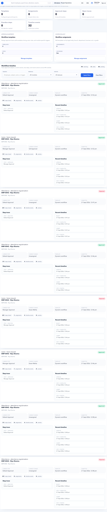

# Workflows

Workflows manages approval templates, routing, owners, and governance for HR processes.

## Purpose

Use Workflows to define who reviews and approves actions such as leave, attendance, movement, document rejection, payroll review, or support access.

## Use this page when

- A process needs approval routing.
- An approver role changes.
- A workflow template needs activation or retirement.
- A launch blocker says workflow templates are missing.
- A process is stuck because owner or approver is unclear.

## Workflow concepts

| Concept | Meaning |
| --- | --- |
| Template | Reusable approval design. |
| Step | One stage in the workflow. |
| Owner | Person or role responsible for action. |
| Approver | Person or role who approves or rejects. |
| Escalation | What happens when a task is overdue. |
| Active version | Workflow version currently used. |

## Good practice

- Keep workflow names short and business-friendly.
- Use roles where possible instead of individual users.
- Test the workflow with a low-risk process before broad rollout.
- Review overdue and escalation behavior before activation.
