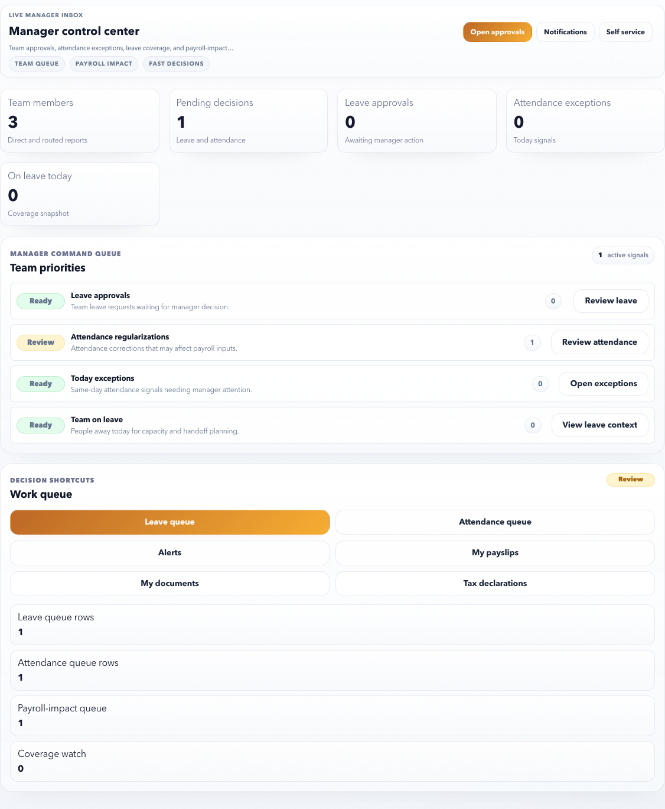

# Manager Self Service

Manager Self Service is the manager workspace for team approvals, team alerts, and manager-specific notification review.

## What Managers Can Do

| Area | Purpose | Best next action |
| --- | --- | --- |
| Control Center | See team action queues and pending decisions. | Start here to decide what needs review first. |
| Approvals | Review leave and attendance regularization requests. | Open when a team member is waiting for approval. |
| Notifications | Review manager-facing alerts and source workflow messages. | Use when a notification mentions team action or approval risk. |
| Self Service | Open your own employee workspace. | Use for your own payslips, documents, leave, and notifications. |

## How To Use The Control Center

The control center is designed for a manager’s daily check-in.

- Review the top priority cards first.
- Open approval queues for leave and attendance decisions.
- Check team notifications when delivery or workflow alerts appear.
- Use quick links to move to ESS if you need your own employee data.

## Manager Checklist

Daily:

- Review pending leave approvals.
- Review attendance regularization requests.
- Check whether any team notification requires action.
- Avoid approving requests without checking date, reason, and team coverage.

Before payroll cutoff:

- Clear old attendance regularizations.
- Confirm leave approvals are not pending for the payroll period.
- Escalate unclear or disputed requests to HR.

## Manager decision principles

| Principle | Meaning |
| --- | --- |
| Review context before action | Check employee, date, request type, reason, and team coverage before deciding. |
| Add useful comments | Rejection or clarification comments should tell the employee what to fix. |
| Clear payroll-period items first | Old attendance and leave requests can affect payroll accuracy. |
| Escalate policy uncertainty | Managers should not guess when leave, attendance, or payroll policy is unclear. |
| Use ESS for personal work | Use MSS for team actions and ESS for your own employee tasks. |

## What managers should not do

- Approve requests only from memory without checking dates.
- Reject without an actionable reason.
- Leave payroll-period requests pending past cutoff.
- Use manager notifications as a replacement for approval review.
- Approve a request that conflicts with policy without HR confirmation.

## Related Pages

- [Approvals](approvals.md)
- [Notifications](notifications.md)
- [MSS Task Recipes](task-recipes.md)
