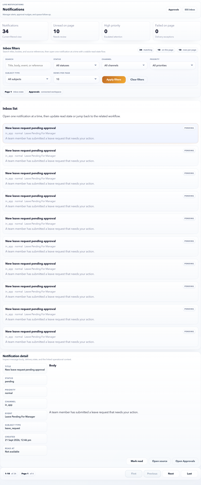

# Notifications

Use Manager Notifications to review manager-facing alerts, delivery status, and linked team workflow events.

## Page Purpose

The manager notification inbox keeps team-related alerts separate from personal employee notifications.

## Main Sections

| Section | What it shows | How to use it |
| --- | --- | --- |
| Notification list | Messages sent to the manager role. | Filter unread, failed, or important messages. |
| Notification detail | Message body, status, delivery channel, source context, and timeline. | Read and open the related workflow. |
| Status chips | Priority, read state, failed state, and retry information. | Triage urgent or failed delivery items first. |

## Controls

| Control | Purpose |
| --- | --- |
| Review | Open the selected notification detail. |
| Mark read | Clear unread state after review. |
| Source link | Open the related approval or workflow. |
| Status filter | Narrow the queue by delivery or read status. |

## Manager notification priorities

| Priority | Example | Action |
| --- | --- | --- |
| High | Payroll-period approval risk or failed urgent delivery. | Open immediately and complete the source workflow. |
| Normal action | Leave or attendance request waiting for decision. | Review during daily manager check-in. |
| Informational | Team status or system update. | Read when convenient. |
| Failed / retry capped | Delivery failed but in-app record exists. | Review in-app and tell HR if external delivery is needed. |

## Source workflow guidance

Use the source link whenever available. The notification tells you something happened; the source workflow is where the decision or correction should happen.

Examples:

- Leave approval notification: open **Approvals** and decide there.
- Attendance exception notification: open the linked regularization request.
- Failed delivery notice: open detail, confirm whether action is still required, then escalate if needed.

## Good Practice

- Open failed or retry-capped notifications first.
- Use the linked workflow instead of acting only from the notification text.
- Clear unread messages after decisions are complete.

## FAQ

### Should I approve from a notification alone?

No. Open the linked approval or workflow so you can review the full request context before deciding.

### What if the notification is old?

Open the source workflow and check current status. If the request is already approved, rejected, or cancelled, no further action may be needed.
