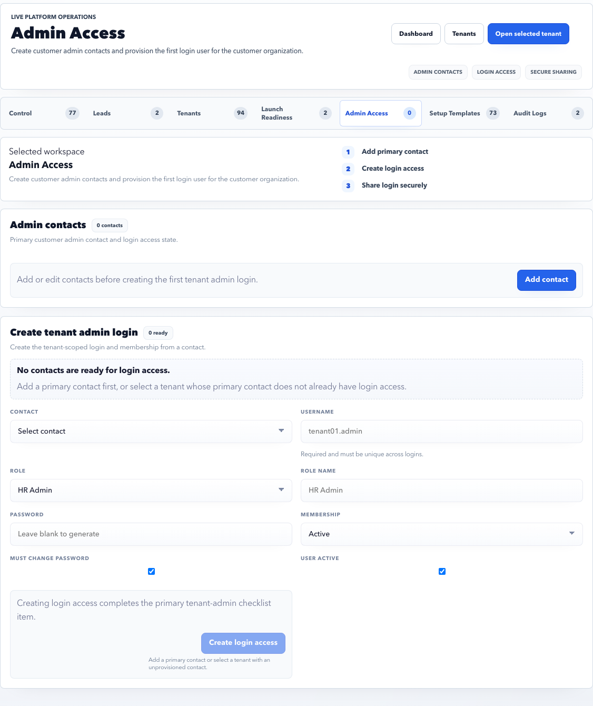

# Admin Access

Admin Access manages customer admin contacts and first login provisioning.

## Purpose

Use Admin Access to create the primary tenant admin contact and provision customer login access.

## Use this page when

- A tenant needs its first admin user.
- A primary admin contact is missing or incorrect.
- Login access must be created for a tenant admin.
- Admin contact evidence needs review.

## Page sections

| Section | Meaning |
| --- | --- |
| Admin contact list | Customer admin contacts, primary flag, email, title, and access state. |
| Add contact | Creates customer admin contact details. |
| Edit contact | Corrects contact metadata before or after provisioning. |
| Provision login access | Creates membership/login access for the selected contact. |
| Generated credential notice | Shows generated password once after provisioning. |

## Provisioning checklist

Before provisioning login access, confirm:

- Tenant record is the correct tenant.
- Contact email is spelled correctly.
- Contact is authorized to administer the customer account.
- Contact title or responsibility is captured.
- Primary admin is marked correctly.
- Credential handoff channel is secure and agreed.

After provisioning, confirm:

- Access state shows active or provisioned.
- The customer admin can sign in.
- The user lands in the expected tenant/admin workspace.
- Audit evidence is visible for the provisioning action.

## Good practice

- Confirm email spelling before provisioning.
- Use one primary admin for launch unless customer process requires more.
- Share generated credentials only through approved secure channels.
- Prefer reset flows after first login.

## FAQ

### Can I provision multiple tenant admins?

Yes, if the customer needs more than one account owner. Keep at least one clear primary admin for accountability.

### What should I do if the generated password was not copied?

Use the password reset flow or regenerate through an approved access process. Do not expose or store credentials in notes.
