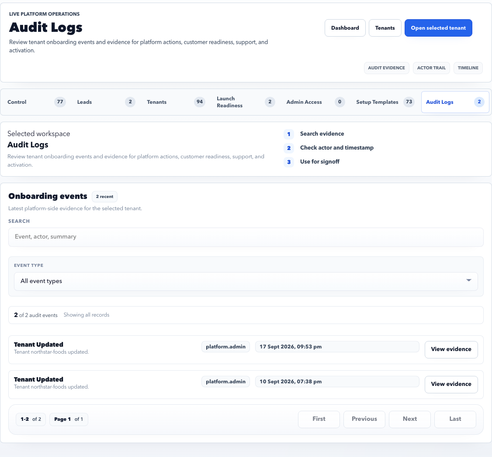

# Platform Audit Logs

Audit Logs provides evidence for platform onboarding and operator actions.

## Purpose

Use Audit Logs to review who changed what, when it happened, and which tenant or setup item was affected.

## Use this page when

- A lead conversion needs evidence.
- A tenant setup or activation action needs review.
- Support asks who changed a platform record.
- You need evidence for launch signoff.

## Page sections

| Section | Meaning |
| --- | --- |
| Event filters | Search by event text, actor, tenant, event type, or payload. |
| Event list | Recent platform onboarding events for the selected tenant. |
| Evidence detail | Redacted event payload and action context. |
| Pagination | Moves through event pages. |

## Common event groups

| Event group | Examples |
| --- | --- |
| Lead | Status changes, conversion, closure. |
| Tenant | Tenant creation, status change, activation. |
| Admin access | Contact creation, login provisioning. |
| Setup template | Publish, adoption preview, apply, upgrade. |
| Launch | Baseline confirmation, handoff, activation. |

## Investigation workflow

1. Filter by tenant or actor.
2. Narrow by event group.
3. Confirm timestamp and actor.
4. Open the evidence detail.
5. Compare the payload with the page state.
6. Record only the minimum evidence needed for the support or launch decision.

## Evidence review checklist

- Actor is the expected operator or system user.
- Timestamp matches the reported incident or launch step.
- Tenant code matches the intended customer.
- Event group and action match the business decision.
- Payload does not expose sensitive details before sharing.

## Good practice

- Use filters before reviewing evidence.
- Confirm actor and timestamp before making conclusions.
- Do not copy sensitive payload details outside approved channels.

## FAQ

### Can audit logs be edited?

No. Audit logs should be treated as evidence. If a correction is needed, perform the corrected action and keep both events visible.

### What should I share externally?

Share only approved summaries or exports. Avoid raw payload details unless policy allows it.
