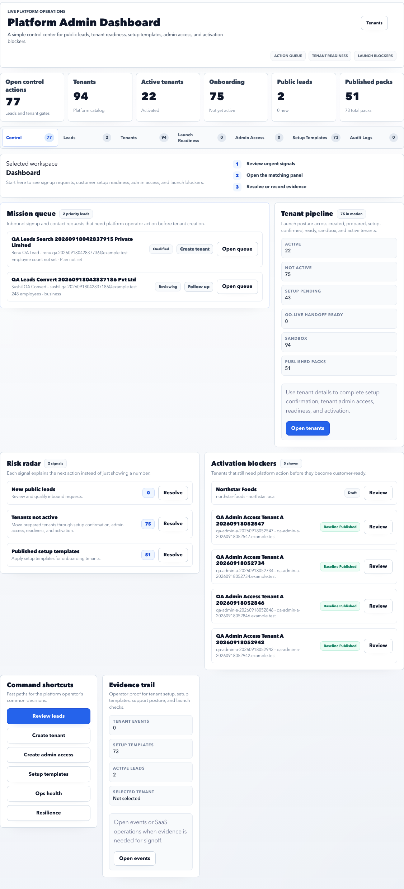

# Platform Admin

Platform Admin is used by the Accerio operations team to bring a customer from lead to live tenant.

## Main purpose

Use Platform Admin to:

- Review signup leads.
- Convert approved leads into tenants.
- Create tenant admin login access.
- Apply setup templates.
- Track launch readiness.
- Review platform-level audit logs.

## Menu guide

| Menu | Purpose | Common actions |
| --- | --- | --- |
| Dashboard | Control center for open platform actions. | Review urgent signals, open leads, resolve launch blockers. |
| Leads | Signup request queue. | Review lead details, qualify, reject, convert to tenant. |
| Tenants | Customer registry. | Inspect tenant status, domains, setup state, readiness. |
| Launch Readiness | Go-live gate tracker. | Review blockers, evidence, and tenant activation readiness. |
| Admin Access | Tenant admin contact and login setup. | Create first admin access, confirm active login. |
| Setup Templates | Platform-owned baseline templates. | Publish templates, version setup packs, apply templates to tenants. |
| Permissions | RBAC catalog. | Review platform permission definitions and default role coverage. |
| Audit Logs | Operator action evidence. | Verify who changed what and when. |

## Detailed guides

| Guide | Use it for |
| --- | --- |
| Task Recipes | Step-by-step platform operator workflows. |
| Dashboard | Control-center triage across leads, tenants, setup, and launch. |
| Leads | Public signup review and tenant conversion. |
| Tenants | Customer registry, tenant selection, and new tenant creation. |
| Launch Readiness | Go-live gate review, blockers, handoff, and activation. |
| Admin Access | Primary customer admin contact and login provisioning. |
| Setup Templates | Baseline setup packs, publishing, adoption, and upgrades. |
| Permissions | Platform permission catalog and RBAC risk review. |
| Audit Logs | Platform action evidence and timeline review. |

## Typical onboarding workflow

1. Open **Leads**.
2. Review the signup request.
3. Mark the lead as qualified when commercial approval is complete.
4. Convert the lead to a tenant.
5. Open **Admin Access** and create the primary tenant admin login.
6. Open **Setup Templates** and apply a baseline setup template.
7. Open **Launch Readiness** and close blockers.
8. Activate the tenant only when readiness checks are clear.

## Operator decision rules

| Decision | Use this rule |
| --- | --- |
| Convert a lead | Convert only after commercial approval, duplicate check, and domain/code confirmation. |
| Create a tenant manually | Use only for approved accounts that did not originate from public signup. |
| Provision admin access | Provision after the tenant record is correct and the primary admin email is confirmed. |
| Apply setup template | Apply a published template that matches customer size, country, and launch scope. |
| Complete handoff | Complete only after customer admin login, setup evidence, and launch blockers are clear. |
| Activate tenant | Activate only when launch readiness shows no blocking gaps. |

## Evidence to keep

| Stage | Evidence |
| --- | --- |
| Lead qualification | Commercial approval, customer contact, domain, plan, and conversion notes. |
| Tenant creation | Tenant code, domain, plan, sandbox/live decision, and creator. |
| Admin access | Primary admin email, access state, and credential handoff channel. |
| Template adoption | Template name, version, adoption result, and any skipped items. |
| Launch signoff | Completed gates, blocker resolution notes, handoff owner, and activation timestamp. |

## Important checks

- Do not convert test leads into production tenants.
- Confirm the tenant code and primary domain before conversion.
- Confirm first admin login is active before go-live.
- Keep launch blockers documented with evidence.
