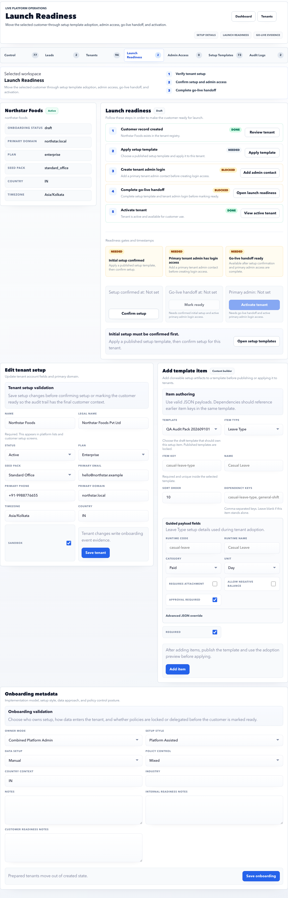

# Launch Readiness

Launch Readiness controls the final gate before a tenant becomes production-ready.

## Purpose

Use Launch Readiness to confirm setup, admin access, handoff, blockers, and activation readiness.

## Use this page when

- A tenant is close to go-live.
- A launch blocker needs review.
- Setup or admin access evidence is missing.
- You need to complete handoff or activate a tenant.

## Page sections

| Section | Meaning |
| --- | --- |
| Tenant setup details | Tenant status, plan, domain, setup choices, and readiness fields. |
| Guided checklist | Customer record, setup template, admin login, handoff, and activation gates. |
| Gate controls | Confirm baseline setup, complete handoff, and activate when allowed. |
| Blocker notes | Reasons a gate cannot be completed. |
| Audit evidence | Recent onboarding and launch events for the selected tenant. |

## Launch gates

| Gate | Required evidence |
| --- | --- |
| Customer record created | Tenant exists with correct code and domain. |
| Setup template applied | Baseline setup has been adopted or confirmed. |
| Tenant admin login created | Primary customer admin has usable login access. |
| Go-live handoff complete | Operator confirms handoff is ready. |
| Tenant activated | Activation happens only after previous gates are clear. |

## Gate review order

1. Confirm customer record and tenant code.
2. Confirm setup template adoption or documented manual setup.
3. Confirm tenant admin login works.
4. Review open launch blockers.
5. Complete go-live handoff.
6. Activate tenant only after the prior gates are complete.

## Do not activate if

- Primary admin login is missing or untested.
- Tenant domain or code is still temporary for a production account.
- Setup template adoption failed or was not reviewed.
- Launch blockers are open without an approved exception.
- Handoff owner is unclear.

## Good practice

- Do not activate a tenant only because the record exists.
- Confirm customer admin login before handoff.
- Use audit evidence for all launch-signoff decisions.

## FAQ

### What does go-live handoff mean?

It means the platform operator has confirmed the tenant is ready for the customer/HR team to own daily operations, including access, setup evidence, and launch blockers.

### Can a tenant be activated with warnings?

Only if the warnings are documented, assigned, and accepted by the launch owner. Blockers should be cleared before activation.
