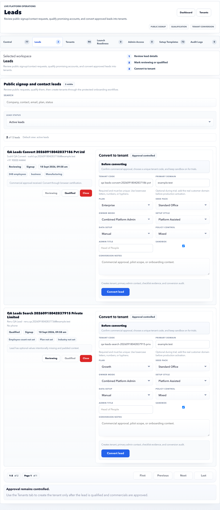

# Platform Leads

Leads is the public signup and contact-request queue.

## Purpose

Use Leads to review incoming requests, qualify good prospects, close non-actionable requests, and convert approved leads into tenants.

## Use this page when

- A new signup request arrives.
- Commercial approval is complete and the lead can become a tenant.
- A duplicate or test request should be closed.
- You need to record conversion notes.

## Page sections

| Section | Meaning |
| --- | --- |
| Filters | Search by company, contact, email, phone, status, plan, or domain. |
| Lead list | Signup requests with status, source, timestamp, company context, and actions. |
| Status controls | Mark leads as reviewing, qualified, or closed. |
| Convert to tenant | Creates tenant, primary admin contact, checklist evidence, and conversion audit. |
| Pagination | Moves through large lead queues. |

## Lead states

| State | Meaning |
| --- | --- |
| New | Newly received and not yet reviewed. |
| Reviewing | Operator or commercial team is checking the request. |
| Qualified | Approved for tenant creation. |
| Closed | Not moving forward or duplicate/test data. |

## Qualification checklist

Before marking a lead as qualified, confirm:

- Company name and contact person are real and correctly spelled.
- Email and phone are reachable.
- Primary domain is known or intentionally left temporary for trial.
- Requested plan and employee count look commercially valid.
- Duplicate lead or existing tenant does not already exist.
- Conversion notes explain why the lead is ready.

## Conversion safety checks

Before clicking **Convert lead**, verify:

- Tenant code is lowercase, readable, and unlikely to change.
- Primary domain is correct for production or clearly a trial placeholder.
- Sandbox is selected only when the customer should not be live yet.
- Plan, seed pack, owner mode, setup style, data setup, and policy control match the agreed onboarding path.
- Admin title and conversion notes are complete enough for audit.

## Good practice

- Confirm commercial approval before conversion.
- Confirm tenant code and domain before clicking **Convert lead**.
- Keep conversion notes clear enough for later audit.

## FAQ

### Should every lead become a tenant?

No. Close duplicates, test submissions, and unapproved enquiries. Tenant creation should represent a real account setup decision.

### What if the domain is not final?

Use a clearly temporary domain only for sandbox or trial work, then update the real customer domain before production activation.
