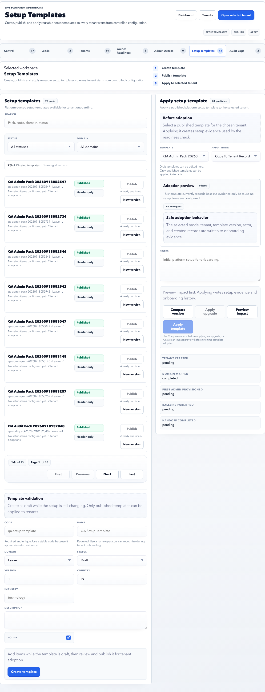

# Setup Templates

Setup Templates are platform-owned baseline packs used during tenant onboarding.

## Purpose

Use Setup Templates to create, publish, preview, apply, and version baseline setup packs.

## Use this page when

- A tenant needs baseline setup data.
- A new standard setup pack is required.
- A template should be published or versioned.
- Existing tenant setup should be compared with a template upgrade.

## Page sections

| Section | Meaning |
| --- | --- |
| Template filters | Search by pack, code, domain, and status. |
| Template list | Draft and published setup packs, version, domain, item counts, and adoption counts. |
| Template item editor | Adds or updates setup items such as leave types, policies, attendance, payroll, or organization seed data. |
| Publish controls | Moves a draft pack into published state. |
| Adoption preview | Shows whether the selected template can be applied to the selected tenant. |
| Apply setup template | Copies or upgrades template records into tenant setup. |

## Template states

| State | Meaning |
| --- | --- |
| Draft | Editable template; not ready for adoption. |
| Published | Can be applied to tenants. |
| Versioned | A new version exists to preserve prior adoption evidence. |

## Template design guidance

| Design area | Recommendation |
| --- | --- |
| Template name | Include domain, country, and intended customer type when useful. |
| Scope | Keep one template focused on one baseline setup path. |
| Versioning | Version when a published template changes in a way that affects future tenants. |
| Items | Prefer clear, reusable setup items over customer-specific one-off entries. |
| Adoption notes | Capture why an item was copied, skipped, or upgraded. |

## When to create a new version

Create a new version when:

- A published pack already has tenant adoptions.
- Policy logic, payroll setup, leave setup, or attendance setup changes materially.
- Existing tenant evidence should remain tied to the old baseline.
- Operators need to distinguish old and new onboarding standards.

## Good practice

- Publish only tested templates.
- Create a new version instead of silently changing a live baseline.
- Preview adoption before applying to a tenant.
- Use clear template names by domain and customer type.

## FAQ

### Should I edit a published template directly?

Avoid direct edits that change onboarding meaning. Create a new version so older adoption evidence remains understandable.

### Can draft templates be applied to tenants?

No. Publish the template after review, then apply it to tenants.
