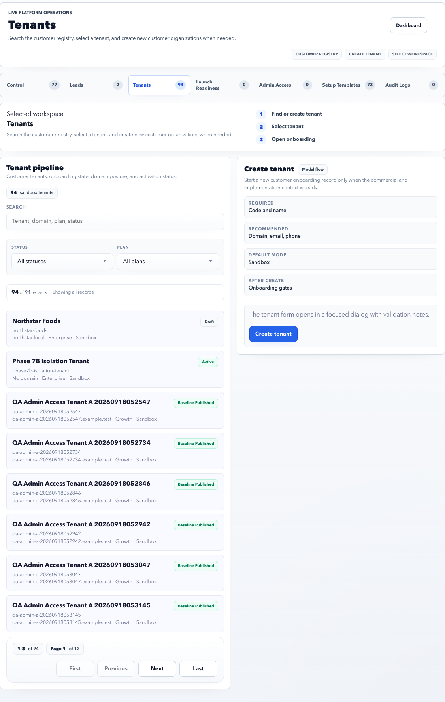

# Platform Tenants

Tenants is the customer registry for all tenant records.

## Purpose

Use Tenants to search customer records, create tenants, select a tenant for setup, and inspect tenant status.

## Use this page when

- You need to find a customer tenant.
- You need to create a tenant manually.
- You need to inspect status, plan, domain, sandbox, or onboarding state.
- You need to select a tenant before setup or launch work.

## Page sections

| Section | Meaning |
| --- | --- |
| Filters | Search by tenant code, name, domain, status, onboarding state, or plan. |
| Tenant list | Customer records with plan, status, domain, setup state, and action links. |
| Create tenant | Manual tenant creation for approved accounts. |
| Selected tenant details | Focused tenant information used by downstream panels. |
| Pagination | Moves through long tenant lists. |

## Tenant fields to verify

| Field | Why it matters |
| --- | --- |
| Tenant code | Used in URLs, audit evidence, integrations, and support references. Avoid changing it later. |
| Primary domain | Controls customer identity and can affect public URLs, email, and workspace access. |
| Plan | Drives limits, available modules, and setup expectations. |
| Sandbox/live status | Prevents a trial account from being treated as production. |
| Onboarding state | Tells operators which setup or launch area still needs action. |
| Primary admin | Confirms who owns the customer-side handoff. |

## Before activating a tenant

- Confirm the tenant was not created as a duplicate.
- Confirm tenant code and primary domain are final.
- Confirm setup template adoption is complete or intentionally skipped.
- Confirm at least one tenant admin can sign in.
- Confirm launch readiness has no open blockers.

## Good practice

- Search before creating a tenant to avoid duplicates.
- Keep tenant code stable after creation.
- Use sandbox status intentionally; do not activate production accidentally.

## FAQ

### When should I create a tenant manually?

Create manually only for approved accounts that did not start from a lead or where commercial/onboarding teams intentionally asked for direct tenant setup.

### What if the tenant domain is wrong?

Correct it before admin provisioning and production activation. Domain mistakes become harder to explain after emails, login access, or integrations use the old value.
