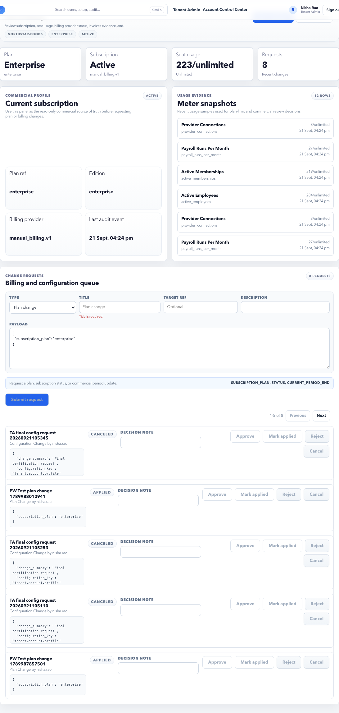

# Plan And Billing

Plan and Billing shows subscription status, edition, usage, limits, feature availability, and commercial support evidence.

## On This Page

- [When to use this page](#when-to-use-this-page)
- [Page sections](#page-sections)
- [Screen labels to recognize](#screen-labels-to-recognize)
- [Controls and actions](#controls-and-actions)
- [Common usage meters](#common-usage-meters)
- [Example: request a user limit increase](#example-request-a-user-limit-increase)
- [Example: investigate feature unavailable](#example-investigate-feature-unavailable)
- [Validation and negative cases](#validation-and-negative-cases)
- [Signoff checklist](#signoff-checklist)

## When To Use This Page

- A feature appears unavailable.
- A user sees a limit exceeded message.
- The customer asks which plan or edition they are on.
- Usage needs review before adding users, employees, payroll runs, documents, or support sessions.
- Commercial support or audit evidence is required.

## Page Sections

| Section | Meaning | What to check |
| --- | --- | --- |
| Plan summary | Subscription, plan code, edition, status, and tenant reference. | Account should be active before broad rollout. |
| Usage meters | Current usage against configured limits. | Look for near-limit or exceeded meters. |
| Feature availability | Which modules or capabilities are enabled. | Feature hidden issues often start here. |
| Change request area | Governed request workflow for plan or account changes. | Use this instead of changing sensitive settings directly. |
| Commercial support audit | Exportable commercial evidence when allowed. | Treat exports as sensitive account evidence. |

## Screen Labels To Recognize

| Screen label | Meaning |
| --- | --- |
| Commercial profile | Commercial plan, contract, billing, and tenant-commercial identity. |
| Current subscription | The active plan and enabled account capabilities. |
| Change requests | Pending or completed commercial changes such as seat or feature updates. |

## Controls And Actions

| Control | Meaning | Expected result |
| --- | --- | --- |
| Dashboard | Returns to Tenant Dashboard. | User can re-check account posture. |
| Download audit | Exports commercial or plan evidence when allowed. | Audit file is generated for authorized users. |
| Request change | Starts a governed plan or account change request. | Request appears with status and audit evidence. |
| Approve / Apply / Reject / Cancel | Moves a plan change request through its lifecycle. | Status changes and evidence is recorded. |

## Common Usage Meters

| Meter | Meaning | Practical example |
| --- | --- | --- |
| Active users | Tenant users with active access. | Add user may be blocked if this is at limit. |
| Employees | Workforce size under the plan. | Employee import may fail if plan has a hard cap. |
| Payroll runs | Payroll processing usage. | More runs may require a plan update. |
| Documents or storage | Document and artifact usage. | Uploads may be blocked or warned near limit. |
| Support sessions | Assisted support access usage. | Support requests may require commercial review. |

## Limit Review Workflow

Use this workflow before adding many users, importing a large workforce, opening payroll runs, or requesting support at scale.

1. Open **Plan and Billing**.
2. Confirm subscription status is active.
3. Review each usage meter against its limit.
4. Check whether the affected feature is included in the plan.
5. Confirm the acting user has the right role in **Users**.
6. If the limit or entitlement is the blocker, submit a change request.
7. Keep the request evidence available for commercial or launch review.

## Example: Request A User Limit Increase

1. Open **Tenant Admin > Plan and Billing**.
2. Review active user count and plan limit.
3. Confirm the business reason, such as "Need 5 additional HR and payroll users before launch".
4. Open the plan change request area.
5. Enter the request title, reason, and requested limit.
6. Submit the request.
7. Track status until approved and applied.
8. Return to **Users** and invite the new users.

## Example: Investigate Feature Unavailable

1. Open **Plan and Billing**.
2. Confirm subscription status is active.
3. Check whether the feature is included in the plan.
4. If included, check the user's role in **Users** and permissions in **Roles**.
5. If not included, create a plan change request.

Do not assume a feature problem is only a permission issue. Plan entitlement and role permission must both be valid.

## Validation And Negative Cases

| Case | Expected behavior | What to do |
| --- | --- | --- |
| Add user fails due to limit | Users page may block creation or activation. | Request a limit increase here. |
| Feature hidden | Feature may not be in the plan or user lacks permission. | Check plan first, then role. |
| Change request missing reason | Submit should be blocked or request should be incomplete. | Add business context. |
| Apply action disabled | Request is not approved or user lacks permission. | Review state and role permission. |
| Export hidden | User lacks audit export permission. | Ask an authorized tenant admin. |

## Signoff Checklist

- Subscription status is active.
- No critical usage meter is exceeded.
- Plan entitlements match expected launch scope.
- Commercial change requests have reason, owner, and status.
- Commercial support evidence can be exported by authorized users only.

## Related Guides

- [Tenant Users](users.md)
- [Settings](settings.md)
- [Trust Audit](trust-audit.md)
