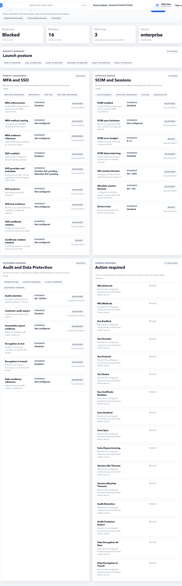

# Security Readiness

Security Readiness helps tenant owners review whether account security controls are acceptable for live use. It focuses on access governance, authentication posture, support controls, audit, sessions, and data protection.

## On This Page

- [When to use this page](#when-to-use-this-page)
- [Readiness domains](#readiness-domains)
- [Screen labels to recognize](#screen-labels-to-recognize)
- [Controls and actions](#controls-and-actions)
- [Example: review account before production](#example-review-account-before-production)
- [Example: resolve a support access blocker](#example-resolve-a-support-access-blocker)
- [Validation and negative cases](#validation-and-negative-cases)
- [Signoff checklist](#signoff-checklist)

## When To Use This Page

- The tenant is preparing for launch.
- A security or compliance owner asks for access-control evidence.
- Dashboard shows security blocked or warning.
- Support access, sessions, audit, MFA, SSO, or data protection needs review.

## Readiness Domains

| Domain | What it checks | Typical next page |
| --- | --- | --- |
| MFA and SSO | Authentication posture and enterprise login readiness. | Settings or identity provider setup. |
| SCIM and sessions | User lifecycle automation and session governance. | Users, Roles, or Settings. |
| Audit and data protection | Evidence, data handling, and export controls. | Trust Audit. |
| Support access | Whether assisted access is controlled and temporary. | Support Access. |
| Role and user governance | Whether admin roles and active users are safe. | Users and Roles. |

## Screen Labels To Recognize

| Screen label | Meaning |
| --- | --- |
| Security domains | Security areas reviewed for launch and account governance. |
| Launch posture | Overall security readiness state for production use. |
| Launch blockers | Security issues that must be resolved or formally accepted. |

## Controls And Actions

| Control | Meaning | Expected result |
| --- | --- | --- |
| Trust audit | Opens Trust Audit for evidence review. | Security reviewer can inspect events. |
| Console | Returns to account posture. | User can confirm whether blocker count changed. |
| Review support access | Opens Support Access when support posture is blocked. | Active or pending grants can be closed. |
| Review users or roles | Opens access pages when role posture is blocked. | Tenant admin can correct assignments. |

## Example: Review Account Before Production

1. Open **Tenant Admin > Security Readiness**.
2. Review blocked domains first.
3. Open the linked page for each blocker.
4. Resolve active support access, risky roles, or missing audit evidence.
5. Review warnings next.
6. Open **Trust Audit** and confirm evidence exists for security decisions.
7. Return to Dashboard and confirm readiness status.

## Example: Resolve A Support Access Blocker

1. Open **Security Readiness**.
2. Find the support access blocker.
3. Open **Support Access** from the action.
4. End or revoke unnecessary active grants.
5. Reject unclear pending grants.
6. Open **Trust Audit** and confirm support events were recorded.
7. Return to Security Readiness.

## Validation And Negative Cases

| Case | Expected behavior | What to do |
| --- | --- | --- |
| Security stays blocked after setup completion | Setup completion does not automatically clear security blockers. | Resolve the exact readiness domain. |
| MFA/SSO not configured | Security may show warning or blocker depending on tenant policy. | Document decision or configure provider. |
| Active support grant exists | Security should flag it. | End or revoke the grant. |
| Audit export unavailable | User lacks permission. | Ask authorized tenant admin. |
| Critical role assigned broadly | Security may warn on access governance. | Review Roles and Users. |

## Signoff Checklist

- No unsupported active support grant is open.
- Critical tenant roles have named business owners.
- Audit evidence is available for user, role, support, and setting changes.
- MFA, SSO, session, and SCIM posture is reviewed.
- Data export permissions are limited.
- Security readiness blockers are resolved or formally accepted.

## Related Guides

- [Support Access](support-access.md)
- [Trust Audit](trust-audit.md)
- [Roles](roles.md)
