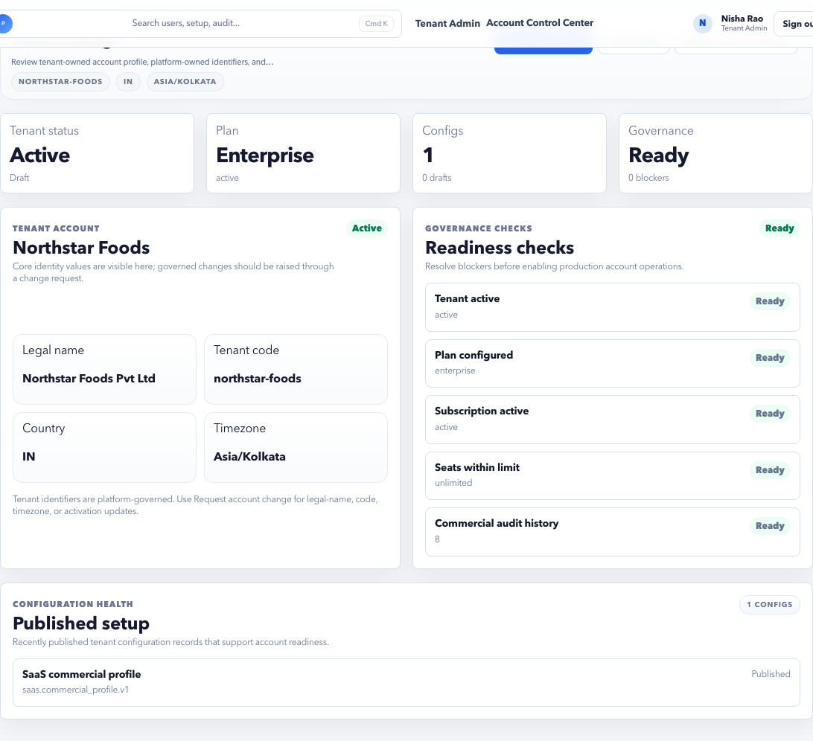

# Tenant Settings

Tenant Settings contains governed account controls for tenant identity, account behavior, setup links, and change evidence.

## Purpose

Use Settings to review tenant-level account configuration and controlled account changes.

## Use this page when

- Tenant display or account settings need review.
- Account controls need governed changes.
- Setup or subscription signals do not look correct.
- You need to navigate back to the setup guide.

## Page sections

| Section | Meaning |
| --- | --- |
| Account summary | Tenant code, plan, subscription, and account posture. |
| Settings controls | Governed account settings available to the tenant. |
| Change evidence | Recent or requested account changes. |
| Setup links | Navigation to Setup Guide and Dashboard. |

## Change safety checks

Before changing account settings, confirm:

- The change is requested by an authorized owner.
- The setting affects only the intended tenant.
- Downstream effects are understood, especially URL, domain, plan, or security behavior.
- Trust Audit will capture the change.
- Users who may be affected have been informed.

## Settings vs Setup Guide

| Need | Use |
| --- | --- |
| Change account-level behavior | Settings. |
| See whether launch setup is complete | Setup Guide. |
| Review who changed something | Trust Audit. |
| Review security posture | Security Readiness. |

## Good practice

- Keep tenant codes stable.
- Use governed change flows for sensitive account changes.
- Review audit evidence after changing account controls.

## FAQ

### Should tenant code be changed after launch?

Avoid it. Tenant code is used for identity, support, URLs, and evidence references.

### Where should I check after changing a setting?

Check the affected page, then review Trust Audit for evidence.
