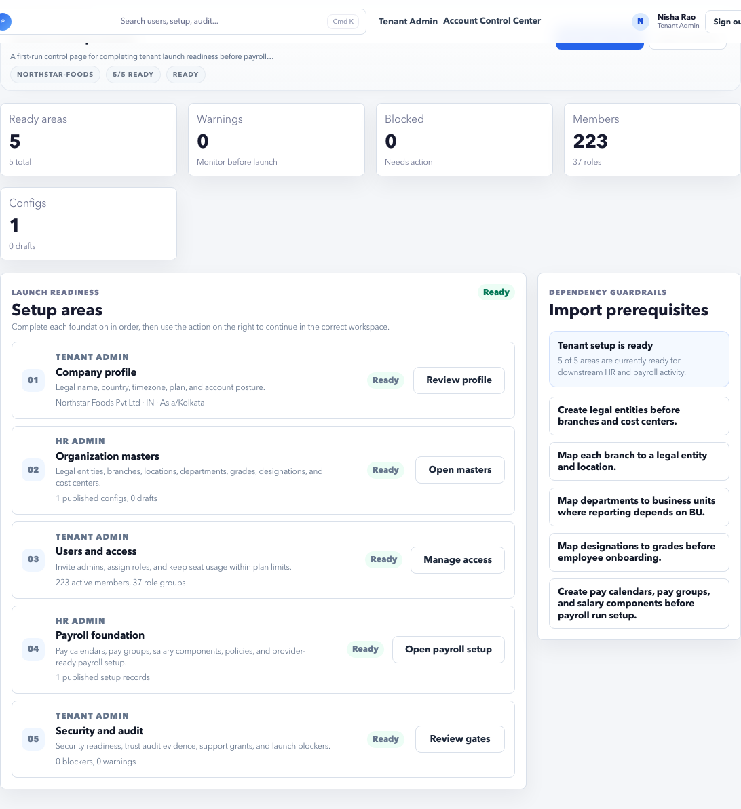

# Tenant Setup Guide

Tenant Setup Guide tracks the account launch checklist across organization, users, roles, security, and support readiness.

## Purpose

Use Setup Guide during onboarding or after major account changes to confirm the tenant is ready for everyday use.

## Use this page when

- A new tenant is being configured.
- Setup status is incomplete.
- A launch or readiness gate is blocked.
- You need to know which setup area to open next.

## Setup areas

| Area | Meaning |
| --- | --- |
| Organization setup | Legal entities, locations, departments, and other masters. |
| Users and access | Tenant users, assigned roles, and seat coverage. |
| HR workspace setup | HR admin data required for operations. |
| Payroll setup | Payroll configuration and source readiness. |
| Security and audit | Security readiness, trust evidence, and support access. |

## Workflow

1. Open **Setup Guide**.
2. Review incomplete or action-required areas.
3. Open the linked setup area.
4. Complete the missing setup.
5. Return to Setup Guide.
6. Confirm the status improved.

## Recommended completion order

1. Organization setup.
2. Users and access.
3. HR workspace setup.
4. Payroll setup.
5. Security and audit.
6. Final launch readiness.

## What to do when a step is blocked

- Open the linked setup area.
- Read the blocker message.
- Fix the source data or ownership issue.
- Return to Setup Guide and refresh/recheck the state.
- If the blocker remains, use Trust Audit or Support Access evidence before escalating.

## Good practice

- Complete organization masters before employee imports.
- Complete users and roles before handoff to customer admins.
- Resolve security and audit items before production launch.

## FAQ

### Why does setup order matter?

Later workflows depend on earlier setup. For example, employees need organization masters, payroll needs employee and bank data, and launch needs users and security evidence.

### Should I use Setup Guide after launch?

Yes, after major account changes, new modules, or readiness concerns.
