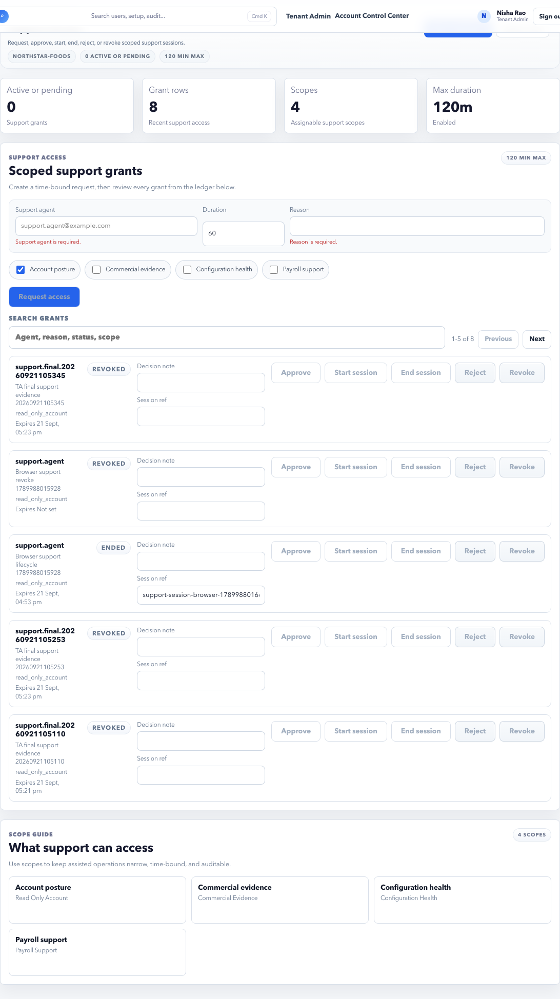

# Support Access

Support Access controls assisted operations access for support or implementation teams.

## Purpose

Use Support Access to request, approve, start, end, or revoke scoped support access with audit evidence.

## Use this page when

- Support needs temporary access to help the tenant.
- A support grant is pending approval.
- A support grant should be ended or revoked.
- You need evidence of who accessed the tenant and why.

## Page sections

| Section | Meaning |
| --- | --- |
| Active or pending grants | Support access requests that need action or are currently open. |
| Request form | Creates a scoped support request when permitted. |
| Grant list | Support grants, scopes, statuses, expiry, and evidence. |
| Support audit link | Opens trust audit filtered for support events. |

## Grant states

| State | Meaning |
| --- | --- |
| Requested | Support access has been requested. |
| Approved | Tenant admin approved the access. |
| Active | Support session can be used. |
| Ended | Session completed normally. |
| Revoked | Access was stopped before normal completion. |
| Expired | Time window ended. |

## Approval checklist

- Confirm who requested access.
- Confirm reason and scope.
- Confirm expiry time.
- Confirm support role is appropriate.
- Approve only the minimum scope needed.

## Scope decision guide

| Need | Preferred scope |
| --- | --- |
| Investigate a login or role issue | Account/user access scope only. |
| Investigate payroll setup | Payroll setup or payroll readiness scope only. |
| Investigate employee data issue | HR employee scope with limited duration. |
| Review audit evidence | Trust audit scope only. |
| General troubleshooting | Start narrow, then request broader access only if evidence shows it is needed. |

## After support session ends

1. Confirm the grant status is ended, revoked, or expired.
2. Review Trust Audit for support activity.
3. Save evidence if the case requires it.
4. Do not leave support access active for convenience.

## Good practice

Never approve broad or long-running support access without a clear reason. Use Trust Audit after the session to confirm activity.

## FAQ

### Who should approve support access?

A tenant admin or authorized account owner should approve it. The approver should understand the scope and expiry.

### Can support access be revoked early?

Yes. Revoke it when the issue is resolved or when the requested scope is no longer appropriate.
