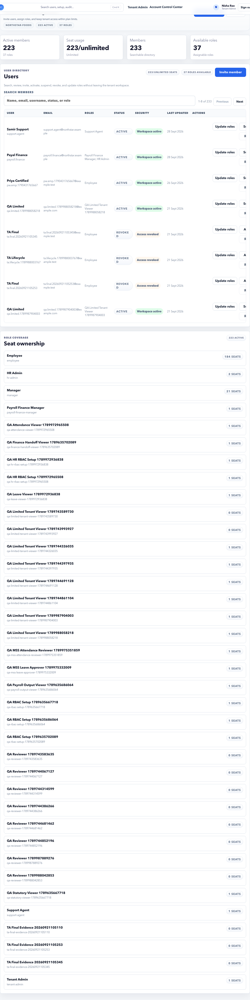

# Access Issues

Use this page when a user logs in but sees the wrong workspace, cannot see a menu item, cannot access ESS/MSS/HR Admin, or does not receive invite/reset email.

## Logged In but Wrong Workspace Opens

Check:

| Check | Expected result |
| --- | --- |
| Tenant membership | Active |
| User role | Correct for the intended workspace |
| Primary role | Matches the default workspace if the user has multiple roles |
| Employee link | Required for ESS and MSS |
| Workspace URL | User is opening the correct route |

Common workspace routes:

| Workspace | Route |
| --- | --- |
| HR Admin | `/hr-admin` |
| ESS | `/ess` |
| MSS | `/mss` |
| Tenant Admin | `/tenant-admin` |
| Platform Admin | `/platform-admin` |
| Finance Manager | `/finance-manager` |

If a user lands on Workspace Access:

1. Open **Tenant Admin > Users**.
2. Search the user.
3. Confirm status is active.
4. Confirm role assignment.
5. Confirm the role has permissions.
6. Confirm the user is linked to an employee if ESS or MSS is needed.

## User Cannot See HR Admin

Check:

- User has an HR Admin role or equivalent custom role.
- Role includes HR Admin permissions.
- Tenant plan includes the required HR module.
- User account is active.
- User is opening `/hr-admin`.

Do not assign HR Admin broadly. HR Admin can view and change sensitive employee, payroll, and compliance data.

## User Cannot See ESS

Check:

- User has ESS access.
- User is linked to an employee profile.
- Employee profile is active or allowed for self-service.
- Work email or login identifier matches the user account.

If the user sees no payslips, documents, or declarations after logging into ESS, the account may be active but not correctly linked to the employee record.

## User Cannot See MSS

Check:

- User has MSS access.
- User is linked to an employee profile.
- Employee is assigned as manager for at least one employee if team pages are expected.
- Manager chain is ready in employee master.

If the manager can log in but sees no team data:

1. Open **Employees**.
2. Search a direct report.
3. Confirm the manager field points to the manager.
4. Confirm manager chain readiness.

## Role Assigned but Page Still Unavailable

Possible causes:

| Cause | Fix |
| --- | --- |
| Browser session is old | Sign out and sign in again. |
| Role has no permission keys | Update role permissions in Tenant Admin. |
| Feature is not in plan | Check Tenant Admin plan/security setup. |
| Route belongs to a different workspace | Use the correct workspace route. |
| User is inactive | Activate user if appropriate. |

## Invite or Reset Email Not Received

Check:

1. Confirm the email address is correct.
2. Ask the user to check spam, promotions, and blocked senders.
3. Open **Notifications** and search for the user email.
4. Check whether email delivery failed or retry capped.
5. Confirm SMTP/provider configuration if many emails fail.

If email failed, follow [Notification Issues](notifications.md).

### How to interpret the notification result

| What you find | Meaning | Action |
| --- | --- | --- |
| Delivered email notification exists | The app sent the message through the configured provider. | Ask the user to check spam/promotions or verify the mailbox address. |
| Failed email notification exists | The app tried to send but the provider or recipient path failed. | Open the notification review page, fix the cause, then retry. |
| Retry capped | The system stopped retrying after the configured attempt limit. | Fix the provider/recipient issue, then use controlled retry or create a new reset/setup email. |
| Pending for too long | Queue processor may not be running or the notification is scheduled for later. | Check notification delivery health and worker/timer status. |
| No notification exists for a new HR Admin access user | Access was created but the setup email was not queued, or the user was created before invite automation was enabled. | Use password reset/resend setup email and verify the notification appears. |

### HR Admin-created employee access

When HR Admin creates employee access from **Employees > Actions > Access**, the expected behavior is:

- A user account is created or linked.
- Tenant membership and role assignment are saved.
- A secure invite/setup email is queued.
- The email contains a setup/reset link.
- The generated password is not shown in the email body.

After creating access, verify the employee can set a password and route to the intended workspace. If they land on **Workspace Access**, check role assignment, employee link, membership status, and default workspace.

## Security Rules

- Assign the least access needed.
- Do not share login credentials.
- Remove admin access when a user changes responsibility.
- Review access before payroll close and before customer launch.
- Use custom roles carefully; test with a real user before assigning widely.

## Escalation Details

When escalating an access issue, include:

- User email or username.
- Intended workspace.
- Current workspace or error shown.
- Assigned roles.
- Whether the user is linked to employee profile.
- Whether the issue started after a role or tenant change.

## Related Guides

- [Tenant Admin Users](../tenant-admin/users.md)
- [Tenant Admin Roles](../tenant-admin/roles.md)
- [Workspaces and Roles](../getting-started/workspaces-and-roles.md)
- [Notification Failure to Recovery](../workflows/notification-failure-to-recovery.md)
