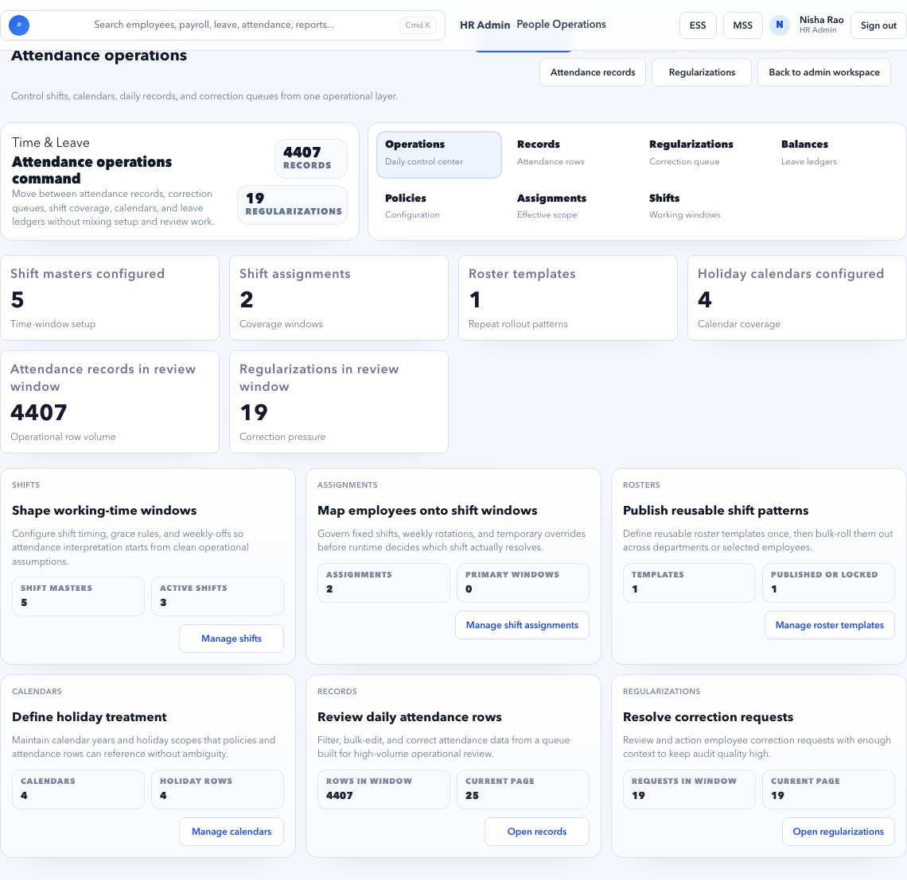
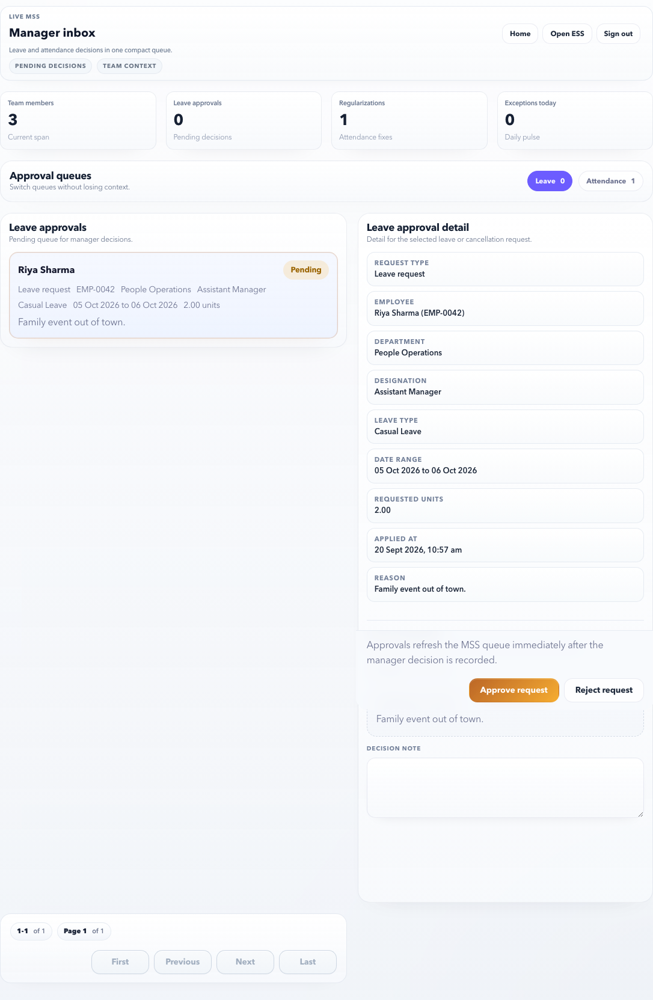

# Leave and Attendance to Payroll

Use this workflow before payroll inputs are locked, especially when payable days, absences, overtime, or regularizations affect salary.

## Outcome

Leave and attendance exceptions are reviewed, approved or rejected, and reflected in payroll readiness before calculation.

## Owners

| Task | Owner |
| --- | --- |
| Submit leave or regularization | Employee |
| Approve team requests | Manager |
| Review exceptions and balances | HR Admin |
| Lock payroll inputs | Payroll Admin |

## Step 1: Review Payroll Period

1. Open **Payroll > Payroll Control**.
2. Confirm the payroll period start and end dates.
3. Note pending approvals and blockers linked to leave or attendance.
4. Open **Attendance** or **Leave** from the action list.

Do not review outside the payroll period unless you are correcting carry-forward, arrears, or historical payable-day impact.

## Step 2: Close Attendance Exceptions

1. Open **HR Admin > Attendance**.
2. Filter by the payroll period.
3. Review missing punches, absences, late marks, shift gaps, or pending regularizations.
4. Approve valid regularizations.
5. Reject invalid regularizations with a clear reason.
6. Confirm no critical attendance blockers remain.

Manager view if approval is needed:

Common checks:

| Check | Why it matters |
| --- | --- |
| Missing attendance | Can reduce payable days or block payroll. |
| Pending regularization | Can change payable days after approval. |
| Shift mapping | Can affect late/absent calculation. |
| Holiday/weekoff mapping | Can affect attendance exceptions. |
| Employee status | Exit or joining date can change expected attendance. |

Close high-impact exceptions first: pending regularizations, missing punches, shift gaps, and attendance/leave conflicts. Cosmetic or non-payroll warnings can be reviewed after payroll blockers are clear.

## Step 3: Review Leave Balances and Requests

1. Open **HR Admin > Leave**.
2. Search employee or policy.
3. Check pending, approved, rejected, and cancelled leave records.
4. Review leave balance transactions.
5. Apply corrections only with a clear reason.
6. Confirm payroll-impacting leave is finalized.

Do not proceed if:

- Leave requests in the payroll period are pending.
- Balance correction has no reason.
- Leave without pay is not reflected correctly.
- Carry-forward or expiry changes are incomplete.

If many employees need manual correction, pause and check policy setup before applying more corrections.

## Step 4: Validate Employee-Level Payroll Readiness

1. Open **Payroll > Payroll Control**.
2. Go to employee readiness details.
3. Filter for leave or attendance warnings.
4. Open the employee if the issue is specific to one person.
5. Fix the source record and refresh readiness.

Typical readiness messages:

| Message | Action |
| --- | --- |
| Attendance pending | Open Attendance and close exceptions. |
| Leave pending | Open Leave or manager approval queue. |
| Payable days mismatch | Check joining, exit, leave without pay, attendance, and shift rules. |
| Employee not in scope | Check pay group, employment status, and joining date. |

## Step 5: Lock Inputs Only After Closure

1. Confirm leave and attendance blockers are closed.
2. Open **Payroll > Payroll Inputs**.
3. Select the payroll run.
4. Review snapshots.
5. Lock inputs only when the source data is stable.

Do not lock inputs if:

- Any manager approvals are still pending.
- HR is still changing leave balances.
- Attendance regularizations are still being processed.
- Payroll Control shows leave or attendance blockers.

After locking inputs, source changes may not affect the selected payroll run. If a late approval changes pay, follow the payroll correction, rerun, or adjustment process.

## Employee and Manager Communication

Use notification and ESS/MSS pages to keep users aligned:

- Employee checks leave status in ESS.
- Manager approves requests in MSS.
- HR reviews failed notifications if reminders did not deliver.
- Payroll waits for final source data before locking inputs.

## Final Checklist

| Check | Expected result |
| --- | --- |
| Attendance exceptions | Closed or intentionally accepted |
| Regularizations | Approved or rejected |
| Leave requests | No payroll-impacting pending requests |
| Leave balances | Correct and explained |
| Manager approvals | Complete |
| Payroll Control | No leave or attendance blockers |
| Payroll Inputs | Locked only after source closure |

## Common mistakes

| Mistake | Risk |
| --- | --- |
| Approving regularizations after input lock | Payroll may not reflect the correction. |
| Correcting balances manually every month | Hides policy setup problems. |
| Ignoring shift gaps | Employees can appear absent or late incorrectly. |
| Leaving manager approvals pending | Payroll may be blocked or payable days may change later. |
| Changing policies during close | Historical and current payroll behavior can shift unexpectedly. |

## Related Pages

- [Attendance](../hr-admin/attendance.md)
- [Leave](../hr-admin/leave.md)
- [Payroll Control](../hr-admin/payroll/payroll-control.md)
- [Payroll Inputs](../hr-admin/payroll/payroll-inputs.md)
- [MSS Approvals](../mss/approvals.md)
- [ESS Overview](../ess/index.md)
