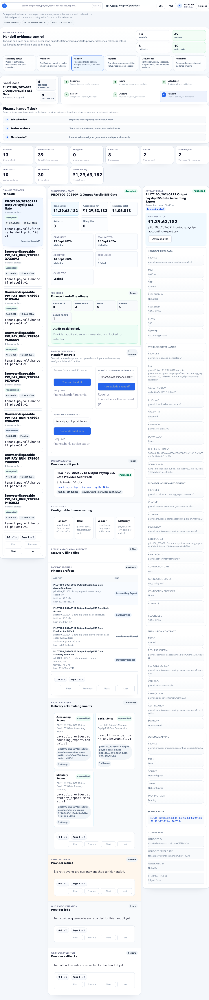

# Payroll Close to Finance Handoff

Use this workflow when payroll must move from readiness to finance-ready output.

## Outcome

Payroll is reviewed, approved, output artifacts are generated, and Finance Manager has the files and evidence required for payout and compliance.

## Owners

| Stage | Owner |
| --- | --- |
| Source readiness | HR Admin and Payroll Admin |
| Input lock | Payroll Admin |
| Calculation | Payroll Admin |
| Exception review | Payroll Admin and approver |
| Output generation | Payroll Admin |
| Finance handoff | Finance Manager |

## Stage 1: Readiness

1. Open **Payroll > Payroll Control**.
2. Confirm payroll cycle dates.
3. Review employee count, ready count, warnings, blocked count, and pending approvals.
4. Open **Issues** for blockers.
5. Fix source records from the owning page.
6. Return to Payroll Control and confirm counts changed.

Do not proceed if:

- Blocked count is greater than zero.
- Critical attendance or leave approvals are still pending.
- Organization, bank, salary, or statutory data is incomplete.

## Stage 2: Lock Inputs

1. Open **Payroll > Payroll Inputs**.
2. Select the correct payroll run.
3. Review employee snapshots and source families.
4. Confirm snapshot counts match the expected payroll population.
5. Lock inputs only after source data is stable.

Check:

- Payroll run name and period are correct.
- Snapshot count is not unexpectedly low or high.
- Blocked input rows are explained.
- No source page changes are still being made.

Do not proceed if:

- Payroll Control still shows blockers.
- Employee count differs from HR expectation.
- Inputs are already locked for the wrong run.

## Stage 3: Calculate Payroll

1. Open **Payroll > Payroll Calculations**.
2. Select the current run.
3. Review gross earnings, deductions, net pay, line count, and issue register.
4. Open a line trace if any amount needs explanation.
5. Resolve calculation blockers before review.

Check:

- Net pay trend is reasonable.
- Zero-pay or negative-pay employees are explained.
- Deduction totals match expected statutory and voluntary deductions.
- Calculation issue register is clear or intentionally accepted.

## Stage 4: Review Exceptions

1. Open **Payroll > Payroll Review**.
2. Review exceptions by severity.
3. Add review notes for accepted exceptions.
4. Send back to source owner if correction is needed.
5. Approve according to internal approval policy.

Do not approve if:

- Net pay changed unexpectedly after review started.
- Exceptions have no owner or explanation.
- Required approver has not signed off.

## Stage 5: Generate Outputs

1. Open **Payroll > Payroll Outputs**.
2. Generate required artifacts.
3. Review artifact register.
4. Confirm payslip publication status.
5. Confirm files are generated for the intended run.

Common outputs:

| Output | User |
| --- | --- |
| Payslips | Employees through ESS |
| Payroll register | Payroll and finance teams |
| Bank advice | Finance Manager or bank uploader |
| Statutory reports | Compliance and finance teams |
| Audit manifest | Payroll, finance, and audit users |

## Stage 6: Handoff to Finance

1. Open **Payroll > Payroll Handoff**.
2. Confirm bank artifacts, statutory artifacts, provider jobs, and delivery evidence.
3. Open **Finance Manager**.
4. Review latest net pay, bank artifacts, reconciled deliveries, and provider exceptions.
5. Export bank advice or filings only after all exceptions are explained.

Do not proceed if:

- Bank advice row count does not match payroll output.
- Provider exceptions remain blocked.
- Compliance evidence is missing.
- Audit evidence is stale or incomplete.

## Finance reconciliation gates

| Gate | Finance must confirm |
| --- | --- |
| Run gate | Payroll register, bank advice, handoff manifest, and finance page refer to the same payroll run. |
| Amount gate | Latest net pay equals the payable bank advice total after approved holds. |
| Population gate | Employee count and bank advice rows match the payable population. |
| Compliance gate | Statutory artifacts exist for the same period and legal entity. |
| Provider gate | Provider jobs completed or exceptions are accepted with evidence. |
| Audit gate | Export, receipt, callback, and manifest evidence can be retrieved later. |

## Handoff failure paths

| Failure | Return to |
| --- | --- |
| Wrong run or period | Payroll Outputs, then regenerate handoff. |
| Missing bank advice | Payroll Outputs or Payroll Handoff. |
| Amount mismatch | Payroll Review or Payroll Calculations. |
| Missing employee bank details | Employees or Payroll Readiness. |
| Missing statutory evidence | Statutory Payroll or Payroll Outputs. |
| Provider job failure | Payroll Providers or Finance Audit Evidence. |

## Final Close Checklist

| Check | Expected result |
| --- | --- |
| Payroll Control | No unresolved blockers |
| Inputs | Locked for correct period and run |
| Calculations | Completed with no blocking issues |
| Review | Approved or exception notes recorded |
| Outputs | Generated and verified |
| Payslips | Published only when final |
| Bank advice | Exported from final run |
| Statutory files | Available or exception noted |
| Finance handoff | Accepted by Finance Manager |
| Audit evidence | Available for later review |

## Related Pages

- [Payroll Control](../hr-admin/payroll/payroll-control.md)
- [Payroll Inputs](../hr-admin/payroll/payroll-inputs.md)
- [Payroll Calculations](../hr-admin/payroll/payroll-calculations.md)
- [Payroll Review](../hr-admin/payroll/payroll-review.md)
- [Payroll Outputs](../hr-admin/payroll/payroll-outputs.md)
- [Payroll Handoff](../hr-admin/payroll/payroll-handoff.md)
- [Finance Manager](../finance-manager/index.md)
