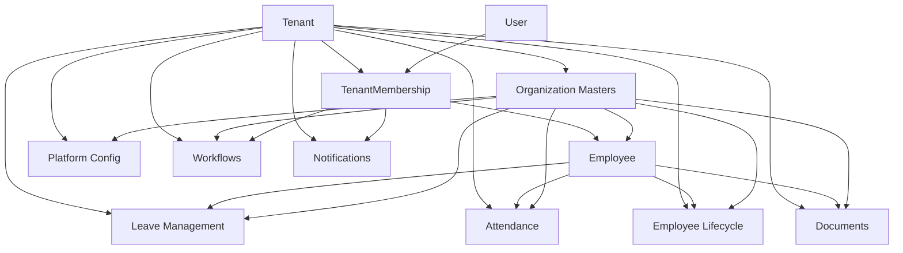

# HRMS Backend Model Structure and Relationships

## 1. Purpose

This document describes the current Django model structure in the backend and the important relationships between domains.

It is intended as a technical reference for:

- onboarding engineers to the data model
- understanding tenant boundaries
- understanding how employee, organization, policy, workflow, and operational data connect
- planning future refactors, reporting, and payroll expansion

This document reflects the current model definitions in `backend/apps/*/models.py` as reviewed on June 18, 2026.

---

## 2. Shared Modeling Patterns

## 2.1 Base Abstract Models

Most domain models inherit from shared base abstractions in `apps.common.models`:

- `UUIDPrimaryKeyModel`
  Uses UUID primary keys across the domain.
- `TimeStampedModel`
  Adds `created_at` and `updated_at`.
- `SoftDeleteModel`
  Exists as a shared abstraction, but is not broadly applied in the current domain models yet.

## 2.2 Tenant-Scoped Design

The majority of business models are explicitly tenant-owned through a `tenant` foreign key.

This means:

- tenant is the primary isolation boundary
- organization masters, employees, policies, workflow templates, documents, notifications, attendance, and leave are all tenant-scoped
- cross-tenant joins should not exist in normal business flows

## 2.3 Employee-Centric Operational Design

After tenant scoping, `Employee` is the main operational anchor.

Many downstream records attach directly to `Employee`, including:

- leave requests and balances
- attendance records and regularizations
- onboarding, movements, probation reviews, and exits
- documents and generated letters
- shift assignments

## 2.4 Scoped Assignment Pattern

Several domains use the same assignment approach:

- policy assignment
- workflow template assignment
- document requirement rules
- configuration overrides

These models typically support scoping by one or more of:

- legal entity
- branch
- location
- department
- business unit
- grade
- employment type
- employee

This is one of the core architectural patterns in the system.

Current policy-resolution rule:

- manual `priority` is the explicit admin override
- when two matching assignments have the same priority, the resolver falls back to the more granular matching scope
- when one matching assignment combines multiple scopes and another matching assignment is a broader single scope at the same priority, the combined scope wins
- if two active assignments still overlap at the same priority and same effective granularity, the admin save is blocked so runtime does not depend on arbitrary tie-breaking
- the current fallback ladder is: `employee` -> `grade` and `employment type` -> `department` -> `location` -> `branch` -> `legal entity`

---

## 3. High-Level Domain Graph



---

## 4. Core Domain Structure

## 4.1 Tenants Domain

Primary models:

- `Tenant`
- `TenantDomain`

Role in the system:

- `Tenant` is the root business entity for SaaS isolation
- `TenantDomain` maps custom domains or workspaces to a tenant

Important relationships:

- one `Tenant` has many `TenantDomain`
- one `Tenant` has many downstream business records across nearly all apps

Operational meaning:

- all organization structures, users-in-context, policies, workflow templates, and transactions belong to a tenant

## 4.2 IAM Domain

Primary models:

- `User`
- `Role`
- `RolePermission`
- `TenantMembership`
- `MembershipRole`
- `MembershipScope`

Relationship structure:

- one `User` can have many `TenantMembership`
- one `Tenant` can have many `TenantMembership`
- one `Tenant` can define many `Role`
- one `Role` has many `RolePermission`
- `MembershipRole` is the join model between membership and role
- `MembershipScope` stores access constraints attached to membership

Important modeling decision:

- access is tenant-contextual
- `User` is global/platform identity
- `TenantMembership` is tenant identity plus access state
- `Employee` links back to a tenant membership instead of directly replacing it

Current implementation note:

- tenant business roles such as `hr-admin`, `manager`, and `employee` are already modeled as tenant-scoped roles
- platform roles are currently a documentation and architectural expectation more than a fully separated policy-ownership implementation in the data model
- a future platform policy admin layer should sit above tenant policy records as an ownership and seeding concept, not as a replacement for tenant membership

## 4.3 Organization Domain

Primary models:

- `LegalEntity`
- `Location`
- `Branch`
- `BusinessUnit`
- `Department`
- `CostCenter`
- `Grade`
- `Designation`
- `EmploymentType`

Relationship structure:

- all organization models inherit from `OrganizationScopedModel`
- `Branch` belongs to `LegalEntity`
- `Branch` may reference `Location`
- `BusinessUnit` supports self-hierarchy through `parent`
- `Department` supports self-hierarchy through `parent`
- `Department` may reference `BusinessUnit`
- `CostCenter` may reference `LegalEntity`
- `Designation` may reference `Grade`

Operational meaning:

- these are the master data axes used across employee assignment, policy scoping, workflow scoping, document rules, and configuration overrides

## 4.3.1 Planned Platform Policy Ownership Layer

The current runtime policy records such as leave policies, attendance policies, workflow templates, and document rules are tenant-scoped.

That is correct for operational execution, but a future platform policy ownership layer is expected for implementation and seeded rollout.

Recommended future shape:

- platform-owned baseline policy templates
- tenant-published copies or resolved effective records
- delegation metadata describing which policy families or fields are tenant-editable
- traceability from tenant policy back to source baseline when cloned from a platform pack

This means:

- runtime execution can remain tenant-bound
- platform admins can still prepare first-time baseline configuration
- tenant admins can own only the policy areas delegated to them

## 4.4 Employees Domain

Primary models:

- `Employee`
- `EmployeeAddress`
- `EmergencyContact`
- `EmployeeBankAccount`

Relationship structure:

- one `Employee` belongs to one `Tenant`
- one `Employee` may map one-to-one to one `TenantMembership`
- one `Employee` may reference:
  - `LegalEntity`
  - `Branch`
  - `Location`
  - `Department`
  - `BusinessUnit`
  - `CostCenter`
  - `Designation`
  - `Grade`
  - `EmploymentType`
- one `Employee` may reference another `Employee` as `reporting_manager`
- one `Employee` has many addresses
- one `Employee` has many emergency contacts
- one `Employee` has many bank accounts

Important modeling decision:

- `Employee` is the business-facing person record
- `TenantMembership` is the access-facing user-in-tenant record
- these are related, but intentionally not the same concept

---

## 5. Configuration and Policy Domains

## 5.1 Platform Configuration

Primary models:

- `ConfigurationDefinition`
- `SeedPackTemplate`
- `SeedPackItem`
- `TenantConfiguration`
- `ScopedConfigurationOverride`
- `ConfigurationChangeLog`

Relationship structure:

- `ConfigurationDefinition` is the master definition of a config key
- `SeedPackTemplate` has many `SeedPackItem`
- `SeedPackItem` links a seed pack to a configuration definition
- `TenantConfiguration` links a tenant to a configuration definition
- `ScopedConfigurationOverride` belongs to `TenantConfiguration`
- overrides may point to:
  - `LegalEntity`
  - `Branch`
  - `Department`
  - `Grade`
  - `EmploymentType`
  - employee identifier as a string
- `ConfigurationChangeLog` records config actions against tenant plus definition

Important modeling decision:

- configuration is modeled as metadata plus value records
- scoped overrides are attached below tenant-level configuration
- employee targeting here is string-based today, not a direct foreign key

## 5.2 Leave Management

Primary models:

- `LeaveType`
- `LeavePolicy`
- `LeavePolicyAssignment`
- `LeaveBalance`
- `LeaveBalanceTransaction`
- `LeaveRequest`

Relationship structure:

- one `Tenant` has many `LeaveType`
- one `LeaveType` has many `LeavePolicy`
- one `LeavePolicy` has many `LeavePolicyAssignment`
- one `LeavePolicyAssignment` can be scoped by:
  - `LegalEntity`
  - `Branch`
  - `Department`
  - `Grade`
  - `EmploymentType`
  - `Employee`
- one `Employee` has many `LeaveBalance`
- one `LeaveBalance` belongs to one `LeavePolicy`
- one `LeaveBalance` has many `LeaveBalanceTransaction`
- one `LeaveRequest` belongs to:
  - `Tenant`
  - `Employee`
  - `LeaveType`
  - optional `LeavePolicy`

Operational meaning:

- `LeaveType` defines the leave category
- `LeavePolicy` defines rule behavior
- assignment determines who gets which policy
- balance tracks yearly entitlement state
- request captures the operational transaction

## 5.3 Attendance

Primary models:

- `Shift`
- `HolidayCalendar`
- `Holiday`
- `AttendancePolicy`
- `AttendancePolicyAssignment`
- `EmployeeShiftAssignment`
- `ShiftRosterTemplate`
- `ShiftRosterRollout`
- `ShiftRosterRolloutItem`
- `AttendanceRecord`
- `AttendanceRegularization`

Relationship structure:

- one `Tenant` has many `Shift`
- one `Tenant` has many `HolidayCalendar`
- one `HolidayCalendar` has many `Holiday`
- one `AttendancePolicy` may reference:
  - `Shift` as `default_shift`
  - `HolidayCalendar`
- one `AttendancePolicyAssignment` can be scoped by:
  - `LegalEntity`
  - `Branch`
  - `Location`
  - `Department`
  - `Grade`
  - `EmploymentType`
  - `Employee`
- one `EmployeeShiftAssignment` belongs to one employee and one shift
- one `ShiftRosterTemplate` belongs to one shift
- one `ShiftRosterRollout` belongs to one roster template and optional initiating employee
- one `ShiftRosterRolloutItem` belongs to one rollout and may reference:
  - employee
  - created `EmployeeShiftAssignment`
- one `AttendanceRecord` belongs to one employee and optional:
  - shift
  - holiday
- one `AttendanceRegularization` belongs to:
  - tenant
  - employee
  - attendance record

Operational meaning:

- shifts and calendars define expected schedule structure
- attendance policy defines rules
- scoped assignment determines which policy applies
- shift assignment determines planned schedule
- attendance record is the daily actual
- regularization is the correction/approval layer

---

## 6. Lifecycle, Document, Workflow, and Notification Domains

## 6.1 Employee Lifecycle

Primary models:

- `EmployeeLifecycleEvent`
- `EmployeeOnboarding`
- `ProbationReview`
- `EmployeeMovement`
- `EmployeeExit`

Relationship structure:

- all lifecycle models belong to `Tenant`
- all lifecycle models attach to `Employee`
- `EmployeeOnboarding` is one-to-one with `Employee`
- `EmployeeExit` is one-to-one with `Employee`
- `ProbationReview` is one-to-many from employee
- `EmployeeLifecycleEvent` is a generic ledger against employee
- `EmployeeMovement` captures before/after references for many organization and employee dimensions:
  - legal entity
  - branch
  - location
  - department
  - business unit
  - designation
  - grade
  - employment type
  - manager

Important modeling decision:

- lifecycle is modeled both as:
  - specialized operational tables
  - a generic lifecycle event ledger

This gives flexibility for audit and future workflow integration.

Current runtime behavior:

- `EmployeeOnboarding` is not only a checklist/status record; when onboarding is completed, the employee master can be synchronized with the actual joining date and moved from `draft` or `inactive` into `active`
- `EmployeeOnboarding` now also consumes `DocumentRequirementRule` and `EmployeeDocument` state at runtime so onboarding completion can be blocked by missing or unverified mandatory documents that are already due
- `EmployeeOnboarding.checklist_snapshot` is now treated as structured runtime data rather than arbitrary notes; checklist items are normalized into a predictable shape with blocking/non-blocking semantics and progress counts
- the onboarding checklist structure now also carries operational metadata such as owner, due date, overdue state, and escalation-ready state
- the onboarding checklist structure now also carries embedded item-level action history and last-action metadata for operational auditing
- the onboarding checklist structure can now also drive owner-targeted in-app reminder and escalation notifications when overdue thresholds are reached
- the onboarding checklist structure now distinguishes between `owner` and `escalation_owner`, allowing escalation routing to be modeled directly inside the item data
- the onboarding checklist structure also supports `auto_reassign_on_escalation`, allowing escalation to move live ownership rather than only notify a fallback owner
- the onboarding checklist structure now also persists escalation state directly on the item through `is_escalated` and `escalated_at`, making escalation a stored operational state instead of only a derived due-condition
- onboarding payload construction now also derives record-level attention metadata such as `attention_state`, `attention_rank`, `attention_due_on`, `next_due_on`, and `next_escalation_on` from the normalized checklist items
- the same onboarding model now acts as the first rehire bridge for exited employees when the last `EmployeeExit` marks the employee as rehire-eligible and the new joining date is later than the prior exit date
- `EmployeeOnboarding.onboarding_template_code` now has practical runtime meaning as well; it can act as the trigger key for lifecycle workflow-instance creation and for first-pass checklist item seeding from workflow template steps, including template-driven `due_on` derivation from step rule metadata like `due_anchor` and `due_offset_days`
- lifecycle workflow step rules can now also express fallback anchor order through `due_anchor_candidates`, while HR admin template validation now blocks invalid lifecycle anchors up front
- lifecycle workflow step rules now also support `due_offset_unit` such as `business_days`, allowing SLA derivation to skip weekends and matching tenant holiday-calendar dates when seeded lifecycle items are due on working days only
- template-derived lifecycle items now also preserve custom non-working weekdays inside their stored due-date metadata so later lifecycle saves can recompute due dates without losing tenant-specific working-day assumptions
- `ProbationReview` now acts as the current confirmation bridge for the employee master; confirm and extend decisions can update `Employee.probation_end_date` and `Employee.confirmation_date`
- `EmployeeMovement` is the lifecycle bridge for structural master changes; completed movements can apply validated target legal entity, branch, location, department, business unit, designation, grade, employment type, and reporting manager values back to `Employee`
- `EmployeeExit` is the lifecycle bridge for employee terminal state; approved or clearance-in-progress exits can move the employee to `on_notice`, and completed exits can move the employee to `exited` once live access is no longer active
- `EmployeeExit.clearance_status_snapshot` is now treated as structured runtime data rather than opaque JSON; clearance items are normalized into a predictable shape with blocking/non-blocking semantics and progress counts
- the exit clearance structure now also carries operational metadata such as owner, due date, overdue state, and escalation-ready state
- the exit clearance structure now also carries embedded item-level action history and last-action metadata for operational auditing
- the exit clearance structure can now also drive owner-targeted in-app reminder and escalation notifications when overdue thresholds are reached
- the exit clearance structure now distinguishes between `owner` and `escalation_owner`, allowing escalation routing to be modeled directly inside the item data
- the exit clearance structure also supports `auto_reassign_on_escalation`, allowing escalation to move live ownership rather than only notify a fallback owner
- the exit clearance structure now also persists escalation state directly on the item through `is_escalated` and `escalated_at`, making escalation a stored operational state instead of only a derived due-condition
- exit payload construction now also derives record-level attention metadata such as `attention_state`, `attention_rank`, `attention_due_on`, `next_due_on`, and `next_escalation_on` from the normalized clearance items
- template-derived lifecycle items now also preserve due-date origin metadata such as `due_date_source`, `source_due_anchor`, and `source_due_offset_days`, allowing later lifecycle saves to refresh those due dates when anchor dates move
- `EmployeeExit` can now also bootstrap a lifecycle workflow instance from a configured clearance workflow template code stored inside the clearance snapshot, and that same template code can seed the first structured clearance items when HR starts from an empty clearance plan
- `EmployeeLifecycleEvent` has now started to become a real audit layer as rehire completion can be recorded there as a `rehire` event

## 6.2 Documents

Primary models:

- `DocumentCategory`
- `DocumentRequirementRule`
- `EmployeeDocument`
- `DocumentVerificationLog`
- `GeneratedLetter`

Relationship structure:

- one `Tenant` has many `DocumentCategory`
- one `DocumentCategory` has many `DocumentRequirementRule`
- one `DocumentRequirementRule` can be scoped by:
  - `LegalEntity`
  - `Branch`
  - `Department`
  - `Grade`
  - `EmploymentType`
- one `EmployeeDocument` belongs to:
  - tenant
  - employee
  - category
- one `EmployeeDocument` has many verification logs
- one `GeneratedLetter` belongs to tenant and employee

Operational meaning:

- category defines document type behavior
- requirement rules define who must provide what
- employee document stores the actual submitted/generated file metadata
- verification log stores review trail
- generated letter provides a separate HR-issued document track

## 6.3 Workflows

Primary models:

- `WorkflowTemplate`
- `WorkflowStep`
- `WorkflowTemplateAssignment`
- `WorkflowInstance`
- `WorkflowStepInstance`
- `WorkflowAssignment`
- `WorkflowActionLog`

Relationship structure:

- one `Tenant` has many `WorkflowTemplate`
- one `WorkflowTemplate` has many `WorkflowStep`
- `WorkflowStep` may reference:
  - `Role`
  - `TenantMembership`
- one `WorkflowTemplateAssignment` assigns a template to org scope:
  - `LegalEntity`
  - `Branch`
  - `Department`
  - `BusinessUnit`
  - `Grade`
- one `WorkflowInstance` belongs to tenant and optional template
- one `WorkflowInstance` has many `WorkflowStepInstance`
- one `WorkflowStepInstance` has many `WorkflowAssignment`
- one `WorkflowAssignment` may reference:
  - membership
  - role
- one `WorkflowInstance` has many `WorkflowActionLog`

Important modeling decision:

- runtime instances use `subject_type` and `subject_identifier` strings rather than direct foreign keys to business records
- this keeps the workflow engine generic across modules

## 6.4 Notifications

Primary models:

- `NotificationTemplate`
- `NotificationEventDefinition`
- `Notification`
- `NotificationDeliveryLog`

Relationship structure:

- one `Tenant` has many `NotificationTemplate`
- one `NotificationEventDefinition` may reference:
  - `NotificationTemplate`
  - `Role`
  - `TenantMembership`
- one `Notification` belongs to tenant and optional event definition
- one `Notification` may reference:
  - recipient membership
  - recipient role
- one `Notification` has many delivery logs

Important modeling decision:

- notifications are modeled as generated runtime records rather than only provider logs
- delivery attempts are broken out into a separate log table

---

## 7. Cross-Domain Relationship Patterns

## 7.1 Tenant As Root

Almost every operational model starts from `Tenant`.

This creates a consistent isolation and filtering strategy for:

- APIs
- reporting
- permissions
- background jobs

## 7.2 Employee As Operational Hub

The following domains converge around `Employee`:

- leave
- attendance
- lifecycle
- documents
- shift assignment

This means employee state integrity is critical for nearly every HR transaction.

## 7.3 Organization Masters As Shared Scoping Axes

The following domains reuse the same organization masters for targeting:

- employees
- leave policy assignment
- attendance policy assignment
- workflow template assignment
- document requirement rules
- configuration overrides
- lifecycle movement before/after snapshots

This is good for consistency, but it also means changes to organization masters have broad downstream effects.

## 7.4 String References For Generic Engines

Some cross-cutting engines avoid direct foreign keys and instead store identifiers or references:

- `workflow_reference` on leave, attendance, lifecycle, and generated letters
- `subject_type` and `subject_identifier` in workflow instances
- `actor_identifier` fields across logs
- `employee_identifier` in config overrides

Why this matters:

- it keeps engines generic
- it lowers coupling
- it increases responsibility on application services to preserve referential discipline

## 7.5 JSON Snapshot Usage

The schema uses JSON snapshots in several places:

- policy config snapshots
- workflow rule snapshots
- lifecycle payloads and checklist snapshots
- roster rollout scope snapshots
- notification payloads
- document metadata

Why this matters:

- it supports explainability and audit context
- it also introduces semi-structured data that may be harder to validate consistently over time

---

## 8. Relationship Walkthroughs

## 8.1 Identity to Employee

```text
User
  -> TenantMembership
    -> MembershipRole
    -> MembershipScope
    -> Employee
```

Meaning:

- a person logs in as a `User`
- they gain tenant access through `TenantMembership`
- they receive roles and scopes through membership
- they may also map to an employee record for HR operations

## 8.2 Leave Flow

```text
Tenant
  -> LeaveType
    -> LeavePolicy
      -> LeavePolicyAssignment

Employee
  -> LeaveBalance
    -> LeaveBalanceTransaction
  -> LeaveRequest
```

Meaning:

- the tenant defines leave types and policies
- assignments decide who receives each policy
- balances track policy state per employee and year
- leave requests consume and interact with those balances

## 8.3 Attendance Flow

```text
Tenant
  -> Shift
  -> HolidayCalendar
    -> Holiday
  -> AttendancePolicy
    -> AttendancePolicyAssignment

Employee
  -> EmployeeShiftAssignment
  -> AttendanceRecord
    -> AttendanceRegularization
```

Meaning:

- shifts and holidays define expected scheduling context
- policies define rule behavior
- assignments determine applicable policy
- records capture actual attendance
- regularization handles post-facto correction

## 8.4 Workflow Flow

```text
WorkflowTemplate
  -> WorkflowStep
  -> WorkflowTemplateAssignment

WorkflowInstance
  -> WorkflowStepInstance
    -> WorkflowAssignment
  -> WorkflowActionLog
```

Meaning:

- templates define reusable approval logic
- assignments decide where those templates apply
- instances capture runtime execution
- logs preserve audit history

---

## 9. Payroll Output Artifact Contract

Current payroll depth now includes output and finance artifact records.

```text
PayrollOutputBatch
  -> PayrollOutputArtifact
    -> optional Employee
    -> optional PayrollInputSnapshot
```

The artifact record stores:

- tenant, payroll run, review, output batch, optional employee, and optional input snapshot lineage
- kind/status keys for payslip, register, bank advice, accounting export, and statutory report outputs
- output profile and template/config snapshots
- totals, line snapshots, and source hash evidence
- file name, MIME type, storage provider reference, storage key, file size, SHA-256 checksum, downloadable flag, retention policy reference, and generated local payload

Published artifact fields are immutable, including file metadata and payload. HR admin downloads are tenant-scoped and allowed only for published downloadable artifacts whose checksum verifies.

---

## 10. Current Technical Observations

## 10.1 Strengths

- strong tenant-scoped consistency
- clean separation between access identity and business employee record
- reusable scoped-assignment pattern across domains
- generic workflow and notification runtime models
- organization masters are modeled as reusable dimensions instead of hardcoded fields

## 10.2 Current Limitations

- many generic references are string-based rather than true foreign keys
- tenant consistency across related foreign keys depends heavily on application logic
- there are relatively few explicit database-level constraints to enforce valid scope combinations
- payroll-specific structures are now present through readiness, setup, rules, calculations, review, outputs, adjustments, settlements, and handoff
- external payroll storage/provider integration models are not yet present
- the schema is ready for operational HRMS and payroll foundation work, but not yet fully hardened for production-grade external provider reconciliation

## 10.3 Areas Likely To Matter In Future Refactors

- stronger tenant-consistency validation across related objects
- more explicit domain-level constraint enforcement for scoped assignment records
- workflow and notification references that may later benefit from typed subject registries
- object-storage adapters and external provider acknowledgement/reconciliation models for payroll files

---

## 11. Summary

The current backend model structure is centered on four big design ideas:

- tenant as the isolation root
- employee as the operational hub
- organization masters as shared scoping dimensions
- generic engines for workflows, notifications, and configuration

The schema already supports a broad HRMS operating model for:

- identity and membership
- organization structure
- employee master
- leave
- attendance
- lifecycle
- documents
- workflows
- notifications

The next architectural challenge is less about adding more schema breadth and more about:

- hardening constraints
- improving service-layer enforcement
- tightening cross-domain referential discipline
- preparing the model base for payroll expansion
